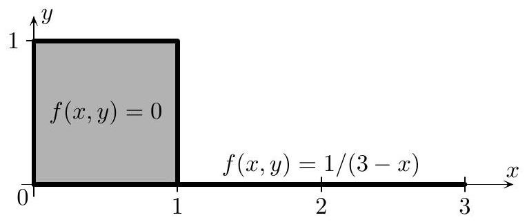
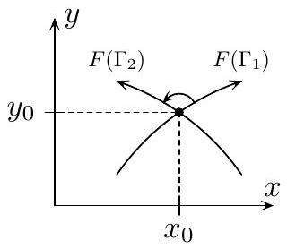
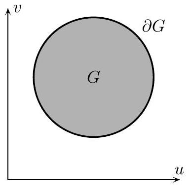

<block id='B1'>
## Г.Е. Иванов

## ЛЕКЦИИ ПО

# МАТЕМАТИЧЕСКОМУ 

## АНАЛИЗУ

Часть 2
© Иванов Г.Е., 2016
</block>
<block id = 'B2'>
## Оглавление

Предисловие ..... 4
Глава 13. ЭКСТРЕМУМЫ ФУНКЦИЙ НЕСКОЛЬКИХ ПЕРЕМЕННЫХ ..... 5
§ 1. Безусловный экстремум ..... 5
§ 2. Условный экстремум ..... 9
Глава 14. КРАТНЫЙ ИНТЕГРАЛ ..... 18
§ 1. Кратный интеграл Римана. Ограниченность интегри- руемой функции ..... 18
§ 2. Свойства кратного интеграла ..... 20
§ 3. Сведение кратного интеграла к повторному ..... 26
§ 4. Геометрический смысл модуля якобиана ..... 30
§ 5. Замена переменных в кратном интеграле ..... 39
§ 6. Геометрический смысл знака якобиана отображения ..... 45
§ 7. Формула Грина ..... 49
Глава 15. ПОВЕРХНОСТНЫЕ ИНТЕГРАЛЫ ..... 55
§ 1. Определения поверхностей ..... 55
§ 2. Поверхностный интеграл первого рода ..... 62
§ 3. Поверхностный интеграл второго рода ..... 66
§ 4. Оператор Гамильтона ..... 70
§ 5. Формула Остроградского-Гаусса ..... 73
§ 6. Формула Стокса ..... 80
§ 7. Условия независимости криволинейного интеграла от пути интегрирования ..... 84
§ 8. Дифференциальные формы и общая теорема Стокса ..... 89
Глава 16. РЯДЫ ФУРЬЕ ..... 94
§ 1. Определение ряда Фурье по ортогональной системе ..... 94
§ 2. Теорема Римана об осцилляции ..... 100
§ 3. Сходимость ряда Фурье в точке ..... 103
§ 4. Почленное дифференцирование и интегрирование ряда Фурье ..... 110
§ 5. Порядок убывания коэффициентов Фурье и остатка ряда Фурье ..... 112
§ 6. Суммирование ряда Фурье методом средних арифметических ..... 114
§ 7. Приближения непрерывных функций многочленами ..... 118
§ 8. Пространства $C[a, b], R L_{1}[a, b], R L_{2}[a, b]$ ..... 120
§ 9. Полные системы ..... 125
§ 10. Сходимость ряда Фурье в смысле евклидовой нормы ..... 130
§ 11. Неравенство Бесселя, равенство Парсеваля и равно- мерная сходимость ряда Фурье ..... 136
§ 12. Замкнутые системы ..... 138
Глава 17. ИНТЕГРАЛЫ, ЗАВИСЯЩИЕ OT ПАРАМЕТРА ..... 142
§ 1. Собственные интегралы, зависящие от параметра ..... 142
§ 2. Равномерная сходимость несобственных интегралов ..... 145
§ 3. Несобственные интегралы, зависящие от параметра ..... 149
§ 4. Эйлеровы интегралы ..... 154
§ 5. Интеграл Фурье ..... 155
§ 6. Преобразование Фурье ..... 161
Глава 18. ОБОБЩЕННЫЕ ФУНКЦИИ ..... 171
§ 1. Пространство $\mathcal{D}$ основных (пробных) функций ..... 171
§ 2. Пространство $\mathcal{D}^{\prime}$ обобщенных функций ..... 172
§ 3. Сходимость в пространстве $\mathcal{D}^{\prime}$ ..... 176
§ 4. Произведение обобщенной функции на бесконеч- но дифференцируемую функцию. Производная обобщенной функции ..... 177
§ 5. Пространства Шварца $S$ и $S^{\prime}$ ..... 180
§ 6. Преобразование Фурье обобщенных функций ..... 183
Предметный указатель ..... 189
</block>
<block id = 'B3'>
## Предисловие

Настоящее учебное пособие написано на основе лекций, читаемых автором студентам второго курса Московского физико-технического института (государственного университета).

Содержание материала соответствует программе кафедры высшей математики МФТИ (ГУ).

Автор выражает искреннюю признательность коллегам и студентам, высказавшим ценные замечания и предложения, а также обнаружившим опечатки в лекциях.
</block>
<block id='C13'>
# ЭКСТРЕМУМЫ ФУНКЦИЙ НЕСКОЛЬКИХ ПЕРЕМЕННЫХ 
</block>
<block id = 'C13.01'>

## § 1. Безусловный экстремум
</block>
<block id = 'D13.01.01'>
Определение. Пусть на множестве $X \subset \mathbb{R}^{n}$ задана функция $f: X \rightarrow \mathbb{R}$. Точка $x^{0} \in X$ называется точкой строгого локального минимума (максимума) функции $f$ на множестве $X$, если

$$
\exists \delta>0: \forall x \in \stackrel{o}{U}_{\delta}\left(x^{0}\right) \bigcap X \hookrightarrow f\left(x^{0}\right)<(>) f(x) .
$$

Если здесь строгое неравенство заменить нестрогим, то получится определение нестрогого локального минимума (максимума). Точки минимума и максимума называются точками экстремума.
</block>
<block id = 'D13.01.02'>
Определение. Пусть $x^{0}$ - точка локального экстремума функции $f$ на множестве $X$. Тогда если $x^{0} \in \operatorname{int} X$, то $x^{0}$ называется точкой безусловного локального экстремума функции $f$; если $x^{0} \in \partial X$, то $x^{0}$ называется точкой условного локального экстремума функции $f$.
</block>
<block id = 'L13.01.01'>
Лемма 1. $x^{0}$ - точка строгого безусловного локального минимума функции $f$ тогда и только тогда, когда

$$
\exists \delta>0: \forall x \in \stackrel{o}{U}_{\delta}\left(x^{0}\right) \hookrightarrow f\left(x^{0}\right)<f(x) .
$$
</block>
<block id = 'PL13.01.01'>

Доказательство. Пусть $x^{0}$ - точка строго безусловного локального минимума функции $f$. Тогда $\exists \delta_{1}>0: \forall x \in \stackrel{o}{U}_{\delta_{1}}\left(x^{0}\right) \cap X \hookrightarrow$ $\hookrightarrow f\left(x^{0}\right)<f(x)$. Поскольку $x^{0} \in \operatorname{int} X$, то $\exists \delta_{2}>0: U_{\delta_{2}}\left(x^{0}\right) \subset X$. Определим $\delta=\min \left\{\delta_{1}, \delta_{2}\right\}$. Тогда $\forall x \in U_{\delta}\left(x^{0}\right) \hookrightarrow f\left(x^{0}\right)<f(x)$. Обратное утверждение очевидно.
</block>
<block id = 'R13.01.01'>
Утверждения, аналогичные лемме 1 , справедливы и для максимума, и для нестрогих экстремумов. Иными словами, в определении безусловного экстремума множество $X$ указывать не нужно.
</block>
<block id = 'T13.01.01'>
Теорема 1. (Необходимое условие экстремума.) Пусть функция $f(x)$ определена в окрестности точки $x^{0} \in \mathbb{R}^{n}$ и дифференцируема

в точке $x^{0}$. Если $x^{0}$ - точка безусловного локального экстремума функции $f$, то $\operatorname{grad} f\left(x^{0}\right)=\overline{0}$.
</block>
<block id='PT13.01.01'>
Доказательство. Поскольку компоненты вектора grad $f\left(x^{0}\right)=$ $=\overline{0}$ равны частным производным $\frac{\partial f}{\partial x_{i}}\left(x^{0}\right)$, то достаточно доказать, что $\frac{\partial f}{\partial x_{i}}\left(x^{0}\right)=0 \quad \forall i \in\{1, \ldots, n\}$. Зафиксируем произвольное $i \in$ $\in\{1, \ldots, n\}$ и рассмотрим функцию одной переменной $\varphi\left(x_{i}\right)=$ $=f\left(x_{1}^{0}, \ldots, x_{i-1}^{0}, x_{i}, x_{i+1}^{0}, \ldots, x_{n}^{0}\right)$. Поскольку $x^{0}$ - точка локального экстремума функции $f$, то $x_{i}^{0}$ - точка локального экстремума функции $\varphi\left(x_{i}\right)$. В силу теоремы Ферма $\varphi^{\prime}\left(x_{i}^{0}\right)=0$. Следовательно, $\frac{\partial f}{\partial x_{i}}\left(x^{0}\right)=\varphi^{\prime}\left(x_{i}^{0}\right)=0$.
</block>
<block id = 'D13.01.03'>
Определение. Если $\operatorname{grad} f\left(x^{0}\right)=\overline{0}$, то точка $x^{0}$ называется cmaционарной точкой функции $f$.
</block>
<block id = 'R13.01.02'>
Из теоремы 1 следует, что точки экстремума функции являются ее стационарными точками. Обратное неверно. Например, для функции одной переменной $f(x)=x^{3}$ точка $x_{0}=0$ является стационарной точкой, но не является точкой экстремума.
</block>
<block id = 'TX13.01.01'>
Пусть функция $f(x)$ дважды непрерывно дифференцируема в окрестности точки $x^{0} \in \mathbb{R}^{n}$ (т. е. частные производные функции $f$ до второго порядка включительно непрерывны в окрестности точки $x^{0}$ ). Тогда справедлива следующая формула Тейлора (глава $6, \S 11$, теорема 2):

$$
f(x)-f\left(x^{0}\right)=d f\left(x^{0}\right)+\frac{1}{2} d^{2} f\left(x^{0}\right)+o\left(|\Delta x|^{2}\right) \quad \text { при } \quad \Delta x \rightarrow \overline{0} .
$$

Через $f_{x}^{\prime}\left(x^{0}\right)$ обозначим строку частных производных первого порядка или, что то же самое, координатную строку вектора градиента:

$$
f_{x}^{\prime}\left(x_{0}\right)=\left(\begin{array}{lll}
\frac{\partial f}{\partial x_{1}}\left(x^{0}\right) & \cdots & \frac{\partial f}{\partial x_{n}}\left(x^{0}\right)
\end{array}\right),
$$

а через $f_{x x}^{\prime \prime}\left(x^{0}\right)$ - матрицу частных производных второго порядка:

$$
f_{x x}^{\prime \prime}\left(x^{0}\right)=\left(\begin{array}{ccc}
\frac{\partial^{2} f}{\partial x_{1} \partial x_{1}}\left(x^{0}\right) & \cdots & \frac{\partial^{2} f}{\partial x_{n} \partial x_{1}}\left(x^{0}\right) \\
\cdots & \cdots & \cdots \\
\frac{\partial^{2} f}{\partial x_{1} \partial x_{n}}\left(x^{0}\right) & \cdots & \frac{\partial^{2} f}{\partial x_{n} \partial x_{n}}\left(x^{0}\right)
\end{array}\right)
$$

Поскольку для дважды непрерывно дифференцируемой функции $f$ частные производные второго порядка не зависят от порядка дифференцирования, то $f_{x x}^{\prime \prime}\left(x^{0}\right)$ - симметрическая матрица.

Полагая $d x=\Delta x=x-x^{0}=\left(\begin{array}{c}x_{1}-x_{1}^{0} \\ \ldots \\ x_{n}-x_{n}^{0}\end{array}\right), \quad \Delta f=f(x)-f\left(x^{0}\right)$, получаем равенства

$$
\begin{gather*}
d f\left(x^{0}\right)=\sum_{i=1}^{n} \frac{\partial f}{\partial x_{i}}\left(x^{0}\right) d x_{i}=f_{x}^{\prime}\left(x^{0}\right) d x \\
d^{2} f\left(x^{0}\right)=\sum_{i=1}^{n} \sum_{j=1}^{n} \frac{\partial^{2} f}{\partial x_{i} \partial x_{j}}\left(x^{0}\right) d x_{i} d x_{j}=(d x)^{T} f_{x x}^{\prime \prime}\left(x^{0}\right) d x \tag{1}
\end{gather*}
$$

Из формулы (1) следует, что второй дифференциал функции $f$ является квадратичной формой относительно вектора $d x$.
</block>
<block id = 'D13.01.04'>
Напомним, что квадратичная форма $k(x)=x^{T} M x$ называется

1) положительно определенной, если $k(x)>0 \quad \forall x \neq \overline{0}$;
2) отрицательно определенной, если $k(x)<0 \quad \forall x \neq \overline{0}$;
3) знаконеопределенной, если $\exists x_{1}, x_{2} \in \mathbb{R}^{n}: k\left(x_{1}\right)>0, k\left(x_{2}\right)<0$.
</block>
<block id = 'R13.01.03'>
Легко видеть, что квадратичная форма $k(x)=x^{T} M x$ отрицательно определена, если квадратичная форма $-k(x)=x^{T}(-M) x$ положительно определена. Для проверки положительной и отрицательной определенности квадратичной формы удобно использовать критерий Сильвестра. Доказательство того, что квадратичная форма знаконеопределена, проводят по определению.
</block>
<block id = 'L13.01.02'>
Лемма 2. Если квадратичная форма $k(x)$ положительно определена, то

$$
\exists \lambda>0: \forall x \in \mathbb{R}^{n} \hookrightarrow k(x) \geq \lambda|x|^{2} .
$$
</block>
<block id = 'PL13.01.02'>
Доказательство. Поскольку функция $k(x)=x^{T} M x$ непрерывна, а единичная сфера $S=\left\{x \in \mathbb{R}^{n}:|x|=1\right\}$ ограничена и замкнута, т. е. является компактом, то существует $\min _{x \in S} k(x)=\lambda$. Из положительной определенности квадратичной формы $k(x)$ следует, что $\lambda>0$. Из определения минимума получаем, что $\forall \widetilde{x} \in S \hookrightarrow k(\widetilde{x}) \geq \lambda$.

Если $x=\overline{0}$, то $k(x)=0$, и неравенство $k(x) \geq \lambda|x|^{2}$ выполняется.
Если $x \neq \overline{0}$, то $\widetilde{x}=\frac{x}{|x|} \in S$, следовательно, $k(\widetilde{x}) \geq \lambda, \quad k(x)=$ $=x^{T} M x=|x|^{2} \widetilde{x}^{T} M \widetilde{x}=|x|^{2} k(\widetilde{x}) \geq \lambda|x|^{2}$.
</block>
<block id = 'T13.01.02'>
Теорема 2. (Достаточные условия экстремума.) Пусть функция $f(x)$ дважды непрерывно дифференцируема в окрестности точки $x^{0}$ и пусть $x^{0}$ - стационарная точка функции $f$. Тогда

1) если квадратичная форма $d^{2} f\left(x^{0}\right)$ положительно определена, то $x^{0}$ - точка строгого безусловного локального минимума функции $f$;
2) если квадратичная форма $d^{2} f\left(x^{0}\right)$ отрицательно определена, то $x^{0}$ - точка строгого безусловного локального максимума функции $f$;
3) если квадратичная форма $d^{2} f\left(x^{0}\right)$ знаконеопределена, то $x^{0}$ не является точкой безусловного локального экстремума функции $f$;
4) если квадратичная форма $d^{2} f\left(x^{0}\right)$ не является ни положительно, ни отрицательно определенной и не является знаконеопределенной, то $x^{0}$ может быть точкой локального экстремума, а может и не быть.
</block>
<block id = 'PT13.01.02'>
Доказательство. Поскольку $x^{0}$ - стационарная точка функции $f$, то $d f\left(x^{0}\right)=0$, следовательно,

$$
\begin{equation*}
\Delta f=\frac{1}{2} d^{2} f\left(x^{0}\right)+o\left(|\Delta x|^{2}\right) \quad \text { при } \quad \Delta x \rightarrow \overline{0} . \tag{2}
\end{equation*}
$$

1) Пусть квадратичная форма $d^{2} f\left(x^{0}\right)$ положительно определена. В силу леммы $2 \quad \exists \lambda>0: \forall \Delta x \in \mathbb{R}^{n} \hookrightarrow d^{2} f\left(x^{0}\right) \geq \lambda|\Delta x|^{2}$. Отсюда и из формулы Тейлора (2) следует, что $\Delta f \geq \frac{\lambda}{2}|\Delta x|^{2}+o\left(|\Delta x|^{2}\right)$ при $\Delta x \rightarrow \overline{0}$. По определению о-малого $\lim _{\Delta x \rightarrow \overline{0}} \frac{o\left(|\Delta x|^{2}\right)}{|\Delta x|^{2}}=0$, поэтому

$$
\lim _{\Delta x \rightarrow \overline{0}} \frac{\frac{\lambda}{2}|\Delta x|^{2}+o\left(|\Delta x|^{2}\right)}{|\Delta x|^{2}}=\frac{\lambda}{2}>0 .
$$

Следовательно,

$$
\exists \delta>0: \forall \Delta x \in U_{\delta}(\overline{0}) \hookrightarrow \frac{\lambda}{2}|\Delta x|^{2}+o\left(|\Delta x|^{2}\right)>0,
$$

поэтому $\forall x \in U_{\delta}\left(x^{0}\right) \hookrightarrow f(x)-f\left(x^{0}\right)=\Delta f \geq \frac{\lambda}{2}|\Delta x|^{2}+o\left(|\Delta x|^{2}\right)>0$, а значит, $x^{0}$ - точка строгого безусловного локального минимума.

Пункт (2) сводится к пункту (1) заменой функции $f(x)$ на $-f(x)$.
3) Пусть квадратичная форма $d^{2} f\left(x^{0}\right)=(d x)^{T} f_{x x}^{\prime \prime}\left(x^{0}\right) d x$ знаконеопределена, т. е. $\exists \xi_{1}, \xi_{2} \in \mathbb{R}^{n}: \xi_{1}^{T} f_{x x}^{\prime \prime}\left(x^{0}\right) \xi_{1}>0, \xi_{2}^{T} f_{x x}^{\prime \prime}\left(x^{0}\right) \xi_{2}<0$. Применяя формулу (2) для $\Delta x=t \xi_{1}$, получим $f\left(x^{0}+t \xi_{1}\right)-f\left(x^{0}\right)=$ $=\Delta f=\frac{1}{2}(\Delta x)^{T} f_{x x}^{\prime \prime}\left(x^{0}\right) \Delta x+o\left(|\Delta x|^{2}\right)=\frac{1}{2}\left(\xi_{1}\right)^{T} f_{x x}^{\prime \prime}\left(x^{0}\right) \xi_{1} t^{2}+o\left(t^{2}\right)$

при $t \rightarrow 0$. Поскольку

$$
\lim _{t \rightarrow 0} \frac{1}{t^{2}}\left(\frac{1}{2}\left(\xi_{1}\right)^{T} f_{x x}^{\prime \prime}\left(x^{0}\right) \xi_{1} t^{2}+o\left(t^{2}\right)\right)=\frac{1}{2}\left(\xi_{1}\right)^{T} f_{x x}^{\prime \prime}\left(x^{0}\right) \xi_{1}>0
$$

то

$$
\exists \delta_{1}>0: \forall t \in\left(0, \delta_{1}\right) \hookrightarrow \Delta f=f\left(x^{0}+t \xi_{1}\right)-f\left(x^{0}\right)>0 .
$$

Аналогично,

$$
\exists \delta_{2}>0: \forall t \in\left(0, \delta_{2}\right) \hookrightarrow \Delta f=f\left(x^{0}+t \xi_{2}\right)-f\left(x^{0}\right)<0 .
$$

Поэтому $\forall \delta>0 \quad \exists t_{1}=\min \left\{\frac{\delta_{1}}{2}, \frac{\delta}{2\left|\xi_{1}\right|}\right\}, \exists t_{2}=\min \left\{\frac{\delta_{2}}{2}, \frac{\delta}{2\left|\xi_{2}\right|}\right\}$ такие, что $x^{1}=x^{0}+t_{1} \xi_{1} \in U_{\delta}\left(x^{0}\right), \quad x^{2}=x^{0}+t_{2} \xi_{2} \in U_{\delta}\left(x^{0}\right), \quad f\left(x^{1}\right)-$ $-f\left(x^{0}\right)>0, \quad f\left(x^{2}\right)-f\left(x^{0}\right)<0$. Следовательно, точка $x^{0}$ не является ни точкой локального минимума, ни точкой локального максимума функции $f$.
4) Пусть $f(x)$ - функция одной переменной $x \in \mathbb{R}$. Тогда в случае $f^{\prime \prime}\left(x_{0}\right)=0$ квадратичная форма $d^{2} f\left(x_{0}\right)=f^{\prime \prime}\left(x_{0}\right)(d x)^{2}$ не является положительно определенной, отрицательно определенной, а также не является знаконеопределенной.

Для функции $f(x)=x^{4}$ имеем $f^{\prime \prime}(0)=0$, а точка $x_{0}=0$ является точкой минимума.

Для функции $f(x)=x^{3}: f^{\prime \prime}(0)=0$, а точка $x_{0}=0$ не является точкой экстремума.
</block>
<block id = 'PR13.01.01'>
Задача 1. Пусть функция $f: \mathbb{R}^{2} \rightarrow \mathbb{R}$ дважды непрерывно дифференцируема и $\operatorname{det} f_{x x}^{\prime \prime}\left(x^{0}\right)<0$. Может ли функция $f$ достигать локальный безусловный экстремум в точке $x^{0}$ ?
</block>
<block id='C13.02'>
## § 2. Условный экстремум
</block>
<block id='TX13.02.01'>
Пусть в окрестности точки $x^{0} \in \mathbb{R}^{n}$ заданы скалярная функция $f(x)$ и вектор-функция $g(x)=\left(\begin{array}{c}g_{1}(x) \\ \cdots \\ g_{m}(x)\end{array}\right)$. Рассмотрим задачу отыскания экстремума функции $f(x)$ на множестве $X \subset \mathbb{R}^{n}$, заданном системой уравнений $g(x)=\overline{0}$ :

Исследовать на экстремум $f(x)$ по $x \in \mathbb{R}^{n}: g(x)=\overline{0}$.

Далее будем всегда предполагать, что число ограничений $g_{i}(x)=$ $=0$ меньше числа переменных $x_{j}$ : $\quad m<n$.

Если система из $m$ уравнений $g(x)=\overline{0}$ разрешима относительно $m$ переменных, т. е. вектор $x \in \mathbb{R}^{n}$ можно разбить на два вектора $y \in \mathbb{R}^{m}$ и $z \in \mathbb{R}^{n-m}: x=\binom{y}{z}$ таких, что

$$
g(y, z)=\overline{0} \quad \Longleftrightarrow \quad y=\varphi(z),
$$

тогда задача (1) отыскания условного экстремума сводится к задаче отыскания безусловного экстремума функции $f(\varphi(z), z)$.
</block>
<block id = 'D13.02.01'>
Этот метод называется прямым методом, или методом разрешения ограничений.
</block>
<block id = 'E13.02.01'>
Пример 1. Найти локальные экстремумы функции $f(x, y, z)=$ $=-x^{3}-x^{2}+4 x y+2 x z-4 y^{2}+2 y z-z^{2}$ при условии $x+y-z=0$.

Решение. Из условия $x+y-z=0$ можно выразить $z=x+y$, поэтому исходная задача сводится к задаче отыскания безусловных локальных экстремумов функции $F(x, y)=f(x, y, x+y)=-x^{3}+$ $+6 x y-3 y^{2}$. Найдем стационарные точки функции $F$ :

$$
\left\{\begin{array} { l } 
{ F _ { x } ^ { \prime } = 0 } \\
{ F _ { y } ^ { \prime } = 0 }
\end{array} \Leftrightarrow \left\{\begin{array} { l } 
{ - 3 x ^ { 2 } + 6 y = 0 } \\
{ 6 x - 6 y = 0 }
\end{array} \Leftrightarrow \left\{\begin{array}{l}
x=y, \\
x^{2}=2 x .
\end{array}\right.\right.\right.
$$

Функция $F$ имеет две стационарные точки: $(0,0)$ и $(2,2)$.
Исследуем знакоопределенность второго дифференциала в стационарных точках.

Поскольку $F^{\prime \prime}(x, y)=\left(\begin{array}{cc}-6 x & 6 \\ 6 & -6\end{array}\right)$, то $F^{\prime \prime}(0,0)=\left(\begin{array}{cc}0 & 6 \\ 6 & -6\end{array}\right)$, $d^{2} F(0,0)=12 d x d y-6(d y)^{2}$.

При $\binom{d x}{d y}=\binom{0}{1}$ имеем $d^{2} F(0,0)=-6<0$, а при $\binom{d x}{d y}=\binom{1}{1}$ получаем $d^{2} F(0,0)=12-6=6>0$. Следовательно, квадратичная форма $d^{2} F(0,0)$ знаконеопределена, и в точке ( 0,0 ) нет локального экстремума.

Матрица $F^{\prime \prime}(2,2)=\left(\begin{array}{cc}-12 & 6 \\ 6 & -6\end{array}\right)$ отрицательно определена, так как матрица $-F^{\prime \prime}(2,2)=\left(\begin{array}{cc}12 & -6 \\ -6 & 6\end{array}\right)$ положительно определена, что проверяется по критерию Сильвестра: $\Delta_{1}=12>0, \Delta_{2}=12 \cdot 6-$ $-6^{2}>0$. Поэтому в точке $\left(x_{0}, y_{0}\right)=(2,2)$ функция $F$ достигает

локального минимума. Следовательно, в точке $\left(x_{0}, y_{0}, z_{0}\right)=(2,2,4)$ функция $f(x, y, z)$ достигает локального минимума, равного $-x_{0}^{3}+$ $+6 x_{0} y_{0}-3 y_{0}^{2}=4$.
</block>
<block id = 'TX13.02.02'>
Если в задаче на условный экстремум (1) не удается разрешить ограничения, явно выразив одни переменные как достаточно простые функции других переменных, то следует использовать метод множителей Лагранжа.
</block>
<block id = 'D13.02.02'>
Определение. Функцией Лагранжа для задачи (1) называется функция

$$
L(x, \lambda)=f(x)+\lambda^{T} g(x)=f(x)+\lambda_{1} g_{1}(x)+\cdots+\lambda_{m} g_{m}(x),
$$

где вектор $\lambda=\left(\begin{array}{c}\lambda_{1} \\ \cdots \\ \lambda_{m}\end{array}\right)$ называется вектором множителей Лаграчœа.
</block>
<block id = 'T13.02.01'>
Теорема 1. (Необходимые условия экстремума.) Пусть $x^{0}-$ точка локального экстремума в задаче (1). Пусть функция $f(x)$ и вектор-функция $g(x)$ непрерывно дифференцируемы в окрестности точки $x^{0}$. Пусть векторы $\operatorname{grad} g_{1}\left(x^{0}\right), \cdots, \operatorname{grad} g_{m}\left(x^{0}\right)$ линейно независимы. Тогда существует вектор множителей Лагранжа $\lambda^{0} \in$ $\in \mathbb{R}^{m}$ такой, что точка $\binom{x^{0}}{\lambda^{0}}$ является стационарной точкой функции Лагранжа.
</block>
<block id = 'D13.02.03'>
Определение. Пусть вектор-функция $g(x)$ дифференцируема в точке $x^{0}$. Тогда касательным подпространством к множеству допустимых точек называется множество векторов

$$
E_{\mathbf{K A C}}=\left\{d x \in \mathbb{R}^{n}: d g_{i}\left(x^{0}\right)=0 \quad \forall i \in\{1, \ldots, m\}\right\} .
$$
</block>
<block id = 'TX13.02.03'>
Иными словами, касательное подпространство образуют векторы $d x$, удовлетворяющие продифференцированным уравнениям ограничений, т. е. системе уравнений

$$
\left\{\begin{array}{ccc}
\frac{\partial g_{1}}{\partial x_{1}}\left(x^{0}\right) d x_{1} & +\cdots+ & \frac{\partial g_{1}}{\partial x_{n}}\left(x^{0}\right) d x_{n}=0, \\
\cdots & \cdots & \cdots \\
\frac{\partial g_{m}}{\partial x_{1}}\left(x^{0}\right) d x_{1} & +\cdots+ & \frac{\partial g_{m}}{\partial x_{n}}\left(x^{0}\right) d x_{n}=0 .
\end{array}\right.
$$
</block>
<block id = 'T13.02.02'>
Теорема 2. (Достаточные условия экстремума.) Пусть $\binom{x^{0}}{\lambda^{0}}$ - стационарная точка функции Лагранжа. Пусть функция $f(x)$ и вектор-функция $g(x)$ дважды непрерывно дифференцируемы в окрестности точки $x^{0}$. Пусть векторы $\operatorname{grad} g_{1}\left(x^{0}\right), \cdots, \operatorname{grad} g_{m}\left(x^{0}\right)$ линейно независимы. И пусть $k(d x)=(d x)^{T} L_{x x}^{\prime \prime}\left(x^{0}, \lambda^{0}\right) d x-$ второй дифференциал функции Лагранжа по переменным $x$. Тогда

1) если квадратичная форма $k(d x)$ положительно определена на $E_{\mathbf{K A C}}$, т. е. $k(d x)>0 \quad \forall d x \in E_{\mathbf{K A C}} \backslash\{\overline{0}\}$, то $x^{0}$ - точка строгого локального минимума в задаче (1);
2) если квадратичная форма $k(d x)$ отрицательно определена на $E_{\text {KAC }}$, т. е. $k(d x)<0 \quad \forall d x \in E_{\text {KAC }} \backslash\{\overline{0}\}$, то $x^{0}$ - точка строгого локального максимума в задаче (1);
3) если квадратичная форма $k(d x)$ знаконеопределена на $E_{\text {кас }}$, т. е. существуют векторы $\xi_{1}, \xi_{2} \in E_{\text {кас }}: k\left(\xi_{1}\right)>0, k\left(\xi_{2}\right)<0$, то $x^{0}$ не является точкой локального экстремума в задаче (1);
4) если условия предыдущих пунктов не выполнены, то точка $x^{0}$ может быть точкой локального экстремума в задаче (1), а может и не быть ею.
</block>
<block id = 'TX13.02.04'>
Доказательства теорем 1 и 2 будут приведены после рассмотрения примера.
</block>
<block id = 'E13.02.02'>
Пример 2. Достигается ли в точке $(0,0)$ локальный экстремум в задаче

на экстремум $f(x, y)=3 y-2 x$ по $(x, y) \in \mathbb{R}^{2}: \quad x+e^{x}=y+e^{2 y}$ ?
Решение. Поскольку уравнение $x+e^{x}=y+e^{2 y}$ неразрешимо относительно $x$ или $y$, то воспользуемся методом множителей Лагранжа. Функция Лагранжа имеет вид $L(x, y, \lambda)=3 y-2 x+\lambda\left(x+e^{x}-\right.$ $-y-e^{2 y}$ ). Найдем стационарные точки функции Лагранжа:

$$
\left\{\begin{array} { l } 
{ L _ { x } ^ { \prime } = 0 }  \tag{3}\\
{ L _ { y } ^ { \prime } = 0 } \\
{ L _ { \lambda } ^ { \prime } = 0 }
\end{array} \Leftrightarrow \left\{\begin{array}{c}
-2+\lambda\left(1+e^{x}\right)=0 \\
3+\lambda\left(-1-2 e^{2 y}\right)=0 \\
x+e^{x}-y-e^{2 y}=0
\end{array}\right.\right.
$$

Получилась система из трех уравнений для определения стационарных точек функции Лагранжа. В данном примере рассматривается точка $\left(x_{0}, y_{0}\right)=(0,0)$. Подставляя $x=0, y=0$ в систему ( 3 ),

получаем, что точка $\left(\begin{array}{l}x_{0} \\ y_{0} \\ \lambda_{0}\end{array}\right)=\left(\begin{array}{l}0 \\ 0 \\ 1\end{array}\right)$ является стационарной точкой функции Лагранжа. Согласно теореме 2 , теперь нужно исследовать знакоопределенность второго дифференциала функции $L\left(x, y, \lambda_{0}\right)=$ $=3 y-2 x+\left(x+e^{x}-y-e^{2 y}\right)$ на $E_{\text {кас }}$. Поскольку $d^{2} L\left(x, y, \lambda_{0}\right)=$ $=e^{x}(d x)^{2}-4 e^{2 y}(d y)^{2}$, то $d^{2} L\left(x_{0}, y_{0}, \lambda_{0}\right)=(d x)^{2}-4(d y)^{2}$. Найдем касательное подпространство:

$$
\begin{gathered}
E_{\mathbf{K A C}}=\left\{\binom{d x}{d y}:\left.d\left(x+e^{x}-y-e^{2 y}\right)\right|_{(x, y)=(0,0)}=0\right\}= \\
=\left\{\binom{d x}{d y}: 2 d x-3 d y=0\right\}=\left\{\binom{\frac{3}{2} d y}{d y}: d y \in \mathbb{R}\right\}
\end{gathered}
$$

Поэтому при $\binom{d x}{d y} \in E_{\text {кас }} \backslash\{\overline{0}\}: \quad d^{2} L\left(x_{0}, y_{0}, \lambda_{0}\right)=\left(\frac{3}{2} d y\right)^{2}-4(d y)^{2}=$ $=-\frac{7}{4}(d y)^{2}<0$. Следовательно, квадратичная форма $d^{2} L\left(x_{0}, y_{0}, \lambda_{0}\right)$ отрицательно определена на $E_{\text {кас }}$. Поэтому $(0,0)$ - точка локального максимума в задаче (2).
</block>
<block id = 'R13.02.02'>
Замечание. Применение метода множителей Лагранжа не требует разрешения ограничений. Однако доказательство теорем 1 и 2 основано на том, что в силу теоремы о неявной функции ограничения $g(x)=\overline{0}$ можно разрешить в некоторой окрестности точки $x^{0}$.
</block>
<block id = 'D13.02.04'>
Определение. Будем говорить, что в точке $x^{0}$ выполнены $y$ словия локальной разрешимости ограничений $g(x)=\overline{0}$, если

1) $g\left(x^{0}\right)=\overline{0}$;
2) вектор-функция $g(x)$ непрерывно дифференцируема в окрестности точки $x^{0}$;
3) векторы $\operatorname{grad} g_{1}\left(x^{0}\right), \cdots, \operatorname{grad} g_{m}\left(x^{0}\right)$ линейно независимы.
</block>
<block id = 'TX13.02.05'>
Третье из условий локальной разрешимости ограничений означает, что строки матрицы Якоби

$$
\mathcal{D} g\left(x^{0}\right)=\left(\begin{array}{ccc}
\frac{\partial g_{1}}{\partial x_{1}}\left(x^{0}\right) & \cdots & \frac{\partial g_{1}}{\partial x_{n}}\left(x^{0}\right) \\
\cdots & \cdots & \cdots \\
\frac{\partial g_{m}}{\partial x_{1}}\left(x^{0}\right) & \cdots & \frac{\partial g_{m}}{\partial x_{n}}\left(x^{0}\right)
\end{array}\right)
$$

линейно независимы, т. е. $\operatorname{rang} \mathcal{D} g\left(x^{0}\right)=m$. Следовательно, существуют $m$ линейно независимых столбцов матрицы $\mathcal{D} g\left(x^{0}\right)$. Без ограничения общности будем считать, что первые $m$ столбцов матрицы $\mathcal{D} g\left(x^{0}\right)$ линейно независимы (если это не так, то можно перенумеровать переменные $x_{i}$ так, что это условие выполняется). Разобъем вектор $x=\left(\begin{array}{c}x_{1} \\ \ldots \\ x_{n}\end{array}\right)$ на два вектора: $y=\left(\begin{array}{c}x_{1} \\ \ldots \\ x_{m}\end{array}\right)$ и $z=\left(\begin{array}{c}x_{m+1} \\ \ldots \\ x_{n}\end{array}\right)$. Тогда

$$
\begin{gathered}
x=\binom{y}{z}, \quad x^{0}=\binom{y^{0}}{z^{0}} \\
f(x)=f(y, z), \quad g(x)=g(y, z), \quad L(x, \lambda)=L(y, z, \lambda)
\end{gathered}
$$

Будем обозначать

$$
\begin{aligned}
f_{y}^{\prime}\left(y^{0}, z^{0}\right) & =\left(\frac{\partial f}{\partial x_{1}}\left(x^{0}\right) \cdots \frac{\partial f}{\partial x_{m}}\left(x^{0}\right)\right) \\
f_{z}^{\prime}\left(y^{0}, z^{0}\right) & =\left(\frac{\partial f}{\partial x_{m+1}}\left(x^{0}\right) \cdots \frac{\partial f}{\partial x_{n}}\left(x^{0}\right)\right) \\
g_{y}^{\prime}\left(y^{0}, z^{0}\right) & =\left(\begin{array}{ccc}
\frac{\partial g_{1}}{\partial x_{1}}\left(x^{0}\right) & \cdots & \frac{\partial g_{1}}{\partial x_{m}}\left(x^{0}\right) \\
\cdots & \cdots & \cdots \\
\frac{\partial g_{m}}{\partial x_{1}}\left(x^{0}\right) & \cdots & \frac{\partial g_{m}}{\partial x_{m}}\left(x^{0}\right)
\end{array}\right) \\
g_{z}^{\prime}\left(y^{0}, z^{0}\right) & =\left(\begin{array}{ccc}
\frac{\partial g_{1}}{\partial x_{m+1}}\left(x^{0}\right) & \cdots & \frac{\partial g_{1}}{\partial x_{n}}\left(x^{0}\right) \\
\cdots & \cdots & \cdots \\
\frac{\partial g_{m}}{\partial x_{m+1}}\left(x^{0}\right) & \cdots & \frac{\partial g_{m}}{\partial x_{n}}\left(x^{0}\right)
\end{array}\right)
\end{aligned}
$$

Поскольку первые $m$ столбцов матрицы $\mathcal{D} g\left(x^{0}\right)$ линейно независимы, а они являются столбцами квадратной матрицы $g_{y}^{\prime}\left(y^{0}, z^{0}\right)$, то $\operatorname{det} g_{y}^{\prime}\left(y^{0}, z^{0}\right) \neq 0$.

Из теоремы о неявной функции (глава $12, \S 4$, теорема 1) получаем следующую лемму.
</block>
<block id = 'L13.02.01'>
Лемма 1. Пусть в точке $x^{0}$ выполняются условия локальной разрешимости ограничений. Тогда существуют числа $\beta>0, \gamma>$ $>0$ и функция $\varphi(z)$, непрерывно дифференцируемая в $U_{\beta}\left(z^{0}\right)$, такие, что при $z \in U_{\beta}\left(z^{0}\right), y \in U_{\gamma}\left(y^{0}\right)$ системы $g(y, z)=\overline{0}$ и $y=\varphi(z)$ эквивалентны.

При этом точка $x^{0}=\binom{y^{0}}{z^{0}}$ является локальным минимумом (максимумом) в задаче (1) тогда и только тогда, когда $z^{0}$ является точкой безусловного локального минимума (максимума) функции $F(z)=f(\varphi(z), z)$.
</block>
<block id = 'PT13.02.01'>
Доказательство теоремы 1. Из условий теоремы 1 следует, что в точке $x^{0}$ выполняются условия локальной разрешимости ограничений. В силу леммы 1 существует непрерывно дифференцируемая функция $\varphi(z)$ такая, что в окрестности точки $x^{0}=\binom{y^{0}}{z^{0}}$

$$
g(y, z)=\overline{0} \quad \Longleftrightarrow \quad y=\varphi(z) .
$$

Требуется доказать, что существует вектор $\lambda^{0} \in \mathbb{R}^{n}$ такой, что точка $\left(\begin{array}{l}y^{0} \\ z^{0} \\ \lambda^{0}\end{array}\right)$ является стационарной точкой функции Лагранжа $L(x, \lambda)=$ $=f(x)+\lambda^{T} g(x)$, т. е.

$$
\left\{\begin{array}{l}
L_{y}^{\prime}\left(y^{0}, z^{0}, \lambda^{0}\right)=\overline{0} \\
L_{z}^{\prime}\left(y^{0}, z^{0}, \lambda^{0}\right)=\overline{0} \\
L_{\lambda}^{\prime}\left(y^{0}, z^{0}, \lambda^{0}\right)=\overline{0}
\end{array}\right.
$$

Поскольку точка $x^{0}=\binom{y^{0}}{z^{0}}$ удовлетворяет ограничениям $g(x)=$ $=\overline{0}$, то $L_{\lambda}^{\prime}\left(y^{0}, z^{0}, \lambda^{0}\right)=\left(g\left(x^{0}\right)\right)^{T}=\overline{0}$. Следовательно, уравнение $L_{\lambda}^{\prime}\left(y^{0}, z^{0}, \lambda^{0}\right)=\overline{0}$ выполнено автоматически.

Определим вектор $\lambda^{0}$ из уравнения $L_{y}^{\prime}\left(y^{0}, z^{0}, \lambda^{0}\right)=\overline{0}$ : $L_{y}^{\prime}\left(y^{0}, z^{0}, \lambda^{0}\right)=f_{y}^{\prime}\left(y^{0}, z^{0}\right)+\left(\lambda^{0}\right)^{T} g_{y}^{\prime}\left(y^{0}, z^{0}\right)=\overline{0}$. Поскольку $\operatorname{det} g_{y}^{\prime}\left(y^{0}, z^{0}\right) \neq 0$, то существует матрица $\left(g_{y}^{\prime}\left(y^{0}, z^{0}\right)\right)^{-1}$, и вектор $\lambda^{0}$ можно определить по формуле

$$
\left(\lambda^{0}\right)^{T}=-f_{y}^{\prime}\left(y^{0}, z^{0}\right)\left(g_{y}^{\prime}\left(y^{0}, z^{0}\right)\right)^{-1}
$$

Осталось показать, что выполняется равенство $L_{z}^{\prime}\left(y^{0}, z^{0}, \lambda^{0}\right)=\overline{0}$.
По условию теоремы 1 точка $x^{0}$ доставляет локальный экстремум в задаче (1). Отсюда и из леммы 1 следует, что $z^{0}$ - точка локального безусловного экстремума функции $F(z)=f(\varphi(z), z)$. Поскольку $y=\varphi(z)$ - это решение уравнения $g(y, z)=\overline{0}$, то $g(\varphi(z), z)=\overline{0}$,

следовательно,

$$
F(z)=f(\varphi(z), z)+\left(\lambda^{0}\right)^{T} g(\varphi(z), z)=L\left(\varphi(z), z, \lambda^{0}\right) .
$$

Из теоремы 1 § 1 следует, что $z^{0}$ - стационарная точка функции $F(z)$, т. е. $F_{z}^{\prime}\left(z^{0}\right)=\overline{0}$, а значит,

$$
L_{y}^{\prime}\left(\varphi\left(z^{0}\right), z^{0}, \lambda^{0}\right) \varphi_{z}^{\prime}\left(z^{0}\right)+L_{z}^{\prime}\left(\varphi\left(z^{0}\right), z^{0}, \lambda^{0}\right)=\overline{0}
$$

Отсюда и из условий $y^{0}=\varphi\left(z^{0}\right), L_{y}^{\prime}\left(y^{0}, z^{0}, \lambda^{0}\right)=\overline{0}$ следует, что $L_{z}^{\prime}\left(y^{0}, z^{0}, \lambda^{0}\right)=\overline{0}$.
</block>
<block id = 'PT13.02.02'>
Доказательство теоремы 2. Из условий теоремы 2 следует выполнение условий локальной разрешимости ограничений в точке $x^{0}$. В силу леммы 1 точка $x^{0}$ доставляет локальный минимум (максимум) в задаче (1) тогда и только тогда, когда точка $z^{0}$ доставляет безусловный локальный минимум (максимум) функции $F(z)=$ $=f(\varphi(z), z)$. Поскольку $g(\varphi(z), z)=\overline{0}$, то

$$
\begin{equation*}
F(z)=f(\varphi(z), z)+\left(\lambda^{0}\right)^{T} g(\varphi(z), z)=L\left(\varphi(z), z, \lambda^{0}\right) . \tag{4}
\end{equation*}
$$

Следовательно,

$$
\begin{aligned}
F_{z}^{\prime}\left(z^{0}\right) & =L_{y}^{\prime}\left(\varphi\left(z^{0}\right), z^{0}, \lambda^{0}\right) \varphi_{z}^{\prime}\left(z^{0}\right)+L_{z}^{\prime}\left(\varphi\left(z^{0}\right), z^{0}, \lambda^{0}\right)= \\
& =L_{y}^{\prime}\left(y^{0}, z^{0}, \lambda^{0}\right) \varphi_{z}^{\prime}\left(z^{0}\right)+L_{z}^{\prime}\left(y^{0}, z^{0}, \lambda^{0}\right)
\end{aligned}
$$

Поскольку $\left(\begin{array}{c}y^{0} \\ z^{0} \\ \lambda^{0}\end{array}\right)$ - стационарная точка функции Лагранжа, то $L_{y}^{\prime}\left(y^{0}, z^{0}, \lambda^{0}\right)=\overline{0}, L_{z}^{\prime}\left(y^{0}, z^{0}, \lambda^{0}\right)=\overline{0}$, следовательно, $F_{z}^{\prime}\left(z^{0}\right)=\overline{0}$, т. е. $z^{0}$ - стационарная точка функции $F(z)$.

Согласно теореме 2 § 1 , наличие в точке $z^{0}$ экстремума функции $F(z)$, а значит, и наличие в точке $x^{0}$ экстремума в задаче (1), зависит от знакоопределенности квадратичной формы $d^{2} F\left(z^{0}\right)$.

В силу инвариантности формы первого дифференциала получаem

$$
d F(z)=L_{y}^{\prime}\left(y, z, \lambda^{0}\right) d y+L_{z}^{\prime}\left(y, z, \lambda^{0}\right) d z
$$

где $y=\varphi(z), d z$ - приращение вектора независимых переменных $z$, а $d y=d \varphi(z)$. Найдем $d^{2} F\left(z^{0}\right)$ :

$$
\begin{gathered}
d\left(L_{y}^{\prime}\left(y, z, \lambda^{0}\right) d y\right)=L_{y}^{\prime}\left(y, z, \lambda^{0}\right) d^{2} y+ \\
+\left(L_{y}^{\prime}\left(y, z, \lambda^{0}\right) d y\right)_{y}^{\prime} d y+\left(L_{y}^{\prime}\left(y, z, \lambda^{0}\right) d y\right)_{z}^{\prime} d z
\end{gathered}
$$

Поскольку $L_{y}^{\prime}\left(y, z, \lambda^{0}\right) d y=\left(L_{y}^{\prime}\left(y, z, \lambda^{0}\right) d y\right)^{T}=(d y)^{T}\left(L_{y}^{\prime}\left(y, z, \lambda^{0}\right)\right)^{T}$, то $\left(L_{y}^{\prime}\left(y, z, \lambda^{0}\right) d y\right)_{y}^{\prime} \quad=\quad(d y)^{T} L_{y y}^{\prime \prime}\left(y, z, \lambda^{0}\right)$. Аналогично, $\left(L_{y}^{\prime}\left(y, z, \lambda^{0}\right) d y\right)_{z}^{\prime}=(d y)^{T} L_{y z}^{\prime \prime}\left(y, z, \lambda^{0}\right)$. Поэтому

$$
\begin{gathered}
d\left(L_{y}^{\prime}\left(y, z, \lambda^{0}\right) d y\right)=L_{y}^{\prime}\left(y, z, \lambda^{0}\right) d^{2} y+ \\
+(d y)^{T} L_{y y}^{\prime \prime}\left(y, z, \lambda^{0}\right) d y+(d y)^{T} L_{y z}^{\prime \prime}\left(y, z, \lambda^{0}\right) d z
\end{gathered}
$$

Аналогично, учитывая, что $d^{2} z=0$, получаем

$$
d\left(L_{z}^{\prime}\left(y, z, \lambda^{0}\right) d z\right)=(d z)^{T} L_{z z}^{\prime \prime}\left(y, z, \lambda^{0}\right) d z+(d z)^{T} L_{z y}^{\prime \prime}\left(y, z, \lambda^{0}\right) d y .
$$

Следовательно,

$$
\begin{gathered}
d^{2} F(z)=L_{y}^{\prime}\left(y, z, \lambda^{0}\right) d^{2} y+(d y)^{T} L_{y y}^{\prime \prime}\left(y, z, \lambda^{0}\right) d y+ \\
+2(d y)^{T} L_{y z}^{\prime \prime}\left(y, z, \lambda^{0}\right) d z+(d z)^{T} L_{z z}^{\prime \prime}\left(y, z, \lambda^{0}\right) d z= \\
=L_{y}^{\prime}\left(x, \lambda^{0}\right) d^{2} y+(d x)^{T} L_{x x}^{\prime \prime}\left(x, \lambda^{0}\right) d x
\end{gathered}
$$

Поскольку $\left(\begin{array}{l}y^{0} \\ z^{0} \\ \lambda^{0}\end{array}\right)$ - стационарная точка функции Лагранжа, то $L_{y}^{\prime}\left(x^{0}, \lambda^{0}\right)=\overline{0}$, поэтому

$$
d^{2} F\left(z^{0}\right)=(d x)^{T} L_{x x}^{\prime \prime}\left(x^{0}, \lambda^{0}\right) d x=k(d x) .
$$

Из эквивалентности систем $g(y, z)=\overline{0}$ и $y=\varphi(z)$ следует эквивалентность систем $d g(x)=\overline{0}$ и $d y=d \varphi(z)$. Поскольку $d z \in \mathbb{R}^{n-m}$ - произвольный вектор, $d y=d \varphi\left(z^{0}\right)$, то $d x=\binom{d y}{d z}$ - произвольный вектор, удовлетворяющий системе $d g\left(x^{0}\right)=\overline{0}$, т. е. $d x$ - произвольный вектор из $E_{\text {кас }}$. Следовательно, знакоопределенность квадратичной формы $d^{2} F\left(z^{0}\right)=(d z)^{T} F_{z z}^{\prime \prime}\left(z^{0}\right) d z$ такая же, как и знакоопределенность квадратичной формы $k(d x)$ на подпространстве $E_{\text {кас }}$. Применение теоремы $2 \S 1$ завершает доказательство теоремы 2 .
</block>
<block id = 'C14'>
## КРАТНЫЙ ИНТЕГРАЛ
</block>
<block id = 'C14.01'>
## § 1. Кратный интеграл Римана. Ограниченность интегрируемой функции
</block>
<block id = 'D14.01.01'>
Определение. Диаметром множества $E \subset \mathbb{R}^{n}$ называется супремум расстояний между двумя элементами этого множества:

$$
\operatorname{diam}(E)=\sup _{x \in E, y \in E}|x-y|
$$
</block>
<block id = 'D14.01.02'>
Определение. Разбиением измеримого множества $E \subset \mathbb{R}^{n}$ называется конечный набор множеств $\mathrm{T}=\left\{E_{i}\right\}_{i=1}^{I}$ таких, что

1) множества $E_{i}$ измеримы по Жордану;
2) множества $E_{i}$ и $E_{j}$ при $i \neq j$ не имеют общих внутренних точек (могут пересекаться лишь по границе);
3) $\bigcup_{i=1}^{I} E_{i}=E$.
</block>
<block id = 'D14.01.03'>
Определение. Мелкостью разбиения $\mathrm{T}=\left\{E_{i}\right\}_{i=1}^{I}$ называется максимальный диаметр элементов этого разбиения:

$$
\ell(\mathrm{T})=\max _{i=1, \ldots, I} \operatorname{diam}\left(E_{i}\right) .
$$
</block>
<block id = 'D14.01.04'>
Определение. Пусть заданы разбиение $\mathrm{T}=\left\{E_{i}\right\}_{i=1}^{I}$ измеримого множества $E \subset \mathbb{R}^{n}$, выборка $\xi_{\mathrm{T}}=\left\{\xi_{i}\right\}_{i=1}^{I}, \xi_{i} \in E_{i}$ и функция $f: E \rightarrow \mathbb{R}$. Интегральной суммой Римана называется

$$
\sigma\left(f ; \mathrm{T} ; \xi_{\mathrm{T}}\right)=\sum_{i=1}^{I} f\left(\xi_{i}\right) \mu\left(E_{i}\right)
$$
</block>
<block id = 'D14.01.05'>
Определение. Число $J$ называется $n$-кратным интегралом $P u$ мана функции $f(x)$ по измеримому множеству $E \subset \mathbb{R}^{n}$ и обозначается

$$
J=\overbrace{\int_{E}^{n} \ldots}^{n} f(x) d x_{1} \cdots d x_{n}
$$

если $J=\lim _{\ell(\mathrm{T}) \rightarrow 0} \sigma\left(f ; \mathrm{T} ; \xi_{\mathrm{T}}\right)$, т. е.

$$
\forall \varepsilon>0 \exists \delta>0: \forall \mathrm{T} \forall \xi_{\mathrm{T}}: \quad \ell(\mathrm{T})<\delta \quad \hookrightarrow \quad\left|\sigma\left(f ; \mathrm{T} ; \xi_{\mathrm{T}}\right)-J\right|<\varepsilon .
$$
</block>
<block id = 'D14.01.06'>
Если существует кратный интеграл функции $f$ по множеству $E$, то функция $f$ называется интегрируемой на множестве $E$.
</block>
<block id = 'R14.01.01'>
Несложно доказать, что определение интеграла Римана по отрезку $[a, b]$, данное в главе 7 , эквивалентно определению 1 -кратного интеграла по множеству $E=[a, b]$. Таким образом, понятие кратного интеграла Римана является обобщением понятия интеграла Римана по отрезку.
</block>
<block id = 'TX14.01.01'>
Известно, что если функция одной переменной интегрируема на отрезке, то она ограничена на этом отрезке. Следующий пример показывает, что функция $f(x)$ может быть интегрируема на измеримом множестве $E$, но не быть ограниченной на $E$.
</block>
<block id = 'D14.01.07'>
Определение. Декартовым произведением множеств $X$ и $Y$ называется множество всех пар ( $x, y$ ), где $x \in X, y \in Y$. Если $x=$ $=\left(x_{1}, \ldots, x_{n}\right) \in \mathbb{R}^{n}, y=\left(y_{1}, \ldots, y_{m}\right) \in \mathbb{R}^{m}$, то пару ( $x, y$ ) будем отождествлять с вектором $\left(x_{1}, \ldots, x_{n}, y_{1}, \ldots, y_{m}\right) \in \mathbb{R}^{n+m}$.
</block>
<block id = 'E14.01.01'>
Рассмотрим в $\mathbb{R}^{2}$ множество

$$
E=([0,1] \times[0,1]) \bigcup((1,3) \times\{0\})
$$

Пусть $f(x, y)=\left\{\begin{array}{ll}0, & x \in[0,2], \\ 1 /(3-x), & x \in(2,3) .\end{array} \quad\right.$ Поскольку $f(x, 0) \rightarrow \infty$ при $x \rightarrow 3$, то функция $f$ неограничена на множестве $E$. Пусть $\mathrm{T}=$ $=\left\{E_{i}\right\}_{i=1}^{I}$ - разбиение множества $E$ мелкости $\ell(\mathrm{T}) \leq 1$. Поскольку $\operatorname{diam}\left(E_{i}\right) \leq 1 \forall i \in\{1, \ldots, I\}$, то либо $E_{i}$ не пересекается с квадратом $[0,1] \times[0,1]$, либо $E_{i}$ не пересекается с интервалом $(2,3) \times\{0\}$. В первом случае $\mu\left(E_{i}\right)=0$, во втором - для любой точки $\xi_{i}=\left(x_{i}, y_{i}\right) \in E_{i}$ выполняется $f\left(\xi_{i}\right)=0$. Итак, $f\left(\xi_{i}\right) \mu\left(E_{i}\right)=0 \forall i \in\{1, \ldots, I\}$, поэтому $\sigma\left(f ; \mathrm{T} ; \xi_{\mathrm{T}}\right)=0$ при $\ell(\mathrm{T}) \leq 1$, следовательно, интеграл Римана функции $f$ по множеству $E$ существует и равен 0 .
</block>
<block id = 'T14.01.01'>
Теорема 1. Если $\bar{E}=\overline{\operatorname{int} E}$ и функция $f(x)$ интегрируема на множестве $E$, то $f(x)$ ограничена на $E$.
</block>
<block id = 'PT14.01.01'>
Доказательство. Предположим противное: функция $f$ неограничена на $E$. Тогда существует последовательность точек $\left\{x_{k}\right\}_{k=1}^{\infty} \subset$ $\subset E$ такая, что $f\left(x_{k}\right) \rightarrow \infty$ при $k \rightarrow \infty$. Поскольку функция $f$ интегрируема на $E$, то множество $E$ измеримо, а значит, ограничено. Поэтому множество $\bar{E}$ является компактом. Следовательно, из последовательности $\left\{x_{k}\right\} \subset \bar{E}$ можно выделить подпоследовательность $\left\{x_{k_{j}}\right\}$, сходящуюся к некоторому $\widehat{x} \in \bar{E}$.

Выберем произвольное число $\delta>0$. Обозначим через $E_{1}$ пересечение множества $E$ и $\delta$-окрестности точки $\widehat{x}$. Поскольку $f\left(x_{k_{j}}\right) \rightarrow \infty$ при $j \rightarrow \infty$ и $x_{k_{j}} \in E_{1}$ при достаточно больших $j$, то функция $f$ неограничена на множестве $E_{1}$. Из условия $\bar{E}=\overline{\operatorname{int} E}$ следует, что $\widehat{x} \in \widehat{\operatorname{int} E}$, поэтому $\exists x_{1} \in(\operatorname{int} E) \bigcap E_{1}$, откуда следует, что $\mu\left(E_{1}\right) \neq 0$. Из этого условия и неограниченности функции $f$ на $E_{1}$ вытекает, что путем выбора точки $\xi_{1} \in E_{1}$ число $f\left(\xi_{1}\right) \mu\left(E_{1}\right)$ можно сделать сколь угодно большим по модулю.

Достроим разбиение $\mathrm{T}=\left\{E_{i}\right\}_{i=1}^{I}$ множества $E$ так, чтобы $\ell(\mathrm{T}) \leq$ $\leq 2 \delta$ и множество $E_{1}$ являлось первым элементом разбиения Т. Поскольку выбором точки $\xi_{1}$ сумму Римана $\sigma\left(f ; \mathrm{T} ; \xi_{\mathrm{T}}\right)$ можно сделать сколь угодно большой по модулю, $\ell(\mathrm{T}) \leq 2 \delta$, а число $\delta>0$ - произвольно, то не существует конечного предела $\lim _{\ell(\mathrm{T}) \rightarrow 0} \sigma\left(f ; \mathrm{T} ; \xi_{\mathrm{T}}\right)$, т. е. функция $f$ неинтегрируема на множестве $E$. Полученное противоречие завершает доказательство теоремы.
</block>
<block id = 'C14.02'>
## § 2. Свойства кратного интеграла
</block>
<block id = 'D14.02.01'>
Определение. Пусть функция $f(x)$ ограничена на измеримом

множестве $E \subset \mathbb{R}^{n}$ и пусть задано разбиение $\mathrm{T}=\left\{E_{i}\right\}_{i=1}^{I}$ множества $E$. Определим числа $m_{i}=\inf _{x \in E_{i}} f(x), M_{i}=\sup _{x \in E_{i}} f(x),(i=1, \ldots, I)$. Нижней и верхней суммами Дарбу называются соответственно числа

$$
s(f ; \mathrm{T})=\sum_{i=1}^{I} m_{i} \mu\left(E_{i}\right), \quad S(f ; \mathrm{T})=\sum_{i=1}^{I} M_{i} \mu\left(E_{i}\right) .
$$
</block>
<block id = 'PROP14.02.01'>
Свойство 1. (Определение интеграла Римана через суммы Дарбу.) Число $J$ является кратным интегралом Римана ограниченной функции $f(x)$ по измеримому множеству $E$ тогда и только тогда, когда

$$
J=\lim _{\ell(\mathrm{T}) \rightarrow 0} s(f ; \mathrm{T})=\lim _{\ell(\mathrm{T}) \rightarrow 0} S(f ; \mathrm{T})
$$
</block>
<block id = 'PROP14.02.02'>
Свойство 2. (Критерий интегрируемости функции.) Ограниченная функция $f(x)$ интегрируема на измеримом множестве $E \subset \mathbb{R}^{n}$ тогда и только тогда, когда

$$
\lim _{\ell(\mathrm{T}) \rightarrow 0}(S(f ; \mathrm{T})-s(f ; \mathrm{T}))=0
$$

При этом

$$
S(f ; \mathrm{T})-s(f ; \mathrm{T})=\sum_{i=1}^{I} \omega_{i}(f) \mu\left(E_{i}\right)
$$

где $\omega_{i}(f)=M_{i}-m_{i}=\sup _{x^{\prime}, x^{\prime \prime} \in E_{i}}\left|f\left(x^{\prime}\right)-f\left(x^{\prime \prime}\right)\right|-$ колебание функции $f$ на множестве $E_{i}$.
</block>
<block id = 'PROP14.02.03'>
Свойство 3. (Свойство линейности.) Если функции $f(x)$ и $g(x)$ интегрируемы на множестве $E \subset \mathbb{R}^{n}$, то для любых чисел $\alpha, \beta$ функция $\alpha f(x)+\beta g(x)$ интегрируема на множестве $E$ и

$$
\begin{gathered}
\int \cdots \int_{E}(\alpha f(x)+\beta g(x)) d x_{1} \cdots d x_{n}= \\
=\alpha \int_{E} \int_{E} f(x) d x_{1} \cdots d x_{n}+\beta \int_{E} \int_{g} g(x) d x_{1} \cdots d x_{n}
\end{gathered}
$$
</block>
<block id = 'PROP14.02.04'>
Свойство 4. (Интегрирование неравенств.) Если функции $f(x)$ и $g(x)$ интегрируемы на множестве $E \subset \mathbb{R}^{n}$ и $f(x) \leq g(x)$ для любых $x \in E$, то

$$
\int \cdots \int_{E} f(x) d x_{1} \cdots d x_{n} \leq \int \cdots \int g(x) d x_{1} \cdots d x_{n}
$$
</block>
<block id = 'PROP14.02.05'>
Свойство 5. (Интегрируемость модуля.) Если функция $f(x)$ интегрируема на множестве $E \subset \mathbb{R}^{n}$, то функция $|f(x)|$ также интегрируема на множестве $E$.
</block>
<block id = 'PROP14.02.06'>
Свойство 6. (Интегрируемость по подмножеству.) Если функция $f(x)$ интегрируема на множестве $E$, то $f$ интегрируема на любом измеримом подмножестве множества $E$.
</block>
<block id = 'TX14.02.01'>
Доказательство свойств 1-6 аналогично доказательству соответствующих свойств интеграла Римана по отрезку.
</block>
<block id = 'T14.02.01'>
Теорема 1. (Свойство аддитивности кратного интеграла относительно множеств интегрирования.) Пусть функция $f(x)$ ограничена и интегрируема на множествах $X \subset \mathbb{R}^{n}$ и $Y \subset \mathbb{R}^{n}$, не имеющих общих внутренних точек. Тогда $f(x)$ интегрируема на множестве $X \bigcup Y$, причем

$$
\begin{gather*}
\int \cdots \int_{X \cup Y} f(x) d x_{1} \cdots d x_{n}= \\
=\int \cdots \int f(x) d x_{1} \cdots d x_{n}+\int \cdots \int f(x) d x_{1} \cdots d x_{n} \tag{1}
\end{gather*}
$$
</block>
<block id = 'PT14.02.01'>
Доказательство. Так как функция $f$ ограничена на множестве $X \bigcup Y$, то $\exists C \in \mathbb{R}: \forall x \in X \bigcup Y \hookrightarrow|f(x)| \leq C$.

Пусть задано произвольное разбиение $\mathrm{T}=\left\{E_{i}\right\}_{i=1}^{I}$ множества $X \bigcup Y$. Определим $X_{i}=X \bigcap E_{i}, Y_{i}=Y \bigcap E_{i} \quad \forall i \in\{1, \ldots, I\}$. Из непустых множеств $X_{i}$ составим разбиение $\mathrm{T}_{X}$ множества $X$, а из непустых множеств $Y_{i}$ - разбиение $T_{Y}$ множества $Y$. Рассмотрим множество индексов

$$
\mathfrak{I}=\left\{i \in\{1, \ldots, I\}: E_{i} \not \subset X \text { и } E_{i} \bigcap X \neq \emptyset\right\} .
$$

Тогда

$$
\begin{equation*}
\left|s(f ; \mathrm{T})-s\left(f ; \mathrm{T}_{X}\right)-s\left(f ; \mathrm{T}_{Y}\right)\right| \leq 2 C \sum_{i \in \mathfrak{I}} \mu\left(E_{i}\right) \tag{2}
\end{equation*}
$$

Поскольку при $i \in \mathfrak{I}$ существуют точки $x, y \in E_{i}$ такие, что $x \in$ $\in X, y \notin X$, то на отрезке с концами в точках $x$ и $y$ найдется точка $z \in \partial X$. Следовательно, $E_{i} \subset U_{\delta_{i}}(\partial X)$, где $\delta_{i}=2 \operatorname{diam} E_{i} \leq 2 \ell(T)$. Поэтому $\bigcup_{i \in \mathfrak{I}} E_{i} \subset U_{2 \ell(\mathrm{~T})}(\partial X)$. Так как $\mu(\partial X)=0$, то в силу леммы 2 $\S 1$ главы 7 имеем $\mu^{*}\left(U_{2 \ell(\mathrm{~T})}(\partial X)\right) \rightarrow 0$ при $\ell(\mathrm{T}) \rightarrow 0$. Следовательно,

$$
\sum_{i \in \mathfrak{I}} \mu\left(E_{i}\right)=\mu\left(\bigcup_{i \in \mathfrak{I}} E_{i}\right) \leq \mu^{*}\left(U_{2 \ell(\mathrm{~T})}(\partial X)\right) \rightarrow 0 \quad \text { при } \quad \ell(\mathrm{T}) \rightarrow 0 .
$$

Отсюда из неравенства (2) получаем

$$
\begin{equation*}
\lim _{\ell(\mathrm{T}) \rightarrow 0}\left(s(f ; \mathrm{T})-s\left(f ; \mathrm{T}_{X}\right)-s\left(f ; \mathrm{T}_{Y}\right)\right)=0 \tag{3}
\end{equation*}
$$

Обозначим

$$
J_{X}=\int \cdots \int f(x) d x_{1} \cdots d x_{n}, \quad J_{Y}=\int \cdots \int f(x) d x_{1} \cdots d x_{n}
$$

Так как $\ell\left(\mathrm{T}_{X}\right) \leq \ell(\mathrm{T}), \ell\left(\mathrm{T}_{Y}\right) \leq \ell(\mathrm{T})$ и в силу интегрируемости функции $f$ на множествах $X$ и $Y$ справедливы равенства $\lim _{\ell\left(\mathrm{T}_{X}\right) \rightarrow 0} s\left(f ; \mathrm{T}_{X}\right)=J_{X}, \lim _{\ell\left(\mathrm{T}_{Y}\right) \rightarrow 0} s\left(f ; \mathrm{T}_{Y}\right)=J_{Y}$, то из соотношения (3) получаем $\lim _{\ell(\mathrm{T}) \rightarrow 0} s(f ; \mathrm{T})=J_{X}+J_{Y}$. Аналогично, для верхней суммы Дарбу $\lim _{\ell(\mathrm{T}) \rightarrow 0} S(f ; \mathrm{T})=J_{X}+J_{Y}$. Поэтому существует

$$
\int_{X \cup Y} \cdots \int_{Y} f(x) d x_{1} \cdots d x_{n}=J_{X}+J_{Y}
$$
</block>
<block id = 'R14.02.01'>
Замечание. Для неограниченной функции $f$ из интегрируемости $f$ на множествах $X$ и $Y$ не следует интегрируемость $f$ на $X \cup Y$. Пусть, например, $X=(0,1) \times(0,1), Y=(0,1) \times\{0\}, f(x, y)=$ $=\left\{\begin{array}{ll}0, & y \in(0,1), \\ 1 / x, & y=0 .\end{array}\right.$ Поскольку суммы Римана функции $f$ по любому разбиению множества $X$ и $Y$ равны нулю, то 2 -кратные интегралы функции $f$ по множествам $X$ и $Y$ существуют и равны нулю. Поскольку для множества $X \bigcup Y=(0,1) \times[0,1)$ имеет место условие $\overline{\operatorname{int}(X \bigcup Y)}=\overline{X \bigcup Y}=[0,1] \times[0,1]$ и функция $f$ неограничена на

множестве $X \bigcup Y$, то в силу теоремы 1 § 1 функция $f$ неинтегрируема на $X \bigcup Y$.
</block>
<block id = 'T14.02.02'>
Теорема 2. (Достаточное условие интегрируемости.) Если функция $f$ непрерывна на измеримом компакте $E \subset \mathbb{R}^{n}$, то $f$ интегрируема на $E$.
</block>
<block id = 'PT14.02.02'>
Доказательство. В силу теоремы Кантора из непрерывности функции $f(x)$ на компакте $E$ следует ее равномерная непрерывность на этом компакте, т. е. модуль непрерывности функции $f$ :

$$
\omega(\delta)=\sup _{x^{\prime}, x^{\prime \prime} \in E,\left|x^{\prime}-x^{\prime \prime}\right|<\delta}\left|f\left(x^{\prime}\right)-f\left(x^{\prime \prime}\right)\right| \rightarrow 0 \quad \text { при } \quad \delta \rightarrow 0 .
$$

Поскольку для любого разбиения $\mathrm{T}=\left\{E_{i}\right\}_{i=1}^{I}$ множества $E$ при $x^{\prime}, x^{\prime \prime} \in E_{i}$ выполняется неравенство $\left|x^{\prime}-x^{\prime \prime}\right| \leq$ $\leq \operatorname{diam}\left(E_{i}\right) \leq \ell(\mathrm{T})<2 \ell(T)$, то $\omega_{i}(f) \leq \omega(2 \ell(T))$. Следовательно,

$$
\begin{gathered}
S(f ; \mathrm{T})-s(f ; \mathrm{T})=\sum_{i=1}^{I} \omega_{i}(f) \mu\left(E_{i}\right) \leq \omega(2 \ell(T)) \sum_{i=1}^{I} \mu\left(E_{i}\right)= \\
=\omega(2 \ell(T)) \mu(E) \rightarrow 0 \quad \text { при } \quad \ell(\mathrm{T}) \rightarrow 0
\end{gathered}
$$

и в силу критерия интегрируемости функция $f$ интегрируема на $E$.
</block>
<block id = 'D14.02.02'>
## Определение.

Множество $G \subset$ $\subset \mathbb{R}^{n+1}$ называется элементарным относительно оси $x_{n+1}$, если существует измеримое множество $E \subset \mathbb{R}^{n}$ и непрерывные на замыкании $E$ функции $\varphi(x)$, $\psi(x)$ такие, что $\varphi(x)<\psi(x) \quad \forall x \in$ $\in E$,

$$
\begin{gather*}
G=\left\{\left(x_{1}, \ldots, x_{n+1}\right):\left(x_{1}, \ldots, x_{n}\right) \in E,\right.  \tag{4}\\
\left.\varphi\left(x_{1}, \ldots, x_{n}\right)<x_{n+1}<\psi\left(x_{1}, \ldots, x_{n}\right)\right\} .
\end{gather*}
$$
</block>
<block id = 'T14.02.03'>
Теорема 3. Элементарное множество (4) измеримо и

$$
\mu(G)=\int \cdots \int(\psi(x)-\varphi(x)) d x_{1} \cdots d x_{n}
$$
</block>
<block id = 'PT14.02.03'>
Доказательство. Пусть $\mathrm{T}=\left\{E_{i}\right\}_{i=1}^{I}$ - произвольное разбиение множества $E$. Для любого $i \in\{1, \ldots, I\}$ обозначим
$m_{i}^{\varphi}=\inf _{x \in E_{i}} \varphi(x), \quad M_{i}^{\varphi}=\sup _{x \in E_{i}} \varphi(x), \quad m_{i}^{\psi}=\inf _{x \in E_{i}} \psi(x), \quad M_{i}^{\psi}=\sup _{x \in E_{i}} \psi(x)$.
Рассмотрим множества

$$
\begin{gathered}
B_{i}=E_{i} \times\left[m_{i}^{\varphi}, M_{i}^{\psi}\right], \quad A_{i}= \begin{cases}E_{i} \times\left[M_{i}^{\varphi}, m_{i}^{\psi}\right], & M_{i}^{\varphi} \leq m_{i}^{\psi} \\
\emptyset & M_{i}^{\varphi}>m_{i}^{\psi}\end{cases} \\
A=\bigcup_{i=1}^{I} A_{i}, \quad B=\bigcup_{i=1}^{I} B_{i}
\end{gathered}
$$

В силу теоремы 4 § 1 главы 7 (теоремы об измеримости цилиндра) существуют
$\mu\left(B_{i}\right)=\left(M_{i}^{\psi}-m_{i}^{\varphi}\right) \mu\left(E_{i}\right), \quad \mu\left(A_{i}\right)= \begin{cases}\left(m_{i}^{\psi}-M_{i}^{\varphi}\right) \mu\left(E_{i}\right), & M_{i}^{\varphi} \leq m_{i}^{\psi}, \\ 0, & M_{i}^{\varphi}>m_{i}^{\psi},\end{cases}$
а значит, $\mu\left(A_{i}\right) \geq\left(m_{i}^{\psi}-M_{i}^{\varphi}\right) \mu\left(E_{i}\right)$. Поскольку при $i \neq j$ множества $E_{i}$ и $E_{j}$ не имеют общих внутренних точек, то тем же свойством обладают множества $A_{i}$ и $A_{j}$, а также $B_{i}$ и $B_{j}$. Следовательно,

$$
\mu(A)=\sum_{i=1}^{I} \mu\left(A_{i}\right) \geq \sum_{i=1}^{I}\left(m_{i}^{\psi}-M_{i}^{\varphi}\right) \mu\left(E_{i}\right)=s(\psi ; T)-S(\varphi ; T) .
$$

Так как $A \subset G$, то

$$
\begin{equation*}
\mu_{*}(G) \geq \mu_{*}(A)=\mu(A)=s(\psi ; T)-S(\varphi ; T) . \tag{5}
\end{equation*}
$$

По теореме 2 функции $\varphi$ и $\psi$ интегрируемы на измеримом компакте $\bar{E}$, а значит, и на $E$. Поэтому $\lim _{\ell(T) \rightarrow 0}(s(\psi ; T)-S(\varphi ; T))=J$, где введено обозначение $J=\int \underset{E}{\int} \int(\psi(x)-\varphi(x)) d x_{1} \cdots d x_{n}$. Переходя в неравенстве (5) к пределу при $\ell(T) \rightarrow 0$, получаем $\mu_{*}(G) \geq J$. Аналогично, используя включение $G \subset B$, приходим к неравенству $\mu^{*}(G) \leq J$. Поэтому существует $\mu(G)=J$.
</block>
<block id = 'TX14.02.02'>
Из теоремы 3 и критерия измеримости следует также, что график скалярной функции, непрерывной на измеримом компакте, имеет меру нуль.
</block>
<block id = 'C14.03'>
## § 3. Сведение кратного интеграла к повторному
</block>
<block id = 'T14.03.01'>
Теорема 1. Пусть задано измеримое множество $E \subset \mathbb{R}^{n}$, отрезок $[a, b]$ и функция $g\left(x_{1}, \ldots, x_{n}, y\right)$, интегрируемая на цилиндре $\Omega=$ $=E \times[a, b] \subset \mathbb{R}^{n+1}$. Пусть для любой точки $x=\left(x_{1}, \ldots, x_{n}\right) \in E$ существует интеграл $\int_{a}^{b} g(x, y) d y$. Тогда функция $h(x)=\int_{a}^{b} g(x, y) d y$ интегрируема на множестве $E$ и справедлива формула

$$
\begin{aligned}
& \int \cdots \int g\left(x_{1}, \ldots, x_{n}, y\right) d x_{1} \cdots d x_{n} d y= \\
= & \int \cdots \int d x_{1} \cdots d x_{n} \int_{a}^{b} g\left(x_{1}, \ldots, x_{n}, y\right) d y .
\end{aligned}
$$
</block>
<block id = 'PT14.03.01'>
## Доказательство.

Зафиксируем произвольное число $\delta>0$. Пусть $T_{\delta}^{E}=\left\{E_{i}\right\}_{i=1}^{I}-$ произвольное разбиение множества $E$ мелкости $\ell\left(T_{\delta}^{E}\right) \leq \delta$. Пусть $\xi_{T_{\delta}^{E}}=$ $=\left\{\xi_{i}\right\}_{i=1}^{I}-$ произвольная выборка, соответствующая разбиению $T_{\delta}^{E}$, т. е. $\xi_{i} \in E_{i}$ для любого $i \in\{1, \ldots, I\}$. Так как $h\left(\xi_{i}\right)=\int_{a}^{b} g\left(\xi_{i}, y\right) d y$, то по определению интеграла Римана существует $\quad\left\{y_{i}^{k}\right\}_{k=0}^{K_{i}} \quad-$ разбиение отрезка $[a, b]$ такое, что для любого
 $i \in\{1, \ldots, I\}$

$$
\begin{equation*}
\max _{k \in\left\{1, \ldots, K_{i}\right\}}\left|y_{i}^{k}-y_{i}^{k-1}\right| \leq \delta \tag{1}
\end{equation*}
$$

и

$$
\left|h\left(\xi_{i}\right)-\sum_{k=1}^{K_{i}} g\left(\xi_{i}, y_{i}^{k}\right)\left(y_{i}^{k}-y_{i}^{k-1}\right)\right| \leq \delta .
$$

Умножая последнее неравенство на $\mu\left(E_{i}\right)$ и суммируя по $i \in$ $\in\{1, \ldots, I\}$, получаем

$$
\begin{align*}
\mid \sum_{i=1}^{I} \mu\left(E_{i}\right) h\left(\xi_{i}\right)- & \sum_{i=1}^{I} \sum_{k=1}^{K_{i}} \mu\left(E_{i}\right) g\left(\xi_{i}, y_{i}^{k}\right)\left(y_{i}^{k}-y_{i}^{k-1}\right) \mid \leq  \tag{2}\\
& \leq \sum_{i=1}^{I} \mu\left(E_{i}\right) \delta=\mu(E) \delta
\end{align*}
$$

Обозначим
$\Omega_{i}^{k}=E_{i} \times\left[y_{i}^{k-1}, y_{i}^{k}\right], \quad T_{\delta}^{\Omega}=\left\{\Omega_{i}^{k}\right\}_{\substack{i=1, \ldots, I \\ k=1, \ldots, K_{i}}}, \quad \xi_{T_{\delta}^{\Omega}}=\left\{\left(\xi_{i}, y_{i}^{k}\right)\right\}_{\substack{i=1, \ldots, I \\ k=1, \ldots, K_{i}}}$.

Из теоремы 4 § 1 главы 7 (теоремы об измеримости цилиндра) следует, что $\mu\left(\Omega_{i}^{k}\right)=\mu\left(E_{i}\right)\left(y_{i}^{k}-y_{i}^{k-1}\right)$. Поэтому неравенство (2) можно записать через суммы Римана:

$$
\begin{equation*}
\left|\sigma\left(h, T_{\delta}^{E}, \xi_{T_{\delta}^{E}}\right)-\sigma\left(g, T_{\delta}^{\Omega}, \xi_{T_{\delta}^{\Omega}}\right)\right| \leq \mu(E) \delta . \tag{3}
\end{equation*}
$$

В силу теоремы Пифагора, используя неравенства (1) и $\ell\left(T_{\delta}^{E}\right) \leq \delta$, получаем неравенства

$$
\operatorname{diam} \Omega_{i}^{k} \leq \sqrt{\left(\operatorname{diam} E_{i}\right)^{2}+\left(y_{i}^{k}-y_{i}^{k-1}\right)^{2}} \leq \sqrt{\left(\ell\left(T_{\delta}^{E}\right)\right)^{2}+\delta^{2}} \leq \delta \sqrt{2}
$$

Поэтому

$$
\begin{equation*}
\ell\left(T_{\delta}^{\Omega}\right) \leq \delta \sqrt{2} \rightarrow 0 \quad \text { при } \quad \delta \rightarrow 0 . \tag{4}
\end{equation*}
$$

Обозначим

$$
J=\int \cdots \int g\left(x_{1}, \ldots, x_{n}, y\right) d x_{1} \cdots d x_{n} d y
$$

По определению интеграла и в силу соотношения (4) имеем $\sigma\left(g, T_{\delta}^{\Omega}, \xi_{T_{\delta}^{\Omega}}\right) \rightarrow J$ при $\delta \rightarrow 0$. Следовательно, используя неравенство (3), получаем

$$
\sigma\left(h, T_{\delta}^{E}, \xi_{T_{\delta}^{E}}\right) \xrightarrow{\delta \rightarrow 0} J,
$$

то есть существует

$$
\int \cdots \int h(x) d x_{1} \cdots d x_{n}=J
$$
</block>
<block id = 'R14.03.01'>
Замечание. Из теоремы 1 следует, что если функция $g(x, y)$ интегрируема на прямоугольнике $[a, b] \times[c, d]$ и существуют повторные интегралы $\int_{a}^{b} d x \int_{c}^{d} g(x, y) d y$ и $\int_{c}^{d} d y \int_{a}^{b} g(x, y) d x$, то они равны кратному и, следовательно, равны между собой. Если же кратный интеграл не существует, то указанные повторные интегралы могут существовать, но быть различными. Например, для функции $g(x, y)=\frac{x^{2}-y^{2}}{\left(x^{2}+y^{2}\right)^{2}}$

имеет место $\int_{0}^{1} d y \int_{0}^{1} g(x, y) d x=-\pi / 4$, но $\int_{0}^{1} d x \int_{0}^{1} g(x, y) d y=\pi / 4$. Действительно, интегрируя по частям, получаем $\int_{0}^{1} \frac{d x}{x^{2}+y^{2}}=\left.\frac{x}{x^{2}+y^{2}}\right|_{0} ^{1}+$ $+2 \int_{0}^{1} \frac{x^{2}}{\left(x^{2}+y^{2}\right)^{2}} d x$, следовательно, $\int_{0}^{1} \frac{x^{2}-y^{2}}{\left(x^{2}+y^{2}\right)^{2}} d x=-\left.\frac{x}{x^{2}+y^{2}}\right|_{x=0} ^{x=1}=-\frac{1}{1+y^{2}}$, поэтому $\int_{0}^{1} d y \int_{0}^{1} g(x, y) d x=-\int_{0}^{1} \frac{d y}{1+y^{2}}=-\pi / 4$. Второй повторный интеграл вычисляется аналогично.
</block>
<block id = 'T14.03.02'>
Теорема 2. Пусть

1) множество $G$ элементарно относительно оси $x_{n+1}$, т. е.

$$
\begin{aligned}
& G=\left\{\left(x_{1}, \ldots, x_{n+1}\right):\left(x_{1}, \ldots, x_{n}\right) \in E\right. \\
& \left.\varphi\left(x_{1}, \ldots, x_{n}\right)<x_{n+1}<\psi\left(x_{1}, \ldots, x_{n}\right)\right\}
\end{aligned}
$$

где функции $\varphi$ и $\psi$ непрерывны на замыкании измеримого множества $E$ и $\varphi(x)<\psi(x) \quad \forall x \in E$;
2) функция $f\left(x_{1}, \ldots, x_{n+1}\right)$ ограничена и интегрируема на множестве $G$;
3) для любой точки $\left(x_{1}, \ldots, x_{n}\right) \in E$ существует интеграл

$$
h\left(x_{1}, \ldots, x_{n}\right)=\int_{\varphi\left(x_{1}, \ldots, x_{n}\right)}^{\psi\left(x_{1}, \ldots, x_{n}\right)} f\left(x_{1}, \ldots, x_{n+1}\right) d x_{n+1}
$$

Тогда функция $h$ интегрируема на множестве $E$ и справедлива формула

$$
\begin{gather*}
\int \cdots \int f\left(x_{1}, \ldots, x_{n+1}\right) d x_{1} \cdots d x_{n+1}= \\
=\int \cdots \int d x_{1} \cdots d x_{n} \int_{\varphi\left(x_{1}, \ldots, x_{n}\right)}^{\psi\left(x_{1}, \ldots, x_{n}\right)} f\left(x_{1}, \ldots, x_{n+1}\right) d x_{n+1} \tag{5}
\end{gather*}
$$
</block>
<block id = 'PT14.03.02'>
Доказательство. Определим числа $a=\min _{x \in \bar{E}} \varphi(x), b=\max _{x \in \bar{E}} \psi(x)$ и множество $\Omega=E \times[a, b]$. На множестве $\Omega$ определим функцию

$$
g\left(x_{1}, \ldots, x_{n+1}\right)= \begin{cases}f\left(x_{1}, \ldots, x_{n+1}\right), & \left(x_{1}, \ldots, x_{n+1}\right) \in G \\ 0, & \left(x_{1}, \ldots, x_{n+1}\right) \notin G .\end{cases}
$$

Поскольку функция $g$ ограничена и интегрируема на множествах $G$ и $\Omega \backslash G$, то по свойству аддитивности интеграла относительно множеств интегрирования функция $g$ интегрируема на множестве $\Omega$ и

$$
\begin{align*}
& \int \cdots \int g\left(x_{1}, \ldots, x_{n+1}\right) d x_{1} \cdots d x_{n+1}= \\
= & \int_{G} \cdots \int_{G} g\left(x_{1}, \ldots, x_{n+1}\right) d x_{1} \cdots d x_{n+1}+ \\
+ & \int_{\Omega \backslash G} \cdots \int_{G} g\left(x_{1}, \ldots, x_{n+1}\right) d x_{1} \cdots d x_{n+1}=  \tag{6}\\
= & \int_{G} \cdots \int_{G} f\left(x_{1}, \ldots, x_{n+1}\right) d x_{1} \cdots d x_{n+1}
\end{align*}
$$

В силу теоремы 1 функция $h\left(x_{1}, \ldots, x_{n}\right)=\int_{a}^{b} g\left(x_{1}, \ldots, x_{n+1}\right) d x_{n+1}$ интегрируема на $E$ и справедлива формула

$$
\begin{gathered}
\int \cdots \int g\left(x_{1}, \ldots, x_{n+1}\right) d x_{1} \cdots d x_{n+1}= \\
=\int \cdots \int d x_{1} \cdots d x_{n} \int_{a}^{b} g\left(x_{1}, \ldots, x_{n+1}\right) d x_{n+1}= \\
=\int \cdots \int d x_{1} \cdots d x_{n} \int_{\varphi\left(x_{1}, \ldots, x_{n}\right)}^{\psi\left(x_{1}, \ldots, x_{n}\right)} f\left(x_{1}, \ldots, x_{n+1}\right) d x_{n+1}
\end{gathered}
$$

откуда и из (6) получаем (5).
</block>
<block id='C14.04'>
## § 4. Геометрический смысл модуля якобиана
</block>
<block id = 'D14.04.01'>
Определение. Пусть функция $f(x)$ определена и непрерывна на множестве $G \subset \mathbb{R}^{n}$. Будем говорить, что функция $f(x)$ непрерывно продолжима на замыкание множества $G$, если существует функция $\widetilde{f}(x)$, непрерывная на $\bar{G}$ и совпадающая с $f(x)$ на $G$.
</block>
<block id = 'TX14.04.01'>
Далее будут рассматриваться функции, непрерывно дифференцируемые на замыканиях открытых множеств. Поскольку о дифференцируемости функции в точке можно говорить только тогда, когда функция определена в окрестности этой точки, то непрерывную дифференцируемость на замыкании открытого множества будем понимать в смысле следующего определения.
</block>
<block id = 'D14.04.02'>
Определение. Будем говорить, что функция $f(x)$ является $k$ раз непрерывно дифферениируемой на замыкании открытого множества $G \subset \mathbb{R}^{n}$, если

1) $f(x)$ непрерывна на $\bar{G}$;
2) все частные производные функции $f$ до порядка $k$ включительно существуют в $G$ и непрерывно продолжимы на $\bar{G}$.

Вектор-функция называется $k$ раз непрерывно дифференцируемой на замыкании открытого множества, если все ее компоненты обладают этим свойством.
</block>
<block id = 'TX14.04.02'>
Пусть $\mathbb{R}_{u v}^{2}$ - двумерное арифметическое пространство точек $\vec{u}=\binom{u}{v}$, а $\mathbb{R}_{x y}^{2}$ - двумерное арифметическое пространство точек $\vec{x}=\binom{x}{y}$. Пусть заданы открытые множества $G \subset \mathbb{R}_{u v}^{2}$ и $G^{*} \subset \mathbb{R}_{x y}^{2}$. Рассмотрим отображение (вектор-функцию) $F: G \rightarrow G^{*}$, значения которого $F(\vec{u})=\binom{x(u, v)}{y(u, v)}$.

Будем предполагать, что отображение $F$ :

$$
\begin{equation*}
\mathbb{R}_{u v}^{2} \quad \supset \quad \underset{\substack{\text { откр. } \\ \text { измер. }}}{G} \quad \stackrel{F}{\rightleftarrows} \quad \underset{\substack{G^{*} \\ \text { иткр. } \\ \text { измер. }}}{G^{*} \text { ( }} \tag{1}
\end{equation*}
$$

обладает следующими свойствами:
$1^{o}$. $\quad F$ взаимно однозначно отображает $G$ в $G^{*}$;
$2^{o}$. отображение $F$ непрерывно дифференцируемо на $\bar{G}$;
$3^{o}$. $J_{F}(\vec{u}) \neq 0$ для любой точки $\vec{u} \in G$.
Здесь $J_{F}(\vec{u})$ - якобиан отображения $F$ в точке $\vec{u}=\binom{u}{v}$ :

$$
J_{F}(\vec{u})=\operatorname{det} \mathcal{D} F(\vec{u})=\operatorname{det}\left(\begin{array}{ll}
x_{u}^{\prime}(u, v) & x_{v}^{\prime}(u, v) \\
y_{u}^{\prime}(u, v) & y_{v}^{\prime}(u, v)
\end{array}\right)=\frac{\partial(x, y)}{\partial(u, v)} .
$$
</block>
<block id = 'L14.04.01'>
Лемма 1. Для любого множества $E \subset G$ образ границы $E$ при отображении $F$ совпадает с границей образа $E$ :

$$
F(\partial E)=\partial F(E) .
$$
</block>
<block id = 'PL14.04.01'>
Доказательство. Зафиксируем произвольную точку $\vec{u}_{0} \in \partial E$. Так как $\vec{u}_{0} \in \bar{E}$, то существует последовательность $\left\{\vec{u}_{k}\right\} \subset E$ такая, что $\lim _{k \rightarrow \infty} \vec{u}_{k}=\vec{u}_{0}$. В силу непрерывности отображения $F$ на множестве $\bar{G}$ имеем

$$
\begin{equation*}
\lim _{k \rightarrow \infty} F\left(\vec{u}_{k}\right)=F\left(\vec{u}_{0}\right) \tag{2}
\end{equation*}
$$

Поскольку $F\left(\vec{u}_{k}\right) \in F(E)$ для любого $k \in \mathbb{N}$, то из соотношения (2) следует включение

$$
\begin{equation*}
F\left(\vec{u}_{0}\right) \in \overline{F(E)} . \tag{3}
\end{equation*}
$$

Покажем, что

$$
\begin{equation*}
F\left(\vec{u}_{0}\right) \in \partial F(E) . \tag{4}
\end{equation*}
$$

Рассмотрим сначала случай $\vec{u}_{0} \in G$. Так как множество $G$ открыто, то $\vec{u}_{0} \in \operatorname{int} G$. Тогда в силу включения $\vec{u}_{0} \in \partial E$ найдется последовательность $\left\{\vec{w}_{k}\right\} \subset G \backslash E$ такая, что $\lim _{k \rightarrow \infty} \vec{w}_{k}=\vec{u}_{0}$. Поскольку отображение $F: G \rightarrow F(G)$ взаимно однозначно, то $F\left(\vec{w}_{k}\right) \notin F(E)$ для любого $k \in \mathbb{N}$, а в силу непрерывности $F$ справедливо равенство $\lim _{k \rightarrow \infty} F\left(\vec{w}_{k}\right)=F\left(\vec{u}_{0}\right)$. Поэтому $F\left(\vec{u}_{0}\right) \notin \operatorname{int} F(E)$ и в силу включения (3) получаем включение (4) в случае $\vec{u}_{0} \in G$.

Пусть теперь $\vec{u}_{0} \notin G$. Если $F\left(\vec{u}_{0}\right) \notin F(E)$, то, используя включение (3), опять приходим к включению (4). Предположим, что $F\left(\vec{u}_{0}\right) \in$ $\in F(E)$, т. е. существует вектор $\vec{v}_{0} \in E \subset G$ такой, что $F\left(\vec{u}_{0}\right)=F\left(\vec{v}_{0}\right)$. Поскольку $\vec{u}_{0} \notin G$, а $\vec{v}_{0} \in G$, то $\vec{v}_{0} \neq \vec{u}_{0}$. Из соотношения (2) следует, что $\lim _{k \rightarrow \infty} F\left(\vec{u}_{k}\right)=F\left(\vec{v}_{0}\right)$. В силу теоремы об обратном отображении найдется последовательность $\left\{\vec{v}_{k}\right\} \subset G$ такая, что $\lim _{k \rightarrow \infty} \vec{v}_{k}=\vec{v}_{0}$ и $F\left(\vec{v}_{k}\right)=F\left(\vec{u}_{k}\right)$ при достаточно больших $k$. Тогда при достаточно больших $k$ имеем $\vec{v}_{k} \neq \vec{u}_{k}, \vec{u}_{k} \in G, \vec{v}_{k} \in G, F\left(\vec{v}_{k}\right)=F\left(\vec{u}_{k}\right)$. Это противоречит условию $1^{o}$ ). Итак, включение (4) доказано. Следовательно,

$$
\begin{equation*}
F(\partial E) \subset \partial F(E) . \tag{5}
\end{equation*}
$$

Докажем обратное включение. Зафиксируем точку $\vec{x}_{0} \in \partial F(E)$. Тогда найдется последовательность $\left\{\vec{x}_{k}\right\} \subset F(E)$ такая, что
$\lim _{k \rightarrow \infty} \vec{x}_{k}=\vec{x}_{0}$. Поскольку $\left\{\vec{x}_{k}\right\} \subset F(E)$, то для любого индекса $k \in$ $\in \mathbb{N}$ найдется вектор $\vec{u}_{k} \in E$ такой, что $F\left(\vec{u}_{k}\right)=\vec{x}_{k}$. Так как множество $G$ измеримо, то оно ограничено. Следовательно, его подмножество $E$ также ограничено. Поэтому существует подпоследовательность $\left\{\vec{u}_{k_{j}}\right\}$, сходящаяся к некоторому вектору $\vec{u}_{0} \in \bar{E}$. В силу непрерывности отображения $F$ на множестве $\bar{G}$ справедливо равенство $F\left(\vec{u}_{0}\right)=\vec{x}_{0}$. Если $\vec{u}_{0} \in \operatorname{int} E$, то в силу теоремы об обратном отображении имеем $\vec{x}_{0}=F\left(\vec{u}_{0}\right) \in \operatorname{int} F(E)$, что противоречит включению $\vec{x}_{0} \in \partial F(E)$. Поэтому $\vec{u}_{0} \in \partial E$. Следовательно, $\vec{x}_{0} \in F(\partial E)$. Таким образом, включение, обратное к (5), также доказано.
</block>
<block id = 'TX14.04.03'>
Наряду с нелинейным отображением $F$ рассмотрим линейное отображение $F^{\operatorname{lin}}$ :

$$
F^{\operatorname{lin}}(\vec{u})=A\binom{u}{v}+\binom{c_{1}}{c_{2}}=\binom{a_{11} u+a_{12} v+c_{1}}{a_{21} u+a_{22} v+c_{2}}, \quad \text { где } \quad \vec{u}=\binom{u}{v}
$$

задаваемое матрицей $A=\left(\begin{array}{ll}a_{11} & a_{12} \\ a_{21} & a_{22}\end{array}\right)$ и столбцом $\binom{c_{1}}{c_{2}}$. Далее мы будем использовать следующие два свойства линейных отображений.

Из свойства нормы матрицы (глава $12, \S 2$, лемма 1) следует
</block>
<block id = 'PROP14.04.01'>
Первое свойство линейных отображений. При линейном отображении отношение расстояния между образами двух точек к расстоянию между прообразами не превосходит нормы матрицы линейного отображения:

$$
\frac{\left|F^{\operatorname{lin}}\left(\vec{u}_{1}\right)-F^{\operatorname{lin}}\left(\vec{u}_{2}\right)\right|}{\left|\vec{u}_{1}-\vec{u}_{2}\right|} \leq\|A\| \quad \forall \vec{u}_{1} \in \mathbb{R}^{2} \quad \forall \vec{u}_{2} \in \mathbb{R}^{2}: \vec{u}_{1} \neq \vec{u}_{2} .
$$
</block>
<block id = 'PROP14.04.02'>
Второе свойство линейных отображений. Если $\operatorname{det} A \neq 0$, то линейное отображение с матрицей $A$ переводит параллелограмм в параллелограмм, причем отношение площади образа к площади прообраза равно модулю $\operatorname{det} A$.
</block>
<block id ='TX14.04.04'> 

Действительно, рассмотрим параллелограмм $P$, построенный на векторах $\vec{b}_{1}=\binom{b_{11}}{b_{21}}$ и $\vec{b}_{2}=\binom{b_{12}}{b_{22}}$. При отображении $F^{\operatorname{lin}}$ он перейдет в параллелограмм $P^{*}$, построенный на векторах $\vec{b}_{1}^{*}=A \vec{b}_{1}$ и $\vec{b}_{2}^{*}=$ $=A \vec{b}_{2}$. Площадь параллелограмма $P$ равна длине векторного произведения векторов $\left(\begin{array}{c}b_{11} \\ b_{21} \\ 0\end{array}\right)$ и $\left(\begin{array}{c}b_{12} \\ b_{22} \\ 0\end{array}\right): \mu(P)=\left|b_{11} b_{22}-b_{12} b_{21}\right|=|\operatorname{det} B|$, где $B=\left(\begin{array}{ll}b_{11} & b_{12} \\ b_{21} & b_{22}\end{array}\right)$. Аналогично, $\mu\left(P^{*}\right)=\left|\operatorname{det} B^{*}\right|$, где столбцы матрицы $B^{*}$ равны $\vec{b}_{1}^{*}=A \vec{b}_{1}$ и $\vec{b}_{2}^{*}=A \vec{b}_{2}$, а значит, $B^{*}=A B$. Следовательно,

$$
\frac{\mu\left(P^{*}\right)}{\mu(P)}=\frac{|\operatorname{det}(A B)|}{|\operatorname{det} B|}=|\operatorname{det} A| .
$$

Через $F_{\vec{u}_{0}}^{\operatorname{lin}}(\vec{u})$ будем обозначать линейное приближение отображения $F(\vec{u})$ в окрестности точки $\vec{u}_{0}=\binom{u_{0}}{v_{0}} \in G$ :

$$
\begin{gather*}
F_{\vec{u}_{0}}^{\ln }(\vec{u})=F\left(\vec{u}_{0}\right)+\mathcal{D} F\left(\vec{u}_{0}\right)\left(\vec{u}-\vec{u}_{0}\right)= \\
=\binom{x\left(u_{0}, v_{0}\right)+x_{u}^{\prime}\left(u_{0}, v_{0}\right)\left(u-u_{0}\right)+x_{v}^{\prime}\left(u_{0}, v_{0}\right)\left(v-v_{0}\right)}{y\left(u_{0}, v_{0}\right)+y_{u}^{\prime}\left(u_{0}, v_{0}\right)\left(u-u_{0}\right)+y_{v}^{\prime}\left(u_{0}, v_{0}\right)\left(v-v_{0}\right)} . \tag{6}
\end{gather*}
$$

Через $\left[\vec{u}, \vec{u}_{0}\right]$ обозначим отрезок в $\mathbb{R}_{u v}^{2}$ с концами в точках $\vec{u}=$ $=\binom{u}{v}$ и $\vec{u}_{0}=\binom{u_{0}}{v_{0}}$. Длина этого отрезка равна $\left|\vec{u}-\vec{u}_{0}\right|=$ $=\sqrt{\left(u-u_{0}\right)^{2}+\left(v-v_{0}\right)^{2}}$.
</block>
<block id = 'L14.04.02'>
## Лемма 2.

$$
\sup _{\substack{\left\{\vec{u}, \vec{u}_{0}\right] \subset G \\ 0<\left|\vec{u}-\vec{u}_{0}\right| \leq \delta}} \frac{\left|F(\vec{u})-F_{\vec{u}_{0}}^{\operatorname{lin}}(\vec{u})\right|}{\left|\vec{u}-\vec{u}_{0}\right|} \longrightarrow 0 \quad \text { при } \quad \delta \rightarrow+0 .
$$
</block>
<block id = 'PL14.04.02'>
Доказательство. Зафиксируем произвольную точку $\vec{u}_{0} \in G$ и применим теорему о среднем (глава 12 , § 2, теорема 1) к векторфункции

$$
\begin{equation*}
g(\vec{u})=F(\vec{u})-F_{\vec{u}_{0}}^{\operatorname{lin}}(\vec{u}) . \tag{7}
\end{equation*}
$$

Получим, что

$$
\begin{equation*}
|g(\vec{u})|=\left|g(\vec{u})-g\left(\vec{u}_{0}\right)\right| \leq \sup _{\theta \in(0,1)}\left\|\mathcal{D} g\left(\vec{u}_{\theta}\right)\right\|\left|\vec{u}-\vec{u}_{0}\right|, \tag{8}
\end{equation*}
$$

где $\vec{u}_{\theta}=\vec{u}_{0}+\theta\left(\vec{u}-\vec{u}_{0}\right)$.
Заметим, что

$$
\begin{equation*}
\mathcal{D} g\left(\vec{u}_{\theta}\right)=\mathcal{D} F\left(\vec{u}_{\theta}\right)-\mathcal{D} F_{\vec{u}_{0}}^{\operatorname{lin}}\left(\vec{u}_{\theta}\right)=\mathcal{D} F\left(\vec{u}_{\theta}\right)-\mathcal{D} F\left(\vec{u}_{0}\right) . \tag{9}
\end{equation*}
$$

Поскольку $\left|\vec{u}_{\theta}-\vec{u}_{0}\right| \leq\left|\vec{u}-\vec{u}_{0}\right|$, то, как следует из формул (7), (8), (9),

$$
\begin{equation*}
\frac{\left|F(\vec{u})-F_{\vec{u}_{0}}^{\operatorname{lin}}(\vec{u})\right|}{\left|\vec{u}-\vec{u}_{0}\right|} \leq \sup _{\substack{\vec{u}_{0} \in G, \vec{u}^{\prime} \in G \\ 0<\left|\vec{u}^{\prime}-\vec{u}_{0}\right| \leq \delta}}\left\|\mathcal{D} F\left(\vec{u}^{\prime}\right)-\mathcal{D} F\left(\vec{u}_{0}\right)\right\| . \tag{10}
\end{equation*}
$$

В силу непрерывной дифференцируемости отображения $F$ на $\bar{G}$ продолженные на $\bar{G}$ частные производные этого отображения непрерывны на компакте $\bar{G}$. Отсюда по теореме Кантора следует равномерная непрерывность продолженных частных производных отображения $F$ на $\bar{G}$, а значит, равномерная непрерывность этих частных производных на $G$. Поэтому матрица Якоби $\mathcal{D} F$ равномерно непрерывна на $G$, т. е. при $\delta \rightarrow+0$

$$
\sup _{\substack{\vec{u}_{0} \in G, \vec{u}^{\prime} \in G \\ 0<\left|\vec{u}^{\prime}-\vec{u}_{0}\right| \leq \delta}}\left\|\mathcal{D} F\left(\vec{u}^{\prime}\right)-\mathcal{D} F\left(\vec{u}_{0}\right)\right\| \longrightarrow 0 .
$$

Отсюда и из неравенства (10) получаем требуемое утверждение.
</block>
<block id = 'T14.04.01'>
Теорема 1. (Геометрический смысл модуля якобиана отображения.) Пусть задано отображение $F$ (см. (1)) со свойствами $1^{o}-3^{o}$.

При различных числах $h>0$ и векторах $\vec{u}_{0}=\binom{u_{0}}{v_{0}} \in G$ будем рассматривать квадраты

$$
Q_{h}=Q_{h}\left(\vec{u}_{0}\right)=\left[u_{0}-h, u_{0}+h\right] \times\left[v_{0}-h, v_{0}+h\right] \subset G .
$$

Тогда образы квадратов $Q_{h}$ при отображении $F$ являются измеримыми множествами и при $h \rightarrow+0$ отношение мер $\frac{\mu\left(F\left(Q_{h}\right)\right)}{\mu\left(Q_{h}\right)}$ стремится к модулю якобиана $\left|J_{F}\left(\vec{u}_{0}\right)\right|$ равномерно по всем точкам $\vec{u}_{0}$ таким, что квадраты $Q_{h}=Q_{h}\left(\vec{u}_{0}\right)$ содержатся в $G$ :

$$
\sup _{\vec{u}_{0}: Q_{h}=Q_{h}\left(\vec{u}_{0}\right) \subset G}\left|\frac{\mu\left(F\left(Q_{h}\right)\right)}{\mu\left(Q_{h}\right)}-\left|J_{F}\left(\vec{u}_{0}\right)\right|\right| \longrightarrow 0 \quad \text { при } \quad h \rightarrow+0 .
$$
</block>
<block id = 'PT14.04.01'>
Доказательство. Из теоремы о производной сложной функции следует, что образ непрерывно дифференцируемой кривой при непрерывно дифференцируемом отображении является непрерывно дифференцируемой кривой. Поэтому образ стороны квадрата $Q_{h}$ является непрерывно дифференцируемой кривой, а образ границы $Q_{h}$ - кусочно-гладкой, а значит, спрямляемой кривой. Отсюда и из теоремы 3 § 1 главы 7 следует, что $\mu\left(F\left(\partial Q_{h}\right)\right)=0$, что вместе с леммой 1 текущего параграфа дает равенство $\mu\left(\partial F\left(Q_{h}\right)\right)=0$. Следовательно, в силу критерия измеримости множество $F\left(Q_{h}\right)$ измеримо.

В силу второго свойства линейных отображений образ квадрата $Q_{h}$ при отображении $F_{\vec{u}_{0}}^{\operatorname{lin}}$ является параллелограммом $S_{h}=$ $=F_{\vec{u}_{0}}^{\ln }\left(Q_{h}\right)$, причем

$$
\begin{equation*}
\frac{\mu\left(S_{h}\right)}{\mu\left(Q_{h}\right)}=\left|\operatorname{det} \mathcal{D} F\left(\vec{u}_{0}\right)\right|=\left|J_{F}\left(\vec{u}_{0}\right)\right| . \tag{11}
\end{equation*}
$$

Обозначим

$$
\begin{gather*}
\sigma(h)=\sup _{\vec{u}_{0}: Q_{h}\left(\vec{u}_{0}\right) \subset G} \sup _{\vec{u} \in Q_{h}\left(\vec{u}_{0}\right)}\left|F(\vec{u})-F_{\vec{u}_{0}}^{\ln }(\vec{u})\right|,  \tag{12}\\
\beta(\delta)=\sup _{\substack{\left[\vec{u}, \vec{u}_{0}\right] \subset G \\
0<\left|\vec{u}-\vec{u}_{0}\right| \leq \delta}} \frac{\left|F(\vec{u})-F_{\vec{u}_{0}}^{\operatorname{lin}}(\vec{u})\right|}{\left|\vec{u}-\vec{u}_{0}\right|} .
\end{gather*}
$$

Согласно лемме 2

$$
\begin{equation*}
\beta(\delta) \longrightarrow 0 \quad \text { при } \quad \delta \rightarrow+0 . \tag{13}
\end{equation*}
$$

Покажем, что

$$
\begin{equation*}
\sigma(h) \leq \sqrt{2} h \cdot \beta(h \sqrt{2}) \quad \forall h>0 . \tag{14}
\end{equation*}
$$

Для этого зафиксируем произвольные число $h>0$ и вектор $\vec{u}_{0}$ такие, что $Q_{h}\left(\vec{u}_{0}\right) \subset G$, а также вектор $\vec{u} \in Q_{h}\left(\vec{u}_{0}\right)$ и покажем, что

$$
\begin{equation*}
\left|F(\vec{u})-F_{\vec{u}_{0}}^{\ln }(\vec{u})\right| \leq \sqrt{2} h \cdot \beta(h \sqrt{2}) . \tag{15}
\end{equation*}
$$

Действительно, если $\vec{u}=\vec{u}_{0}$, то в левой части неравенства (15) стоит ноль и, следовательно, это неравенство выполнено. Пусть $\vec{u} \neq \vec{u}_{0}$. Поскольку $\vec{u} \in Q_{h}$, то $\left|\vec{u}-\vec{u}_{0}\right| \leq h \sqrt{2}$. Следовательно,

$$
\begin{aligned}
& \left|F(\vec{u})-F_{\vec{u}_{0}}^{\operatorname{lin}}(\vec{u})\right|=\frac{\left|F(\vec{u})-F_{\vec{u}_{0}}^{\operatorname{lin}}(\vec{u})\right|}{\left|\vec{u}-\vec{u}_{0}\right|} \cdot\left|\vec{u}-\vec{u}_{0}\right| \leq \\
& \quad \leq \sqrt{2} h \cdot \frac{\left|F(\vec{u})-F_{\vec{u}_{0}}^{\operatorname{lin}}(\vec{u})\right|}{\left|\vec{u}-\vec{u}_{0}\right|} \leq \sqrt{2} h \cdot \beta(h \sqrt{2}) .
\end{aligned}
$$

Таким образом, неравенство (15) доказано. Переходя в неравенстве $(15)$ к супремуму по всем $\vec{u}_{0}$ таким, что $Q_{h}\left(\vec{u}_{0}\right) \subset G$, и по всем $\vec{u} \in$ $\in Q_{h}\left(\vec{u}_{0}\right)$, получаем неравенство (14). Из неравенства (14) и соотношения (13) следует соотношение

$$
\begin{equation*}
\frac{\sigma(h)}{h} \rightarrow 0 \quad \text { при } \quad h \rightarrow+0 . \tag{16}
\end{equation*}
$$

Пусть $p_{h}$ - периметр параллелограмма $S_{h}$. Из формулы (12) следует, что «криволинейный параллелограмм» $F\left(Q_{h}\right)$ содержится в замыкании $\sigma(h)$ - окрестности параллелограмма $S_{h}=F_{\vec{u}_{0}}^{\ln }\left(Q_{h}\right): \quad F\left(Q_{h}\right) \subset$ $\subset \overline{U_{\sigma(h)}\left(S_{h}\right)}$. Поэтому $\mu\left(F\left(Q_{h}\right)\right) \leq \mu\left(U_{\sigma(h)}\left(S_{h}\right)\right)$. Заметим, что площадь окрестности $U_{\sigma(h)}\left(S_{h}\right)$ отличается от площади параллелограмма $S_{h}$ не более чем на $\sigma(h) p_{h}+\pi \sigma^{2}(h)$ :

$$
\mu\left(U_{\sigma(h)}\left(S_{h}\right)\right)-\mu\left(S_{h}\right) \leq \sigma(h) p_{h}+\pi \sigma^{2}(h) .
$$

Следовательно,

$$
\begin{equation*}
\mu\left(F\left(Q_{h}\right)\right)-\mu\left(S_{h}\right) \leq \sigma(h) p_{h}+\pi \sigma^{2}(h) . \tag{17}
\end{equation*}
$$

Докажем неравенство

$$
\begin{equation*}
\mu\left(S_{h}\right)-\mu\left(F\left(Q_{h}\right)\right) \leq \sigma(h) p_{h} \tag{18}
\end{equation*}
$$

Если минимальная из высот параллелограмма $S_{h}$ не превосходит $2 \sigma(h)$, то $\mu\left(S_{h}\right) \leq \sigma(h) p_{h}$, и неравенство (18) выполнено. Поэтому будем предполагать, что $2 \sigma(h)$ меньше высот параллелограмма $S_{h}$. Тогда существует параллелограмм $\widetilde{S}_{h}$, содержащийся в параллелограмме $S_{h}$ и такой, что стороны параллелограмма $\widetilde{S}_{h}$ параллельны соответствующим сторонам параллелограмма $S_{h}$ и находятся от них на расстоянии $\sigma(h)$.

При линейном отображении $F_{\vec{u}_{0}}^{\ln }$ точка $\vec{u}_{0}$, находящаяся в центре квадрата $Q_{h}$, перейдет в центр параллелограмма $S_{h}$, который обозначим через $\vec{x}_{0}: \vec{x}_{0}=F_{\vec{u}_{0}}^{\operatorname{lin}}\left(\vec{u}_{0}\right)$. Из определения параллелограмма $\widetilde{S}_{h}$ следует, что точка $\vec{x}_{0}$ является его центром, а значит, $\vec{x}_{0} \in \operatorname{int} \widetilde{S}_{h}$. Из формулы (6) следует, что $F_{\vec{u}_{0}}^{\ln }\left(\vec{u}_{0}\right)=F\left(\vec{u}_{0}\right)$. Поэтому $\vec{x}_{0}=F\left(\vec{u}_{0}\right)$.

Покажем, что

$$
\begin{equation*}
\widetilde{S}_{h} \subset F\left(Q_{h}\right) \tag{19}
\end{equation*}
$$

Предположим противное: существует точка $\vec{x}_{*} \in \widetilde{S}_{h} \backslash F\left(Q_{h}\right)$. Тогда на отрезке $\left[\vec{x}_{0}, \vec{x}_{*}\right]$ найдется точка $\vec{x}_{1} \in \partial F\left(Q_{h}\right)$. В силу леммы 1 имеем $\partial F\left(Q_{h}\right)=F\left(\partial Q_{h}\right)$. Поэтому существует точка $\vec{u}_{1} \in \partial Q_{h}$ такая, что $\vec{x}_{1}=F\left(\vec{u}_{1}\right)$. При этом $\vec{x}_{1} \in \overline{F\left(Q_{h}\right)}=F\left(Q_{h}\right)$ (множество $F\left(Q_{h}\right)$ замкнуто как образ компакта при непрерывном отображении) и, следовательно, $\vec{x}_{1} \neq \vec{x}_{*}$.

Из формулы (12) получаем неравенство $\left|F\left(\vec{u}_{1}\right)-F_{\vec{u}_{0}}^{\ln }\left(\vec{u}_{1}\right)\right| \leq \sigma(h)$. Поскольку $F_{\vec{u}_{0}}^{\operatorname{lin}}\left(\vec{u}_{1}\right) \in \partial S_{h}$, то расстояние от точки $\vec{x}_{1}=F\left(\vec{u}_{1}\right)$ до границы параллелограмма $S_{h}$ не превосходит $\sigma(h)$. С другой стороны,

из соотношений $\vec{x}_{0} \in \operatorname{int} \widetilde{S}_{h}, \vec{x}_{*} \in \widetilde{S}_{h}, \vec{x}_{1} \in\left[\vec{x}_{0}, \vec{x}_{*}\right], \vec{x}_{1} \neq \vec{x}_{*}$ следует, что $\vec{x}_{1} \in \operatorname{int} \widetilde{S}_{h}$, а значит, расстояние от точки $\vec{x}_{1}$ до границы параллелограмма $S_{h}$ строго больше $\sigma(h)$. Полученное противоречие доказывает включение (19). Из включения (19) и неравенства $\mu\left(S_{h}\right)-$ $-\mu\left(\widetilde{S}_{h}\right) \leq \sigma(h) p_{h}$ следует неравенство (18), которое вместе с неравенством (17) дает оценку

$$
\begin{equation*}
\left|\mu\left(F\left(Q_{h}\right)\right)-\mu\left(S_{h}\right)\right| \leq \sigma(h) p_{h}+\pi \sigma^{2}(h) . \tag{20}
\end{equation*}
$$

Поскольку периметр квадрата $Q_{h}$ равен $8 h$, то в силу первого свойства линейных отображений $p_{h} \leq 8 h\left\|\mathcal{D} F\left(\vec{u}_{0}\right)\right\|$. Так как отображение $F$ непрерывно дифференцируемо на компакте $\bar{G}$, то по теореме Вейерштрасса продолженные частные производные отображения $F$ ограничены на $\vec{G}$. Следовательно, матрица Якоби $\mathcal{D} F(\vec{u})$ ограничена на $G$, т. е. $\sup _{\vec{u}_{0} \in G}\left\|\mathcal{D} F\left(\vec{u}_{0}\right)\right\|=M \in \mathbb{R}$. Следовательно, $p_{h} \leq 8 M h$. Отсюда и из формул (16), (20) следует, что при $h \rightarrow+0$

$$
\sup _{\vec{u}_{0}: Q_{h}\left(\vec{u}_{0}\right) \subset G}\left|\mu\left(F\left(Q_{h}\right)\right)-\mu\left(S_{h}\right)\right| / h^{2} \rightarrow 0 .
$$

Замечая, что $\mu\left(Q_{h}\right)=4 h^{2}$, получаем при $h \rightarrow+0$

$$
\sup _{\vec{u}_{0}: Q_{h}\left(\vec{u}_{0}\right) \subset G}\left|\frac{\mu\left(F\left(Q_{h}\right)\right)}{\mu\left(Q_{h}\right)}-\frac{\mu\left(S_{h}\right)}{\mu\left(Q_{h}\right)}\right| \longrightarrow 0 .
$$

Отсюда и из равенства (11) следует доказываемое утверждение.
</block>

<block id = 'C14.05'>
## **§ 5. Замена переменных в кратном интеграле**
</block>
<block id='TX14.05.01'>
В этом параграфе так же, как и в предыдущем, предполагается, что отображение $F: G \rightarrow G^{*}$ обладает свойствами $1^{o}-3^{o}$, а $G \subset \mathbb{R}_{u v}^{2}$ и $G^{*} \subset \mathbb{R}_{x y}^{2}$ - открытые измеримые множества.
 </block>

 
<block id='L14.05.01'>
**Лемма 1.** Пусть $P$ - замкнутый квадрат, лежащий в $G$, стороны квадрата $P$ параллельны координатным осям. Пусть на множестве $F(P)$ задана непрерывная функция $f(x, y)$. Тогда
$$
\iint_{F(P)} f(x, y) d x d y=\iint_{P} f(x(u, v), y(u, v))\left|\frac{\partial(x, y)}{\partial(u, v)}\right| d u d v
$$
</block>

<block id='PL14.05.01'>
**Доказательство.** Пусть $a_{0}$ - длина стороны квадрата $P$. Разобъем стороны квадрата $P$ на $k$ равных частей и получим разбиение
$\mathrm{T}=\left\{P_{i}^{k}\right\}_{i=1}^{k^{2}}$ квадрата $P$ на квадраты

$$
P_{i}^{k}=\left[u_{i}^{k}-\frac{a_{0}}{2 k}, u_{i}^{k}+\frac{a_{0}}{2 k}\right] \times\left[v_{i}^{k}-\frac{a_{0}}{2 k}, v_{i}^{k}+\frac{a_{0}}{2 k}\right] .
$$

Обозначим $\vec{u}_{i}^{k}=\binom{u_{i}^{k}}{v_{i}^{k}}$. Из теоремы $1 \S 4$ следует, что

$$
\begin{equation*}
\max _{i \in\left\{1, \ldots, k^{2}\right\}}\left|\frac{\mu\left(F\left(P_{i}^{k}\right)\right)}{\mu\left(P_{i}^{k}\right)}-\left|J_{F}\left(\vec{u}_{i}^{k}\right)\right|\right| \longrightarrow 0 \quad \text { при } \quad k \rightarrow \infty . \tag{1}
\end{equation*}
$$

В силу леммы $1 \S 4$ множества $F\left(P_{i}^{k}\right)$ и $F\left(P_{j}^{k}\right)$ при $i \neq j$ могут пересекаться лишь по границе. Рассмотрим разбиение $\widetilde{\mathrm{T}}=\left\{F\left(P_{i}^{k}\right)\right\}_{i=1}^{k^{2}}$ множества $F(P)$. Для разбиений Т и $\widetilde{\mathrm{T}}$ определим выборки $\xi_{\mathrm{T}}=$ $=\left\{\vec{u}_{i}^{k}\right\}_{i=1}^{k^{2}}$ и $\xi_{\widetilde{T}}=\left\{F\left(\vec{u}_{i}^{k}\right)\right\}_{i=1}^{k^{2}}$.

Заметим, что $\ell(\mathrm{T})=a_{0} \sqrt{2} / k$. Следовательно, $\ell(\mathrm{T}) \rightarrow 0$ при $k \rightarrow$ $\rightarrow \infty$. Поскольку функция

$$
g(u, v)=f(x(u, v), y(u, v))\left|\frac{\partial(x, y)}{\partial(u, v)}\right|
$$

непрерывна на измеримом компакте $P$, то она интегрируема на этом компакте. Следовательно,

$$
\begin{equation*}
\sigma\left(g ; \mathrm{T} ; \xi_{\mathrm{T}}\right) \longrightarrow \iint_{P} g(u, v) d u d v \quad \text { при } \quad k \rightarrow \infty \tag{2}
\end{equation*}
$$

Из равномерной непрерывности отображения $F$ на компакте $P$ следует, что $\ell(\widetilde{\mathrm{T}}) \rightarrow 0$ при $k \rightarrow \infty$. Отсюда и из интегрируемости функции $f(x, y)$, непрерывной на измеримом компакте $F(P)$, получаем

$$
\begin{equation*}
\sigma\left(f ; \widetilde{\mathrm{T}} ; \xi_{\widetilde{\mathrm{T}}}\right) \longrightarrow \iint_{F(P)} f(x, y) d x d y \quad \text { при } \quad k \rightarrow \infty \tag{3}
\end{equation*}
$$

Обозначим $M=\max _{(x, y) \in F(P)}|f(x, y)|$. Тогда

$$
\begin{aligned}
& \quad\left|\sigma\left(f ; \widetilde{\mathrm{T}} ; \xi_{\widetilde{\mathrm{T}}}\right)-\sigma\left(g ; \mathrm{T} ; \xi_{\mathrm{T}}\right)\right|= \\
& =\left|\sum_{i=1}^{k^{2}} f\left(F\left(\vec{u}_{i}^{k}\right)\right) \mu\left(F\left(P_{i}^{k}\right)\right)-\sum_{i=1}^{k^{2}} g\left(\vec{u}_{i}^{k}\right) \mu\left(P_{i}^{k}\right)\right|= \\
& =\left|\sum_{i=1}^{k^{2}} f\left(F\left(\vec{u}_{i}^{k}\right)\right)\left(\mu\left(F\left(P_{i}^{k}\right)\right)-\left|J_{F}\left(\vec{u}_{i}^{k}\right)\right| \mu\left(P_{i}^{k}\right)\right)\right| \leq \\
& \quad \leq M k^{2} \max _{i \in\left\{1, \ldots, k^{2}\right\}}\left|\mu\left(F\left(P_{i}^{k}\right)\right)-\left|J_{F}\left(\vec{u}_{i}^{k}\right)\right| \mu\left(P_{i}^{k}\right)\right| .
\end{aligned}
$$

Замечая, что $\mu\left(P_{i}^{k}\right)=\left(a_{0} / k\right)^{2}$, получаем

$$
\begin{gather*}
\left|\sigma\left(f ; \widetilde{\mathrm{T}} ; \xi_{\widetilde{\mathrm{T}}}\right)-\sigma\left(g ; \mathrm{T} ; \xi_{\mathrm{T}}\right)\right| \leq \\
\leq M a_{0}^{2} \max _{i \in\left\{1, \ldots, k^{2}\right\}}\left|\frac{\mu\left(F\left(P_{i}^{k}\right)\right)}{\mu\left(P_{i}^{k}\right)}-\left|J_{F}\left(\vec{u}_{i}^{k}\right)\right| \cdot\right. \tag{4}
\end{gather*}
$$

Из формул (1), (4) получаем, что

$$
\left|\sigma\left(f ; \widetilde{\mathrm{T}} ; \xi_{\widetilde{\mathrm{T}}}\right)-\sigma\left(g ; \mathrm{T} ; \xi_{\mathrm{T}}\right)\right| \longrightarrow 0 \quad \text { при } \quad k \rightarrow \infty,
$$

откуда и из формул (2), (3) следует требуемое равенство.
</block>

<block id='T14.05.01'>
**Теорема 1.** (О замене переменных в кратном интеграле.) Пусть заданы отображение $F$
$$
\mathbb{R}_{u v}^{2} \quad \supset \quad \underset{\substack{\text { откр. } \\ \text { измер. }}}{G} \quad \stackrel{F}{\rightleftarrows} \underset{\substack{G^{*} \\ \text { измер. }}}{G^{*} \text { кр. }} \subset \mathbb{R}_{x y}^{2}
$$

со свойствами $1^{o}-3^{o}$ и функция $f(x, y)$, непрерывная в замыкании множества $G^{*}$. Тогда

$$
\begin{equation*}
\iint_{G^{*}} f(x, y) d x d y=\iint_{G} f(x(u, v), y(u, v))\left|\frac{\partial(x, y)}{\partial(u, v)}\right| d u d v \tag{5}
\end{equation*}
$$
</block>

<block id='PT14.05.01'>
**Доказательство.** Поскольку функции $f(x, y)$ и $g(u, v)=$ $=f(x(u, v), y(u, v))\left|\frac{\partial(x, y)}{\partial(u, v)}\right|$ непрерывны на измеримых компактах $\overline{G^{*}}$ и $\bar{G}$, то эти функции интегрируемы на них. Следовательно, функции $f$ и $g$ интегрируемы на измеримых подмножествах $G^{*} \subset \overline{G^{*}}, G \subset \bar{G}$. Поэтому интегралы в формуле (5) существуют.

Поскольку множество $G$ измеримо, то оно ограничено. Следовательно, существует замкнутый квадрат $Q^{0}: G \subset Q^{0}$. Разобъем стороны квадрата $Q^{0}$ на $k$ равных частей и получим разбиение $\left\{Q_{i}^{k}\right\}_{i=1}^{k^{2}}$ квадрата $Q^{0}$ на квадраты $Q_{i}^{k}$, не имеющие общих внутренних точек. Через $A_{k}$ обозначим клеточное множество, состоящее из тех квадратов $Q_{i}^{k}$, которые содержатся во множестве $G$ :

$$
A_{k}=\bigcup_{i: Q_{i}^{k} \subset G} Q_{i}^{k}
$$

Пусть $a_{0}$ - длина стороны квадрата $Q^{0}$. Тогда $\operatorname{diam}\left(Q_{i}^{k}\right)=$ $=a_{0} \sqrt{2} / k$. Заметим, что если точка $\vec{u}$ лежит во множестве $G \backslash A_{k}$, то $\vec{u} \in Q_{i}^{k}, Q_{i}^{k} \not \subset G$. Поэтому, как следует из леммы $3 \S 1$ главы 7 , $Q_{i}^{k} \bigcap \partial G \neq \emptyset$, а значит, $\vec{u} \in U_{\varepsilon_{k}}(\partial G)$, где $\varepsilon_{k}=\operatorname{diam}\left(Q_{i}^{k}\right)=a_{0} \sqrt{2} / k \rightarrow$ $\rightarrow 0$ при $k \rightarrow \infty$. Следовательно, $G \backslash A_{k} \subset U_{\varepsilon_{k}}(\partial G)$.

В силу измеримости множества $G$ справедливо равенство $\mu(\partial G)=0$. Поэтому, как следует из леммы 2 § 1 главы 7, $\mu\left(U_{\varepsilon_{k}}(\partial G)\right) \rightarrow 0$ при $k \rightarrow \infty$. Следовательно,

$$
\begin{equation*}
\mu\left(G \backslash A_{k}\right) \longrightarrow 0 \quad \text { при } \quad k \rightarrow \infty . \tag{6}
\end{equation*}
$$

Так как отображение $F$ непрерывно на компакте $\bar{G}$, то оно равномерно непрерывно на $\bar{G}$. Отсюда и из условия $\lim _{k \rightarrow \infty} \varepsilon_{k}=0$ получаем, что для числовой последовательности

$$
\sigma_{k}=\sup _{\substack{\vec{u}_{1} \in \bar{G}, \vec{u}_{2} \in \bar{G}: \\\left|\vec{u}_{1}-\vec{u}_{2}\right|<\varepsilon_{k}}}\left|F\left(\vec{u}_{1}\right)-F\left(\vec{u}_{2}\right)\right|
$$

выполняется условие $\lim _{k \rightarrow \infty} \sigma_{k}=0$.
Поскольку $G \backslash A_{k} \subset U_{\varepsilon_{k}}(\partial G)$, то $F\left(G \backslash A_{k}\right) \subset U_{\sigma_{k}}(F(\partial G))$. В силу леммы $1 \S 4$ имеем $F(\partial G)=\partial F(G)=\partial G^{*}$. Отсюда и из критерия измеримости следует равенство $\mu(F(\partial G))=0$, что вместе с леммой $2 \S 1$ главы 7 дает соотношение $\mu\left(U_{\sigma_{k}}(F(\partial G)) \rightarrow 0\right.$ при $k \rightarrow \infty$. Следовательно, $\mu\left(F\left(G \backslash A_{k}\right)\right) \rightarrow 0$ при $k \rightarrow \infty$. Так как отображение $F$ взаимно однозначно, то $F\left(G \backslash A_{k}\right)=F(G) \backslash F\left(A_{k}\right)=G^{*} \backslash F\left(A_{k}\right)$. Поэтому

$$
\begin{equation*}
\mu\left(G^{*} \backslash F\left(A_{k}\right)\right) \longrightarrow 0 \quad \text { при } \quad k \rightarrow \infty . \tag{7}
\end{equation*}
$$

В силу непрерывности функции $f$ на компакте $\overline{G^{*}}=\overline{F(G)}$ существует число $M=\max _{(x, y) \in \overline{G^{*}}}|f(x, y)|$. Отсюда и из (7) следует, что при $k \rightarrow \infty$

$$
\left|\int_{G^{*} \backslash F\left(A_{k}\right)} f(x, y) d x d y\right| \leq M \mu\left(G^{*} \backslash F\left(A_{k}\right)\right) \longrightarrow 0
$$

Используя аддитивность интеграла по множеству, получаем

$$
\iint_{G^{*}} f(x, y) d x d y=\iint_{F\left(A_{k}\right)} f(x, y) d x d y+\int_{G^{*} \backslash F\left(A_{k}\right)} f(x, y) d x d y
$$

поэтому

$$
\begin{equation*}
\iint_{F\left(A_{k}\right)} f(x, y) d x d y \longrightarrow \iint_{G^{*}} f(x, y) d x d y \quad \text { при } \quad k \rightarrow \infty \tag{8}
\end{equation*}
$$

Аналогично из непрерывности функции $g$ на компакте $\bar{G}$ и условия (6) следует, что

$$
\begin{equation*}
\iint_{A_{k}} g(u, v) d u d v \longrightarrow \iint_{G} g(u, v) d u d v \quad \text { при } \quad k \rightarrow \infty \tag{9}
\end{equation*}
$$

В силу леммы 1 и аддитивности интеграла получаем равенство

$$
\begin{equation*}
\iint_{A_{k}} g(u, v) d u d v=\iint_{F\left(A_{k}\right)} f(x, y) d x d y \tag{10}
\end{equation*}
$$

Из формул (8) - (10) следует требуемое равенство (5).
</block>
<block id='E14.05.01'> **Пример.** Пусть в открытом круге $\Omega=\left\{(x, y) \in \mathbb{R}^{2}: x^{2}+\right.$ $\left.+y^{2}<r_{0}^{2}\right\}$ задана непрерывная функция $f(x, y)$, которая может быть непрерывно продолжена в замыкание круга $\Omega$. Для вычисления интеграла $\iint_{\Omega} f(x, y) d x d y$ часто удобно ввести полярные координаты:
$$
r \geq 0, \quad \varphi \in[0,2 \pi], \quad x=r \cos \varphi, \quad y=r \sin \varphi .
$$

Отображение $F(r, \varphi)=\binom{r \cos \varphi}{r \sin \varphi}$ непрерывно дифференцируемо, и его якобиан

$$
J_{F}(r, \varphi)=\operatorname{det}\left(\begin{array}{ll}
x_{r}^{\prime} & x_{\varphi}^{\prime} \\
y_{r}^{\prime} & y_{\varphi}^{\prime}
\end{array}\right)=\operatorname{det}\left(\begin{array}{cc}
\cos \varphi & -r \sin \varphi \\
\sin \varphi & r \cos \varphi
\end{array}\right)=r .
$$

Отображение $F: \mathbb{R}_{r \varphi}^{2} \rightarrow \mathbb{R}_{x y}^{2}$ не является взаимно однозначным, так как, например, точки ( $r, 0$ ) и ( $r, 2 \pi$ ) переходят в одну и ту же точку. Кроме того, $J_{F}(r, \varphi)=0$ при $r=0$. Чтобы удовлетворить требованиям взаимной однозначности и неравенства нулю якобиана, рассмотрим открытое измеримое множество

$$
G=\left\{(r, \varphi): r \in\left(0, r_{0}\right), \varphi \in(0,2 \pi)\right\}
$$

которое при отображении $F$ переходит во множество

$$
G^{*}=\left\{(x, y):\left(0<x^{2}+y^{2}<r_{0}^{2}\right) \text { и }(y \neq 0 \text { при } x>0)\right\} .
$$

В силу теоремы о замене переменных в кратном интеграле и теоремы о сведении кратного интеграла к повторному справедливы равенства

$$
\begin{gathered}
\iint_{G^{*}} f(x, y) d x d y=\iint_{G} f(r \cos \varphi, r \sin \varphi) r d r d \varphi= \\
=\int_{0}^{r_{0}} r d r \int_{0}^{2 \pi} f(r \cos \varphi, r \sin \varphi) d \varphi
\end{gathered}
$$

Поскольку круг $\Omega$ отличается от множества $G^{*}$ на множество меры нуль, а интеграл по множеству меры нуль равен нулю, то

$$
\iint_{\Omega} f(x, y) d x d y=\iint_{G^{*}} f(x, y) d x d y
$$

Таким образом, вычисление интеграла по кругу $\Omega$ сводится к вычислению повторного интеграла:

$$
\iint_{x^{2}+y^{2}<r_{0}^{2}} f(x, y) d x d y=\int_{0}^{r_{0}} r d r \int_{0}^{2 \pi} f(r \cos \varphi, r \sin \varphi) d \varphi
$$
</block>

<block id='TX14.05.02'>
Для кратного интеграла по множеству $G \subset \mathbb{R}^{n}$ имеет место следующая теорема о замене переменных, доказательство которой аналогично доказательству теоремы 1.

</block>
<block id='T14.05.02'>
**Теорема 2.** Рассматривается пространство $\mathbb{R}_{x}^{n}$ точек $x=$ $=\left(x_{1}, \ldots, x_{n}\right)$ и пространство $\mathbb{R}_{u}^{n}$ точек $u=\left(u_{1}, \ldots, u_{n}\right)$. Пусть на замыкании открытого измеримого множества $G \subset \mathbb{R}_{u}^{n}$ задана векторфункция $F(u)=\left(\begin{array}{c}x_{1}\left(u_{1}, \ldots, u_{n}\right) \\ \ldots \\ x_{n}\left(u_{1}, \ldots, u_{n}\right)\end{array}\right)$, переводящая множество $G$ в открытое измеримое множество $G^{*} \subset \mathbb{R}_{x}^{n}$ и обладающая свойствами:
$1^{o}$. $F$ взаимно однозначно отображает $G$ в $G^{*}$;
$2^{o}$. отображение $F$ непрерывно дифференцируемо на $\bar{G}$;
$3^{o} . \quad J_{F}(u)=\operatorname{det}\left(\begin{array}{ccc}\frac{\partial x_{1}}{\partial u_{1}}(u) & \cdots & \frac{\partial x_{1}}{\partial u_{n}}(u) \\ \cdots & \cdots & \cdots \\ \frac{\partial x_{n}}{\partial u_{1}}(u) & \cdots & \frac{\partial x_{n}}{\partial u_{n}}(u)\end{array}\right) \neq 0$ для любых $u \in G$.
Пусть функция $f: \overline{G^{*}} \rightarrow \mathbb{R}$ непрерывна. Тогда

$$
\int \cdots \int f(x) d x_{1} \cdots d x_{n}=\int \cdots \int f(F(u))\left|J_{F}(u)\right| d u_{1} \cdots d u_{n}
$$
</block>

<block id='C14.06'>
## § 6. Геометрический смысл знака якобиана отображения
</block>

<block id='TX14.06.01'>
Напомним, что кривая $\Gamma \subset \mathbb{R}^{n}$ называется гладкой, если возможна ее натуральная параметризация $\Gamma=\{\vec{\varrho}(s): s \in[0,|\Gamma|]\}$ и векторфункция $\vec{\varrho}(s)$ непрерывно дифференцируема на отрезке $[0,|\Gamma|]$. При этом $\left|\vec{\varrho}^{\prime}(s)\right|=1 \quad \forall s \in[0,|\Gamma|]$.

В главе 5 было показано, что если вектор-функция $\vec{r}(t)$ непрерывно дифференцируема и не имеет особых точек, т. е. $\vec{r}^{\prime}(t) \neq \overline{0} \quad \forall t \in$ $\in[a, b]$, то кривая $\Gamma=\{\vec{r}(t): t \in[a, b]\}$ - гладкая.
</block>

<block id='D14.06.01'>
**Определение.** Пусть заданы два неколлинеарных вектора на плоскости: $\vec{x}=\binom{x_{1}}{x_{2}}$ и $\vec{y}=\binom{y_{1}}{y_{2}}$. Будем говорить, что пара векторов $\vec{x}, \vec{y}$ - правая, если кратчайший поворот от направления вектора $\vec{x}$ к направлению вектора $\vec{y}$ производится против часовой стрелки; иначе пара $\vec{x}, \vec{y}$ называется левой. Из аналитической геометрии известно, что в правой системе координат в случае $\operatorname{det}\left(\begin{array}{ll}x_{1} & y_{1} \\ x_{2} & y_{2}\end{array}\right)>0$ пара векторов $\vec{x}, \vec{y}$ - правая, а в случае $\operatorname{det}\left(\begin{array}{ll}x_{1} & y_{1} \\ x_{2} & y_{2}\end{array}\right)<0$ - левая.
</block>

<block id='D14.06.02'>
**Определение.** Пусть плоские кривые $\Gamma_{1}$ и $\Gamma_{2}$ пересекаются в точке $\vec{r}_{0}$. Пусть $\vec{\tau}_{1}, \vec{\tau}_{2}$ - векторы касательных к кривым $\Gamma_{1}, \Gamma_{2}$ в точке $\vec{r}_{0}$, направленные в соответствии с ориентацией кривых $\Gamma_{1}$, $\Gamma_{2}$. Будем говорить, что кривые $\Gamma_{1}, \Gamma_{2}$ составляют правую (левую) napy в точке $\vec{r}_{0}$, если векторы $\vec{\tau}_{1}, \vec{\tau}_{2}$ составляют правую (левую) пару.
</block>

<block id='L14.06.01'>
**Лемма 1.** Пусть кривые $\Gamma_{1}$ и $\Gamma_{2}$ лежат в области $\Omega \subset \mathbb{R}_{u v}^{2}$ и составляют правую пару в точке $\binom{u_{0}}{v_{0}}$. Пусть в области $\Omega$ задана непрерывно дифференцируемая вектор-функция $F(u, v)=\binom{x(u, v)}{y(u, v)}$ с неравным нулю якобианом. Пусть $F\left(\Gamma_{1}\right), F\left(\Gamma_{2}\right)$ - образы кривых $\Gamma_{1}, \Gamma_{2}$ при отображении $F$, ориентированные в соответствии с ориентацией кривых $\Gamma_{1}, \Gamma_{2}$.

Тогда в случае $J_{F}\left(u_{0}, v_{0}\right)>0$ кривые $F\left(\Gamma_{1}\right), F\left(\Gamma_{2}\right)$ составляют правую пару в точке $\binom{x_{0}}{y_{0}}=\binom{x\left(u_{0}, v_{0}\right)}{y\left(u_{0}, v_{0}\right)}$, а в случае $J_{F}\left(u_{0}, v_{0}\right)<0$ - левую пару.

$$
\begin{gathered}
F \\
J_{F}\left(u_{0}, v_{0}\right)>0
\end{gathered}
$$

</block>

<block id='PL14.06.01'>

**Доказательство.** Поскольку кривые $\Gamma_{1}, \Gamma_{2}$ имеют касательную в точке $\vec{r}_{0}=\binom{u_{0}}{v_{0}}$, то эти кривые могут быть заданы векторфункциями $\vec{r}_{i}(t)=\binom{u_{i}(t)}{v_{i}(t)}$, дифференцируемыми в точке $t_{0}$, где $\vec{r}_{1}\left(t_{0}\right)=\vec{r}_{2}\left(t_{0}\right)=\vec{r}_{0}$, причем $\vec{r}_{i}^{\prime}\left(t_{0}\right) \neq \overline{0}, i=1,2$. Так как кривые $\Gamma_{1}$, $\Gamma_{2}$ составляют в точке $\vec{r}_{0}$ правую пару, то пара векторов $\vec{r}_{1}^{\prime}\left(t_{0}\right), \vec{r}_{2}^{\prime}\left(t_{0}\right)$ - правая, т. е.

$$
\operatorname{det}\left(\begin{array}{ll}
u_{1}^{\prime}\left(t_{0}\right) & v_{1}^{\prime}\left(t_{0}\right)  \tag{1}\\
u_{2}^{\prime}\left(t_{0}\right) & v_{2}^{\prime}\left(t_{0}\right)
\end{array}\right)>0 .
$$

Кривые $F\left(\Gamma_{i}\right)$ могут быть заданы вектор-функциями $\vec{R}_{i}(t)=$ $=\binom{x_{i}(t)}{y_{i}(t)}=F\left(\vec{r}_{i}(t)\right), i=1,2$.

В силу теоремы о дифференцировании сложной вектор-функции $\vec{R}_{i}^{\prime}\left(t_{0}\right)=\mathcal{D} F\left(\vec{r}_{0}\right) \vec{r}_{i}^{\prime}\left(t_{0}\right)$, следовательно,

$$
\left(\begin{array}{ll}
x_{1}^{\prime}\left(t_{0}\right) & x_{2}^{\prime}\left(t_{0}\right) \\
y_{1}^{\prime}\left(t_{0}\right) & y_{2}^{\prime}\left(t_{0}\right)
\end{array}\right)=\mathcal{D} F\left(\vec{r}_{0}\right)\left(\begin{array}{ll}
u_{1}^{\prime}\left(t_{0}\right) & u_{2}^{\prime}\left(t_{0}\right) \\
v_{1}^{\prime}\left(t_{0}\right) & v_{2}^{\prime}\left(t_{0}\right)
\end{array}\right)
$$

поэтому

$$
\operatorname{det}\left(\begin{array}{cc}
x_{1}^{\prime}\left(t_{0}\right) & x_{2}^{\prime}\left(t_{0}\right)  \tag{2}\\
y_{1}^{\prime}\left(t_{0}\right) & y_{2}^{\prime}\left(t_{0}\right)
\end{array}\right)=J_{F}\left(u_{0}, v_{0}\right) \operatorname{det}\left(\begin{array}{cc}
u_{1}^{\prime}\left(t_{0}\right) & u_{2}^{\prime}\left(t_{0}\right) \\
v_{1}^{\prime}\left(t_{0}\right) & v_{2}^{\prime}\left(t_{0}\right)
\end{array}\right) .
$$

Из формул (1), (2) следует, что при $J_{F}\left(u_{0}, v_{0}\right)>0$ пара векторов $\vec{R}_{1}^{\prime}\left(t_{0}\right), \vec{R}_{2}^{\prime}\left(t_{0}\right)$ - правая, т. е. кривые $F\left(\Gamma_{1}\right), F\left(\Gamma_{2}\right)$ составляют правую пару в точке $\binom{x_{0}}{y_{0}}=F\left(\vec{r}_{0}\right)$, а при $J_{F}\left(u_{0}, v_{0}\right)<0$ - левую пару в этой точке.
</block>

<block id='D14.06.03'>
**Определение.** Пусть простая замкнутая кусочно-гладкая кривая $\Gamma=\{\vec{r}(t): t \in[a, b]\}$ лежит на границе области $G \subset \mathbb{R}^{2}$. Пусть $\vec{r}_{0}=\vec{r}\left(t_{0}\right)$ - точка гладкости кривой $\Gamma$, т. е. существует $\vec{r}^{\prime}\left(t_{0}\right) \neq \overline{0}$. Будем говорить, что вектор $\vec{n}\left(t_{0}\right) \in \mathbb{R}^{2}$ является вектором внутренней нормали к границе области $G$ в точке $\vec{r}_{0}$, если

1) $\vec{n}\left(t_{0}\right) \perp \vec{r}^{\prime}\left(t_{0}\right)$ и
2) $\exists \delta_{0}>0: \forall \delta \in\left(0, \delta_{0}\right) \hookrightarrow \vec{r}_{0}+\delta \vec{n}\left(t_{0}\right) \in G$.
</block>

<block id='D14.06.04'>
**Определение.** Будем говорить, что простая замкнутая кусочногладкая кривая $\Gamma=\{\vec{r}(t): t \in[a, b]\}$, лежащая на границе области
$G \subset \mathbb{R}^{2}$, ориентирована положительно относительно области $G$, и писать $\Gamma^{+}$, если в каждой точке $\vec{r}\left(t_{0}\right)$ гладкости кривой $\Gamma$ пара, составленная из вектора касательной $\vec{r}^{\prime}\left(t_{0}\right)$ и вектора внутренней нормали $\vec{n}\left(t_{0}\right)$ является правой. Ориентацию кривой $\Gamma$, противоположную положительной, будем называть отрицательной ориентацией и писать в этом случае $\Gamma^{-}$.

Менее аккуратно можно сказать, что кривая $\Gamma$ ориентирована положительно (отрицательно) относительно области $G$, если при обходе кривой Г в направлении ее ориентации область $G$ остается слева (справа).
</block>

<block id='T14.06.01'>
**Теорема 1.** (Геометрический смысл знака якобиана отображения.) Пусть простая замкнутая кусочно-гладкая кривая $\Gamma^{+}$лежит на границе области $G \subset \mathbb{R}^{2}$ и ориентирована положительно относительно области $G$. Пусть в области $\Omega$, содержащей кривую $\Gamma^{+}$, определена непрерывно дифференцируемая вектор-функция $F(u, v)=$ $=\binom{x(u, v)}{y(u, v)}$, задающая взаимно однозначное отображение $F: G \rightarrow$ $\rightarrow F(G)$ с неравным нулю якобианом. Пусть кривая $F\left(\Gamma^{+}\right)$- образ кривой $\Gamma^{+}$при отображении $F$, ориентирована в соответствии с ориентацией кривой $\Gamma^{+}$.

Тогда в случае $J_{F}(u, v)>0 \quad \forall(u, v) \in \Omega$ кривая $F\left(\Gamma^{+}\right)$ориентирована положительно относительно области $F(G)$, а в случае $J_{F}(u, v)<$ $<0 \quad \forall(u, v) \in \Omega$ - отрицательно. Других случаев не бывает.
</block>

<block id='PT14.06.01'>
**Доказательство.** Пусть $\Gamma^{+}=\left\{\vec{r}_{1}(t): t \in[a, b]\right\}$. Зафиксируем произвольную точку $\vec{r}_{0}=\vec{r}_{1}\left(t_{0}\right)$ на кривой $\Gamma^{+}$. Пусть $\vec{n}_{0}$ - вектор внутренней нормали к границе области $G$ в точке $\vec{r}_{0}$. Тогда $\exists \delta_{0}>$ $>0: \forall \delta \in\left(0, \delta_{0}\right) \hookrightarrow \vec{r}_{0}+\delta \vec{n}\left(t_{0}\right) \in G$. Из положительной ориентации кривой $\Gamma^{+}$следует, что кривые $\Gamma^{+}, \Gamma_{0}=\left\{\vec{r}_{2}(t)=\vec{r}_{0}+\left(t-t_{0}\right) \vec{n}_{0}: t \in\right.$ $\left.\in\left[t_{0}, t_{0}+\delta_{0}\right]\right\}$ образуют правую пару в точке $\vec{r}_{0}$.

Пусть якобиан отображения $F$ положителен. В силу леммы 1 кривые $F\left(\Gamma^{+}\right)=\left\{\vec{R}_{1}(t)=F\left(\vec{r}_{1}(t)\right) \quad: \quad t \in[a, b]\right\}$ и $F\left(\Gamma_{0}\right)=\left\{\vec{R}_{2}(t)=\right.$ $\left.=F\left(\vec{r}_{2}(t)\right): t \in\left[t_{0}, t_{0}+\delta_{0}\right]\right\}$ образуют правую пару в точке $\vec{R}_{0}=$ $=F\left(\vec{r}_{0}\right)$, т. е. пара векторов $\vec{R}_{1}^{\prime}\left(t_{0}\right), \vec{R}_{2}^{\prime}\left(t_{0}\right)$ - правая. Поскольку $\forall \delta \in$ $\in\left(0, \delta_{0}\right) \hookrightarrow \vec{R}_{2}\left(t_{0}+\delta\right) \in F(G)$, то вектор касательной $\vec{R}_{2}^{\prime}\left(t_{0}\right)$ направлен в сторону области $F(G)$. Отсюда следует, что вектор касательной $\vec{R}_{1}^{\prime}\left(t_{0}\right)$ и вектор внутренней нормали к границе области $F(G)$ в точке $\vec{R}_{0}=F\left(\vec{r}_{0}\right)$ составляют правую пару. Поскольку выбором точки $\vec{r}_{0}$

на кривой $\Gamma^{+}$можно получить любую точку $\vec{R}_{0}=F\left(\vec{r}_{0}\right)$ на кривой $F\left(\Gamma^{+}\right)$, то кривая $F\left(\Gamma^{+}\right)$ориентирована положительно относительно области $F(G)$. Аналогично в случае отрицательного якобиана, кривая $F\left(\Gamma^{+}\right)$ориентирована отрицательно относительно области $F(G)$.

Покажем, что других случаев не бывает. Если якобиан $J_{F}(u, v)$ принимает в области $\Omega$ значения различных знаков, то по теореме о промежуточном значении для функции многих переменных, непрерывной на связном множестве, якобиан $J_{F}(u, v)$ должен обращаться в нуль в некоторой точке области $\Omega$, что противоречит условиям теоремы.
</block>

<block id='C14.07'>
## § 7. Формула Грина
</block>

<block id='TX14.07.01'>
Напомним определение криволинейного интеграла второго рода, введенного в §7 главы 7. Пусть кривая $\Gamma=\left\{\vec{r}(t) \in \mathbb{R}^{n}: t \in\right.$ $[a, b]\}$ задана непрерывной вектор-функцией $\vec{r}(t)$, имеющей кусочнонепрерывную производную, а вектор-функция $\vec{f}(\vec{r}) \in \mathbb{R}^{n}$ непрерывна на множестве Г. Криволинейный интеграл второго рода функции $\vec{f}(\vec{r})$ по кривой Г определяется формулой

$$
\begin{equation*}
\int_{\Gamma}(\vec{f}(\vec{r}), d \vec{r})=\int_{a}^{b}\left(\vec{f}(\vec{r}(t)), \vec{r}^{\prime}(t)\right) d t \tag{1}
\end{equation*}
$$

Выражение, записанное в левой части этой формулы является обозначением криволинейного интеграла второго рода, а в правой части данной формулы записан интеграл Римана скалярной функции $\varphi(t)=$ $=\left(\vec{f}(\vec{r}(t)), \vec{r}^{\prime}(t)\right)$ по отрезку $[a, b]$. Здесь через $\left(\vec{f}(\vec{r}(t)), \vec{r}^{\prime}(t)\right)$ обозначено скалярное произведение векторов $\vec{f}(\vec{r}(t))$ и $\vec{r}^{\prime}(t)$.

Как было доказано ранее, криволинейный интеграл второго рода не зависит от параметризации, а при изменении ориентации кривой меняет знак. Отметим, что из свойства аддитивности интеграла Римана по отрезку и формулы (1) следует свойство аддитивности криволинейного интеграла по кривой:
если кривая $\Gamma$ составлена из кривых $\Gamma_{1}, \ldots, \Gamma_{k}$, ориентированных в соответствии с ориентацией кривой $\Gamma$, то

$$
\int_{\Gamma}(\vec{f}(\vec{r}), d \vec{r})=\sum_{i=1}^{k} \int_{\Gamma_{i}}(\vec{f}(\vec{r}), d \vec{r})
$$

Для криволинейного интеграла по плоской кривой $\Gamma=$
$=\left\{\binom{x(t)}{y(t)}: t \in[a, b]\right\}$ от вектор-функции $\vec{f}(x, y)=\binom{P(x, y)}{Q(x, y)}$ формула (1) принимает вид

$$
\begin{gathered}
\int_{\Gamma} P(x, y) d x+Q(x, y) d y= \\
=\int_{a}^{b}\left(P(x(t), y(t)) x^{\prime}(t)+Q(x(t), y(t)) y^{\prime}(t)\right) d t
\end{gathered}
$$

В частности, если кривая Г является графиком функции $y(x)$, непрерывно дифференцируемой на отрезке $[a, b]$, то

$$
\begin{equation*}
\int_{\Gamma} P(x, y) d x=\int_{a}^{b} P(x, y(x)) d x \tag{2}
\end{equation*}
$$

Заметим, что для существования интеграла $\int_{a}^{b} P(x, y(x)) d x$ достаточно требовать непрерывность функции $y(x)$ на $[a, b]$ и непрерывность функции $P(x, y)$ на множестве $\Gamma=\{(x, y(x)): \quad x \in[a, b]\}$. Поэтому в случае, когда кривая $\Gamma$ является графиком непрерывной (а не обязательно непрерывно дифференцируемой) функции, криволинейный интеграл $\int_{\Gamma} P(x, y) d x$ будем понимать в смысле формулы (2). Как показано выше, в случае непрерывной дифференцируемости функции $y(x)$ это определение совпадает с общим определением криволинейного интеграла второго рода.

Аналогично, если кривая $\Gamma=\{(x(y), y): y \in[c, d]\}$ является графиком функции $x(y)$, непрерывной на отрезке $[c, d]$, а функция $Q(x, y)$ непрерывна на множестве $\Gamma$, то определим

$$
\int_{\Gamma} Q(x, y) d y=\int_{c}^{d} Q(x(y), y) d y
$$
</block>

<block id='D14.07.01'>
**Определение.** Будем говорить, что область $G \subset \mathbb{R}^{2}$ элементарна, если она элементарна относительно каждой из координатных осей, т. е. существуют функции $\varphi(x)$, $\psi(x)$, непрерывные на $[a, b]$, и функции $\alpha(y), \beta(y)$, непрерывные на $[c, d]$, такие, что

$$
\begin{array}{ll}
\varphi(x)<\psi(x) & \forall x \in(a, b) \\
\alpha(y)<\beta(y) & \forall y \in(c, d)
\end{array}
$$

и

$$
\begin{aligned}
G & =\{(x, y): x \in(a, b), \varphi(x)<y<\psi(x)\}= \\
& =\{(x, y): y \in(c, d), \alpha(y)<x<\beta(y)\}
\end{aligned}
$$
</block>

<block id='T14.07.01'>
**Теорема 1.** Пусть область $G \subset \mathbb{R}^{2}$ элементарна и ее границей является кусочно-гладкая кривая $\partial G^{+}$, ориентированная положительно относительно области $G$. Пусть в замыкании области $G$ заданы непрерывно дифференцируемые функции $P(x, y)$ и $Q(x, y)$. Тогда справедлива формула Грина:

$$
\int_{\partial G^{+}} P(x, y) d x+Q(x, y) d y=\iint_{G}\left(\frac{\partial Q}{\partial x}(x, y)-\frac{\partial P}{\partial y}(x, y)\right) d x d y
$$
</block>

<block id='PT14.07.01'>
**Доказательство.** Докажем сначала формулу

$$
\begin{equation*}
\int_{\partial G^{+}} P(x, y) d x=-\iint_{G} \frac{\partial P}{\partial y}(x, y) d x d y \tag{3}
\end{equation*}
$$

Разобъем кривую $\partial G^{+}$на кривые

$$
\begin{aligned}
& \Gamma_{1}=\{(x, \varphi(x)): x \in[a, b]\}, \\
& \Gamma_{2}=\{(b, y): y \in[\varphi(b), \psi(b)]\}, \\
& \Gamma_{3}=\{(x, \psi(x)): x \in[a, b]\}, \\
& \Gamma_{4}=\{(a, y): y \in[\varphi(a), \psi(a)]\} .
\end{aligned}
$$

Поскольку координата $x$ на отрезках $\Gamma_{2}$ и $\Gamma_{4}$ не меняется, то криволинейные интегралы $\int P(x, y) d x$ по этим кривым равны нулю. Кривая $\Gamma_{1}$ имеет ориентацию, соответствующую ориентации кривой $\partial G^{+}$, а кривая $\Gamma_{3}$ - противоположную ориентацию. Следовательно, в силу аддитивности криволинейного интеграла

$$
\begin{gathered}
\quad \int_{\partial G^{+}} P(x, y) d x=\int_{\Gamma_{1}} P(x, y) d x-\int_{\Gamma_{3}} P(x, y) d x= \\
=\int_{a}^{b} P(x, \varphi(x)) d x-\int_{a}^{b} P(x, \psi(x)) d x=-\int_{a}^{b}(P(x, \psi(x))-P(x, \varphi(x))) d x
\end{gathered}
$$

Из формулы Ньютона-Лейбница следует, что

$$
P(x, \psi(x))-P(x, \varphi(x))=\int_{\varphi(x)}^{\psi(x)} \frac{\partial P}{\partial y}(x, y) d y
$$

Отсюда и из теоремы о сведении кратного интеграла к повторному получаем

$$
\int_{\partial G^{+}} P(x, y) d x=-\int_{a}^{b} d x \int_{\varphi(x)}^{\psi(x)} \frac{\partial P}{\partial y}(x, y) d y=-\iint_{G} \frac{\partial P}{\partial y}(x, y) d x d y
$$

Формула

$$
\begin{equation*}
\int_{\partial G^{+}} Q(x, y) d y=\iint_{G} \frac{\partial Q}{\partial x}(x, y) d x d y \tag{4}
\end{equation*}
$$

доказывается аналогично. Складывая формулы (3) и (4), получаем формулу Грина.
</block>

<block id='T14.07.02'>
**Теорема 2.** Пусть

1) область $G \subset \mathbb{R}^{2}$ может быть представлена как объединение конечного числа непересекающихся элементарных областей $G_{i}(i=$ $=1, \ldots, I)$ с кусочно-гладкими границами и кривых $\gamma_{j}(j=1, \ldots, J)$, лежащих на внутренних (по отношению к области $G$ ) границах областей $G_{i}$;
2) граница $\partial G^{+}$области $G$ состоит из конечного числа простых замкнутых кусочно-гладких кривых $\Gamma_{k}^{+}(k=1, \ldots, K)$, ориентированных положительно относительно области $G$;
3) пусть функции $P(x, y), Q(x, y)$ непрерывно дифференцируемы на замыкании области $G$.

Тогда справедлива формула Грина:

$$
\begin{equation*}
\int_{\partial G^{+}} P(x, y) d x+Q(x, y) d y=\iint_{G}\left(\frac{\partial Q}{\partial x}(x, y)-\frac{\partial P}{\partial y}(x, y)\right) d x d y \tag{5}
\end{equation*}
$$

где

$$
\int_{\partial G^{+}} P(x, y) d x+Q(x, y) d y=\sum_{k=1}^{K} \int_{\Gamma_{k}^{+}} P(x, y) d x+Q(x, y) d y
$$
</block>

<block id='PT14.07.02'>
**Доказательство.** Применяя теорему 1 к элементарным областям $G_{i}$, из которых состоит область $G$, получаем

$$
\int_{\partial G_{i}^{+}} P(x, y) d x+Q(x, y) d y=\iint_{G_{i}}\left(\frac{\partial Q}{\partial x}(x, y)-\frac{\partial P}{\partial y}(x, y)\right) d x d y
$$

Поскольку кусочно-гладкие кривые $\gamma_{j}$, лежащие на внутренних границах областей $G_{i}$, имеют меру нуль, то кратный интеграл по внутренним границам областей $G_{i}$ равен нулю. Следовательно, в силу аддитивности кратного интеграла

$$
\begin{align*}
& \sum_{i=1}^{I} \int_{\partial G_{i}^{+}} P(x, y) d x+Q(x, y) d y=  \tag{6}\\
= & \iint_{G}\left(\frac{\partial Q}{\partial x}(x, y)-\frac{\partial P}{\partial y}(x, y)\right) d x d y
\end{align*}
$$

Заметим, что если кривая $\gamma_{j}$ лежит на границе соседних областей $G_{i}$ и $G_{\ell}$, то положительная ориентация этой кривой относительно области $G_{i}$ противоположна положительной ориентации этой же кривой относительно области $G_{\ell}$.

Следовательно, интегралы по кривой $\gamma_{j}$ войдут в слагаемые $\underset{\partial G_{i}^{+}}{\int} P(x, y) d x+Q(x, y) d y$ и $\int P(x, y) d x+Q(x, y) d y$ с раз$\partial G_{\ell}^{+}$
ными знаками и при суммировании взаимно уничтожатся. В результате в левой части формулы $(6)$ останутся только интегралы по кривым, лежащим на границе области $G$, что дает формулу (5).
</block>

<block id='R14.07.01'>
**Замечание.** Формула Грина справедлива и для области, которую нельзя представить как объединение конечного числа элементарных областей и частей их границ, т. е. вместо условия (1) теоремы 2 достаточно требовать измеримость области $G$. Доказательство соответствующей теоремы довольно трудоемко, и мы его приводить не будем. Тем более что в практических задачах области, не удовлетворяющие условию (1) теоремы 2, обычно не встречаются.
</block>

<block id='CON14.07.01'>
**Следствие.** (Вычисление площади с помощью криволинейного интеграла.) Пусть область $G \subset \mathbb{R}^{2}$ ограничена, а ее граница $\partial G^{+}$состоит из конечного числа простых замкнутых кусочно-гладких кривых $\Gamma_{k}^{+}(k=1, \ldots, K)$, ориентированных положительно относительно области $G$. Тогда площадь (мера Жордана) области $G$ равна следующим криволинейным интегралам:

$$
\mu(G)=\int_{\partial G^{+}} x d y=-\int_{\partial G^{+}} y d x=\frac{1}{2} \int_{\partial G^{+}} x d y-y d x
$$
</block>

<block id='PCON14.07.01'>
**Доказательство.** Применяя формулу Грина для $P(x, y)=0$, $Q(x, y)=x$, получим $\int_{\partial G^{+}} x d y=\iint_{G} d x d y=\mu(G)$. Равенство $\mu(G)$ остальным криволинейным интегралам доказывается аналогично.
</block>
<block id = 'C15'>
## ПОВЕРХНОСТНЫЕ ИНТЕГРАЛЫ
</block>
<block id='C15.01'>
## § 1. Определения поверхностей
</block>

<block id='D15.01.01'>
**Определение.** Пусть вектор-функция $\vec{r}(u, v)=\left(\begin{array}{l}x(u, v) \\ y(u, v) \\ z(u, v)\end{array}\right)$ непрерывна в замыкании измеримой области $G \subset \mathbb{R}_{u v}^{2}$. Тогда множество

$$
S=\vec{r}(\bar{G})=\{\vec{r}(u, v):(u, v) \in \bar{G}\} \subset \mathbb{R}_{x y z}^{3}
$$

называется поверхностью (заданной параметрически). Векторфункция $\vec{r}(u, v)$ называется параметризацией поверхности $S$.
</block>

<block id='D15.01.02'>
**Определение.** Пусть поверхность $S$ параметризована непрерывно дифференцируемой вектор-функцией $\vec{r}: \bar{G} \rightarrow S$ (определение непрерывной дифференцируемости функции в замыкании области было дано в §5 главы 14). Точка $\left(u_{0}, v_{0}\right) \in \bar{G}$ называется особой точкой параметризации $\vec{r}$, если векторы $\vec{r}^{\prime}{ }_{u}\left(u_{0}, v_{0}\right)=\left(\begin{array}{l}x_{u}^{\prime}\left(u_{0}, v_{0}\right) \\ y_{u}^{\prime}\left(u_{0}, v_{0}\right) \\ z_{u}^{\prime}\left(u_{0}, v_{0}\right)\end{array}\right)$ и $\vec{r}_{v}^{\prime}\left(u_{0}, v_{0}\right)=\left(\begin{array}{l}x_{v}^{\prime}\left(u_{0}, v_{0}\right) \\ y_{v}^{\prime}\left(u_{0}, v_{0}\right) \\ z_{v}^{\prime}\left(u_{0}, v_{0}\right)\end{array}\right)$ коллинеарны, т. е.

$$
\left[\vec{r}_{u}^{\prime}\left(u_{0}, v_{0}\right) \times \vec{r}_{v}^{\prime}\left(u_{0}, v_{0}\right)\right]=\overline{0} .
$$
</block>

<block id='D15.01.03'>
**Определение.** Поверхность $S$ называется простой гладкой, если существует такая ее параметризация $S=\vec{r}(\bar{G})$, что
(1) $G$ - измеримая область в $\mathbb{R}_{u v}^{2}$;
(2) отображение $\vec{r}: \bar{G} \rightarrow S$ взаимно однозначно;
(3) параметризация $\vec{r}$ непрерывно дифференцируема и не имеет особых точек в $\bar{G}$.

В дальнейшем для краткости под словами «простая гладкая поверхность $S=\vec{r}(\bar{G})$ » договоримся иметь в виду, что выполнены условия (1) - (3). Хотя в общем случае простая гладкая поверхность может быть параметризована вектор-функцией, не удовлетворяющей условиям (1) - (3).

</block>

<block id='D15.01.04'>
**Определение.** Образ границы области $G$ называется краем простой гладкой поверхности $S=\vec{r}(\bar{G})$ и обозначается через $\partial S: \quad \partial S=$ $=\vec{r}(\partial G)$.
</block>

<block id='D15.01.05'>
**Определение.** Поверхность $S$ называется кусочно-гладкой, если ее можно представить как объединение конечного числа кусков $S_{i}$, $i \in\{1, \ldots, I\}$, таких, что
(1) каждый кусок $S_{i}$ является простой гладкой поверхностью;
(2) два различных куска $S_{i}$ и $S_{j}$ могут пересекаться лишь по краям: $S_{i} \cap S_{j}=\partial S_{i} \cap \partial S_{j}$;
(3) если пересечение двух различных кусков $S_{i}$ и $S_{j}$ представляет собой бесконечное множество точек, то эти куски называются соседними;
(4) пересечение двух соседних кусков состоит из конечного числа кусочно-гладких кривых и, быть может, конечного числа точек;
(5) для любых двух различных кусков $S_{i}$ и $S_{j}$ существует конечный набор кусков $S_{k_{1}}, S_{k_{2}}, \ldots, S_{k_{m}}$ такой, что $k_{1}=i, k_{m}=j$ и для любого $\ell \in\{1, \ldots, m-1\}$ куски $S_{k_{\ell}}$ и $S_{k_{\ell+1}}$ являются соседними;
(6) пересечение трех различных кусков $S_{i}, S_{j}$ и $S_{k}$ состоит не более чем из конечного числа точек.

При этом краем кусочно-гладкой поверхности $S$ называется объединение всех кривых, каждая из которых лежит на краю одного и только одного куска $S_{i}$.
</block>
<block id = 'TX15.01.01'>
Дадим определение касательной плоскости к простой гладкой поверхности $S=\vec{r}(\bar{G})$ в точке $\vec{r}_{0}=\vec{r}\left(u_{0}, v_{0}\right) \in S$, где $\left(u_{0}, v_{0}\right) \in G$. Поскольку кривые $\Gamma_{u}=\left\{\vec{r}\left(u, v_{0}\right): u \in\left[u_{0}-\delta, u_{0}+\delta\right]\right\}$ и $\Gamma_{v}=$ $=\left\{\vec{r}\left(u_{0}, v\right): v \in\left[v_{0}-\delta, v_{0}+\delta\right]\right\}$ лежат на поверхности $S$, то векторы $\vec{r}^{\prime}{ }_{u}\left(u_{0}, v_{0}\right)$ и $\vec{r}_{v}^{\prime}\left(u_{0}, v_{0}\right)$, касательные к этим кривым, являются направляющими векторами касательной плоскости к поверхности $S$ в точке $\vec{r}_{0}$.
</block>
<block id='D15.01.06'>
**Определение.** Касательной плоскостью к гладкой поверхности $S=\vec{r}(\bar{G})$ в точке $\vec{r}_{0}=\vec{r}\left(u_{0}, v_{0}\right) \in S$ называется плоскость, проходящая через точку $\vec{r}_{0}$ и параллельная векторам $\vec{r}_{u}^{\prime}\left(u_{0}, v_{0}\right), \vec{r}_{v}^{\prime}\left(u_{0}, v_{0}\right)$.

Единичный вектор
$\vec{n}\left(\vec{r}_{0}\right)= \pm\left.\frac{\left[\vec{r}_{u}^{\prime} \times \vec{r}_{v}^{\prime}\right]}{\left|\left[\vec{r}_{u}^{\prime} \times \vec{r}_{v}^{\prime}\right]\right|}\right|_{\left(u_{0}, v_{0}\right)}$,
ортогональный касательной плоскости к поверхности $S$ в точке $\vec{r}_{0}$, называется единичным вектором нормали к поверхности $S$ в точке $\vec{r}_{0}$.

</block>

<block id='D15.01.07'>
**Определение.** Пусть на замыкании измеримой области $\Omega \subset$ $\subset \mathbb{R}_{\alpha \beta}^{2}$ задана вектор-функция $\vec{R}: \Omega \rightarrow \mathbb{R}_{x y z}^{3}$. Будем говорить, что вектор-функция $\vec{R}(\alpha, \beta)$ задает допустимую параметризацию простой гладкой поверхности $S=\vec{r}(\bar{G})$, если существует взаимно однозначное отображение $W: \bar{\Omega} \rightarrow \bar{G}$, заданное непрерывно дифференцируемой функцией $W(\alpha, \beta)=\binom{u(\alpha, \beta)}{v(\alpha, \beta)}$ с неравным нулю якобианом и такое, что $\vec{R}(\alpha, \beta)=\vec{r}(u(\alpha, \beta), v(\alpha, \beta)) \quad \forall(\alpha, \beta) \in \bar{\Omega}$.
</block>

<block id='L15.01.01'>
**Лемма 1.** Касательная плоскость и нормаль к простой гладкой поверхности $S$ в заданной точке $\vec{r}_{0} \in S$ не зависят от параметризации поверхности $S$.
</block>

<block id='PL15.01.01'>
**Доказательство.** Пусть вектор-функция $W(\alpha, \beta)=\binom{u(\alpha, \beta)}{v(\alpha, \beta)}$

задает отображение $W: \bar{\Omega} \rightarrow \bar{G}$, определяющее допустимую параметризацию $\vec{R}(\alpha, \beta)=\vec{r}(u(\alpha, \beta), v(\alpha, \beta))$ поверхности $S=\vec{r}(\bar{G})$. Требуется доказать, что единичный вектор нормали

$$
\vec{n}\left(\vec{r}_{0}\right)= \pm \frac{\left[\vec{r}_{u}^{\prime}\left(u_{0}, v_{0}\right) \times \vec{r}_{v}^{\prime}\left(u_{0}, v_{0}\right)\right]}{\left|\left[\vec{r}_{u}^{\prime}\left(u_{0}, v_{0}\right) \times \vec{r}_{v}^{\prime}\left(u_{0}, v_{0}\right)\right]\right|}
$$

в точке $\vec{r}_{0}=\vec{r}\left(u_{0}, v_{0}\right)$, определенный по параметризации $S=\vec{r}(\bar{G})$, совпадает (с точностью до знака) с единичным вектором нормали

$$
\vec{\nu}\left(\vec{r}_{0}\right)= \pm \frac{\left[\vec{R}_{\alpha}^{\prime}\left(\alpha_{0}, \beta_{0}\right) \times \vec{R}_{\beta}^{\prime}\left(\alpha_{0}, \beta_{0}\right)\right]}{\left|\left[\vec{R}_{\alpha}^{\prime}\left(\alpha_{0}, \beta_{0}\right) \times \vec{R}_{\beta}^{\prime}\left(\alpha_{0}, \beta_{0}\right)\right]\right|}
$$

в той же точке $\vec{r}_{0}=\vec{R}\left(\alpha_{0}, \beta_{0}\right)$, определенным по параметризации $S=$ $=\vec{R}(\bar{\Omega})$.

Пользуясь теоремой о дифференцировании сложной функции, опуская аргументы, можно записать $\vec{R}_{\alpha}^{\prime}=\vec{r}^{\prime}{ }_{u} u_{\alpha}^{\prime}+\vec{r}_{v}^{\prime} v_{\alpha}^{\prime}, \quad \vec{R}_{\beta}^{\prime}=$ $=\vec{r}_{u}^{\prime} u_{\beta}^{\prime}+\vec{r}_{v}^{\prime} v_{\beta}^{\prime}$, поэтому

$$
\left[\vec{R}_{\alpha}^{\prime} \times \vec{R}_{\beta}^{\prime}\right]=\left[\vec{r}_{u}^{\prime} \times \vec{r}_{v}^{\prime}\right]\left(u_{\alpha}^{\prime} v_{\beta}^{\prime}-u_{\beta}^{\prime} v_{\alpha}^{\prime}\right)=\left[\vec{r}_{u}^{\prime} \times \vec{r}_{v}^{\prime}\right] J_{W} .
$$

Следовательно,

$$
\vec{\nu}\left(\vec{r}_{0}\right)= \pm \frac{J_{W}\left[\vec{r}_{u}^{\prime}\left(u_{0}, v_{0}\right) \times \vec{r}_{v}^{\prime}\left(u_{0}, v_{0}\right)\right]}{\left|J_{W}\right|\left|\left[\vec{r}_{u}^{\prime}\left(u_{0}, v_{0}\right) \times \vec{r}_{v}^{\prime}\left(u_{0}, v_{0}\right)\right]\right|}= \pm \vec{n}\left(\vec{r}_{0}\right) .
$$
</block>

<block id='D15.01.08'>
**Определение.** Поверхность $S$ называется гладкой, если для любой точки $\vec{r}_{0} \in S$ существует число $\delta>0$ такое, что $\overline{U_{\delta}\left(\vec{r}_{0}\right)} \cap S$ является простой гладкой поверхностью.
</block>

<block id='D15.01.09'>
**Определение.** Гладкая поверхность $S$ называется ориентируемой, если существует непрерывное поле единичных нормалей к поверхности $S$, т. е. существует непрерывная на множестве $S$ векторфункция $\vec{n}(\vec{r})$, значением которой в каждой точке $\vec{r} \in S$ является вектор единичной нормали к поверхности $S$ в точке $\vec{r}$.
</block>
<block id = 'TX15.01.02'>
Легко видеть, что для ориентируемой поверхности $S$ существуют две взаимно противоположные ориентации. Если какая-либо ориентация поверхности $S$ задана, то поверхность $S$ называется ориентированной.

Заметим, что любая простая гладкая поверхность $S=\vec{r}(\bar{G})$ ориентируема, так как каждая из вектор-функций

$$
\begin{gathered}
\vec{n}_{+}(\vec{r})=\frac{\left[\vec{r}_{u}^{\prime}(u, v) \times \vec{r}_{v}^{\prime}(u, v)\right]}{\left|\left[\vec{r}_{u}^{\prime}(u, v) \times \vec{r}_{v}^{\prime}(u, v)\right]\right|} \quad \text { и } \\
\vec{n}_{-}(\vec{r})=-\frac{\left[\vec{r}_{u}^{\prime}(u, v) \times \vec{r}_{v}^{\prime}(u, v)\right]}{\left|\left[\vec{r}_{u}^{\prime}(u, v) \times \vec{r}_{v}^{\prime}(u, v)\right]\right|}, \quad \text { где } \quad \vec{r}=\vec{r}(u, v),
\end{gathered}
$$

является непрерывным полем единичных нормалей к поверхности $S$.
Существуют гладкие неориентирумые поверхности, например, лист Мёбиуса.

При определении ориентации кусочно-гладкой поверхности, а также в теореме Стокса, о которой пойдет речь в § 6, используется следующее понятие согласованности ориентации простой гладкой поверхности и ее края. Пусть $S=\vec{r}(\bar{G})$ - простая гладкая поверхность, границей области $G \subset \mathbb{R}_{u v}^{2}$ является простая замкнутая кусочногладкая кривая $\partial G=\left\{\vec{u}(t): t \in\left[t_{1}, t_{2}\right]\right\}$. Тогда краем поверхности $S$ является кусочно-гладкая кривая

$$
\partial S=\vec{r}(\partial G)=\left\{\vec{r}(\vec{u}(t)): t \in\left[t_{1}, t_{2}\right]\right\} .
$$

Зафиксируем точку $\vec{u}_{0}=\vec{u}\left(t_{0}\right), t_{0} \in\left[t_{1}, t_{2}\right]$, которая является точкой гладкости кривой $\partial G$, т. е. существует $\vec{u}^{\prime}\left(t_{0}\right) \neq \overline{0}$. При этом точка $\vec{r}_{0}=\vec{r}\left(\vec{u}_{0}\right)$ является точкой гладкости кривой $\partial S$. Пусть $\vec{\tau}=\vec{\tau}\left(\vec{r}_{0}\right)$ - вектор касательной к кривой $\partial S$ в точке $\vec{r}_{0}$, направленный в соответствии с ориентацией кривой $\partial S$. Пусть $\vec{N}$ - вектор внутренней (по отношению к области $G$ ) нормали к кривой $\partial G$ в точке $\vec{u}_{0}$. Так как при достаточно малом $\delta>0$ отрезок $\left[\vec{u}_{0}, \vec{u}_{0}+\delta \vec{N}\right]$ содержится в $\bar{G}$, то его образ, т.е. кривая

$$
\Gamma=\left\{\vec{r}\left(\vec{u}_{0}+t \vec{N}\right): t \in[0, \delta]\right\},
$$

лежит на поверхности $S$. Следовательно, ее вектор касательной

$$
\begin{equation*}
\vec{\beta}=\vec{\beta}\left(\vec{r}_{0}\right)=\left.\frac{d}{d t} \vec{r}\left(\vec{u}_{0}+t \vec{N}\right)\right|_{t=0} \tag{1}
\end{equation*}
$$

лежит в касательной плоскости к поверхности $S$ в точке $\vec{r}_{0}$, причем вектор $\vec{\beta}$ направлен «в сторону» поверхности $S$.

</block>
<block id='D15.01.10'>

**Определение.** Пусть ориентация простой гладкой поверхности $S=\vec{r}(\bar{G})$ задана полем единичных нормалей $\vec{n}(\vec{r}), \vec{r} \in S$, а границей области $G \subset \mathbb{R}_{u v}^{2}$ является простая замкнутая кусочно-гладкая кривая. Будем говорить, что край $\partial S$ ориентирован положительно относительно поверхности $S$, и писать $\partial S^{+}$, если в любой $\vec{r}_{0}$ - точке гладкости края $\partial S^{+}$тройка векторов $\vec{\tau}\left(\vec{r}_{0}\right), \vec{\beta}\left(\vec{r}_{0}\right), \vec{n}\left(\vec{r}_{0}\right)$ является правой. Иначе будем говорить, что край $\partial S$ ориентирован отрицательно, и писать $\partial S^{-}$.

Менее строго можно сказать, что край $\partial S^{+}$ориентирован положительно тогда и только тогда, когда при обходе края $\partial S^{+}$в направлении его ориентации поверхность $S$ остается слева, если смотреть с той стороны, в которую направлен вектор нормали к этой поверхности. В случае, когда поверхность $S$ «близка» к плоскости, положительную ориентацию края $\partial S^{+}$можно определить по правилу правого буравчика: при вращении ручки буравчика в направлении ориетации $\partial S^{+}$буравчик будет двигаться в направлении ориентации поверхности $S$.
</block>

<block id='L15.01.02'>
**Лемма 2.** Пусть системы координат $(u, v)$ в плоскости $\mathbb{R}_{u v}^{2}$ и $(x, y, z)$ в пространстве $\mathbb{R}_{x y z}^{3}$ - правые. Пусть $S=\vec{r}(\bar{G})$ - простая гладкая поверхность, а границей области $G \subset \mathbb{R}_{u v}^{2}$ является простая замкнутая кусочно-гладкая кривая. Пусть
$\left(1^{o}\right)$ поверхность $S$ ориентирована полем нормалей $\vec{n}_{+}=\frac{\left[\vec{r}_{u}^{\prime} \times \vec{r}_{v}^{\prime}\right]}{\left|\left[\vec{r}_{u}^{\prime} \times \vec{r}_{v}^{\prime}\right]\right|}$;
$\left(2^{o}\right)$ ориентация края $\partial S^{+}$поверхности $S$ соответствует положительной ориентации границы $\partial G^{+}$относительно области $G$, т. е. если при возрастании параметра $t$ точка $\vec{u}(t)$ движется по границе $\partial G^{+}$в

направлении ее ориентации, то при возрастании параметра $t$ образ этой точки $\vec{r}(\vec{u}(t))$ движется в направлении ориентации кривой $\partial S^{+}$.

Тогда край $\partial S^{+}$поверхности $S$ ориентирован положительно относительно ориентации поверхности $S$.

Если нарушается одно из условий $\left(1^{o}\right)-\left(2^{o}\right)$, то край $\partial S^{+}$ориентирован отрицательно, если оба условия - то положительно.
</block>

<block id='PL15.01.02'>
**Доказательство.** Пусть $\vec{N}=\binom{N_{u}}{N_{v}}$ - вектор внутренней (по отношению к области $G$ ) нормали к кривой $\partial G=\left\{\vec{u}(t): t \in\left[t_{1}, t_{2}\right]\right\}$ в точке $\vec{u}_{0}=\vec{u}\left(t_{0}\right)$. Пусть $\vec{u}(t)=\binom{u(t)}{v(t)}$. По определению положительной ориентации границы $\partial G^{+}$пара векторов $\vec{u}^{\prime}\left(t_{0}\right), \vec{N}$ является правой, т. е.

$$
\operatorname{det}\left(\begin{array}{cc}
u^{\prime}\left(t_{0}\right) & N_{u}  \tag{2}\\
v^{\prime}\left(t_{0}\right) & N_{v}
\end{array}\right)>0
$$

Пусть $\vec{\tau}$ - вектор касательной к краю $\partial S^{+}=\left\{\vec{r}(\vec{u}(t)): t \in\left[t_{1}, t_{2}\right]\right\}$ в точке $\vec{r}_{0}$, направленный в соответствии с ориентацией $\partial S^{+}$. Используя правила дифференцирования сложной функции и формулу (1), получаем

$$
\begin{gathered}
\tau=\left.\frac{d}{d t} \vec{r}(\vec{u}(t))\right|_{t=t_{0}}=\vec{r}_{u}^{\prime}\left(\vec{u}_{0}\right) u^{\prime}\left(t_{0}\right)+\vec{r}_{v}^{\prime}\left(\vec{u}_{0}\right) v^{\prime}\left(t_{0}\right), \\
\vec{\beta}=\left.\frac{d}{d t} \vec{r}\left(\vec{u}_{0}+t \vec{N}\right)\right|_{t=0}=\vec{r}_{u}^{\prime}\left(\vec{u}_{0}\right) N_{u}+\vec{r}_{v}^{\prime}\left(\vec{u}_{0}\right) N_{v} .
\end{gathered}
$$

Следовательно,

$$
[\tau \times \beta]=\left.\left[\vec{r}_{u}^{\prime} \times \vec{r}_{v}^{\prime}\right]\right|_{\vec{u}_{0}}\left(u^{\prime}\left(t_{0}\right) N_{v}-v^{\prime}\left(t_{0}\right) N_{u}\right) .
$$

Применяя неравенство (2) и условие ( $1^{o}$ ), получаем

$$
\left.[\tau \times \beta] \Uparrow\left[\vec{r}_{u}^{\prime} \times \vec{r}_{v}^{\prime}\right]\right|_{\vec{u}_{0}} \uparrow \uparrow \vec{n}_{+} .
$$

Поэтому тройка векторов $\tau, \beta, \vec{n}_{+}$является правой и, следовательно, край $\partial S^{+}$ориентирован положительно. При нарушении одного из условий ( $1^{o}$ ) или ( $2^{o}$ ) направление вектора $\vec{n}_{+}$или $\tau$ изменится на противоположное, и рассматриваемая тройка векторов станет левой. При одновременном нарушении условий $\left(1^{o}\right)$ и $\left(2^{o}\right)$ ориентация этой тройки, а значит и края $\partial S^{+}$, не изменится.
</block>

<block id='D15.01.11'>
**Определение.** Кусочно-гладкая поверхность называется ориентируемой, если ее куски $S_{i}$ можно ориентировать согласованно, т.е. так, что положительные ориентации общего края любых двух соседних поверхностей $S_{i}$ и $S_{j}$ взаимно противоположны.

</block>

<block id='C15.02'>
## § 2. Поверхностный интеграл первого рода
</block>

<block id='TX15.02.01'>
Пусть задана простая гладкая поверхность $S=\vec{r}(\bar{G})$, разбиение $\mathrm{T}=\left\{G_{i}\right\}_{i=1}^{I}$ области $G \subset \mathbb{R}_{u v}^{2}$ и выборка $\xi_{\mathrm{T}}=\left\{\left(u_{i}, v_{i}\right)\right\}_{i=1}^{I}$, где $\left(u_{i}, v_{i}\right) \in G_{i}$.

Через $\vec{r}_{i}(u, v)$ обозначим линейное приближение отображения $\vec{r}(u, v)$ в окрестности точки $\left(u_{i}, v_{i}\right)$ :

$$
\vec{r}_{i}(u, v)=\vec{r}\left(u_{i}, v_{i}\right)+\vec{r}_{u}^{\prime}\left(u_{i}, v_{i}\right)\left(u-u_{i}\right)+\vec{r}_{v}^{\prime}\left(u_{i}, v_{i}\right)\left(v-v_{i}\right) .
$$

Через $S_{i}$ обозначим образ множества $G_{i}$ при линейном отображении $\vec{r}_{i}(u, v): \quad S_{i}=\vec{r}_{i}\left(G_{i}\right)$. Заметим, что множество $S_{i}$ лежит в касательной плоскости к поверхности $S$ в точке $\left(u_{i}, v_{i}\right)$. Через $\mu\left(S_{i}\right)$ обозначим площадь (меру Жордана на плоскости) множества $S_{i}$, а через $\mu\left(G_{i}\right)$ - площадь множества $G_{i} \subset \mathbb{R}_{u v}^{2}$.

Как известно из аналитической геометрии, отношение площадей образа и прообраза при линейном отображении равно длине векторного произведения образов базисных векторов ортонормированного базиса. При линейном отображении $\vec{r}_{i}(u, v)$ базисные векторы $\binom{1}{0}$ и $\binom{0}{1}$ переходят соответственно в векторы $\vec{r}^{\prime}{ }_{u}\left(u_{i}, v_{i}\right)$ и $\vec{r}^{\prime}{ }_{v}\left(u_{i}, v_{i}\right)$, поэтому

$$
\frac{\mu\left(S_{i}\right)}{\mu\left(G_{i}\right)}=\left|\left[\vec{r}_{u}^{\prime}\left(u_{i}, v_{i}\right) \times \vec{r}_{v}^{\prime}\left(u_{i}, v_{i}\right)\right]\right| .
$$

Объединением множеств $S_{i}(i=1, \ldots, I)$ является «чешуйчатое» множество $S_{\mathrm{T}}$, которое при малой мелкости разбиения Т близко к

поверхности $S$. Предел площадей «чешуйчатых» множеств $S_{\mathrm{T}}$ при $\ell(\mathrm{T}) \rightarrow 0$ называется площадью поверхности $S$.
</block>

<block id='D15.02.01'>
**Определение.** Будем говорить, что простая гладкая поверхность $S=\vec{r}(\bar{G})$ имеет площадь $\sigma$, если

$$
\sum_{i=1}^{I} \mu\left(S_{i}\right) \longrightarrow \sigma \quad \text { при } \quad \ell(\mathrm{T}) \rightarrow 0 .
$$
</block>

<block id='T15.02.01'>
**Теорема 1.** Площадь простой гладкой поверхности $S=\vec{r}(\bar{G})$ существует и равна

$$
\begin{equation*}
\iint_{G}\left|\left[\vec{r}_{u}^{\prime}(u, v) \times \vec{r}_{v}^{\prime}(u, v)\right]\right| d u d v \tag{1}
\end{equation*}
$$
</block>

<block id='PT15.02.01'>
**Доказательство.** Через $\sigma\left(g ; \mathrm{T} ; \xi_{\mathrm{T}}\right)$ обозначим сумму Римана функции $g(u, v)=\left|\left[\vec{r}_{u}^{\prime}(u, v) \times \vec{r}_{v}^{\prime}(u, v)\right]\right|$ для разбиения $\mathrm{T}=\left\{G_{i}\right\}_{i=1}^{I}$ и выборки $\xi_{\mathrm{T}}=\left\{\left(u_{i}, v_{i}\right)\right\}_{i=1}^{I}$ :

$$
\begin{equation*}
\sigma\left(g ; \mathrm{T} ; \xi_{\mathrm{T}}\right)=\sum_{i=1}^{I}\left|\left[\vec{r}_{u}^{\prime}\left(u_{i}, v_{i}\right) \times \vec{r}_{v}^{\prime}\left(u_{i}, v_{i}\right)\right]\right| \mu\left(G_{i}\right)=\sum_{i=1}^{I} \mu\left(S_{i}\right) . \tag{2}
\end{equation*}
$$

Поскольку функция $g(u, v)$ непрерывна на измеримом компакте $\bar{G}$, то эта функция интегрируема на $\bar{G}$, а значит, и на $G$. Поэтому при $\ell(\mathrm{T}) \rightarrow 0$

$$
\begin{equation*}
\sigma\left(g ; \mathrm{T} ; \xi_{\mathrm{T}}\right) \longrightarrow \iint_{G}\left|\left[\vec{r}_{u}^{\prime}(u, v) \times \vec{r}_{v}^{\prime}(u, v)\right]\right| d u d v \tag{3}
\end{equation*}
$$

Из условий (2), (3) следует требуемое утверждение.
</block>

<block id='D15.02.02'>
**Определение.** Пусть $S=\vec{r}(\bar{G})$ - простая гладкая поверхность. Тогда квадратичная форма

$$
\begin{aligned}
& K(d u, d v)=\left|d \vec{r}\left(u_{0}, v_{0}\right)\right|^{2}=\left|\vec{r}_{u}^{\prime} d u+\vec{r}_{v}^{\prime} d v\right|^{2}= \\
& \quad=\left|\vec{r}_{u}^{\prime}\right|^{2} d u^{2}+2\left(\vec{r}_{u}^{\prime}, \vec{r}_{v}^{\prime}\right) d u d v+\left|\vec{r}_{v}^{\prime}\right|^{2} d v^{2}
\end{aligned}
$$

(где частные производные $\vec{r}_{u}^{\prime}, \vec{r}_{v}^{\prime}$ вычислены в точке $\left(u_{0}, v_{0}\right)$ ) называется первой квадратичной формой поверхности $S$ в точке $\overrightarrow{r_{0}}=$ $=\vec{r}\left(u_{0}, v_{0}\right)$.

Заметим, что длину векторного произведения $\left[\vec{r}^{\prime}{ }_{u} \times \vec{r}^{\prime}{ }_{v}\right]$ удобно вычислять через коэффициенты первой квадратичной формы поверхности:

$$
\left|\left[\vec{r}_{u}^{\prime} \times \vec{r}_{v}^{\prime}\right]\right|=\sqrt{\left|\vec{r}_{u}^{\prime}\right|^{2} \cdot\left|\vec{r}_{v}^{\prime}\right|^{2}-\left(\vec{r}_{u}^{\prime}, \vec{r}_{v}^{\prime}\right)^{2}} .
$$

Площадь поверхности $S$ можно трактовать как массу этой поверхности с поверхностной плотностью, равной единице. Обобщая формулу (1) для площади поверхности $S$, дадим определение поверхностного интеграла первого рода от функции $f(x, y, z)$, физический смысл которого состоит в том, что он равен массе поверхности $S$ с поверхностной плотностью $f$.
</block>

<block id='D15.02.03'>
**Определение.** Пусть функция $f(\vec{r})$ непрерывна на простой гладкой поверхности $S=\vec{r}(\bar{G})$. Интегралом первого рода $\iint_{S} f(\vec{r}) d S$ от функции $f(\vec{r})$ по поверхности $S$ называется кратный интеграл

$$
\iint_{G} f(\vec{r}(u, v))\left|\left[\vec{r}_{u}^{\prime}(u, v) \times \vec{r}_{v}^{\prime}(u, v)\right]\right| d u d v
$$
</block>

<block id='L15.02.01'>
**Лемма 1.** Если функция $f(x, y, z)$ непрерывна на поверхности $S=\left\{\vec{r}(x, y)=\left(\begin{array}{c}x \\ y \\ z(x, y)\end{array}\right):(x, y) \in \bar{G}\right\}$, являющейся графиком непрерывно дифференцируемой функции $z(x, y)$, то

$$
\iint_{S} f(x, y, z) d S=\iint_{G} f(x, y, z(x, y)) \sqrt{1+\left(z_{x}^{\prime}\right)^{2}+\left(z_{y}^{\prime}\right)^{2}} d x d y
$$
</block>

<block id='PL15.02.01'>
**Доказательство.** Поскольку $\quad \vec{r}_{x}^{\prime}=\left(\begin{array}{c}1 \\ 0 \\ z_{x}^{\prime}\end{array}\right), \quad \vec{r}_{y}^{\prime}=\left(\begin{array}{c}0 \\ 1 \\ z_{y}^{\prime}\end{array}\right), \quad$ то $\left|\vec{r}_{x}^{\prime}\right|^{2}=1+\left(z_{x}^{\prime}\right)^{2}, \quad\left|\vec{r}_{y}^{\prime}\right|^{2}=1+\left(z_{y}^{\prime}\right)^{2}, \quad\left(\vec{r}_{x}^{\prime}, \vec{r}_{y}^{\prime}\right)=z_{x}^{\prime} \cdot z_{y}^{\prime}$. Следовательно, $\left|\left[\vec{r}_{x}^{\prime} \times \vec{r}_{y}^{\prime}\right]\right|=\sqrt{\left|\vec{r}_{x}^{\prime}\right|^{2} \cdot\left|\vec{r}_{y}^{\prime}\right|^{2}-\left(\vec{r}_{x}^{\prime}, \vec{r}_{y}^{\prime}\right)^{2}}=\sqrt{1+\left(z_{x}^{\prime}\right)^{2}+\left(z_{y}^{\prime}\right)^{2}}$, что

по определению поверхностного интеграла первого рода дает требуемое равенство.
</block>

<block id='TX15.02.02'>
Из свойства аддитивности кратного интеграла по множеству следует свойство аддитивности интеграла первого рода по простой гладкой поверхности:

если простая гладкая поверхность $S$ является объединением простых гладких поверхностей $S_{i}(i=1, \ldots, I)$, пересекающихся только по краям, а функция $f$ непрерывна на множестве $S$, то

$$
\iint_{S} f(\vec{r}) d S=\sum_{i=1}^{I} \iint_{S_{i}} f(\vec{r}) d S
$$
</block>

<block id='D15.02.04'>
**Определение.** Интеграл первого рода от непрерывной функции $f(\vec{r})$ по кусочно-гладкой поверхности $S$ определяется как сумма интегралов от функции $f$ по простым гладким кускам поверхности $S$.

Из свойства аддитивности интеграла первого рода по простой гладкой поверхности следует, что
a) интеграл по кусочно-гладкой поверхности не зависит от способа разбиения этой поверхности на простые гладкие куски и
б) интеграл первого рода по кусочно-гладкой поверхности также обладает свойством аддитивности.
</block>

<block id='T15.02.02'>
**Теорема 2.** Поверхностный интеграл первого рода не зависит от параметризации поверхности.
</block>

<block id='PT15.02.02'>
**Доказательство.** В силу свойства аддитивности интеграла первого рода достаточно доказать независимость от параметризации интеграла по простой гладкой поверхности $S$. Пусть заданы две параметризации поверхности $S: \quad S=\vec{r}(\bar{G})=\vec{R}(\alpha, \beta)$, причем $\vec{R}(\alpha, \beta)=$ $=\vec{r}(u(\alpha, \beta), v(\alpha, \beta))$, где вектор-функция $W(\alpha, \beta)=\binom{u(\alpha, \beta)}{v(\alpha, \beta)}$ задает непрерывно дифференцируемое взаимно однозначное отображение $W: \bar{\Omega} \rightarrow \bar{G}$ с неравным нулю якобианом. Пусть функция $f(\vec{r})$ непрерывна на множестве $S$. Требуется доказать, что

$$
\begin{align*}
& \iint_{G} f(\vec{r}(u, v))\left|\left[\vec{r}_{u}^{\prime}(u, v) \times \vec{r}_{v}^{\prime}(u, v)\right]\right| d u d v=  \tag{4}\\
= & \iint_{\Omega} f(\vec{R}(\alpha, \beta))\left|\left[\vec{R}_{\alpha}^{\prime}(\alpha, \beta) \times \vec{R}_{\beta}^{\prime}(\alpha, \beta)\right]\right| d \alpha d \beta .
\end{align*}
$$

Как было показано при доказательстве леммы 1 § 1,

$$
\begin{equation*}
\left[\vec{R}_{\alpha}^{\prime} \times \vec{R}_{\beta}^{\prime}\right]=\left[\vec{r}_{u}^{\prime} \times \vec{r}_{v}^{\prime}\right] J_{W} . \tag{5}
\end{equation*}
$$

В силу теоремы о замене переменных в кратном интеграле получаем

$$
\begin{aligned}
& \iint_{G} f(\vec{r}(u, v))\left|\left[\vec{r}_{u}^{\prime}(u, v) \times \vec{r}_{v}^{\prime}(u, v)\right]\right| d u d v= \\
& \quad=\iint_{\Omega} f(\vec{R}(\alpha, \beta))\left|\left[\vec{r}_{u}^{\prime} \times \vec{r}_{v}^{\prime}\right]\right|\left|J_{W}\right| d \alpha d \beta
\end{aligned}
$$

откуда и из формулы (5) получаем равенство (4).
</block>
<block id='C15.03'>
## § 3. Поверхностный интеграл второго рода
</block>

<block id='TX15.03.01'>
Для удобства обозначений определим вектор

$$
\overrightarrow{d S}=\left(\begin{array}{l}
d y d z \\
d z d x \\
d x d y
\end{array}\right)
$$
</block>

<block id='D15.03.01'>
**Определение 1.** Интегралом второго рода

$$
\begin{gathered}
\iint_{S}(\vec{a}(x, y, z), \overrightarrow{d S})= \\
=\iint_{S} P(x, y, z) d y d z+Q(x, y, z) d z d x+R(x, y, z) d x d y
\end{gathered}
$$

от непрерывной вектор-функции $\vec{a}(x, y, z)=\left(\begin{array}{l}P(x, y, z) \\ Q(x, y, z) \\ R(x, y, z)\end{array}\right)$ по кусочно-гладкой поверхности $S$, ориентированной полем единичных

нормалей $\vec{n}(x, y, z)$, называется интеграл первого рода от скалярной функции $f(x, y, z)=(\vec{a}(x, y, z), \vec{n}(x, y, z))$ по поверхности $S$ :

$$
\iint_{S}(\vec{a}(x, y, z), \overrightarrow{d S})=\iint_{S}(\vec{a}(x, y, z), \vec{n}(x, y, z)) d S
$$
</block>

<block id='PHYS15.03.01'>
Физический смысл интеграла второго рода вектор-функции (векторного поля) $\vec{a}$ по поверхности $S$ состоит в том, что он равен потоку векторного поля $\vec{a}$ через поверхность $S$ в направлении нормали $\vec{n}(x, y, z)$, соответствующей ориентации поверхности $S$.
</block>

<block id='TX15.03.02'>
Непосредственно из определения следует, что при изменении ориентации поверхности интеграл второго рода меняет знак.

Из свойства аддитивности поверхностного интеграла первого рода следует свойство аддитивности поверхностного интеграла второго рода.
</block>

<block id='T15.03.01'>
**Теорема 1.** Поверхностный интеграл второго рода не зависит от параметризации поверхности.
</block>

<block id='PT15.03.01'>
**Доказательство.** В силу свойства аддитивности поверхностного интеграла второго рода достаточно доказать независимость от параметризации интеграла второго рода по простой гладкой поверхности. В силу леммы 1 § 1 единичный вектор нормали не зависит от параметризации, следовательно, функция $f(x, y, z)=$ $=(\vec{a}(x, y, z), \vec{n}(x, y, z))$ не зависит от параметризации. Отсюда и из независимости от параметризации поверхностного интеграла первого рода получаем требуемое утверждение.
</block>

<block id='T15.03.02'>
**Теорема 2.** Интеграл второго рода от непрерывной функции $\vec{a}(\vec{r})=\left(\begin{array}{l}P(\vec{r}) \\ Q(\vec{r}) \\ R(\vec{r})\end{array}\right)$ по простой гладкой поверхности $S=\vec{r}(\bar{G})$, $\vec{r}(u, v)=\left(\begin{array}{l}x(u, v) \\ y(u, v) \\ z(u, v)\end{array}\right)$ можно вычислить по формуле

$$
\iint_{S}(\vec{a}(x, y, z), \overrightarrow{d S})=
$$

$$
\begin{aligned}
& = \pm \iint_{G} \operatorname{det}\left(\begin{array}{ccc}
P(\vec{r}(u, v)) & Q(\vec{r}(u, v)) & R(\vec{r}(u, v)) \\
x_{u}^{\prime}(u, v) & y_{u}^{\prime}(u, v) & z_{u}^{\prime}(u, v) \\
x_{v}^{\prime}(u, v) & y_{v}^{\prime}(u, v) & z_{v}^{\prime}(u, v)
\end{array}\right) d u d v= \\
& \quad= \pm \iint_{G}\left(P \frac{\partial(y, z)}{\partial(u, v)}+Q \frac{\partial(z, x)}{\partial(u, v)}+R \frac{\partial(x, y)}{\partial(u, v)}\right) d u d v
\end{aligned}
$$

Знак + или - перед кратным интегралом по области $G$ зависит от ориентации поверхности $S$. Определить этот знак можно, выбрав произвольную «удобную» точку $\vec{r}_{0}=\vec{r}\left(u_{0}, v_{0}\right) \in S$ и сравнив знаки координат вектора нормали $\vec{n}\left(\vec{r}_{0}\right)$, задающего ориентацию поверхности $S$, и вектора

$$
\left[\vec{r}_{u}^{\prime}\left(u_{0}, v_{0}\right) \times \vec{r}_{v}^{\prime}\left(u_{0}, v_{0}\right)\right]=\operatorname{det}\left(\begin{array}{ccc}
\vec{i} & \vec{j} & \vec{k} \\
x_{u}^{\prime}\left(u_{0}, v_{0}\right) & y_{u}^{\prime}\left(u_{0}, v_{0}\right) & z_{u}^{\prime}\left(u_{0}, v_{0}\right) \\
x_{v}^{\prime}\left(u_{0}, v_{0}\right) & y_{v}^{\prime}\left(u_{0}, v_{0}\right) & z_{v}^{\prime}\left(u_{0}, v_{0}\right)
\end{array}\right)
$$

где $\vec{i}, \vec{j}, \vec{k}$ - базисные векторы.
Если знаки координат этих векторов по любой из координатных осей совпадают, то перед кратным интегралом следует поставить знак + , если различны, то знак -.
</block>

<block id='PT15.03.02'>
**Доказательство.** Единичный вектор нормали, задающий ориентацию поверхности $S$, можно вычислить по формуле

$$
\begin{equation*}
\vec{n}(\vec{r})= \pm \frac{\left[\vec{r}_{u}^{\prime}(u, v) \times \vec{r}_{v}^{\prime}(u, v)\right]}{\left|\left[\vec{r}_{u}^{\prime}(u, v) \times \vec{r}_{v}^{\prime}(u, v)\right]\right|}, \quad \text { где } \quad \vec{r}=\vec{r}(u, v), \tag{1}
\end{equation*}
$$

причем знак + или - можно определить так, как сказано выше.
Пользуясь определениями поверхностных интегралов первого и второго родов, получаем

$$
\begin{gathered}
\iint_{S}(\vec{a}(\vec{r}), \overrightarrow{d S})=\iint_{S}(\vec{a}(\vec{r}), \vec{n}(\vec{r})) d S= \\
=\iint_{G}(\vec{a}(\vec{r}(u, v)), \vec{n}(\vec{r}(u, v)))\left|\left[\vec{r}_{u}^{\prime}(u, v) \times \vec{r}_{v}^{\prime}(u, v)\right]\right| d u d v
\end{gathered}
$$

Отсюда и из формулы (1) следует, что

$$
\iint_{S}(\vec{a}(\vec{r}), \overrightarrow{d S})= \pm \iint_{G}\left(\vec{a}(\vec{r}(u, v)),\left[\vec{r}_{u}^{\prime}(u, v) \times \vec{r}_{v}^{\prime}(u, v)\right]\right) d u d v
$$

Выражая смешанное произведение трех векторов через определитель матрицы, составленной из их координат в правой координатной системе, получим доказываемое равенство.
</block>
<block id = 'TX15.03.03'>
Дадим определение интеграла второго рода $\iint_{S} f(x, y, z) d x d y$ по поверхности $S$, которая взаимно однозначно проектируется на плоскость ( $x, y$ ).
</block>
<block id='D15.03.02'>
**Определение 2.** Пусть на замыкании измеримой области $G \subset$ $\subset \mathbb{R}_{x y}^{2}$ задана непрерывная функция $z(x, y)$. Пусть $S^{+}$- верхняя, а $S^{-}$- нижняя стороны поверхности $S=\left\{\left(\begin{array}{c}x \\ y \\ z(x, y)\end{array}\right):(x, y) \in \bar{G}\right\}$. Пусть функция $f(x, y, z)$ непрерывна на множестве $S$. Тогда uumeграль второго рода $\iint_{S^{+}} f(x, y, z) d x d y$ и $\iint_{S^{-}} f(x, y, z) d x d y$ определяются через кратный интеграл по области $G$ формулами

$$
\iint_{S^{+}} f(x, y, z) d x d y=-\iint_{S^{-}} f(x, y, z) d x d y=\iint_{G} f(x, y, z(x, y)) d x d y
$$

Аналогично определяются интеграл $\iint_{S} f(x, y, z) d y d z$ по поверхности $S$, взаимно однозначно проектирующейся на плоскость ( $y, z$ ), и интеграл $\iint_{S} f(x, y, z) d z d x$ по поверхности $S$, взаимно однозначно проектирующейся на плоскость $(z, x)$.
</block>
<block id ='TX15.03.04'>
В следующей теореме доказана эквивалентность определения 1 и определения 2 для интеграла по гладкой поверхности, взаимно однозначно проектирующейся на плоскость $(x, y)$.
</block>
<block id='T15.03.03'>
**Теорема 3.** Пусть поверхность $S$ является графиком функции $z(x, y)$, непрерывно дифференцируемой на замыкании измеримой области $G \subset \mathbb{R}_{x y}^{2}$. Пусть функция $f(x, y, z)$ непрерывна на множестве $S$. Пусть $S_{1}^{+}$- поверхность $S$, ориентированная полем нормалей
$\vec{n}(x, y, z)=\left(\begin{array}{l}n_{x}(x, y, z) \\ n_{y}(x, y, z) \\ n_{z}(x, y, z)\end{array}\right)$ таких, что $n_{z}(x, y, z) \geq 0 \quad \forall(x, y, z) \in S$, а $S_{2}^{+}$- верхняя сторона поверхности $S$. Тогда

$$
\iint_{S_{1}^{+}} f(x, y, z) d x d y=\iint_{S_{2}^{+}} f(x, y, z) d x d y
$$
</block>

<block id='PT15.03.03'>
**Доказательство.** Полагая, что $\vec{r}(x, y)=\left(\begin{array}{c}x \\ y \\ z(x, y)\end{array}\right)$, получим

$$
\left[\vec{r}_{x}^{\prime} \times \vec{r}_{y}^{\prime}\right]=\operatorname{det}\left(\begin{array}{ccc}
\vec{i} & \vec{j} & \vec{k} \\
1 & 0 & z_{x}^{\prime} \\
0 & 1 & z_{y}^{\prime}
\end{array}\right)=\left(\begin{array}{c}
-z_{x}^{\prime} \\
-z_{y}^{\prime} \\
1
\end{array}\right)
$$

Поэтому единичный вектор нормали $\vec{n}=\frac{\left[\vec{r}_{x}^{\prime}, \vec{r}_{y}^{\prime}\right]}{\left|\left[\vec{r}_{x}^{\prime}, \vec{r}_{y}^{\prime}\right]\right|}=\left(\begin{array}{l}n_{x} \\ n_{y} \\ n_{z}\end{array}\right)$ удовлетворяет условию $n_{z} \geq 0$ и, следовательно, задает ориентацию поверхности $S_{1}^{+}$.

В силу теоремы 2

$$
\iint_{S_{1}^{+}} f(x, y, z) d x d y=+\iint_{G} \operatorname{det}\left(\begin{array}{ccl}
0 & 0 & f(x, y, z(x, y)) \\
1 & 0 & z_{x}^{\prime}(x, y) \\
0 & 1 & z_{y}^{\prime}(x, y)
\end{array}\right) d x d y
$$

Поэтому

$$
\iint_{S_{1}^{+}} f(x, y, z) d x d y=\iint_{G} f(x, y, z(x, y)) d x d y=\iint_{S_{2}^{+}} f(x, y, z) d x d y
$$
</block>
<block id='C15.04'>
## § 4. Оператор Гамильтона
</block>

<block id='D15.04.01'>
**Определение.** Оператором Гамильтона $\nabla$ (набла) называется векторный оператор, который в правой прямоугольной системе координат $\vec{i}, \vec{j}, \vec{k}$ имеет координаты $\frac{\partial}{\partial x}, \frac{\partial}{\partial y}, \frac{\partial}{\partial z}$ :

$$
\nabla=\left(\begin{array}{c}
\frac{\partial}{\partial x} \\
\frac{\partial}{\partial y} \\
\frac{\partial}{\partial z}
\end{array}\right)=\vec{i} \frac{\partial}{\partial x}+\vec{j} \frac{\partial}{\partial y}+\vec{k} \frac{\partial}{\partial z}
$$
</block>

<block id='TX15.04.01'>
Для того чтобы раскрыть выражение, содержащее оператор $\nabla$, векторные поля, скалярные поля, арифметические операции, а также операции скалярного и векторного произведений, достаточно расписать покоординатно данное выражение, при этом с оператором $\nabla$ можно действовать как с обычным вектором, за тем исключением, что нельзя переставлять местами функции и оператор $\nabla$ или его компоненты. В результате получится скалярное или векторное выражение, каждая координата которого может содержать операторы $\frac{\partial}{\partial x}, \frac{\partial}{\partial y}, \frac{\partial}{\partial z}$, скалярные функции и арифметические операции. Каждое такое скалярное выражение определяется обычным образом.

Поскольку операторы $\frac{\partial}{\partial x}, \frac{\partial}{\partial y}, \frac{\partial}{\partial z}$ действуют на функции, стоящие справа от них, и не действуют на функции, стоящие от них слева, то оператор $\nabla$ обладает этим же свойством.
</block>

<block id='E15.04.01'>
**Примеры.** Пусть задано векторное поле $\vec{a}(x, y, z)=\left(\begin{array}{c}P(x, y, z) \\ Q(x, y, z) \\ R(x, y, z)\end{array}\right)$ и непрерывно дифференцируемые скалярные поля $\varphi(x, y, z)$ и $\psi(x, y, z)$. Тогда

1) $\nabla \varphi=\left(\begin{array}{c}\frac{\partial}{\partial x} \varphi \\ \frac{\partial}{\partial y} \varphi \\ \frac{\partial}{\partial z} \varphi\end{array}\right)=\left(\begin{array}{c}\varphi_{x}^{\prime} \\ \varphi_{y}^{\prime} \\ \varphi_{z}^{\prime}\end{array}\right)=\operatorname{grad} \varphi$.
2) $(\vec{a}, \nabla) \varphi=P \frac{\partial}{\partial x} \varphi+Q \frac{\partial}{\partial y} \varphi+R \frac{\partial}{\partial z} \varphi=P \varphi_{x}^{\prime}+Q \varphi_{y}^{\prime}+R \varphi_{z}^{\prime}=$ $=(\vec{a}, \operatorname{grad} \varphi)=\frac{\partial \varphi}{\partial \vec{a}}$. Таким образом, выражение ( $\vec{a}, \nabla$ ) является оператором взятия производной по вектору $\vec{a}(x, y, z)$.
3) $\nabla \varphi \psi=\left(\begin{array}{c}\frac{\partial}{\partial x} \varphi \psi \\ \frac{\partial}{\partial y} \varphi \psi \\ \frac{\partial}{\partial z} \varphi \psi\end{array}\right)=\psi\left(\begin{array}{c}\frac{\partial}{\partial x} \varphi \\ \frac{\partial}{\partial y} \varphi \\ \frac{\partial}{\partial z} \varphi\end{array}\right)+\varphi\left(\begin{array}{c}\frac{\partial}{\partial x} \psi \\ \frac{\partial}{\partial y} \psi \\ \frac{\partial}{\partial z} \psi\end{array}\right)=\psi \nabla \varphi+\varphi \nabla \psi$.

То обстоятельство, что дифференциальный оператор $\nabla$ действует на все функции, записанные справа от него (до первого знака + ,
$-,=)$, бывает неудобным при раскрытии выражений, содержащих оператор $\nabla$. В этом случае договоримся те векторные и скалярные поля, к которым применяется оператор $\nabla$, отмечать стрелкой $\downarrow$. Если в выражении стрелки нет, то, как и раньше, считается, что оператор $\nabla$ действует на все функции, записанные справа от него. Например, $\nabla \varphi \psi=\nabla \stackrel{\downarrow}{\varphi} \psi+\nabla \stackrel{\downarrow}{\psi} \varphi=\psi \nabla \varphi+\varphi \nabla \psi$.
</block>

<block id='D15.04.02'>
**Определение.** Дивергеничей непрерывно дифференцируемого векторного поля $\vec{a}=\vec{a}(x, y, z)=\left(\begin{array}{l}P(x, y, z) \\ Q(x, y, z) \\ R(x, y, z)\end{array}\right)$ называется скалярное произведение $(\nabla, \vec{a})$ :

$$
\operatorname{div} \vec{a}=(\nabla, \vec{a})=\frac{\partial}{\partial x} P+\frac{\partial}{\partial y} Q+\frac{\partial}{\partial z} R
$$
</block>

<block id='D15.04.03'>
**Определение.** Ротором (вихрем) непрерывно дифференцируемого векторного поля $\vec{a}=\vec{a}(x, y, z)=\left(\begin{array}{c}P(x, y, z) \\ Q(x, y, z) \\ R(x, y, z)\end{array}\right)$ называется векторное произведение $[\nabla \times \vec{a}]$.

В правой прямоугольной системе координат $\vec{i}, \vec{j}, \vec{k}$ ротор поля $\vec{a}$ выражается по формуле

$$
\begin{gathered}
\operatorname{rot} \vec{a}=[\nabla \times \vec{a}]=\operatorname{det}\left(\begin{array}{ccc}
\vec{i} & \vec{j} & \vec{k} \\
\frac{\partial}{\partial x} & \frac{\partial}{\partial y} & \frac{\partial}{\partial z} \\
P & Q & R
\end{array}\right)= \\
=\vec{i}\left(\frac{\partial R}{\partial y}-\frac{\partial Q}{\partial z}\right)+\vec{j}\left(\frac{\partial P}{\partial z}-\frac{\partial R}{\partial x}\right)+\vec{k}\left(\frac{\partial Q}{\partial x}-\frac{\partial P}{\partial y}\right) .
\end{gathered}
$$
</block>

<block id='E15.04.02'>
Рассмотрим примеры раскрытия выражений, содержащих оператор $\nabla$.

Пусть заданы непрерывно дифференцируемые векторное поле $\vec{a}=\vec{a}(x, y, z)$ и скалярное поле $\varphi=\varphi(x, y, z)$.

1) $\operatorname{div}(\varphi \vec{a})=(\nabla, \varphi \vec{a})=(\nabla, \stackrel{\downarrow}{\varphi} \vec{a})+(\nabla, \varphi \stackrel{\downarrow}{\vec{a}})=(\vec{a}, \nabla \varphi)+\varphi(\nabla, \vec{a})=$ $=(\vec{a}, \operatorname{grad} \varphi)+\varphi \operatorname{div} \vec{a}$.
2) $\operatorname{rot}(\varphi \vec{a})=[\nabla \times \varphi \vec{a}]=[\nabla \times \stackrel{\downarrow}{\varphi} \vec{a}]+[\nabla \times \varphi \stackrel{\downarrow}{\vec{a}}]=-[\vec{a} \times \nabla \varphi]+\varphi[\nabla \times$ $\times \vec{a}]=-[\vec{a} \times \operatorname{grad} \varphi]+\varphi \operatorname{rot} \vec{a}$.

Пусть теперь векторное поле $\vec{a}$ и скалярное поле $\varphi$ дважды непрерывно дифференцируемы. Тогда
3) $\operatorname{rot} \operatorname{grad} \varphi=[\nabla \times \nabla \varphi]=[\nabla \times \nabla] \varphi=\operatorname{det}\left(\begin{array}{ccc}\vec{i} & \vec{j} & \vec{k} \\ \frac{\partial}{\partial x} & \frac{\partial}{\partial y} & \frac{\partial}{\partial z} \\ \frac{\partial}{\partial x} & \frac{\partial}{\partial y} & \frac{\partial}{\partial z}\end{array}\right) \varphi=$ $=\vec{i}\left(\frac{\partial}{\partial y} \frac{\partial}{\partial z}-\frac{\partial}{\partial z} \frac{\partial}{\partial y}\right) \varphi+\vec{j}\left(\frac{\partial}{\partial z} \frac{\partial}{\partial x}-\frac{\partial}{\partial x} \frac{\partial}{\partial z}\right) \varphi+\vec{k}\left(\frac{\partial}{\partial x} \frac{\partial}{\partial y}-\frac{\partial}{\partial y} \frac{\partial}{\partial x}\right) \varphi$. Пользуясь тем, что смешанные производные дважды непрерывно дифференцируемой функции не зависят от порядка дифференцирования, получаем
$\operatorname{rot} \operatorname{grad} \varphi=\overline{0}$.
4) $\operatorname{div} \operatorname{rot} \vec{a}=(\nabla,[\nabla \times \vec{a}])=(\nabla, \nabla, \vec{a})=0$.

Здесь мы опять воспользовались тем, что компоненты вектора $\nabla$ можно переставлять местами, если эти компоненты применяются к дважды непрерывно дифференцируемой функции, в силу чего с оператором $\nabla$ можно работать как с обычным вектором и, в частности, $[\nabla \times \nabla]=\overline{0}$.
5) div $\operatorname{grad} \varphi=(\nabla, \nabla) \varphi=\left(\frac{\partial^{2}}{\partial x^{2}}+\frac{\partial^{2}}{\partial y^{2}}+\frac{\partial^{2}}{\partial z^{2}}\right) \varphi$.
</block>
<block id='C15.05'>
## § 5. Формула Остроградского-Гаусса
</block>

<block id='D15.05.01'>
**Определение.** Множество называется элементарным, если оно элементарно относительно каждой координатной оси (см. определение в § 3 главы 14).
</block>

<block id='T15.05.01'>
**Теорема 1.** Пусть векторное поле $\vec{a}(x, y, z)=\left(\begin{array}{c}P(x, y, z) \\ Q(x, y, z) \\ R(x, y, z)\end{array}\right)$ непрерывно дифференцируемо в замыкании элементарной области $G \subset \mathbb{R}_{x y z}^{3}$, граница которой $\partial G^{+}$является кусочно-гладкой поверхностью, ориентированной полем внешних нормалей. Тогда справедлива формула Остроградского-Гаусса:

$$
\begin{equation*}
\iiint_{G} \operatorname{div} \vec{a}(x, y, z) d x d y d z=\iint_{\partial G^{+}}(\vec{a}(x, y, z), \overrightarrow{d S}) \tag{1}
\end{equation*}
$$
</block>

<block id='PT15.05.01'>
**Доказательство.** Формулу Остроградского-Гаусса, опуская аргументы, можно переписать в виде

$$
\begin{align*}
& \iiint_{G}\left(\frac{\partial P}{\partial x}+\frac{\partial Q}{\partial y}+\frac{\partial R}{\partial z}\right) d x d y d z= \\
& =\iint_{\partial G^{+}} P d y d z+Q d z d x+R d x d y \tag{2}
\end{align*}
$$

Докажем равенство

$$
\begin{equation*}
\iiint_{G} \frac{\partial R}{\partial z}(x, y, z) d x d y d z=\iint_{\partial G^{+}} R(x, y, z) d x d y \tag{3}
\end{equation*}
$$

В силу элементарности области $G$ относительно оси $z$ существуют измеримое множество $E \subset \mathbb{R}_{x y}^{2}$ и функции $\varphi(x, y), \psi(x, y)$, непрерывные на замыкании множества $E$ и такие, что $\varphi(x, y)<\psi(x, y)$ $\forall(x, y) \in E$ и

$$
G=\{(x, y, z):(x, y) \in E, \varphi(x, y)<z<\psi(x, y)\}
$$

Поэтому поверхность «криволинейного цилиндра» $G$ состоит из трех частей: «верхнего основания»
$S_{1}=\{(x, y, \psi(x, y)):(x, y) \in \bar{E}\}$, «нижнего основания»
$S_{2}=\{(x, y, \varphi(x, y)):(x, y) \in \bar{E}\}$
и «боковой поверхности»

$$
\begin{gathered}
S_{3}=\{(x, y, z):(x, y) \in \partial E \\
\varphi(x, y) \leq z \leq \psi(x, y)\}
\end{gathered}
$$

Поскольку вектор нормали

$\vec{n}(x, y, z)=\left(\begin{array}{l}n_{x}(x, y, z) \\ n_{y}(x, y, z) \\ n_{z}(x, y, z)\end{array}\right) \quad$ к
«боковой поверхности» $S_{3}$ параллелен плоскости $x y$, то $n_{z}(x, y, z)=$ $=0$ при $(x, y, z) \in S_{3}$, следовательно, сводя интеграл второго рода к интегралу первого рода, получаем

$$
\iint_{S_{3}} R(x, y, z) d x d y=\iint_{S_{3}} R(x, y, z) n_{z}(x, y, z) d S=0 .
$$

Пользуясь определением 2 для поверхностных интегралов второго рода по верхней стороне поверхности $S_{1}$ и нижней стороне поверхности $S_{2}$, получаем

$$
\begin{aligned}
\iint_{S_{1}} R(x, y, z) d x d y & =\iint_{E} R(x, y, \psi(x, y)) d x d y \\
\iint_{S_{2}} R(x, y, z) d x d y & =-\iint_{E} R(x, y, \varphi(x, y)) d x d y
\end{aligned}
$$

Следовательно,

$$
\begin{aligned}
& \iint_{\partial G^{+}} R(x, y, z) d x d y=\iint_{S_{1}} R(x, y, z) d x d y+ \\
& +\iint_{S_{2}} R(x, y, z) d x d y+\iint_{S_{3}} R(x, y, z) d x d y= \\
= & \iint_{E}(R(x, y, \psi(x, y))-R(x, y, \varphi(x, y))) d x d y
\end{aligned}
$$

Пользуясь формулой Ньютона-Лейбница, получаем

$$
\iint_{\partial G^{+}} R(x, y, z) d x d y=\iint_{E} d x d y \int_{\varphi(x, y)}^{\psi(x, y)} \frac{\partial R}{\partial z}(x, y, z) d z
$$

Отсюда и из теоремы о сведении кратного интеграла к повторному следует формула (3).

Аналогично, пользуясь элементарностью области $G$ относительно осей $x$ и $y$, можно получить равенства

$$
\begin{align*}
& \iiint_{G} \frac{\partial P}{\partial x}(x, y, z) d x d y d z=\iint_{\partial G^{+}} P(x, y, z) d y d z  \tag{4}\\
& \iiint_{G} \frac{\partial Q}{\partial y}(x, y, z) d x d y d z=\iint_{\partial G^{+}} Q(x, y, z) d z d x \tag{5}
\end{align*}
$$

Складывая равенства (3) - (5), получаем формулу Остроградского-Гаусса (2).
</block>

<block id='T15.05.02'>
## Теорема 2. Пусть

1) область $G$ можно представить в виде объединения конечного числа непересекающихся элементарных областей $G_{i}(i=1, \ldots, I)$ и кусочно-гладких поверхностей $S_{j}(j=1, \ldots, J)$, лежащих на границах областей $G_{i}$;
2) граница $\partial G^{+}$области $G$ является кусочно-гладкой поверхностью, ориентированной полем внешних нормалей;
3) векторное поле $\vec{a}(x, y, z) \in \mathbb{R}^{3}$ непрерывно дифференцируемо в замыкании области $G$.

Тогда справедлива формула Остроградского-Гаусса (1).
</block>

<block id='PT15.05.02'>
**Доказательство.** В силу теоремы 1 для каждой элементарной области $G_{i}$ справедлива формула Остроградского-Гаусса

$$
\iiint_{G_{i}} \operatorname{div} \vec{a}(x, y, z) d x d y d z=\iint_{\partial G_{i}^{+}}(\vec{a}(x, y, z), \overrightarrow{d S}), \quad i \in\{1, \ldots, I\}
$$

Поскольку элементарные области $G_{i}$ измеримы, то $\mu\left(\partial G_{i}\right)=$ $=0$. Отсюда и из условия $G \backslash \bigcup_{i=1}^{I} G_{i} \subset \bigcup_{i=1}^{I} \partial G_{i}$ следует, что $\mu\left(G \backslash \bigcup_{i=1}^{I} G_{i}\right)=0$ и в силу аддитивности кратного интеграла

$$
\begin{gather*}
\iiint_{G} \operatorname{div} \vec{a}(x, y, z) d x d y d z= \\
=\sum_{i=1}^{I} \iiint_{G_{i}} \operatorname{div} \vec{a}(x, y, z) d x d y d z=\sum_{i=1}^{I} \iint_{\partial G_{i}^{+}}(\vec{a}(x, y, z), \overrightarrow{d S}) \tag{6}
\end{gather*}
$$

Через $S_{i \ell}^{+}$обозначим общую границу соседних элементарных областей $G_{i}$ и $G_{\ell}$, ориентированную полем нормалей, внешних по отношению к области $G_{i}$. Тогда ориентации поверхностей $S_{i \ell}^{+}$и $S_{\ell i}^{+}$взаимно противоположны и, следовательно,

$$
\iint_{\partial S_{i \ell}^{+}}(\vec{a}(x, y, z), \overrightarrow{d S})=-\iint_{\partial S_{\ell i}^{+}}(\vec{a}(x, y, z), \overrightarrow{d S})
$$

Поэтому при суммировании интегралов по поверхностям $\partial G^{+}{ }_{i}$ интегралы по общим границам соседних областей взаимно уничтожаются и остается интеграл по границе области $G$. Таким образом, из формулы (6) следует формула Остроградского-Гаусса для области $G$.
</block>

<block id='TX15.05.01'>
Отметим без доказательства, что формула ОстроградскогоГаусса справедлива и для области $G$, которую нельзя представить как объединение конечного числа элементарных областей и частей их границ, т. е. вместо условия (1) теоремы 2 достаточно требовать измеримость области $G$.
</block>

<block id='T15.05.03'>
**Теорема 3.** (Геометрическое определение дивергенции.) Пусть векторное поле $\vec{a}(\vec{r}) \in \mathbb{R}^{3}$ непрерывно дифференцируемо в области $\Omega \subset \mathbb{R}_{x y z}^{3}$. Пусть $\vec{r}_{0} \in \Omega, \quad S_{\delta}^{+}$- сфера радиуса $\delta$ с центром в точке $\vec{r}_{0}$, ориентированная полем внешних нормалей, а $V_{\delta}=\mu\left(U_{\delta}\left(\vec{r}_{0}\right)\right)=\frac{4}{3} \pi \delta^{3}$ - объем шара $U_{\delta}\left(\vec{r}_{0}\right)$. Тогда

$$
\operatorname{div} \vec{a}\left(\vec{r}_{0}\right)=\lim _{\delta \rightarrow+0} \frac{1}{V_{\delta}} \iint_{S_{\delta}^{+}}(\vec{a}(\vec{r}), \overrightarrow{d S})
$$
</block>

<block id='PT15.05.03'>
**Доказательство.** Из непрерывной дифференцируемости поля $\vec{a}(\vec{r})$ следует непрерывность функции $\operatorname{div} \vec{a}(\vec{r})$, поэтому

$$
\varepsilon(\delta)=\sup _{\vec{r} \in U_{\delta}\left(\vec{r}_{0}\right)}\left|\operatorname{div} a(\vec{r})-\operatorname{div} a\left(\vec{r}_{0}\right)\right| \rightarrow 0 \quad \text { при } \quad \delta \rightarrow+0 .
$$

Следовательно,

$$
\left|\iiint_{U_{\delta}\left(\vec{r}_{0}\right)} \operatorname{div} \vec{a}(\vec{r}) d x d y d z-V_{\delta} \operatorname{div} \vec{a}\left(\vec{r}_{0}\right)\right|=
$$

$$
=\left|\iiint_{U_{\delta}\left(\vec{r}_{0}\right)}\left(\operatorname{div} \vec{a}(\vec{r})-\operatorname{div} \vec{a}\left(\vec{r}_{0}\right)\right) d x d y d z\right| \leq \iiint_{U_{\delta}\left(\vec{r}_{0}\right)} \varepsilon(\delta) d x d y d z=V_{\delta} \varepsilon(\delta)
$$

Из теоремы Остроградского-Гаусса получаем, что

$$
\iiint_{U_{\delta}} \operatorname{div} \vec{a}(\vec{r}) d x d y d z=\iint_{S_{\delta}^{+}}(\vec{a}(\vec{r}), \overrightarrow{d S})
$$

Следовательно,

$$
\left|\frac{1}{V_{\delta}} \iint_{S_{\delta}^{+}}(\vec{a}(\vec{r}), \overrightarrow{d S})-\operatorname{div} \vec{a}\left(\vec{r}_{0}\right)\right| \leq \varepsilon(\delta) \rightarrow 0 \quad \text { при } \quad \delta \rightarrow+0
$$
</block>

<block id='R15.05.01'>
**Замечание.** Поскольку поток $\iint_{S_{\delta}^{+}}(\vec{a}(\vec{r}), \overrightarrow{d S})$ не зависит от системы координат, то в силу теоремы 3 дивергенция векторного поля не зависит от системы координат.
</block>

<block id='D15.05.02'>
**Определение.** Будем говорить, что поверхность $S$ ограничива$e m$ область $G \subset \mathbb{R}^{3}$, если

1) $S=\partial G$ и
2) $G$ - ограниченное множество.
</block>

<block id='D15.05.03'>
**Определение.** Поверхность называется замкнутой, если она ограничивает некоторую область.
</block>

<block id='D15.05.04'>
**Определение.** Непрерывное векторное поле $\vec{a}(x, y, z) \in \mathbb{R}^{3}$ называется соленоидальным в области $\Omega$, если поток поля $\vec{a}$ через любую замкнутую кусочно-гладкую поверхность $S$, лежащую в области $\Omega$, равен нулю:

$$
\iint_{S}(\vec{a}(x, y, z), \overrightarrow{d S})=0 \quad \forall \quad \text { замкн., кус.-глад. } \quad S \subset \Omega .
$$
</block>

<block id='D15.05.05'>
**Определение.** Область $\Omega \subset \mathbb{R}^{3}$ называется объемно односвязной, если для любой замкнутой поверхности $S \subset \Omega$ область $G$, ограниченная поверхностью $S$, содержится в $\Omega$.

Образно говоря, объемная односвязность области $\Omega$ означает, что область $\Omega$ не имеет «внутренних полостей».
</block>

<block id='T15.05.04'>
**Теорема 4.** Пусть векторное поле $\vec{a}(x, y, z) \in \mathbb{R}^{3}$ непрерывно дифференцируемо в области $\Omega$. Тогда условие

$$
\begin{equation*}
\operatorname{div} \vec{a}(x, y, z)=0 \quad \forall(x, y, z) \in \Omega \tag{7}
\end{equation*}
$$

является необходимым, а в случае объемной односвязности области $\Omega$ - и достаточным условием соленоидальности поля $\vec{a}$.
</block>

<block id='PT15.05.04'>
**Доказательство.** 1) Необходимость условия (7) для соленоидальности поля $\vec{a}$ следует непосредственно из теоремы 3 .
2) Пусть выполнено условие (7) и область $\Omega$ объемно односвязна. Пусть замкнутая кусочно-гладкая поверхность $S$ ограничивает область $G$. Тогда в силу объемной односвязности области $\Omega \quad G \subset$ $\subset \Omega$, поэтому $\operatorname{div} \vec{a}(x, y, z)=0 \quad \forall(x, y, z) \in G$. Отсюда и из формулы Остроградского-Гаусса следует, что поток поля $\vec{a}$ через поверхность $S$ равен нулю.
</block>

<block id='R15.05.02'>
**Замечание.** Из условия (7) для объемно неодносвязной области $\Omega$ не следует соленоидальность поля $\vec{a}$. Пусть, например, $\vec{a}(\vec{r})=\frac{\vec{r}}{|\vec{r}|^{3}}$ - электрическое поле точечного заряда, $\Omega=\left\{\vec{r} \in \mathbb{R}^{3}: 1<|\vec{r}|<3\right\}$, $S=\left\{\vec{r} \in \mathbb{R}^{3}:|\vec{r}|=2\right\}$. Тогда

$$
\begin{aligned}
& \operatorname{div} \vec{a}=\left(\nabla, \frac{\vec{r}}{|\vec{r}|^{3}}\right)=\frac{1}{|\vec{r}|^{3}}(\nabla, \vec{r})+\left(\vec{r}, \nabla \frac{1}{|\vec{r}|^{3}}\right)= \\
& =\frac{3}{|\vec{r}|^{3}}-\left(\vec{r}, \frac{3 \nabla|\vec{r}|}{|\vec{r}|^{4}}\right)=\frac{3}{|\vec{r}|^{3}}-3\left(\vec{r}, \frac{\vec{r}}{|\vec{r}|^{5}}\right)=0
\end{aligned}
$$

т. е. условие (7) выполнено. Однако

$$
\begin{aligned}
\iint_{S}(\vec{a}, \overrightarrow{d S}) & =\iint_{S}(\vec{a}, \vec{n}) d S=\iint_{S}\left(\frac{\vec{r}}{|\vec{r}|^{3}}, \frac{\vec{r}}{|\vec{r}|}\right) d S= \\
& =\iint_{S} \frac{d S}{|\vec{r}|^{2}}=\frac{2^{2} 4 \pi}{2^{2}}=4 \pi \neq 0
\end{aligned}
$$
</block>
<block id='C15.06'>
## § 6. Формула Стокса
</block>
<block id = 'D15.06.01'>
Определение. Криволинейный интеграл второго рода $\int_{\Gamma}(\vec{a}(x, y, z), d \vec{r})$ от векторного поля $\vec{a}(x, y, z) \in \mathbb{R}^{3}$ по замкнутой кривой Г называется циркуляцией.
</block>
<block id = 'T15.06.01'>
Теорема 1. Пусть

1) $S=\vec{r}(\bar{G})$ - простая гладкая ориентированная поверхность;
2) вектор-функция $\vec{r}(u, v)=\left(\begin{array}{l}x(u, v) \\ y(u, v) \\ z(u, v)\end{array}\right)$ дважды непрерывно дифференцируема в $\bar{G}$;
3) границей области $G$ является простая замкнутая кусочногладкая кривая;
4) край поверхности $\partial S^{+}$ориентирован положительно;
5) векторное поле $\vec{a}(x, y, z) \in \mathbb{R}^{3}$ непрерывно дифференцируемо в некоторой области $\Omega \subset \mathbb{R}^{3}$, содержащей поверхность $S$.

Тогда поток ротора поля $\vec{a}$ через поверхность $S$ равен циркуляции поля $\vec{a}$ по кривой $\partial S^{+}$, т. е. справедлива формула Стокса:

$$
\begin{equation*}
\iint_{S}(\operatorname{rot} \vec{a}(x, y, z), \overrightarrow{d S})=\int_{\partial S^{+}}(\vec{a}(x, y, z), d \vec{r}) \tag{1}
\end{equation*}
$$
</block>
<block id = 'PT15.06.01'>
Доказательство. Представим векторное поле $\vec{a}(x, y, z)=$ $=\left(\begin{array}{l}P(x, y, z) \\ Q(x, y, z) \\ R(x, y, z)\end{array}\right)$ как сумму трех векторных полей $\vec{a}_{1}=\left(\begin{array}{c}P \\ 0 \\ 0\end{array}\right), \quad \vec{a}_{2}=$ $=\left(\begin{array}{l}0 \\ Q \\ 0\end{array}\right), \quad \vec{a}_{3}=\left(\begin{array}{c}0 \\ 0 \\ R\end{array}\right)$. Для доказательства формулы Стокса достаточно доказать, что

$$
\begin{equation*}
\iint_{S}\left(\operatorname{rot} \vec{a}_{i}, \overrightarrow{d S}\right)=\int_{\partial S^{+}}\left(\vec{a}_{i}, d \vec{r}\right), \quad i=1,2,3 \tag{2}
\end{equation*}
$$

Докажем формулу (2) при $i=1$. Пусть поверхность $S$ ориентирована полем нормалей $\vec{n}=\frac{\left[\vec{r}_{u}^{\prime}, \vec{r}_{v}^{\prime}\right]}{\|\left[\vec{r}_{u}^{\prime}, \vec{r}_{v}^{\prime}\right]}$, кривая $\partial G^{+}$ориентирована положительно относительно области $G$, а система координат ( $u, v$ ) - правая. Тогда согласно лемме 2 из § 1 край $\partial S^{+}=\vec{r}\left(\partial G^{+}\right)$поверхности
$S$ ориентирован положительно. Пусть кривая

$$
\partial G^{+}=\left\{\binom{u(t)}{v(t)}: t \in[\alpha, \beta]\right\}
$$

параметризована вектор-функцией $\quad\binom{u(t)}{v(t)}, \quad$ имеющей кусочно-непрерывную производную. Тогда $\partial S^{+}=$ $=\left\{\left(\begin{array}{l}x(u(t), v(t)) \\ y(u(t), v(t)) \\ z(u(t), v(t))\end{array}\right): t \in[\alpha, \beta]\right\} . \quad$ Следовательно,

$$
\begin{aligned}
& \int_{\partial S^{+}}\left(\vec{a}_{1}, d \vec{r}\right)=\int_{\partial S^{+}} P d x=\int_{\alpha}^{\beta} P x_{t}^{\prime} d t= \\
= & \int_{\alpha}^{\beta} P\left(x_{u}^{\prime} u_{t}^{\prime}+x_{v}^{\prime} v_{t}^{\prime}\right) d t=\int_{\partial G^{+}} P x_{u}^{\prime} d u+P x_{v}^{\prime} d v
\end{aligned}
$$

Отсюда в силу теоремы Грина получаем

$$
\int_{\partial S^{+}}\left(\vec{a}_{1}, d \vec{r}\right)=\iint_{G}\left(\left(P x_{v}^{\prime}\right)_{u}^{\prime}-\left(P x_{u}^{\prime}\right)_{v}^{\prime}\right) d u d v
$$

Поскольку

$$
\begin{gathered}
\left(P x_{v}^{\prime}\right)_{u}^{\prime}-\left(P x_{u}^{\prime}\right)_{v}^{\prime}=P_{u}^{\prime} x_{v}^{\prime}+P x_{v u}^{\prime \prime}-P_{v}^{\prime} x_{u}^{\prime}-P x_{u v}^{\prime \prime}=P_{u}^{\prime} x_{v}^{\prime}-P_{v}^{\prime} x_{u}^{\prime}= \\
=\left(P_{x}^{\prime} x_{u}^{\prime}+P_{y}^{\prime} y_{u}^{\prime}+P_{z}^{\prime} z_{u}^{\prime}\right) x_{v}^{\prime}-\left(P_{x}^{\prime} x_{v}^{\prime}+P_{y}^{\prime} y_{v}^{\prime}+P_{z}^{\prime} z_{v}^{\prime}\right) x_{u}^{\prime}= \\
=P_{y}^{\prime}\left(x_{v}^{\prime} y_{u}^{\prime}-x_{u}^{\prime} y_{v}^{\prime}\right)+P_{z}^{\prime}\left(x_{v}^{\prime} z_{u}^{\prime}-x_{u}^{\prime} z_{v}^{\prime}\right)=-P_{y}^{\prime} \frac{\partial(x, y)}{\partial(u, v)}+P_{z}^{\prime} \frac{\partial(z, x)}{\partial(u, v)}
\end{gathered}
$$

то

$$
\begin{equation*}
\int_{\partial S^{+}}\left(\vec{a}_{1}, d \vec{r}\right)=\iint_{G}\left(-P_{y}^{\prime} \frac{\partial(x, y)}{\partial(u, v)}+P_{z}^{\prime} \frac{\partial(z, x)}{\partial(u, v)}\right) d u d v \tag{3}
\end{equation*}
$$

С другой стороны, в силу теоремы $2 \S 3$ и формулы $\operatorname{rot} \vec{a}_{1}=$ $=\operatorname{det}\left(\begin{array}{ccc}\vec{i} & \vec{j} & \vec{k} \\ \frac{\partial}{\partial x} & \frac{\partial}{\partial y} & \frac{\partial}{\partial z} \\ P & 0 & 0\end{array}\right)=\vec{j} P_{z}^{\prime}-\vec{k} P_{y}^{\prime}$ получаем

$$
\begin{gathered}
\iint_{S}\left(\operatorname{rot} \vec{a}_{1}, \overrightarrow{d S}\right)=\iint_{G} \operatorname{det}\left(\begin{array}{ccc}
0 & P_{z}^{\prime} & -P_{y}^{\prime} \\
x_{u}^{\prime} & y_{u}^{\prime} & z_{u}^{\prime} \\
x_{v}^{\prime} & y_{v}^{\prime} & z_{v}^{\prime}
\end{array}\right) d u d v= \\
=\iint_{G}\left(-P_{y}^{\prime} \frac{\partial(x, y)}{\partial(u, v)}+P_{z}^{\prime} \frac{\partial(z, x)}{\partial(u, v)}\right) d u d v
\end{gathered}
$$

Отсюда и из формулы (3) получаем формулу (2) при $i=1$. При $i=2,3$ формула (2) доказывается аналогично. Складывая формулы (2) при $i=1,2,3$, получаем формулу Стокса.
</block>
<block id = 'R15.06.01'>
Замечание. Теорему 1 можно доказать, не предполагая, что выполняется условие (2), т. е. от вектор-функции $\vec{r}(u, v)$ достаточно требовать непрерывную дифференцируемость, а не непрерывность ее вторых производных, но доказательство будет значительно сложнее.
</block>
<block id = 'TX15.06.01'>
Если поверхность $S$ составлена из конечного числа простых гладких поверхностей $S_{i}$, то при суммировании криволинейных интегралов $\int(\vec{a}, d \vec{r})$ интегралы по общему краю двух соседних поверхностей $\partial S_{i}^{+}$ стей $S_{i}$ войдут с противоположными знаками и взаимно уничтожатся. Складывая формулы Стокса для гладких поверхностей $S_{i}$, можно получить формулу Стокса для кусочно-гладкой поверхности $S$.

Итак, справедлива следующая теорема Стокса для кусочногладкой поверхности, полное доказательство которой выходит за рамки нашего курса.
</block>
<block id = 'T15.06.02'>
Теорема 2. Пусть $S$ - кусочно-гладкая поверхность, край которой $\partial S^{+}$состоит из конечного числа простых замкнутых кусочногладких кривых, ориентированных положительно. Пусть векторное поле $\vec{a}(x, y, z) \in \mathbb{R}^{3}$ непрерывно дифференцируемо в некоторой области $\Omega \subset \mathbb{R}^{3}$, содержащей поверхность $S$. Тогда справедлива формула Стокса (1).
</block>
<block id = 'T15.06.03'>
Теорема 3. (Геометрическое определение ротора.) Пусть векторное поле $\vec{a}(\vec{r}) \in \mathbb{R}^{3}$ непрерывно дифференцируемо в области $G \subset$ $\subset \mathbb{R}_{x y z}^{3}$. Пусть заданы точка $\vec{r}_{0} \in G$ и единичный вектор $\vec{n} \in \mathbb{R}^{3}$. Пусть $S_{\delta}$ - круг радиуса $\delta$ с центром в точке $\vec{r}_{0}$ и лежащий в плоскости, перпендикулярной вектору $\vec{n}$. Тогда

$$
\left(\operatorname{rot} \vec{a}\left(\vec{r}_{0}\right), \vec{n}\right)=\lim _{\delta \rightarrow+0} \frac{1}{\pi \delta^{2}} \int_{\partial S_{\delta}^{+}}(\vec{a}(\vec{r}), d \vec{r})
$$

где $\partial S_{\delta}^{+}$- граница круга $S_{\delta}$, ориентированная согласованно с направлением вектора $\vec{n}$ по правилу «правого буравчика».
</block>
<block id = 'PT15.06.02'>
Доказательство. Из непрерывной дифференцируемости поля $\vec{a}$ следует непрерывность функции ( $\operatorname{rot} \vec{a}(\vec{r}), \vec{n}$ ) в точке $\vec{r}_{0}$, поэтому для величины

$$
\varepsilon(\delta)=\sup _{\vec{r} \in S_{\delta}}\left|(\operatorname{rot} \vec{a}(\vec{r}), \vec{n})-\left(\operatorname{rot} \vec{a}\left(\vec{r}_{0}\right), \vec{n}\right)\right|
$$

выполняется условие $\lim _{\delta \rightarrow+0} \varepsilon(\delta)=0$.
Из определения величины $\varepsilon(\delta)$ следует, что

$$
\left|\iint_{S_{\delta}}(\operatorname{rot} \vec{a}(\vec{r}), \vec{n}) d S-\iint_{S_{\delta}}\left(\operatorname{rot} \vec{a}\left(\vec{r}_{0}\right), \vec{n}\right) d S\right| \leq \iint_{S_{\delta}} \varepsilon(\delta) d S=\pi \delta^{2} \varepsilon(\delta),
$$

т.е.

$$
\left|\iint_{S_{\delta}}(\operatorname{rot} \vec{a}(\vec{r}), \overrightarrow{d S})-\pi \delta^{2}\left(\operatorname{rot} \vec{a}\left(\vec{r}_{0}\right), \vec{n}\right)\right| \leq \pi \delta^{2} \varepsilon(\delta)
$$

В силу формулы Стокса

$$
\iint_{S_{\delta}}(\operatorname{rot} \vec{a}(\vec{r}), \overrightarrow{d S})=\int_{\partial S_{\delta}^{+}}(\vec{a}(\vec{r}), d \vec{r})
$$

следовательно,

$$
\left|\frac{1}{\pi \delta^{2}} \int_{\partial S_{\delta}^{+}}(\vec{a}(\vec{r}), d \vec{r})-\left(\operatorname{rot} \vec{a}\left(\vec{r}_{0}\right), \vec{n}\right)\right| \leq \varepsilon(\delta)
$$

что вместе с условием $\lim _{\delta \rightarrow+0} \varepsilon(\delta)=0$ доказывает теорему.
</block>
<block id = 'R15.06.02'>
Замечание. Поскольку циркуляция поля $\vec{a}$ не зависит от системы координат, то из теоремы 3 следует, что для любого вектора $\vec{n} \in$ $\in \mathbb{R}^{3}$ величина ( $\operatorname{rot} \vec{a}\left(\vec{r}_{0}\right), \vec{n}$ ) не зависит от системы координат. Поэтому ротор векторного поля не зависит от системы координат.
</block>
<block id = 'PR15.06.01'>
Задача 1. Пусть $G$ - область в $\mathbb{R}^{3}$, поле $\vec{a}: G \rightarrow \mathbb{R}^{3}$ непрерывно дифференцируемо. Верно ли, что поле $\vec{b}=\operatorname{rot} \vec{a}$ соленоидально в $G$ ?
</block>
<block id = 'C15.07'>
## § 7. Условия независимости криволинейного интеграла от пути интегрирования
</block>

<block id = 'T15.07.01'>
Теорема 1. Пусть в области $G \subset \mathbb{R}^{n}$ задано непрерывное векторное поле $\vec{a}: G \rightarrow \mathbb{R}^{n}$. Тогда следующие условия эквивалентны:

1) Криволинейный интеграл $\int_{\Gamma}(\vec{a}(\vec{r}), d \vec{r})$ не зависит от пути интегрирования $\Gamma \subset G$, т. е. для любых двух кусочно-гладких кривых $\Gamma_{1}, \Gamma_{2} \subset G$, имеющих общее начало и общий конец, справедливо равенство

$$
\int_{\Gamma_{1}}(\vec{a}(\vec{r}), d \vec{r})=\int_{\Gamma_{2}}(\vec{a}(\vec{r}), d \vec{r})
$$

2) Циркуляция $\int_{\Gamma}(\vec{a}(\vec{r}), d \vec{r})$ по любой замкнутой кусочно-гладкой кривой $\Gamma \subset G$ равна нулю.
3) Векторное поле $\vec{a}$ потенциально в области $G$, т. е. существует скалярная функция $\varphi$ (она называется потеницилом) такая, что

$$
\vec{a}(\vec{r})=\operatorname{grad} \varphi(\vec{r}) \quad \forall \vec{r} \in G,
$$

или, что то же самое, подынтегральное выражение является полным дифференциалом функции $\varphi$ :

$$
(\vec{a}(\vec{r}), d \vec{r})=d \varphi(\vec{r}) \quad \forall \vec{r} \in G .
$$
</block>
<block id = 'PT15.07.01'>
## Доказательство.

(3) $\Rightarrow(2) . \quad$ Пусть $(\vec{a}(\vec{r}), d \vec{r})=d \varphi(\vec{r})$ и пусть $\Gamma=\{\vec{r}(t): t \in$ $\in[a, b]\}$ - замкнутая кусочно-гладкая кривая. Тогда $\vec{r}(a)=\vec{r}(b)$ и, следовательно,

$$
\begin{gathered}
\int_{\Gamma}(\vec{a}(\vec{r}), d \vec{r})=\int_{a}^{b}\left(\vec{a}(\vec{r}(t)), \vec{r}^{\prime}(t)\right) d t= \\
=\int_{a}^{b} d \varphi(\vec{r}(t))=\left.\varphi(\vec{r}(t))\right|_{a} ^{b}=\varphi(\vec{r}(b))-\varphi(\vec{r}(a))=0 .
\end{gathered}
$$

$(2) \Rightarrow(1) . \quad$ Пусть кусочно-гладкие кривые $\Gamma_{1}, \Gamma_{2} \subset G$ имеют общие начало и конец. Обозначим через $\Gamma_{2}^{-}$кривую, полученную изменением ориентации кривой $\Gamma_{2}$, а через $\Gamma$ - замкнутую кривую, составленную из кривых $\Gamma_{1}$ и $\Gamma_{2}^{-}$. Тогда

$$
\begin{gathered}
\int_{\Gamma_{1}}(\vec{a}(\vec{r}), d \vec{r})-\int_{\Gamma_{2}}(\vec{a}(\vec{r}), d \vec{r})= \\
=\int_{\Gamma_{1}}(\vec{a}(\vec{r}), d \vec{r})+\int_{\Gamma_{2}^{-}}(\vec{a}(\vec{r}), d \vec{r})=\int_{\Gamma}(\vec{a}(\vec{r}), d \vec{r})=0
\end{gathered}
$$

(1) $\Rightarrow$ (3). $\quad$ Зафиксируем произвольную точку $\vec{r}_{0} \in G$. Для любой точки $\vec{r}_{1} \in G$ определим $\varphi\left(\vec{r}_{1}\right)$ как криволинейный интеграл $\int_{\Gamma}(\vec{a}(\vec{r}), d \vec{r})$ по кусочно-гладкой кривой $\Gamma \subset G$, началом которой является точка $\vec{r}_{0}$, а концом - точка $\vec{r}_{1}$. Такая кривая $\Gamma$ существует, так как область $G$ является связным множеством. В силу независимости криволинейного интеграла от пути интегрирования значение $\varphi\left(\vec{r}_{1}\right)$ не зависит от выбора кривой Г.

Пусть заданы произвольные точки $\vec{r}_{1} \in G$ и $\vec{r}_{2} \in G$. Пусть $\Gamma$ произвольная кусочно-гладкая кривая с началом в точке $\vec{r}_{1}$ и концом в точке $\vec{r}_{2}, \Gamma_{1}$ - произвольная кусочно-гладкая кривая с началом в точке $\vec{r}_{0}$ и концом в точке $\vec{r}_{1}$, а кривая $\Gamma_{2}$ составлена из кривых $\Gamma_{1}$ и Г, тогда

$$
\begin{equation*}
\varphi\left(\vec{r}_{2}\right)-\varphi\left(\vec{r}_{1}\right)=\int_{\Gamma_{2}}(\vec{a}(\vec{r}), d \vec{r})-\int_{\Gamma_{1}}(\vec{a}(\vec{r}), d \vec{r})=\int_{\Gamma}(\vec{a}(\vec{r}), d \vec{r}) \tag{1}
\end{equation*}
$$

Зафиксируем произвольную точку $\vec{r}_{1} \in G$ и покажем, что $\vec{a}\left(\vec{r}_{1}\right)=$ $=\operatorname{grad} \varphi\left(\vec{r}_{1}\right)$. Поскольку область $G$ - открытое множество, то существует окрестность $U_{\delta}\left(\vec{r}_{1}\right) \subset G$. Пусть $\ell \in \mathbb{R}^{n}$ - произвольный вектор единичной длины, а $\Gamma=\left\{\vec{r}(t)=\vec{r}_{1}+t \ell: t \in[0, \delta]\right\}$ - отрезок с концами в точках $\vec{r}_{1}$ и $\vec{r}_{1}+\delta \ell$. Тогда в силу формулы (1) для любого $t \in(0, \delta)$ имеем

$$
\varphi\left(\vec{r}_{1}+t \ell\right)-\varphi\left(\vec{r}_{1}\right)=\int_{\Gamma}(\vec{a}(\vec{r}), d \vec{r})=\int_{0}^{t}(\vec{a}(\vec{r}(\tau)), \ell) d \tau
$$

Следовательно,

$$
\lim _{t \rightarrow+0} \frac{\varphi\left(\vec{r}_{1}+t \ell\right)-\varphi\left(\vec{r}_{1}\right)}{t}=\lim _{t \rightarrow+0} \frac{1}{t} \int_{0}^{t}(\vec{a}(\vec{r}(\tau)), \ell) d \tau=\left(\vec{a}\left(\vec{r}_{1}\right), \ell\right)
$$

т. е. существует производная по направлению $\frac{\partial \varphi}{\partial \ell}\left(\vec{r}_{1}\right)=\left(\vec{a}\left(\vec{r}_{1}\right), \ell\right)$.

Отсюда и из непрерывности векторного поля $\vec{a}$ следует непрерывная дифференцируемость скалярной функции $\varphi$ в области $G$. Поэтому для любой точки $\vec{r}_{1} \in G$ и для любого единичного вектора $\ell \in \mathbb{R}^{n}$

$$
\left(\vec{a}\left(\vec{r}_{1}\right), \ell\right)=\frac{\partial \varphi}{\partial \ell}\left(\vec{r}_{1}\right)=\left(\operatorname{grad} \varphi\left(\vec{r}_{1}\right), \ell\right),
$$

следовательно, $\vec{a}\left(\vec{r}_{1}\right)=\operatorname{grad} \varphi\left(\vec{r}_{1}\right) \quad \forall \vec{r}_{1} \in G$.
</block>
<block id = 'D15.07.01'>
Определение. Непрерывно дифференцируемое векторное поле $\vec{a}$ называется безвихревым в области $G \subset \mathbb{R}^{3}$, если

$$
\operatorname{rot} \vec{a}(\vec{r})=\overline{0} \quad \forall \vec{r} \in G .
$$
</block>
<block id = 'TX15.07.01'>
Рассмотрим связь потенциальности и безвихревости векторного поля $\vec{a}$ в области $G$.
</block>
<block id = 'D15.07.02'>
Определение. Область $G \subset \mathbb{R}^{3}$ называется поверхностно односвязной, если для любой замкнутой кусочно-гладкой кривой $\Gamma \subset$ $\subset G$ существует кусочно-гладкая ориентируемая поверхность $S \subset G$, краем которой является кривая $\Gamma$.

Образно говоря, поверхностная односвязность области $G$ означает, что область $G$ не имеет «сквозных отверстий».
</block>
<block id = 'T15.07.02'>
Теорема 2. Пусть векторное поле $\vec{a}$ непрерывно дифференцируемо в области $G \subset \mathbb{R}^{3}$. Тогда безвихревость $\vec{a}$ в $G$ является необходимым, а в случае поверхностной односвязности области $G$ - и достаточным условием потенциальности поля $\vec{a}$ в области $G$.
</block>
<block id = 'PT15.07.02'>
Доказательство. 1) Если поле $\vec{a}$ потенциально, то в силу теоремы 1 циркуляция поля $\vec{a}$ по любой замкнутой кусочно-гладкой кривой $\Gamma \subset G$ равна нулю. Отсюда и из геометрического определения ротора следует безвихревость поля $\vec{a}$ в области $G$.
2) Пусть поле $\vec{a}$ - безвихревое. В силу теоремы 1 для доказательства потенциальности поля $\vec{a}$ достаточно показать, что циркуляция по любой замкнутой кусочно-гладкой кривой $\Gamma \subset G$ равна нулю. Из поверхностной односвязности области $G$ следует, что для любой замкнутой кусочно-гладкой кривой $\Gamma \subset G$ существует кусочно-гладкая поверхность $S \subset G$, краем которой является кривая Г. Из формулы Стокса и безвихревости поля $\vec{a}$ следует, что циркуляция поля $\vec{a}$ по кривой Г равна нулю.
</block>
<block id = 'R15.07.01'>
Замечание. Из безвихревости поля $\vec{a}$ в поверхностно неодносвязной области $G$ не следует потенциальность поля $\vec{a}$. Пусть, например, $\vec{a}(x, y, z)=\left(\begin{array}{c}\frac{-y}{x^{2}+y^{2}} \\ \frac{x}{x^{2}+y^{2}} \\ 0\end{array}\right), \quad G=\left\{(x, y, z): 1<x^{2}+y^{2}<9, z \in\right.$ $\in \mathbb{R}\}, \quad \Gamma=\{(2 \cos t, 2 \sin t, 0): t \in[0,2 \pi]\}$. Тогда

$$
\begin{gathered}
\operatorname{rot} \vec{a}=\operatorname{det}\left(\begin{array}{ccc}
\vec{i} & \vec{j} & \vec{k} \\
\frac{\partial}{\partial x} & \frac{\partial}{\partial y} & \frac{\partial}{\partial z} \\
\frac{-y}{x^{2}+y^{2}} & \frac{x}{x^{2}+y^{2}} & 0
\end{array}\right)= \\
=\vec{k}\left(\frac{\partial}{\partial x}\left(\frac{x}{x^{2}+y^{2}}\right)-\frac{\partial}{\partial y}\left(\frac{-y}{x^{2}+y^{2}}\right)\right)=\overline{0},
\end{gathered}
$$

однако

$$
\int_{\Gamma}(\vec{a}, d \vec{r})=\int_{\Gamma}-\frac{y d x}{x^{2}+y^{2}}+\frac{x d y}{x^{2}+y^{2}}=\int_{0}^{2 \pi}\left(\sin ^{2} t+\cos ^{2} t\right) d t=2 \pi \neq 0
$$

Поскольку циркуляция поля $\vec{a}$ по замкнутой кривой $\Gamma \subset G$ не равна нулю, то в силу теоремы 1 поле $\vec{a}$ непотенциально в области $G$.
</block>
<block id = 'TX15.07.02'>
Рассмотрим теперь необходимые и достаточные условия потенциальности двумерного векторного поля $\vec{a}(x, y)=\binom{P(x, y)}{Q(x, y)}, \quad$ заданного в плоской области $G \subset \mathbb{R}^{2}$.
</block>
<block id = 'D15.07.03'>
Определение. Будем говорить, что замкнутая кривая $\Gamma \subset \mathbb{R}^{2}$ ограничивает область $G \subset \mathbb{R}^{2}$, если

1) $\Gamma=\partial G$;
2) область $G$ ограничена.
</block>
Справедлива следующая теорема Жордана, которую мы примем без доказательства.
<block id = 'T15.07.03'>
Теорема 3. (Теорема Жордана.) Для любой простой замкнутой кривой $\Gamma \subset \mathbb{R}^{2}$ существуют ограниченная область $\Omega \subset \mathbb{R}^{2}$ и неограниченная область $\Omega^{\prime} \subset \mathbb{R}^{2}$ такие, что $\partial \Omega=\partial \Omega^{\prime}=\Gamma$ и $\Omega \bigcup \Omega^{\prime} \bigcup \Gamma=$ $=\mathbb{R}^{2}$.
</block>
<block id = 'TX15.07.03'>
Из теоремы Жордана следует, что для любой простой замкнутой кривой $\Gamma \subset \mathbb{R}^{2}$ существует область $\Omega$, ограниченная этой кривой.
</block>
<block id = 'D15.07.04'>
Определение. Область $G \subset \mathbb{R}^{2}$ называется односвязной, если для любой простой замкнутой кривой $\Gamma \subset G$ область $\Omega$, ограниченная кривой $\Gamma$, содержится в области $G$.

Образно говоря, односвязность области $G \subset \mathbb{R}^{2}$ означает, что область $G$ не имеет «дыр».
</block>
<block id = 'T15.07.04'>
Теорема 4. Пусть в области $G \subset \mathbb{R}^{2}$ задано непрерывно дифференцируемое векторное поле $\vec{a}(x, y)=\binom{P(x, y)}{Q(x, y)}$. Тогда условие

$$
\begin{equation*}
\frac{\partial Q}{\partial x}(x, y)=\frac{\partial P}{\partial y}(x, y) \quad \forall(x, y) \in G \tag{2}
\end{equation*}
$$

является необходимым, а в случае односвязности области $G$ - и достаточным условием потенциальности векторного поля $\vec{a}$.
</block>
<block id = 'PT15.07.03'>
Доказательство. 1) Пусть поле $\vec{a}$ потенциально в области $G$, т. е. существует функция $\varphi: G \rightarrow \mathbb{R}$ такая, что $\vec{a}(x, y)=\operatorname{grad} \varphi(x, y)$ для любой точки $(x, y) \in G$. Поэтому $P=\varphi_{x}^{\prime}, Q=\varphi_{y}^{\prime}$. Так как поле $\vec{a}$ непрерывно дифференцируемо в $G$, то функция $\varphi$ дважды непрерывно дифференцируема в $G$. Используя теорему о независимости смешанных производных от порядка дифференцирования, для любой точки $(x, y) \in G$ получаем $Q_{x}^{\prime}(x, y)=\varphi_{y x}^{\prime \prime}(x, y)=\varphi_{x y}^{\prime \prime}(x, y)=$ $=P_{y}^{\prime}(x, y)$, т. е. выполнено условие (2).
2) Пусть выполнено условие (2). В силу теоремы 1 для доказательства потенциальности поля $\vec{a}$ достаточно показать, что циркуляция $\int_{\Gamma}(\vec{a}(\vec{r}), d \vec{r})$ по любой замкнутой кусочно-гладкой кривой $\Gamma \subset G$

равна нулю. В силу односвязности области $G$ область $\Omega$, ограниченная кривой $\Gamma$, содержится в $G$. Применяя формулу Грина и используя условие (2), получаем
$\int_{\Gamma}(\vec{a}(\vec{r}), d \vec{r})=\int_{\Gamma} P(x, y) d x+Q(x, y) d y= \pm \iint_{\Omega}\left(\frac{\partial Q}{\partial x}-\frac{\partial P}{\partial y}\right) d x d y=0$.
</block>
<block id='C15.08'>
## § 8. Дифференциальные формы и общая теорема Стокса
</block>
<block id = 'D15.08.01'>
Определение. Пусть $G$ - измеримая область в $\mathbb{R}_{\vec{u}}^{m}$, отображение $\vec{r}: \bar{G} \rightarrow \mathbb{R}_{\vec{x}}^{n}$ непрерывно дифференцируемо, и для любой точки $\vec{u} \in$ $\in \bar{G}$ матрица Якоби $\mathcal{D} \vec{r}(\vec{u})$ имеет ранг $m$. Тогда множество $S=\vec{r}(\bar{G})$ называется $m$-мерным гладким многообразием в $\mathbb{R}_{\vec{x}}^{n}$. Краем многообразия $S=\vec{r}(\bar{G})$ называется образ границы области $G: \partial S=\vec{r}(\partial G)$.
</block>
<block id = 'E15.08.01'>
Например, гладкая кривая в $\mathbb{R}^{n}$ является одномерным гладким многообразием, простая гладкая поверхность является двумерным гладким многообразием в $\mathbb{R}^{3}$, измеримая область в $\mathbb{R}^{n}$ является $n$ мерным гладким многообразием в $\mathbb{R}^{n}$.
</block>
<block id = 'D15.08.02'>
Определение. Пусть для любого упорядоченного набора индек$\cos i_{1} \ldots i_{m}$, где каждый индекс $i_{j} \in\{1, \ldots, n\}$, определена функция $a_{i_{1} \ldots i_{m}}: \mathbb{R}_{\vec{x}}^{n} \rightarrow \mathbb{R}$. Тогда говорят, что на $\mathbb{R}_{\vec{x}}^{n}$ определена дифферени,иальная форма порядка $m$ :

$$
\begin{equation*}
\omega=\sum_{i_{1}=1}^{n} \cdots \sum_{i_{m}=1}^{n} a_{i_{1} \ldots i_{m}}(\vec{x}) d x_{i_{1}} \ldots d x_{i_{m}} . \tag{1}
\end{equation*}
$$

Функции $a_{i_{1} \ldots i_{m}}$ называются коэффициентами дифференциальной формы $\omega$.
</block>
<block id = 'D15.08.03'>
Определение. Интегралом $\int_{S} \omega$ от дифференциальной формы (1) по гладкому многообразию $S=\vec{r}(\bar{G})$ называется кратный интеграл по области $G$ от функции

$$
\begin{gathered}
F(\vec{u})=\sum_{i_{1}=1}^{n} \cdots \sum_{i_{m}=1}^{n} a_{i_{1} \ldots i_{m}}(\vec{r}(\vec{u})) \frac{\partial\left(x_{i_{1}}, \ldots, x_{i_{m}}\right)}{\partial\left(u_{1}, \ldots, u_{m}\right)}: \\
\int_{S} \omega=\int \ldots \\
\ldots
\end{gathered}
$$

где

$$
\begin{gathered}
\frac{\partial\left(x_{i_{1}}, \ldots, x_{i_{m}}\right)}{\partial\left(u_{1}, \ldots, u_{m}\right)}=\operatorname{det}\left(\begin{array}{ccc}
\frac{\partial x_{i_{1}}}{\partial u_{1}} & \cdots & \frac{\partial x_{i_{1}}}{\partial u_{m}} \\
\cdots & \cdots & \cdots \\
\frac{\partial x_{i_{m}}}{\partial u_{1}} & \cdots & \frac{\partial x_{i_{m}}}{\partial u_{m}}
\end{array}\right) \\
\vec{r}(\vec{u})=\left(\begin{array}{c}
x_{1}(\vec{u}) \\
\cdots \\
x_{n}(\vec{u})
\end{array}\right), \quad \vec{u}=\left(\begin{array}{c}
u_{1} \\
\cdots \\
u_{m}
\end{array}\right)
\end{gathered}
$$
</block>
<block id = 'TX15.08.01'>
Заметим, что если коэффициенты дифференциальной формы $\omega$ непрерывны, то интеграл $\int_{S} \omega$ по гладкому многообразию $S$ существует.

Поскольку при перестановке индексов $i_{j} \leftrightarrow i_{k}, j \neq k$ якобиан $\frac{\partial\left(x_{i_{1}}, \ldots, x_{i_{m}}\right)}{\partial\left(u_{1}, \ldots, u_{m}\right)}$ меняет знак, то при перестановке этих индексов в дифференциальной форме $\omega$ интеграл $\int_{S} \omega$ по любому гладкому многообразию $S$ изменит знак. Поэтому считается, что при перестановке дифференциалов независимых переменных дифференциальная форма $a_{i_{1} \ldots i_{m}}(\vec{x}) d x_{i_{1}} \ldots d x_{i_{m}}$ меняет знак. Например, $d x_{2} d x_{1}=$ $=-d x_{1} d x_{2}$. Отсюда также следует, что если дифференциальная форма $a_{i_{1} \ldots i_{m}}(\vec{x}) d x_{i_{1}} \ldots d x_{i_{m}}$ содержит несколько дифференциалов одной и той же независимой переменной, то эта дифференциальная форма равна нулю. Например, $d x_{1} d x_{1} d x_{2}=0$.
</block>
<block id = 'E15.08.02'>
Примеры. 1) Криволинейный интеграл второго рода $\int_{\Gamma} a_{1}(\vec{x}) d x_{1}+\ldots+a_{n}(\vec{x}) d x_{n}$ по гладкой кривой $\Gamma=\{\vec{r}(t)=$ $\left.=\left(x_{1}(t), \ldots, x_{n}(t)\right): \quad t \in[a, b]\right\} \subset \mathbb{R}_{\vec{x}}^{n}$ является интегралом от дифференциальной формы $\omega=\sum_{i=1}^{n} a_{i}(\vec{x}) d x_{i}$ первого порядка. Действительно,

$$
\int_{\Gamma} \omega=\int_{a}^{b}\left(\sum_{i=1}^{n} a_{i}(\vec{r}(t)) \frac{\partial x_{i}}{\partial t}\right) d t=\int_{\Gamma} a_{1}(\vec{x}) d x_{1}+\ldots+a_{n}(\vec{x}) d x_{n}
$$

2) Пусть $\vec{a}(x, y, z)=\left(\begin{array}{c}P(x, y, z) \\ Q(x, y, z) \\ R(x, y, z)\end{array}\right)$. Поверхностный интеграл второго рода

$$
\iint_{S}(\vec{a}(x, y, z), \overrightarrow{d S})=\iint_{S} P d y d z+Q d z d x+R d x d y
$$

по простой гладкой поверхности $S=\vec{r}(\bar{G}) \subset \mathbb{R}_{x y z}^{3}$ является интегралом от дифференциальной формы второго порядка

$$
\begin{equation*}
\omega=P(x, y, z) d y d z+Q(x, y, z) d z d x+R(x, y, z) d x d y \tag{2}
\end{equation*}
$$

Действительно, согласно теореме 2 § 3 имеем

$$
\begin{aligned}
& \int_{S} \omega=\iint_{G}\left(P \frac{\partial(y, z)}{\partial(u, v)}+Q \frac{\partial(z, x)}{\partial(u, v)}+R \frac{\partial(x, y)}{\partial(u, v)}\right) d u d v= \\
& \quad=\iint_{G} \operatorname{det}\left(\begin{array}{ccc}
P & Q & R \\
x_{u}^{\prime} & y_{u}^{\prime} & z_{u}^{\prime} \\
x_{v}^{\prime} & y_{v}^{\prime} & z_{v}^{\prime}
\end{array}\right) d u d v=\iint_{S}(\vec{a}(x, y, z), \overrightarrow{d S})
\end{aligned}
$$
</block>
<block id = 'D15.08.04'>
Определение. Дифференииалом от дифференциальной формы

$$
\omega=\sum_{i_{1}=1}^{n} \cdots \sum_{i_{m}=1}^{n} a_{i_{1} \ldots i_{m}}(\vec{x}) d x_{i_{1}} \ldots d x_{i_{m}}
$$

порядка $m$ с непрерывно дифференцируемыми коэффициентами $a_{i_{1} \ldots i_{m}}$ называется дифференциальная форма

$$
d \omega=\sum_{j=1}^{n} \sum_{i_{1}=1}^{n} \cdots \sum_{i_{m}=1}^{n} \frac{\partial a_{i_{1} \ldots i_{m}}(\vec{x})}{\partial x_{j}} d x_{j} d x_{i_{1}} \ldots d x_{i_{m}}
$$

порядка $m+1$.
</block>
<block id = 'T15.08.01'>
Теорема 1. (Общая теорема Стокса.) Пусть в $\mathbb{R}^{n}$ задана дифференциальная форма $\omega$ порядка $m$ с непрерывно дифференцируемыми коэффициентами. Пусть $S$ - гладкое ( $m+1$ )-мерное многообразие

в $\mathbb{R}^{n}$, краем которого является кусочно-гладкое $m$-мерное многообразие $\partial S^{+}$, ориентированное согласованно с ориентацией многообразия $S$. Тогда справедлива общая формула Стокса:

$$
\begin{equation*}
\int_{\partial S^{+}} \omega=\int_{S} d \omega \tag{3}
\end{equation*}
$$
</block>
<block id = 'TX15.08.02'>
Не будем рассматривать общее понятие ориентации гладкого многообразия и ее согласованности с ориентацией края многообразия. Покажем лишь, что формулы Остроградского-Гаусса, Стокса и Грина являются частными случаями формулы (3).
</block>
<block id = 'E15.08.03'>
Формула Остроградского-Гаусса. Рассмотрим в $\mathbb{R}_{x y z}^{3}$ дифференциальную форму второго порядка (2). Тогда, используя равенство нулю дифференциальных форм, содержащих несколько дифференциалов одной и той же независимой переменной, получаем

$$
d \omega=\left(P_{x}^{\prime}+Q_{y}^{\prime}+R_{z}^{\prime}\right) d x d y d z
$$

Применяя формулу (3) для дифференциальной формы (2) и гладкого многообразия размерности 3 в $\mathbb{R}_{x y z}^{3}$, т. е. области $S=G \subset \mathbb{R}_{x y z}^{3}$, получаем формулу Остроградского-Гаусса:

$$
\int_{\partial G^{+}} P d y d z+Q d z d x+R d x d y=\int_{G}\left(P_{x}^{\prime}+Q_{y}^{\prime}+R_{z}^{\prime}\right) d x d y d z
$$
</block>
<block id = 'E15.08.04'>
Формула Стокса. Теперь в $\mathbb{R}_{x y z}^{3}$ рассмотрим дифференциальную форму первого порядка:

$$
\begin{equation*}
\omega=P(x, y, z) d x+Q(x, y, z) d y+R(x, y, z) d z \tag{4}
\end{equation*}
$$

Тогда

$$
\begin{aligned}
& d \omega=\left(P_{x}^{\prime} d x+P_{y}^{\prime} d y+P_{z}^{\prime} d z\right) d x+\left(Q_{x}^{\prime} d x+Q_{y}^{\prime} d y+Q_{z}^{\prime} d z\right) d y+ \\
& \quad+\left(R_{x}^{\prime} d x+R_{y}^{\prime} d y+R_{z}^{\prime} d z\right) d z= \\
& =\left(R_{y}^{\prime}-Q_{z}^{\prime}\right) d y d z+\left(P_{z}^{\prime}-R_{x}^{\prime}\right) d z d x+\left(Q_{x}^{\prime}-P_{y}^{\prime}\right) d x d y=(\operatorname{rot} \vec{a}, \overrightarrow{d S})
\end{aligned}
$$

где $\vec{a}(x, y, z)=\left(\begin{array}{l}P(x, y, z) \\ Q(x, y, z) \\ R(x, y, z)\end{array}\right), \overrightarrow{d S}=\left(\begin{array}{l}d y d z \\ d z d x \\ d x d y\end{array}\right)$. Применяя формулу (3) для дифференциальной формы (4) и для простой гладкой поверхности $S$ (двумерного гладкого многообразия в $\mathbb{R}_{x y z}^{3}$ ), получаем ранее доказанную формулу Стокса:

$$
\int_{\partial S^{+}}(\vec{a}, d \vec{r})=\int_{S}(\operatorname{rot} \vec{a}, \overrightarrow{d S})
$$
</block>
<block id = 'E15.08.05'>
Формула Грина. Применим формулу (3) для дифференциальной формы $\omega=P(x, y) d x+Q(x, y) d y$ и для двумерного гладкого многообразия (т.е. измеримой области) $S=G \subset \mathbb{R}_{x y}^{2}$. Так как $d \omega=$ $=\left(Q_{x}^{\prime}-P_{y}^{\prime}\right) d x d y$, то формула (3) дает формулу Грина:

$$
\int_{\partial G^{+}} P(x, y) d x+Q(x, y) d y=\int_{G}\left(Q_{x}^{\prime}(x, y)-P_{y}^{\prime}(x, y)\right) d x d y
$$
</block>

## РЯДЫ ФУРЬЕ

## § 1. Определение ряда Фурье по ортогональной системе

Мы хорошо знаем, что для работы с векторами в конечномерном линейном пространстве удобно ввести базис $\left\{\bar{e}_{k}\right\}_{k=1}^{n}$ в этом пространстве и задавать векторы координатами в этом базисе: $\bar{a}=\alpha_{1} \overline{e_{1}}+$ $+\cdots+\alpha_{n} \overline{e_{n}}$.

Особенно удобно работать с ортогональным базисом $\left\{\bar{e}_{k}\right\}$, т.е. с таким, что $\left(\bar{e}_{j}, \bar{e}_{k}\right)=0$ при $j \neq k$. В этом базисе координаты вектора $\bar{a}$ равны $\alpha_{k}=\frac{\left(\bar{a}, \bar{e}_{k}\right)}{\left(\bar{e}_{k}, \bar{e}_{k}\right)}$.

Функции, как известно, являются элементами бесконечномерного линейного пространства. Основная идея теории рядов Фурье состоит в том, чтобы задавать функции через коэффициенты Фурье, которые играют ту же роль, что и координаты конечномерного вектора.

Для непрерывных на отрезке $[a, b]$ функций $f(x)$ и $g(x)$ скалярное произведение определим по формуле

$$
\begin{equation*}
(f, g)=\int_{a}^{b} f(x) g(x) d x \tag{1}
\end{equation*}
$$

Легко проверить, что данная формула действительно задает скалярное произведение в пространстве непрерывных на $[a, b]$ функций, т. е. выполняются все аксиомы скалярного произведения. Мы будем использовать обозначение (1) и в более общем случае, когда функции $f(x)$ и $g(x)$ могут не быть непрерывными, а интеграл $\int_{a}^{b} f(x) g(x) d x$ существует в несобственном смысле.

Лучи $(a,+\infty),(-\infty, a)$, где $a \in \mathbb{R}$, и числовую прямую $(-\infty,+\infty)$ будем называть бесконечными интервалами. Напомним определение абсолютно интегрируемой функции.

Определение. Функция $f$ называется абсолютно интегрируемой на конечном или бесконечном интервале ( $a, b$ ), если

1) функция $f$ имеет на ( $a, b$ ) не более конечного числа особенностей, т. е. существуют $x_{0}, \ldots, x_{I} \in \overline{\mathbb{R}}=\mathbb{R} \cup\{-\infty,+\infty\}: a=x_{0}<$ $<x_{1}<\ldots<x_{I}=b$ такие, что для любого $i \in\{1, \ldots, I\}$ и для любого отрезка $[\alpha, \beta] \subset\left(x_{i-1}, x_{i}\right)$ интеграл Римана $\int_{\alpha}^{\beta} f(x) d x$ существует в собственном смысле;
2) интеграл $\int_{a}^{b}|f(x)| d x$ сходится.

Лемма 1. Если функция $\varphi(x)$ абсолютно интегрируема на конечном или бесконечном интервале ( $a, b$ ), а функция $\psi(x)$ непрерывна и ограничена на $(a, b)$, то функция $\varphi(x) \psi(x)$ абсолютно интегрируема на ( $a, b$ ).

Доказательство. Поскольку функция $\varphi(x)$ абсолютно интегрируема на ( $a, b$ ), то существуют $x_{0}, \ldots, x_{I} \in \overline{\mathbb{R}}$ такие, что $a=x_{0}<$ $<x_{1}<\ldots<x_{I}=b$, и $\varphi(x)$ интегрируема в собственном смысле на любом отрезке $[\alpha, \beta] \subset\left(x_{i-1}, x_{i}\right), i=1, \ldots, I$. Поскольку произведение интегрируемых функций есть функция интегрируемая, то функция $\varphi(x) \psi(x)$ интегрируема в собственном смысле на любом отрезке $[\alpha, \beta] \subset\left(x_{i-1}, x_{i}\right), i=1, \ldots, I$, т. е. для функции $\varphi(x) \psi(x)$ выполнено первое условие определения абсолютной интегрируемости.

Из ограниченности функции $\psi(x)$ и сходимости интеграла $b$ $\int_{a}|\varphi(x)| d x$ по признаку сравнения получаем сходимость интеграла b $\int_{a}^{\int}|\varphi(x) \psi(x)| d x$, т. е. для функции $\varphi(x) \psi(x)$ выполнено второе условие определения абсолютной интегрируемости.

Определение. Пусть на отрезке $[a, b]$ задана система непрерывных и не равных тождественно нулю функций $\left\{e_{k}(x)\right\}_{k=1}^{\infty}$, ортогональная в смысле скалярного произведения (1). Пусть функция $f(x)$ абсолютно интегрируема на интервале ( $a, b$ ). Тогда числа

$$
\alpha_{k}=\frac{\left(f, e_{k}\right)}{\left(e_{k}, e_{k}\right)}, \quad k \in \mathbb{N},
$$

называются коэффициентами Фурье функции $f$ по ортогональной

системе $\left\{e_{k}\right\}$. Здесь, согласно формуле (1), $\quad\left(e_{k}, e_{k}\right)=\int_{a}^{b} e_{k}^{2}(x) d x$, $\left(f, e_{k}\right)=\int_{a}^{b} f(x) e_{k}(x) d x$.

Функциональный ряд $\sum_{k=1}^{\infty} \alpha_{k} e_{k}(x)$ называется рядом Фурье функции $f(x)$, что записывают в виде

$$
f(x) \sim \sum_{k=1}^{\infty} \alpha_{k} e_{k}(x)
$$

Замечание. Для любой абсолютно интегрируемой функции коэффициенты Фурье существуют. Действительно, поскольку функции $e_{k}(x)$ непрерывны и не равны тождественно нулю, то интегралы $\left(e_{k}, e_{k}\right)=\int_{a}^{b} e_{k}^{2}(x) d x$ существуют и не равны нулю. Из непрерывности функций $e_{k}(x)$ на $[a, b]$ следует также ограниченность этих функций на ( $a, b$ ). Отсюда и из абсолютной сходимости $f$ на ( $a, b$ ) по лемме 1 следует абсолютная сходимость, а значит, и просто сходимость интегралов $\left(f, e_{k}\right)=\int_{a}^{b} f(x) e_{k}(x) d x$. Поэтому существуют числа $\alpha_{k}=$ $=\frac{\left(f, e_{k}\right)}{\left(e_{k}, e_{k}\right)}$.

Ряд Фурье абсолютно интегрируемой функции $f(x)$ в общем случае может расходиться или сходиться не к функции $f(x)$. Поэтому из условия $f(x) \sim \sum_{k=1}^{\infty} \alpha_{k} e_{k}(x)$ не следует, что $f(x)=\sum_{k=1}^{\infty} \alpha_{k} e_{k}(x)$. В дальнейшем мы будем изучать вопрос о сходимости ряда Фурье.

Определение. Тригонометрической системой называется система функций

$$
\frac{1}{2}, \sin \frac{\pi x}{\ell}, \cos \frac{\pi x}{\ell}, \cdots, \sin \frac{\pi k x}{\ell}, \cos \frac{\pi k x}{\ell}, \cdots,
$$

где $\ell$ - фиксированное положительное число.
Лемма 2. Тригонометрическая система ортогональна на любом отрезке длины $2 \ell$.

Доказательство. Для любого действительного числа $d$ и любых натуральных чисел $n, k(n \neq k)$ имеем

$$
\begin{gathered}
\int_{d}^{d+2 \ell} \sin \frac{\pi k x}{\ell} \cos \frac{\pi n x}{\ell} d x= \\
=\int_{d}^{d+2 \ell} \frac{1}{2}\left(\sin \frac{\pi(n+k) x}{\ell}-\sin \frac{\pi(n-k) x}{\ell}\right) d x= \\
=-\left.\frac{\ell}{2 \pi(n+k)} \cos \frac{\pi(n+k) x}{\ell}\right|_{d} ^{d+2 \ell}+\left.\frac{\ell}{2 \pi(n-k)} \cos \frac{\pi(n-k) x}{\ell}\right|_{d} ^{d+2 \ell}=0
\end{gathered}
$$

так как, например, $\cos \frac{\pi(n+k)(d+2 \ell)}{\ell}=\cos \left(\frac{\pi(n+k) d}{\ell}+2 \pi(n+k)\right)=$ $=\cos \frac{\pi(n+k) d}{\ell}$. Аналогично, вычисляя интегралы, легко убедиться,

$$
\begin{gathered}
\int_{d}^{d+2 \ell} \sin \frac{\pi n x}{\ell} \cos \frac{\pi n x}{\ell} d x=0 \\
\int_{d}^{d+2 \ell} \sin \frac{\pi n x}{\ell} \sin \frac{\pi k x}{\ell} d x=0, \quad \int_{d}^{d+2 \ell} \cos \frac{\pi n x}{\ell} \cos \frac{\pi k x}{\ell} d x=0 \quad(n \neq k) \\
\int_{d}^{d+2 \ell} \frac{1}{2} \cos \frac{\pi n x}{\ell} d x=0, \quad \int_{d}^{d+2 \ell} \frac{1}{2} \sin \frac{\pi n x}{\ell} d x=0
\end{gathered}
$$

Поскольку

$$
\int_{d}^{d+2 \ell}\left(\frac{1}{2}\right)^{2} d x=\frac{\ell}{2}, \quad \int_{d}^{d+2 \ell}\left(\sin \frac{\pi k x}{\ell}\right)^{2} d x=\int_{d}^{d+2 \ell}\left(\cos \frac{\pi k x}{\ell}\right)^{2} d x=\ell
$$

то коэффициенты Фурье абсолютно интегрируемой на $[d, d+2 \ell]$ функции $f(x)$ определяются по формулам

$$
\begin{aligned}
a_{k} & =\frac{1}{\ell} \int_{d}^{d+2 \ell} f(x) \cos \frac{\pi k x}{\ell} d x, \quad k=0,1,2, \cdots \\
b_{k} & =\frac{1}{\ell} \int_{d}^{d+2 \ell} f(x) \sin \frac{\pi k x}{\ell} d x, \quad k=1,2, \cdots
\end{aligned}
$$

Ряд Фурье функции $f(x)$ по тригонометрической системе имеет вид

$$
\begin{equation*}
f(x) \sim \frac{a_{0}}{2}+\sum_{k=1}^{\infty}\left(a_{k} \cos \frac{\pi k x}{\ell}+b_{k} \sin \frac{\pi k x}{\ell}\right) . \tag{2}
\end{equation*}
$$

При $\ell=\pi$ тригонометрическая система называется стандартной тригонометрической системой и имеет наиболее простой вид:

$$
\frac{1}{2}, \sin x, \cos x, \cdots, \sin k x, \cos k x, \cdots
$$

Заменой $x \rightarrow \frac{\pi x}{\ell}$ из стандартной тригонометрической системы можно получить тригонометрическую систему общего вида. Имея в виду эту замену, для простоты будем рассматривать стандартную тригонометрическую систему.

Если задана неортогональная система функций, то ее можно ортогонализовать согласно следующей теореме.

Теорема 1. (Процесс ортогонализации.) Пусть в евклидовом пространстве (т.е. в линейном пространстве со скалярным произведением) задана система элементов $\left\{f_{k}\right\}_{k=1}^{\infty}$, любая конечная подсистема которой линейно независима. Тогда существует ортонормированная система $\left\{e_{k}\right\}_{k=1}^{\infty}$ (т. е. такая, что $\left(e_{k}, e_{j}\right)=0$ при $j \neq k$ и $\left(e_{k}, e_{k}\right)=1$ ), каждый элемент $e_{k}$ которой является линейной комбинацией элементов $f_{1}, \ldots, f_{k}$.

Доказательство. Из линейной независимости конечных наборов элементов $f_{k}$ следует, что среди элементов $f_{k}$ нет нулевого элемента. Определим

$$
e_{1}=\frac{f_{1}}{\sqrt{\left(f_{1}, f_{1}\right)}}
$$

Тогда $\left(e_{1}, e_{1}\right)=1$. Пусть определен ортонормированный набор $\left\{e_{1}, \ldots, e_{n-1}\right\}$, каждый элемент $e_{k}$ которого является линейной комбинацией элементов $f_{1}, \ldots, f_{k}$. Определим элемент

$$
\widetilde{e_{n}}=f_{n}-\alpha_{1} e_{1}-\ldots-\alpha_{n-1} e_{n-1},
$$

где коэффициенты $\alpha_{k}$ определим из условия ортогональности элемента $\widetilde{e_{n}}$ элементам $e_{1}, \ldots, e_{n-1}: \quad 0=\left(\widetilde{e_{n}}, e_{k}\right)=\left(f_{n}, e_{k}\right)-\alpha_{k}$, где мы воспользовались ортонормированностью набора $\left\{e_{1}, \ldots, e_{n-1}\right\}$. Поэтому искомые коэффициенты равны $\alpha_{k}=\left(f_{n}, e_{k}\right)$.

Поскольку элемент $\alpha_{1} e_{1}+\ldots+\alpha_{n-1} e_{n-1}$ является линейной комбинацией элементов $f_{1}, \ldots, f_{n-1}$, а по условию теоремы подсистема $\left\{f_{1}, \ldots, f_{n}\right\}$ линейно независима, то $\widetilde{e_{n}}$ является ненулевым элементом. Определим

$$
e_{n}=\frac{\widetilde{e_{n}}}{\sqrt{\left(\widetilde{e_{n}}, \widetilde{e_{n}}\right)}}
$$

Тогда набор $\left\{e_{1}, \ldots, e_{n}\right\}$ является ортонормированным, а каждый элемент $e_{k}$ является линейной комбинацией элементов $f_{1}, \ldots, f_{k}$. Действуя по индукции, определим искомую систему $\left\{e_{k}\right\}_{k=1}^{\infty}$.

Лемма 3. Многочлены Лежандра

$$
L_{n}(x)=\frac{1}{n!2^{n}} \frac{d^{n}}{d x^{n}}\left(x^{2}-1\right)^{n}, \quad n \in \mathbb{N}, \quad L_{0}(x)=1
$$

составляют ортогональную систему на отрезке $[-1,1]$.
Доказательство. Требуется доказать, что при $n>k$ справедливо равенство

$$
J=\int_{-1}^{1} \frac{d^{n}}{d x^{n}}\left(x^{2}-1\right)^{n} \cdot \frac{d^{k}}{d x^{k}}\left(x^{2}-1\right)^{k} d x=0
$$

Поскольку $\left(x^{2}-1\right)^{n}=(x-1)^{n}(x+1)^{n}$, то индукцией по $j$ легко доказать, что для любого $j \in\{1, \ldots, n-1\} \quad \frac{d^{j}}{d x^{j}}\left(x^{2}-1\right)^{n}=(x-1)^{n-j} g(x)$, где $g(x)$ - некоторый многочлен. Следовательно, $\left.\frac{d^{j}}{d x^{j}}\left(x^{2}-1\right)^{n}\right|_{x=1}=$ $=0$ при $j \leq n-1$. Аналогично, $\left.\frac{d^{j}}{d x^{j}}\left(x^{2}-1\right)^{n}\right|_{x=-1}=0$ при $j \leq n-1$.

Интегрируя выражение $J$ по частям, получаем

$$
\begin{gathered}
J=-\int_{-1}^{1} \frac{d^{n-1}}{d x^{n-1}}\left(x^{2}-1\right)^{n} \cdot \frac{d^{k+1}}{d x^{k+1}}\left(x^{2}-1\right)^{k} d x=\cdots= \\
=(-1)^{n} \int_{-1}^{1}\left(x^{2}-1\right)^{n} \frac{d^{k+n}}{d x^{k+n}}\left(x^{2}-1\right)^{k} d x
\end{gathered}
$$

Поскольку многочлен $\left(x^{2}-1\right)^{k}$ имеет степень $2 k$, а $k+n>2 k$, то $\frac{d^{k+n}}{d x^{k+n}}\left(x^{2}-1\right)^{k}=0$, следовательно, $J=0$.

Замечание. Можно показать, что в результате применения процесса ортогонализации к системе функций $\left\{1, x, x^{2}, \ldots, x^{k}, \ldots\right\}$ на отрезке $[-1,1]$ получится ортонормированная система функций $\left\{e_{k}(x)\right\}_{k=0}^{\infty}$, элементы которой с точностью до численных коэффициентов совпадают с многочленами Лежандра: $e_{k}(x)=L_{k}(x) \sqrt{k+\frac{1}{2}}$.

Далее в основном мы будем рассматривать ряды Фурье по тригонометрической системе, хотя можно рассматривать ряды Фурье по любой ортогональной системе, например, по системе многочленов Лежандра.

## § 2. Теорема Римана об осцилляции

Определение. Функция $f: X \rightarrow \mathbb{R}$ называется финитной, если существует ограниченное множество $X_{0} \subset X$ такое, что $f(x)=0$ для любого $x \in X \backslash X_{0}$. В частности, если множество $X$ ограничено, то любая функция $f: X \rightarrow \mathbb{R}$ финитна.

Функция $f$, заданная на числовом промежутке, называется кусочно-постоянной, если существует разбиение этого промежутка на конечное число промежутков, на каждом из которых функция $f$ постоянна.

Теорема 1. Пусть функция $f$ абсолютно интегрируема на конечном или бесконечном интервале ( $a, b$ ). Тогда для любого числа $\varepsilon>0$ существует финитная кусочно-постоянная функция $f_{\varepsilon}:(a, b) \rightarrow \mathbb{R}$ такая, что

$$
\begin{equation*}
\int_{a}^{b}\left|f(x)-f_{\varepsilon}(x)\right| d x<\varepsilon \tag{1}
\end{equation*}
$$

Доказательство. Шаг 1. Пусть сначала $a, b \in \mathbb{R}$ и функция $f$ интегрируема на отрезке $[a, b]$ в собственном смысле. По определению интеграла Римана для любого числа $\varepsilon>0$ найдется разбиение $T=\left\{x_{i}\right\}_{i=0}^{I}$ отрезка $[a, b]$ такое, что

$$
\int_{a}^{b} f(x) d x-s(f ; T)<\varepsilon
$$

где $s(f ; T)=\sum_{i=1}^{I}\left(x_{i}-x_{i-1}\right) m_{i}-$ нижняя сумма Римана функции $f$, а $m_{i}=\inf _{x \in\left[x_{i-1}, x_{i}\right]} f(x)$. Определим кусочно-постоянную функцию
$f_{\varepsilon}(x)=m_{i}$ при $x \in\left(x_{i-1}, x_{i}\right)$, в точках $x_{i}$ значения функции $f$ определим произвольно (на интеграл значения в конечном числе точек не повлияют). Тогда

$$
\int_{a}^{b}\left|f(x)-f_{\varepsilon}(x)\right| d x=\int_{a}^{b}\left(f(x)-f_{\varepsilon}(x)\right) d x=\int_{a}^{b} f(x) d x-s(f ; T)<\varepsilon
$$

Шаг 2. Пусть теперь функция $f$ имеет особенность на одном из концов конечного или бесконечного интервала ( $a, b$ ) и не имеет особенностей внутри этого интервала. Пусть для определенности особенность в точке $b \in \mathbb{R} \cup+\infty$. Так как интеграл $\int_{a}^{b}|f(x)| d x$ сходится, то для любого числа $\varepsilon>0$ найдется точка $b^{\prime} \in(a, b)$ такая, что b $\underset{b^{\prime}}{\int}|f(x)| d x<\frac{\varepsilon}{2}$. Поскольку функция $f$ интегрируема в собственном смысле на $\left[a, b^{\prime}\right]$, то, как показано на шаге 1 , существует кусочнопостоянная функция $f_{\varepsilon}:\left[a, b^{\prime}\right] \rightarrow \mathbb{R}$ такая, что

$$
\int_{a}^{b^{\prime}}\left|f(x)-f_{\varepsilon}(x)\right| d x<\frac{\varepsilon}{2}
$$

Доопределяя функцию $f_{\varepsilon}(x)=0$ при $x \in\left(b^{\prime}, b\right)$, получаем, что функция $f_{\varepsilon}:(a, b) \rightarrow \mathbb{R}$ финитна, кусочно-постоянна и удовлетворяет неравенству (1).

Шаг 3. Рассмотрим теперь общий случай. Если функция $f$ не имеет особенностей, то требуемое утверждение доказано на шаге 1. Иначе разобъем интервал ( $a, b$ ) точками $x_{i}: a=x_{0}<x_{1}<\ldots<x_{I}=$ $=b$ так, что для любого $i \in\{1, \ldots, I\}$ функция $f$ имеет особенность лишь на одном из концов интервала ( $x_{i-1}, x_{i}$ ) и не имеет особенностей внутри этого интервала. Тогда, как показано на шаге 2 , для каждого $i \in\{1, \ldots, I\}$ найдется финитная кусочно-постоянная функция $f_{\varepsilon}^{i}:\left(x_{i-1}, x_{i}\right) \rightarrow \mathbb{R}$ такая, что $\int_{x_{i-1}}^{x_{i}}\left|f(x)-f_{\varepsilon}^{i}(x)\right| d x<\frac{\varepsilon}{I}$. Определим на ( $a, b$ ) финитную кусочно-постоянную функцию $f_{\varepsilon}(x)=f_{\varepsilon}^{i}(x)$ при $x \in\left(x_{i-1}, x_{i}\right)$; в точках $x_{i}$ значения $f_{\varepsilon}$ определим произвольно. Функция $f_{\varepsilon}:(a, b) \rightarrow \mathbb{R}$ удовлетворяет неравенству (1).

Теорема 2. (Теорема Римана.) Пусть функция $f(x)$ абсолютно интегрируема на конечном или бесконечном интервале ( $a, b$ ). Тогда

$$
\int_{a}^{b} f(x) \sin \omega x d x \xrightarrow{\omega \rightarrow \infty} 0, \quad \int_{a}^{b} f(x) \cos \omega x d x \xrightarrow{\omega \rightarrow \infty} 0
$$

Доказательство. Зафиксируем произвольное число $\varepsilon>0$. В силу теоремы 1 найдется финитная кусочно-постоянная функция $f_{\varepsilon}$ : $(a, b) \rightarrow \mathbb{R}$ такая, что $\int_{a}^{b}\left|f(x)-f_{\varepsilon}(x)\right| d x<\frac{\varepsilon}{2}$. Тогда

$$
\begin{equation*}
\left|\int_{a}^{b}\left(f(x)-f_{\varepsilon}(x)\right) \cos \omega x d x\right| \leq \int_{a}^{b}\left|f(x)-f_{\varepsilon}(x)\right| d x<\frac{\varepsilon}{2} \tag{2}
\end{equation*}
$$

Так как функция $f_{\varepsilon}$ финитна, то существует конечный интервал $\left(a_{0}, b_{0}\right) \subset(a, b)$ такой, что $f_{\varepsilon}(x)=0$ для любого $x \in(a, b) \backslash\left(a_{0}, b_{0}\right)$. Поскольку функция $f_{\varepsilon}$ кусочно-постоянна, то существуют разбиение $\left\{x_{i}\right\}_{i=0}^{I}$ отрезка $\left[a_{0}, b_{0}\right]$ и набор чисел $\left\{C_{i}\right\}_{i=0}^{I}$ такие, что $f_{\varepsilon}(x)=C_{i}$ для любых $x \in\left(x_{i-1}, x_{i}\right), i \in\{1, \ldots, I\}$. Тогда

$$
\int_{a}^{b} f_{\varepsilon}(x) \cos \omega x d x=\sum_{i=1}^{I} C_{i} \int_{x_{i-1}}^{x_{i}} \cos \omega x d x=\left.\frac{1}{\omega} \sum_{i=1}^{I} C_{i} \sin \omega x\right|_{x=x_{i-1}} ^{x=x_{i}}
$$

Следовательно, $\left|\int_{a}^{b} f_{\varepsilon}(x) \cos \omega x d x\right| \leq \frac{2}{\omega} \sum_{i=1}^{I}\left|C_{i}\right|$. Выбирая число $\omega_{\varepsilon}>0$ так, что $\frac{2}{\omega_{\varepsilon}} \sum_{i=1}^{I}\left|C_{i}\right|<\frac{\varepsilon}{2}$, получаем неравенство

$$
\left|\int_{a}^{b} f_{\varepsilon}(x) \cos \omega x d x\right|<\frac{\varepsilon}{2} \quad \forall \omega:|\omega|>\omega_{\varepsilon}
$$

Отсюда и из неравенства (2) получаем

$$
\left|\int_{a}^{b} f(x) \cos \omega x d x\right|<\frac{\varepsilon}{2}+\frac{\varepsilon}{2}=\varepsilon \quad \forall \omega:|\omega|>\omega_{\varepsilon}
$$

Поэтому $\int_{a}^{b} f(x) \cos \omega x d x \rightarrow 0$ при $\omega \rightarrow \infty$. Соотношение $\int_{a}^{b} f(x) \sin \omega x d x \rightarrow 0$ при $\omega \rightarrow \infty$ доказывается аналогично.

Следствие. Если функция $f(x)$ абсолютно интегрируема на интервале ( $-\pi, \pi$ ), то коэффициенты Фурье

$$
\begin{aligned}
a_{k} & =\frac{1}{\pi} \int_{-\pi}^{\pi} f(x) \cos k x d x, \quad k=0,1,2, \cdots \\
b_{k} & =\frac{1}{\pi} \int_{-\pi}^{\pi} f(x) \sin k x d x, \quad k=1,2, \cdots
\end{aligned}
$$

стремятся к нулю при $k \rightarrow \infty$.

## § 3. Сходимость ряда Фурье в точке

Заметим, что поскольку функции $\sin k x$ и $\cos k x \quad 2 \pi$ периодичны, то сумма ряда Фурье $\frac{a_{0}}{2}+\sum_{k=1}^{\infty}\left(a_{k} \cos k x+b_{k} \sin k x\right)$ (в случае сходимости ряда) является $2 \pi$-периодической функцией. Поэтому периодичность функции $f(x)$ с периодом $2 \pi$ является необходимым условием сходимости ряда Фурье функции $f(x)$ к самой функции $f(x)$.

При вычислении интегралов от периодических функций полезно иметь в виду, что интеграл по отрезку, длина которого равна периоду функции, не зависит от расположения этого отрезка.

Лемма 1. Если функция $\varphi$ периодична с периодом $T$ и интегрируема (в собственном или несобственном смысле) на отрезке длиной $T$, то интеграл $\int_{d}^{d+T} \varphi(x) d x$ не зависит от $d$.

Доказательство. Поскольку любой отрезок можно покрыть конечным числом отрезков длиной $T$, то в силу аддитивности интеграла функция $\varphi$ интегрируема на любом отрезке. Используя периодичность функции $\varphi$, получаем

$$
\begin{aligned}
& \int_{d}^{d+T} \varphi(x) d x=\int_{d}^{T} \varphi(x) d x+\int_{T}^{d+T} \varphi(x) d x= \\
& =\int_{d}^{T} \varphi(x) d x+\int_{0}^{d} \varphi(x) d x=\int_{0}^{T} \varphi(x) d x
\end{aligned}
$$

Обратимся к вопросу о сходимости ряда Фурье. Сходимость ряда Фурье означает сходимость последовательности его частичных сумм

$$
\begin{equation*}
S_{n}(x)=\frac{a_{0}}{2}+\sum_{k=1}^{n}\left(a_{k} \cos k x+b_{k} \sin k x\right) . \tag{1}
\end{equation*}
$$

Лемма 2. Пусть функция $f(x)$ является $2 \pi$-периодичной и абсолютно интегрируемой на интервале ( $-\pi, \pi$ ). Тогда для частичных сумм ряда Фурье функции $f(x)$ справедлива формула

$$
S_{n}(x)=\frac{1}{\pi} \int_{0}^{\pi}(f(x+t)+f(x-t)) D_{n}(t) d t
$$

где функция $D_{n}(t)=\frac{1}{2}+\cos t+\cdots+\cos n t$ называется ядром Дирихле порядка $n$.

Доказательство. Зафиксируем произвольное $x \in \mathbb{R}$. В силу леммы 1 коэффициенты Фурье функции $f$ можно записать в виде

$$
\begin{aligned}
a_{k} & =\frac{1}{\pi} \int_{x-\pi}^{x+\pi} f(u) \cos k u d u, \quad k=0,1,2, \cdots \\
b_{k} & =\frac{1}{\pi} \int_{x-\pi}^{x+\pi} f(u) \sin k u d u, \quad k=1,2, \cdots
\end{aligned}
$$

Следовательно,

$$
\begin{aligned}
& S_{n}(x)=\frac{1}{\pi} \int_{x-\pi}^{x+\pi} f(u)\left(\frac{1}{2}+\sum_{k=1}^{n} \cos k u \cos k x+\sin k u \sin k x\right) d u= \\
= & \frac{1}{\pi} \int_{x-\pi}^{x+\pi} f(u)\left(\frac{1}{2}+\sum_{k=1}^{n} \cos k(u-x)\right) d u=\frac{1}{\pi} \int_{x-\pi}^{x+\pi} f(u) D_{n}(u-x) d u
\end{aligned}
$$

Делая замену переменной интегрирования $u \rightarrow t=u-x$, получим $S_{n}(x)=\frac{1}{\pi} \int_{-\pi}^{\pi} f(x+t) D_{n}(t) d t$. Пользуясь четностью ядра Дирихле, имеем

$$
\begin{gathered}
S_{n}(x)=\frac{1}{\pi}\left(\int_{-\pi}^{0} f(x+t) D_{n}(t) d t+\int_{0}^{\pi} f(x+t) D_{n}(t) d t\right)= \\
=\frac{1}{\pi}\left(\int_{0}^{\pi} f(x-t) D_{n}(-t) d t+\int_{0}^{\pi} f(x+t) D_{n}(t) d t\right)= \\
=\frac{1}{\pi} \int_{0}^{\pi}(f(x+t)+f(x-t)) D_{n}(t) d t
\end{gathered}
$$

## Свойства ядра Дирихле.

(1) $\quad \int_{0}^{\pi} D_{n}(t) d t=\frac{\pi}{2}$;
(2) $D_{n}(t)=\frac{\sin \left(n+\frac{1}{2}\right) t}{2 \sin \frac{t}{2}}$.

Доказательство. 1) $\int_{0}^{\pi} D_{n}(t) d t=\frac{\pi}{2}+\sum_{k=1}^{n} \int_{0}^{\pi} \cos k t d t=\frac{\pi}{2}+$ $+\left.\sum_{k=1}^{n} \frac{\sin k t}{k}\right|_{0} ^{\pi}=\frac{\pi}{2}$.
2) $2 \sin \frac{t}{2} D_{n}(t)=\sin \frac{t}{2}+\sum_{k=1}^{n} 2 \sin \frac{t}{2} \cos k t=\sin \frac{t}{2}+$ $+\sum_{k=1}^{n}\left(\sin \left(k+\frac{1}{2}\right) t-\sin \left(k-\frac{1}{2}\right) t\right)=\sin \left(n+\frac{1}{2}\right) t$.

Теорема 1. (Принцип локализации.) Пусть функции $f(x)$ и $g(x)-2 \pi$-периодичны и абсолютно интегрируемы на ( $-\pi, \pi$ ). Пусть существует число $\delta>0$ такое, что $f(x)=$ $=g(x) \forall x \in\left(x_{0}-\delta, x_{0}+\delta\right)$.

Тогда в точке $x_{0}$ ряды Фурье функций $f(x)$ и $g(x)$ сходятся или расходятся одновременно, а если сходятся - то к одинаковым значениям.

Доказательство. Обозначим через $S_{n}^{f}(x), S_{n}^{g}(x)$ частичные суммы рядов Фурье функций $f$ и $g$. В силу леммы 2

$$
\begin{gathered}
S_{n}^{f}\left(x_{0}\right)-S_{n}^{g}\left(x_{0}\right)= \\
=\frac{1}{\pi} \int_{0}^{\pi}\left(f\left(x_{0}+t\right)+f\left(x_{0}-t\right)-g\left(x_{0}+t\right)-g\left(x_{0}-t\right)\right) D_{n}(t) d t
\end{gathered}
$$

По условию теоремы $f\left(x_{0}+t\right)+f\left(x_{0}-t\right)=g\left(x_{0}+t\right)+g\left(x_{0}-t\right)$ при $t \in(0, \delta)$, поэтому

$$
\begin{gathered}
S_{n}^{f}\left(x_{0}\right)-S_{n}^{g}\left(x_{0}\right)= \\
=\frac{1}{\pi} \int_{\delta}^{\pi}\left(f\left(x_{0}+t\right)+f\left(x_{0}-t\right)-g\left(x_{0}+t\right)-g\left(x_{0}-t\right)\right) D_{n}(t) d t
\end{gathered}
$$

Пользуясь свойством (2) ядра Дирихле, получаем

$$
\begin{equation*}
S_{n}^{f}\left(x_{0}\right)-S_{n}^{g}\left(x_{0}\right)=\frac{1}{\pi} \int_{\delta}^{\pi} h(t) \sin \left(n+\frac{1}{2}\right) t d t \tag{2}
\end{equation*}
$$

где

$$
h(t)=\frac{f\left(x_{0}+t\right)+f\left(x_{0}-t\right)-g\left(x_{0}+t\right)-g\left(x_{0}-t\right)}{2 \sin \frac{t}{2}} .
$$

Из непрерывности функции $\frac{1}{2 \sin \frac{t}{2}}$ на отрезке $[\delta, \pi]$ и из абсолютной интегрируемости функции $f\left(x_{0}+t\right)+f\left(x_{0}-t\right)-g\left(x_{0}+t\right)-g\left(x_{0}-t\right)$ по лемме 1 § 1 следует абсолютная интегрируемость функции $h(t)$ на интервале ( $\delta, \pi$ ). В силу теоремы Римана и формулы (2) получаем $S_{n}^{f}\left(x_{0}\right)-S_{n}^{g}\left(x_{0}\right) \rightarrow 0$ при $n \rightarrow \infty$.

Теорема 2. (Признак Ди́ни.) Пусть функция $f(x)-2 \pi$ периодична и абсолютно интегрируема на ( $-\pi, \pi$ ). Пусть в точке $x_{0}$ существуют конечные односторонние пределы $f\left(x_{0}+0\right)=$ $=\lim _{x \rightarrow x_{0}+0} f(x)$ и $f\left(x_{0}-0\right)=\lim _{x \rightarrow x_{0}-0} f(x)$. Пусть существует число $\delta \in(0, \pi)$ такое, что функция

$$
\varphi(t)=\frac{f\left(x_{0}+t\right)-f\left(x_{0}+0\right)+f\left(x_{0}-t\right)-f\left(x_{0}-0\right)}{\sin \frac{t}{2}}
$$

абсолютно интегрируема на интервале ( $0, \delta$ ). Тогда ряд Фурье функции $f$ в точке $x_{0}$ сходится к числу $\frac{f\left(x_{0}+0\right)+f\left(x_{0}-0\right)}{2}$.

Доказательство. Из абсолютной интегрируемости функции $f$ на $(-\pi, \pi)$ и непрерывности функции $\frac{1}{\sin \frac{t}{2}}$ на отрезке $[\delta, \pi]$ по лемме 1 § 1 следует абсолютная интегрируемость функции $\varphi$ на интервале $(\delta, \pi)$. Отсюда и из условий теоремы получаем, что функция $\varphi$ абсолютно интегрируема на интервале $(0, \pi)$. В силу теоремы Римана

$$
\int_{0}^{\pi} \varphi(t) \sin \left(n+\frac{1}{2}\right) t d t \rightarrow 0 \quad \text { при } \quad n \rightarrow \infty .
$$

Из леммы 2 следует, что

$$
\begin{gathered}
S_{n}\left(x_{0}\right)=\frac{1}{\pi} \int_{0}^{\pi}\left(f\left(x_{0}+t\right)-f\left(x_{0}+0\right)+\right. \\
\left.+f\left(x_{0}-t\right)-f\left(x_{0}-0\right)\right) D_{n}(t) d t+\frac{f\left(x_{0}+0\right)+f\left(x_{0}-0\right)}{\pi} \int_{0}^{\pi} D_{n}(t) d t
\end{gathered}
$$

Пользуясь свойствами ядра Дирихле $\int_{0}^{\pi} D_{n}(t) d t=\frac{\pi}{2}$ и $D_{n}(t)=$ $=\frac{\sin \left(n+\frac{1}{2}\right) t}{2 \sin \frac{t}{2}}$, получаем

$$
\begin{gathered}
S_{n}\left(x_{0}\right)-\frac{f\left(x_{0}+0\right)+f\left(x_{0}-0\right)}{2}= \\
=\frac{1}{\pi} \int_{0}^{\pi} \frac{f\left(x_{0}+t\right)-f\left(x_{0}+0\right)+f\left(x_{0}-t\right)-f\left(x_{0}-0\right)}{2 \sin \frac{t}{2}} \sin \left(n+\frac{1}{2}\right) t d t= \\
=\frac{1}{2 \pi} \int_{0}^{\pi} \varphi(t) \sin \left(n+\frac{1}{2}\right) t d t \rightarrow 0 \quad \text { при } \quad n \rightarrow \infty .
\end{gathered}
$$

Следовательно, $S_{n}\left(x_{0}\right) \rightarrow \frac{f\left(x_{0}+0\right)+f\left(x_{0}-0\right)}{2}$ при $n \rightarrow \infty$.
Теорема 3. (О сходимости ряда Фурье в точке.) Пусть функция $f(x) \quad 2 \pi$-периодична и абсолютно интегрируема на $(-\pi, \pi)$. Пусть в точке $x_{0}$ существуют конечные односторонние пределы $f\left(x_{0}+0\right)$, $f\left(x_{0}-0\right)$ и конечные односторонние производные

$$
f_{+}^{\prime}\left(x_{0}\right)=\lim _{t \rightarrow+0} \frac{f\left(x_{0}+t\right)-f\left(x_{0}+0\right)}{t},
$$

$$
f_{-}^{\prime}\left(x_{0}\right)=\lim _{t \rightarrow-0} \frac{f\left(x_{0}+t\right)-f\left(x_{0}-0\right)}{t} .
$$

Тогда ряд Фурье функции $f$ в точке $x_{0}$ сходится к числу $\frac{f\left(x_{0}+0\right)+f\left(x_{0}-0\right)}{2}$, в частности, в случае непрерывности функции $f$ в точке $x_{0}$ - к значению $f\left(x_{0}\right)$.

Доказательство. Поскольку
$\lim _{t \rightarrow+0} \frac{f\left(x_{0}+t\right)-f\left(x_{0}+0\right)+f\left(x_{0}-t\right)-f\left(x_{0}-0\right)}{t}=f_{+}^{\prime}\left(x_{0}\right)-f_{-}^{\prime}\left(x_{0}\right)$,
то для функции $\varphi(t)=\frac{f\left(x_{0}+t\right)-f\left(x_{0}+0\right)+f\left(x_{0}-t\right)-f\left(x_{0}-0\right)}{\sin \frac{t}{2}}$ существует конечный предел $\lim _{t \rightarrow+0} \varphi(t)=\lim _{t \rightarrow+0} \frac{t}{\sin \frac{t}{2}} \times$ $\times \lim _{t \rightarrow+0} \frac{f\left(x_{0}+t\right)-f\left(x_{0}+0\right)+f\left(x_{0}-t\right)-f\left(x_{0}-0\right)}{t}=2\left(f_{+}^{\prime}\left(x_{0}\right)-f_{-}^{\prime}\left(x_{0}\right)\right) . \quad$ Следовательно, функция $\varphi(t)$ ограничена на некотором интервале $(0, \delta)$, где $\delta \in(0, \pi)$. Отсюда и из абсолютной интегрируемости функции $f$ на ( $-\pi, \pi$ ) следует абсолютная интегрируемость функции $\varphi$ на $(0, \delta)$. По признаку Дини получаем требуемое утверждение.

Заметим, что если функция $f$ определена и дифференцируема на интервале ( $x_{0}, x_{1}$ ) и в точке $x_{0}$ существуют конечные пределы справа функции $f$ и ее производной, то в точке $x_{0}$ правая производная функции $f$ существует и равна правому пределу производной: $f_{+}^{\prime}\left(x_{0}\right)=$ $=f^{\prime}\left(x_{0}+0\right)$, где по определению $f_{+}^{\prime}\left(x_{0}\right)=\lim _{t \rightarrow+0} \frac{f\left(x_{0}+t\right)-f\left(x_{0}+0\right)}{t}$, $f^{\prime}\left(x_{0}+0\right)=\lim _{t \rightarrow+0} f^{\prime}\left(x_{0}+t\right)$. Этот факт следует из теоремы Лагранжа о среднем (глава $3, \S 4$ ). Аналогично, если существует $f^{\prime}\left(x_{0}-0\right) \in \mathbb{R}$, то существует $f_{-}^{\prime}\left(x_{0}\right)$ и $f_{-}^{\prime}\left(x_{0}\right)=f^{\prime}\left(x_{0}-0\right)$.

Напомним, что функция $f(x)$ называется кусочно-непрерывной на отрезке $[a, b]$, если существует разбиение $\left\{x_{i}\right\}_{i=0}^{I}: a=x_{0}<x_{1}<$ $<\ldots<x_{I}=b$ отрезка $[a, b]$ такое, что в любой точке отрезка $[a, b]$, кроме точек $x_{i}$, функция $f$ определена и непрерывна, а в точках $x_{i}$ существуют конечные односторонние пределы $f\left(x_{i}+0\right), i=0, \ldots, I-$ -1 и $f\left(x_{i}-0\right), i=1, \ldots, I$. При этом в самих точках $x_{i}$ функция $f$ может быть неопределена.

Например, если функция $f$ и ее производная $f^{\prime}$ кусочнонепрерывны на отрезке $[a, b]$, то в точках разрыва функции $f$ ее производная не существует, но существуют односторонние производные, равные односторонним пределам производной.

Теорема 4. Пусть функция $f(x)$ и ее производная $f^{\prime}(x)$ кусочнонепрерывны на отрезке $[-\pi, \pi]$. Тогда ряд Фурье функции $f(x)$ сходится в точках $x \in(-\pi, \pi)$ к значению $\frac{1}{2}(f(x+0)+f(x-0))$, а в точках $\pm \pi-$ к числу $\frac{1}{2}(f(-\pi+0)+f(\pi-0))$.

Доказательство. Если $f(-\pi) \neq f(\pi)$, то изменим значение функции $f$ в точке $\pi$ так, чтобы $f(-\pi)=f(\pi)$. При этом коэффициенты Фурье $a_{k}=\frac{1}{\pi} \int_{-\pi}^{\pi} f(x) \cos k x d x, \quad b_{k}=\frac{1}{\pi} \int_{-\pi}^{\pi} f(x) \sin k x d x$ не изменятся, а значит, не изменится и ряд Фурье. Продолжим функцию $f 2 \pi$-периодически на всю числовую ось. Из теоремы 3 следует, что ряд Фурье функции $f(x)$ сходится в точках $x_{0} \in(-\pi, \pi)$ к значению $\frac{1}{2}\left(f\left(x_{0}+0\right)+f\left(x_{0}-0\right)\right)$, а в точках $\pm \pi-$ к числу $\frac{1}{2}(f(\pi+$ $+0)+f(\pi-0))=\frac{1}{2}(f(-\pi+0)+f(\pi-0))$.

Замечание. Существуют непрерывные и $2 \pi$-периодические функции, ряды Фурье которых расходятся в некоторых точках.

Задача а. д Пусть $\quad Q(x, m)=\sum_{k=m}^{2 m-1} \frac{\cos k x}{2 m-k}+\sum_{k=2 m+1}^{3 m} \frac{\cos k x}{2 m-k}$,

$$
f(x)=\sum_{n=1}^{\infty} \frac{1}{n^{2}} Q\left(x, 2^{n^{2}}\right)
$$

Доказать, что функция $f$ непрерывна и $2 \pi$-периодична, но ее ряд Фурье не сходится в точке $x=0$.

Ряд Фурье по тригонометрической системе можно записывать в комплексной форме. Используя формулы Эйлера $\cos z=\frac{e^{i z}+e^{-i z}}{2}$, $\sin z=\frac{e^{i z}-e^{-i z}}{2 i}$, получаем следующее выражение для частичной суммы (1) ряда Фурье функции $f$ :

$$
S_{n}(x)=\frac{a_{0}}{2}+\sum_{k=1}^{n}\left(\frac{a_{k}-i b_{k}}{2} e^{i k x}+\frac{a_{k}+i b_{k}}{2} e^{-i k x}\right) .
$$

Вводя обозначения

$$
\begin{equation*}
c_{0}=\frac{a_{0}}{2}, \quad c_{k}=\frac{a_{k}-i b_{k}}{2}, \quad c_{-k}=\frac{a_{k}+i b_{k}}{2} \quad \forall k \in \mathbb{N}, \tag{3}
\end{equation*}
$$

получаем следующее выражение для частичной суммы ряда Фурье:

$$
S_{n}(x)=\sum_{k=-n}^{n} c_{k} e^{i k x}
$$

Поэтому ряд Фурье по стандартной тригонометрической системе в комплексной форме имеет вид

$$
\begin{equation*}
f(x) \sim \sum_{k=-\infty}^{\infty} c_{k} e^{i k x} \tag{4}
\end{equation*}
$$

Из равенств (3) и ранее полученных выражений для коэффициентов Фурье

$$
a_{k}=\frac{1}{\pi} \int_{-\pi}^{\pi} f(x) \cos k x d x, \quad b_{k}=\frac{1}{\pi} \int_{-\pi}^{\pi} f(x) \sin k x d x
$$

получаем следующее выражение для коэффициентов Фурье в комплексной форме:

$$
c_{k}=\frac{1}{2 \pi} \int_{-\pi}^{\pi} f(x) e^{-i k x} d x \quad \forall k \in \mathbb{Z}
$$

Поскольку сходимость ряда Фурье, т. е. сходимость частичных сумм $S_{n}(x)$, не зависит от их формы записи, то теоремы о сходимости ряда Фурье по тригонометрической системе справедливы и для ряда (4).

## § 4. Почленное дифференцирование и интегрирование ряда Фурье

Теорема 1. (О почленном дифференцировании ряда Фурье.) Пусть функция $f(x)$ непрерывна, а ее производная $f^{\prime}(x)$ кусочнонепрерывна на отрезке $[-\pi, \pi]$ и выполняется равенство $f(-\pi)=$ $=f(\pi)$. Тогда ряд Фурье функции $f^{\prime}(x)$ получается формальным почленным дифференцированием ряда Фурье функции $f(x)$.

Доказательство. Обозначим через $a_{k}^{\prime}, b_{k}^{\prime}$ коэффициенты Фурье функции $f^{\prime}(x)$. Интегрируя по частям и учитывая условие $f(-\pi)=$ $=f(\pi)$ и четность косинуса, получим

$$
b_{k}=\frac{1}{\pi} \int_{-\pi}^{\pi} f(x) \sin k x d x=-\left.\frac{1}{\pi k} f(x) \cos k x\right|_{x=-\pi} ^{x=\pi}+
$$

$$
+\frac{1}{\pi k} \int_{-\pi}^{\pi} f^{\prime}(x) \cos k x d x=\frac{1}{\pi k} \int_{-\pi}^{\pi} f^{\prime}(x) \cos k x d x=\frac{1}{k} a_{k}^{\prime}
$$

Аналогично доказывается формула $a_{k}=-\frac{1}{k} b_{k}^{\prime}$. Таким образом,

$$
a_{k}^{\prime}=k b_{k}, \quad b_{k}^{\prime}=-k a_{k} \quad \forall k \in \mathbb{N}
$$

Из условия $f(-\pi)=f(\pi)$ также следует, что $a_{0}^{\prime}=\frac{1}{\pi} \int_{-\pi}^{\pi} f^{\prime}(x) d x=$ $=\frac{1}{\pi}(f(\pi)-f(-\pi))=0$. Поэтому ряд Фурье функции $f^{\prime}(x)$ :
$f^{\prime}(x) \sim \frac{a_{0}^{\prime}}{2}+\sum_{k=1}^{\infty}\left(a_{k}^{\prime} \cos k x+b_{k}^{\prime} \sin k x\right)=\sum_{k=1}^{\infty}\left(b_{k} k \cos k x-a_{k} k \sin k x\right)$
получается формальным почленным дифференцированием ряда Фурье функции $f(x)$ :

$$
f(x) \sim \frac{a_{0}}{2}+\sum_{k=1}^{\infty}\left(b_{k} \sin k x+a_{k} \cos k x\right)
$$

Теорема 2. (О почленном интегрировании ряда Фурье.) Пусть функция $f(x)$ кусочно-непрерывна на отрезке $[-\pi, \pi]$. Тогда для любого $x \in[-\pi, \pi]$ справедлива формула почленного интегрирования ряда Фурье:

$$
\int_{0}^{x} f(t) d t=\frac{A_{0}}{2}+\frac{a_{0} x}{2}+\sum_{k=1}^{\infty}\left(a_{k} \frac{\sin k x}{k}-b_{k} \frac{\cos k x}{k}\right)
$$

где $a_{k}, b_{k}$ - коэффициенты Фурье функции $f$, а константа $A_{0}$ определяется по формулам

$$
A_{0}=\frac{1}{\pi} \int_{-\pi}^{\pi} \Phi(x) d x, \quad \Phi(x)=\int_{0}^{x} f(t) d t-\frac{a_{0} x}{2}
$$

Доказательство. Так как

$$
\Phi(\pi)-\Phi(-\pi)=\int_{-\pi}^{\pi} f(t) d t-a_{0} \pi=0
$$

то в силу теоремы 4 § 3 функция $\Phi(x)$ равна сумме своего ряда Фурье:

$$
\begin{equation*}
\Phi(x)=\frac{A_{0}}{2}+\sum_{k=1}^{\infty}\left(A_{k} \cos k x+B_{k} \sin k x\right) \tag{1}
\end{equation*}
$$

где $A_{k}, B_{k}$ - коэффициенты Фурье функции $\Phi(x)$, в частности, $A_{0}=$ $=\frac{1}{\pi} \int_{-\pi}^{\pi} \Phi(x) d x$. В силу теоремы о почленном дифференцировании ряда Фурье $\quad A_{k}=-\frac{1}{k} b_{k}, B_{k}=\frac{1}{k} a_{k}$, что вместе с формулой (1) дает требуемое равенство.

## § 5. Порядок убывания коэффициентов Фурье и остатка ряда Фурье

Лемма 1. Пусть функция $f(x)$ и ее производная $f^{\prime}(x)$ кусочнонепрерывны на отрезке $[-\pi, \pi]$. Тогда для коэффициентов Фурье функции $f$ справедливы оценки: $\quad a_{k}=O\left(\frac{1}{k}\right), b_{k}=O\left(\frac{1}{k}\right)$, т. е.

$$
\exists C \in \mathbb{R}: \quad \forall k \in \mathbb{N} \hookrightarrow\left|a_{k}\right| \leq \frac{C}{k}, \quad\left|b_{k}\right| \leq \frac{C}{k} .
$$

Доказательство. Поскольку из кусочной непрерывности функций $f$ и $f^{\prime}$ следует их ограниченность, то существуют числа $C_{0}, C_{1} \in$ $\in \mathbb{R}$ такие, что

$$
|f(x)| \leq C_{0}, \quad\left|f^{\prime}(x)\right| \leq C_{1} \quad \forall x \in[-\pi, \pi] .
$$

Пусть $x_{0}, \ldots, x_{I} \quad\left(-\pi=x_{0}<x_{1}<\cdots<x_{I}=\pi\right)$ - точки разрывов функции $f$. Тогда

$$
\begin{aligned}
& \quad b_{k}=\frac{1}{\pi} \int_{-\pi}^{\pi} f(x) \sin k x d x=-\frac{1}{\pi k} \sum_{i=1}^{I} \int_{x_{i-1}}^{x_{i}} f(x) d \cos k x= \\
& =-\frac{1}{\pi k} \sum_{i=1}^{I}\left(\left.f(x) \cos k x\right|_{x=x_{i-1}+0} ^{x=x_{i}-0}-\int_{x_{i-1}}^{x_{i}} f^{\prime}(x) \cos k x d x\right)
\end{aligned}
$$

Поэтому $\left|b_{k}\right| \leq \frac{2 C_{0} I+2 \pi C_{1}}{\pi k}$, т. е. $b_{k}=O\left(\frac{1}{k}\right)$. Оценка $a_{k}=O\left(\frac{1}{k}\right)$ доказывается аналогично.

Теорема 1. (О порядке убывания коэффициентов Фурье и остатка ряда Фурье.)

1) Пусть функция $f(x)$ и ее производные до $q-1$ порядка включительно непрерывны на отрезке $[-\pi, \pi]$ и удовлетворяют условиям $f^{(p)}(-\pi)=f^{(p)}(\pi)$ при $p=0,1, \ldots, q-1$, где $q \in \mathbb{N}$, либо $q=0$. Пусть производные $q$-го и $(q+1)$-го порядков функции $f$ кусочнонепрерывны на $[-\pi, \pi]$. Тогда справедлива следующая оценка скорости убывания коэффициентов Фурье функции $f$ :

$$
\begin{equation*}
\left|a_{k}\right|+\left|b_{k}\right|=O\left(\frac{1}{k^{q+1}}\right) . \tag{1}
\end{equation*}
$$

2) При этом справедлива следующая оценка скорости убывания остатка ряда Фурье $r_{n}(x)=\sum_{k=n+1}^{\infty} a_{k} \cos k x+b_{k} \sin k x$ :

$$
\sup _{x \in[-\pi, \pi]}\left|r_{n}(x)\right|=O\left(\frac{1}{n^{q}}\right) .
$$

3) Если функция $f^{(q)}(x)$ имеет неустранимый разрыв $\left(f^{(q)}\left(x_{0}-0\right) \neq f^{(q)}\left(x_{0}+0\right)\right)$ в некоторой точке $x_{0} \in(-\pi, \pi)$ или $f^{(q)}(\pi-0) \neq f^{(q)}(-\pi+0)$, то оценка (1) неулучшаема в том смысле, что

$$
\forall \varepsilon>0 \hookrightarrow\left|a_{k}\right|+\left|b_{k}\right| \neq O\left(\frac{1}{k^{q+1+\varepsilon}}\right) .
$$

Доказательство. 1) Обозначим через $a_{k}^{(p)}, b_{k}^{(p)}$ коэффициенты Фурье функции $f^{(p)}(x)$. В силу теоремы о почленном дифференцировании ряда Фурье $a_{k}^{(p)}=-\frac{1}{k} b_{k}^{(p+1)}, b_{k}^{(p)}=\frac{1}{k} a_{k}^{(p+1)}$ при $p=$ $=0,1, \ldots, q-1$, следовательно,

$$
\begin{equation*}
\left|a_{k}\right|+\left|b_{k}\right|=\frac{1}{k^{q}}\left(\left|a_{k}^{(q)}\right|+\left|b_{k}^{(q)}\right|\right) . \tag{2}
\end{equation*}
$$

Применяя лемму 1 к функции $f^{(q)}(x)$, получим оценки $a_{k}^{(q)}=O\left(\frac{1}{k}\right)$, $b_{k}^{(q)}=O\left(\frac{1}{k}\right)$, что вместе с равенством (2) доказывает оценку (1).
2) Из оценки (1) следует существование константы $C$ такой, что $\left|a_{k}\right|+\left|b_{k}\right| \leq \frac{C}{k^{q+1}} \quad \forall k \in \mathbb{N}$, следовательно,

$$
\sup _{x \in[-\pi, \pi]}\left|r_{n}(x)\right| \leq \sum_{k=n+1}^{\infty}\left(\left|a_{k}\right|+\left|b_{k}\right|\right) \leq C \sum_{k=n+1}^{\infty} \frac{1}{k^{q+1}} .
$$

Интегрируя неравенство $\frac{1}{k^{q+1}} \leq \frac{1}{t^{q+1}}$, справедливое при $t \in[k-1, k]$, получим неравенство $\frac{1}{k^{q+1}} \leq \int_{k-1}^{k} \frac{d t}{t^{q+1}}$. Следовательно,

$$
\sup _{x \in[-\pi, \pi]}\left|r_{n}(x)\right| \leq C \quad \sum_{k=n+1}^{\infty} \int_{k-1}^{k} \frac{d t}{t^{q+1}}=C \int_{n}^{\infty} \frac{d t}{t^{q+1}}=\frac{C}{q} \frac{1}{n^{q}}
$$

т. е. $\quad \sup _{x \in[-\pi, \pi]}\left|r_{n}(x)\right|=O\left(\frac{1}{n^{q}}\right)$.
3) Третью часть теоремы докажем методом от противного. Предположим, что для некоторого числа $\varepsilon>0$ справедлива оценка $\left|a_{k}\right|+\left|b_{k}\right|=O\left(\frac{1}{k^{q+1+\varepsilon}}\right)$. Отсюда и из равенства (2) получаем, что $\left|a_{k}^{(q)}\right|+\left|b_{k}^{(q)}\right|=O\left(\frac{1}{k^{1+\varepsilon}}\right)$, следовательно, числовой ряд $\sum_{k=1}^{\infty}\left(\left|a_{k}^{(q)}\right|+\right.$ $\left.+\left|b_{k}^{(q)}\right|\right)$ сходится. В силу признака Вейерштрасса равномерной сходимости функциональных рядов получаем равномерную сходимость ряда Фурье $\frac{a_{0}^{(q)}}{2}+\sum_{k=1}^{\infty}\left(a_{k}^{(q)} \cos k x+b_{k}^{(q)} \sin k x\right)$ функции $f^{(q)}(x)$. Так как сумма равномерно сходящегося функционального ряда, члены которого являются непрерывными функциями, есть функция непрерывная (глава 10,§ 3, теорема 2), то сумма ряда Фурье функции $f^{(q)}(x)$ непрерывна.

Если $f^{(q)}\left(x_{0}-0\right) \neq f^{(q)}\left(x_{0}+0\right)$ в некоторой точке $x_{0} \in(-\pi, \pi)$ или $f^{(q)}(\pi-0) \neq f^{(q)}(-\pi+0)$, то в силу теоремы о сходимости ряда Фурье в точке сумма ряда Фурье функции $f^{(q)}(x)$ будет иметь разрыв в точке $x_{0}$ или в точках $\pm \pi$ соответственно. Полученное противоречие завершает доказательство третьей части теоремы.

## § 6. Суммирование ряда Фурье методом средних арифметических

Определение. Суммами Фейера $\sigma_{n}(x)$ функции $f(x)$ называются средние арифметические сумм Фурье $S_{n}(x)$ функции $f(x)$ :

$$
\sigma_{n}(x)=\frac{S_{0}(x)+S_{1}(x)+\ldots+S_{n}(x)}{n+1}, \quad n=0,1,2, \cdots
$$

Ряд Фурье функции $f(x)$ называется сходящимся в смысле средних арифметических, если сходится последовательность сумм Фейера функции $f(x)$.

В данном параграфе будет доказана теорема Фейера, утверждающая, что последовательность сумм Фейера непрерывной $2 \pi$ периодической функции $f(x)$ сходится к функции $f(x)$ равномерно. Поэтому суммы Фейера любой непрерывной $2 \pi$-периодической функции могут служить равномерными приближениями этой функции. Поскольку последовательность сумм Фурье непрерывной $2 \pi$ периодической функции $f(x)$ может расходиться в некоторых точках, то суммы Фурье не могут служить приближениями такой функции $f(x)$ в этих точках и тем более равномерно.

Лемма 1. Для сумм Фейера непрерывной $2 \pi$-периодической функции $f(x)$ справедлива формула

$$
\sigma_{n}(x)=\frac{1}{\pi} \int_{0}^{\pi}(f(x+t)+f(x-t)) F_{n}(t) d t, \quad n=0,1,2, \cdots
$$

где функция

$$
F_{n}(t)=\frac{D_{0}(t)+D_{1}(t)+\ldots+D_{n}(t)}{n+1}, \quad n=0,1,2, \cdots,
$$

равная среднему арифметическому ядер Дирихле, называется ядром Фейера порядка $n$.

Доказательство. В силу леммы 2 § 3 частичная сумма Фурье выражается через ядро Дирихле по формуле

$$
S_{k}(x)=\frac{1}{\pi} \int_{0}^{\pi}(f(x+t)+f(x-t)) D_{k}(t) d t
$$

Следовательно,

$$
\begin{gathered}
\sigma_{n}(x)=\frac{1}{n+1} \sum_{k=0}^{n} S_{k}(x)= \\
=\frac{1}{\pi} \int_{0}^{\pi}(f(x+t)+f(x-t))\left(\frac{1}{n+1} \sum_{k=0}^{n} D_{k}(t)\right) d t= \\
=\frac{1}{\pi} \int_{0}^{\pi}(f(x+t)+f(x-t)) F_{n}(t) d t
\end{gathered}
$$

## Свойства ядра Фейера:

(1) $\quad \int_{0}^{\pi} F_{n}(t) d t=\frac{\pi}{2}$;
(2) $\quad F_{n}(t)=\frac{1-\cos (n+1) t}{(n+1) 4 \sin ^{2}(t / 2)}$;
(3) $\quad F_{n}(t) \geq 0$;
(4) $\quad \max _{t \in[\delta, \pi]} F_{n}(t) \xrightarrow{n \rightarrow \infty} 0 \quad \forall \delta \in(0, \pi)$.

Доказательство. 1) В силу первого свойства ядра Дирихле $\int_{0}^{\pi} D_{k}(t) d t=\frac{\pi}{2}$, следовательно, $\int_{0}^{\pi} F_{n}(t) d t=\frac{1}{n+1} \sum_{k=0}^{n} \int_{0}^{\pi} D_{k}(t) d t=\frac{\pi}{2}$.
2) Поскольку согласно второму свойству ядра Дирихле имеем $D_{k}(t)=\frac{\sin \left(k+\frac{1}{2}\right) t}{2 \sin \frac{t}{2}}$, то $(n+1) 4 \sin ^{2}(t / 2) F_{n}(t)=$ $=2 \sin (t / 2) \quad \sum_{k=0}^{n} \sin \left(k+\frac{1}{2}\right) t=\sum_{k=0}^{n}(\cos k t-\cos (k+1) t)=1-$ $-\cos (n+1) t$.
3) Следует из второго свойства ядра Фейера.
4) Из второго свойства также следует, что $F_{n}(t) \leq \frac{1}{(n+1) 2 \sin ^{2}(t / 2)}$, поэтому для любого $\delta \in(0, \pi)$ имеем

$$
\max _{t \in[\delta, \pi]} F_{n}(t) \leq \frac{1}{(n+1) 2 \sin ^{2}(\delta / 2)} \xrightarrow{n \rightarrow \infty} 0 .
$$

Теорема 1. (Теорема Фейера.) Пусть функция $f$ непрерывна на $[-\pi, \pi]$ и $f(-\pi)=f(\pi)$. Тогда последовательность сумм Фейера функции $f$ сходится к функции $f$ равномерно на отрезке $[-\pi, \pi]$.

Доказательство. Требуется доказать, что

$$
\begin{equation*}
\sup _{x \in[-\pi, \pi]}\left|\sigma_{n}(x)-f(x)\right| \rightarrow 0 \quad \text { при } \quad n \rightarrow \infty . \tag{1}
\end{equation*}
$$

Продолжим $2 \pi$-периодично функцию $f$ на $\mathbb{R}$. Из условий теоремы следует непрерывность продолженной функции $f$. В силу леммы 1 и первого свойства ядра Фейера
$\sigma_{n}(x)-f(x)=\frac{1}{\pi} \int_{0}^{\pi}(f(x+t)+f(x-t)) F_{n}(t) d t-\frac{2}{\pi} f(x) \int_{0}^{\pi} F_{n}(t) d t=$

$$
=\frac{1}{\pi} \int_{0}^{\pi}(f(x+t)+f(x-t)-2 f(x)) F_{n}(t) d t
$$

Поэтому, используя третье свойство ядра Фейера, получаем

$$
\begin{equation*}
\left|\sigma_{n}(x)-f(x)\right| \leq \frac{1}{\pi} \int_{0}^{\pi}|f(x+t)+f(x-t)-2 f(x)| F_{n}(t) d t \tag{2}
\end{equation*}
$$

Для доказательства соотношения (1) разобъем интеграл в правой части неравенства (2) на два интеграла по отрезкам $[0, \delta]$ и $[\delta, \pi]$.

Из непрерывности функции $f$ на отрезке $[-2 \pi, 2 \pi]$ по теореме Кантора следует равномерная непрерывность $f$ на этом отрезке. Поэтому, обозначая

$$
\omega(\delta)=\sup _{\substack{x^{\prime}, x^{\prime \prime} \in[-2 \pi, 2 \pi] \\\left|x^{\prime}-x^{\prime \prime}\right| \leq \delta}}\left|f\left(x^{\prime}\right)-f\left(x^{\prime \prime}\right)\right|,
$$

получаем соотношение

$$
\begin{equation*}
\lim _{\delta \rightarrow+0} \omega(\delta)=0 \tag{3}
\end{equation*}
$$

Поскольку для любых $\delta \in(0, \pi), x \in[-\pi, \pi]$ справедливы неравенства

$$
\begin{gathered}
\int_{0}^{\delta}|f(x+t)+f(x-t)-2 f(x)| F_{n}(t) d t \leq \\
\leq \int_{0}^{\delta}(|f(x+t)-f(x)|+|f(x-t)-f(x)|) F_{n}(t) d t \leq \\
\leq 2 \omega(\delta) \int_{0}^{\delta} F_{n}(t) d t \leq 2 \omega(\delta) \int_{0}^{\pi} F_{n}(t) d t
\end{gathered}
$$

то в силу первого свойства ядра Фейера для любых $\delta \in(0, \pi), x \in$ $\in[-\pi, \pi]$ имеем

$$
\begin{equation*}
\int_{0}^{\delta}|f(x+t)+f(x-t)-2 f(x)| F_{n}(t) d t \leq \pi \omega(\delta) \tag{4}
\end{equation*}
$$

В силу непрерывности функции $f$ на отрезке $[-2 \pi, 2 \pi]$ существует число $M=\max _{x \in[-2 \pi, 2 \pi]}|f(x)|$. Поэтому для любых $\delta \in(0, \pi), x \in[-\pi, \pi]$ справедливо неравенство

$$
\int_{\delta}^{\pi}|f(x+t)+f(x-t)-2 f(x)| F_{n}(t) d t \leq 4 M \pi \max _{t \in[\delta, \pi]} F_{n}(t)
$$

Отсюда и из неравенств (2), (4) для любого $\delta \in(0, \pi)$ получаем

$$
\sup _{x \in[-\pi, \pi]}\left|\sigma_{n}(x)-f(x)\right| \leq \omega(\delta)+4 M \max _{t \in[\delta, \pi]} F_{n}(t) .
$$

Используя соотношение (3), для любого числа $\varepsilon>0$ определим число $\delta=\delta(\varepsilon) \in(0, \pi)$ так, что $\omega(\delta)<\frac{\varepsilon}{2}$. В силу четвертого свойства ядра Фейера существует номер $N=N(\varepsilon)$ такой, что для любого $n \geq N$ справедливо неравенство $4 M \max _{t \in[\delta, \pi]} F_{n}(t)<\frac{\varepsilon}{2}$. Поэтому

$$
\sup _{x \in[-\pi, \pi]}\left|\sigma_{n}(x)-f(x)\right|<\varepsilon \quad \forall n \geq N(\varepsilon)
$$

то есть выполняется условие (1).

## § 7. Приближения непрерывных функций многочленами

Определение. Пусть $A_{0}, A_{1}, \ldots, A_{n}, B_{1}, \ldots, B_{n}$ - некоторые вещественные числа, причем $A_{n} \neq 0$ или $B_{n} \neq 0$. Выражение

$$
T_{n}(x)=A_{0}+\sum_{k=1}^{n} A_{k} \cos k x+B_{k} \sin k x
$$

называется тригонометрическим многочленом степени $n$.

Теорема 1. (Первая теорема Вейерштрасса.) Пусть функция $f(x)$ непрерывна на $[-\pi, \pi]$ и $f(-\pi)=f(\pi)$. Тогда для любого $\varepsilon>0$ найдется тригонометрический многочлен $T_{n}(x)$, равномерно приближающий функцию $f(x)$ на $[-\pi, \pi]$ с точностью $\varepsilon$, т. е.

$$
\max _{x \in[-\pi, \pi]}\left|f(x)-T_{n}(x)\right|<\varepsilon .
$$

Доказательство. Поскольку частичные суммы Фурье являются тригонометрическими многочленами, то суммы Фейера $\sigma_{n}(x)$, равные линейным комбинациям сумм Фурье, также являются тригонометрическими многочленами. Из теоремы Фейера следует, что для любого $\varepsilon>0$ найдется число $n \in \mathbb{N}$ такое, что $\max _{x \in[-\pi, \pi]} \mid f(x)-$ $-\sigma_{n}(x) \mid<\varepsilon$. Полагая $T_{n}(x)=\sigma_{n}(x)$, получаем требуемое неравенство.

Теорема 2. (Вторая теорема Вейерштрасса.) Пусть функция $f(x)$ непрерывна на отрезке $[a, b]$. Тогда для любого $\varepsilon>0$ найдется многочлен $P_{n}(x)=a_{0}+a_{1} x+\ldots+a_{n} x^{n}$, равномерно приближающий функцию $f(x)$ на отрезке $[a, b]$ с точностью $\varepsilon$, т. е.

$$
\max _{x \in[a, b]}\left|f(x)-P_{n}(x)\right|<\varepsilon
$$

Доказательство. Производя замену переменной

$$
\begin{equation*}
x=a+\frac{b-a}{\pi} t, \quad 0 \leq t \leq \pi, \quad a \leq x \leq b, \tag{1}
\end{equation*}
$$

получим функцию $F(t)=f\left(a+\frac{b-a}{\pi} t\right)$, непрерывную на отрезке $[0, \pi]$. Продолжим функцию $F(t)$ на отрезок $[-\pi, 0]$ четным образом. Получим непрерывную на $[-\pi, \pi]$ функцию $F(t)$, удовлетворяющую условию $F(-\pi)=F(\pi)$.

В силу теоремы 1 для любого $\varepsilon>0$ найдется тригонометрический многочлен $T_{m}(t)$ такой, что

$$
\begin{equation*}
\max _{t \in[-\pi, \pi]}\left|F(t)-T_{m}(t)\right|<\frac{\varepsilon}{2} \tag{2}
\end{equation*}
$$

Поскольку функции $\sin k t, \cos k t$ раскладываются в ряды Тейлора с радиусом сходимости $R=+\infty$, то функция $T_{m}(t)$, равная конечной линейной комбинации функций $\sin k t, \cos k t$, также раскладывается в ряд Тейлора с $R=+\infty$. Так как степенной ряд сходится равномерно на любом отрезке, содержащемся в интервале сходимости этого ряда, то ряд Тейлора функции $T_{m}(t)$ сходится к функции $T_{m}(t)$ равномерно на отрезке $[-\pi, \pi]$. Следовательно, найдется многочлен $Q_{n}(t)=c_{0}+c_{1} t+\ldots+c_{n} t^{n}$ такой, что $\max _{t \in[-\pi, \pi]}\left|T_{m}(t)-Q_{n}(t)\right|<\frac{\varepsilon}{2}$. Отсюда и из неравенства (2) получаем, что

$$
\max _{t \in[-\pi, \pi]}\left|F(t)-Q_{n}(t)\right|<\varepsilon
$$

Производя обратную к (1) замену переменной: $t=\frac{\pi}{b-a}(x-a)$, получим неравенство

$$
\max _{x \in[a, b]}\left|F\left(\frac{\pi}{b-a}(x-a)\right)-Q_{n}\left(\frac{\pi}{b-a}(x-a)\right)\right|<\varepsilon .
$$

Определив многочлен $P_{n}(x)=Q_{n}\left(\frac{\pi}{b-a}(x-a)\right)$ и замечая, что $f(x)=F\left(\frac{\pi}{b-a}(x-a)\right)$, получаем требуемое неравенство.

## § 8. Пространства $C[a, b], R L_{1}[a, b], R L_{2}[a, b]$

Напомним (см. § 1 главы 5) определения линейного, нормированного и евклидова пространств.

Определение. Множество $F$ называется вещественным линейным пространством, если в $F$ определены операции сложения и умножения на число, удовлетворяющие следующим аксиомам:

1) $\forall f, g \in F \hookrightarrow f+g=g+f$;
2) $\forall f, g, h \in F \hookrightarrow(f+g)+h=f+(g+h)$;
3) $\exists \overline{0} \in F: \forall f \in F \hookrightarrow f+\overline{0}=f$;
4) $\forall f \in F \exists-f \in F: f+(-f)=\overline{0}$;
5) $\forall f \in F \forall \alpha, \beta \in \mathbb{R} \hookrightarrow \alpha(\beta f)=(\alpha \beta) f$;
6) $\forall f \in F \forall \alpha, \beta \in \mathbb{R} \hookrightarrow(\alpha+\beta) f=\alpha f+\beta f$;
7) $\forall f, g \in F \forall \alpha \in \mathbb{R} \hookrightarrow \alpha(f+g)=\alpha f+\alpha g$;
8) $\forall f \in F \hookrightarrow 1 f=f$, где $1 \in \mathbb{R}$.

Определение. Линейное вещественное пространство $F$ называется нормированным, если в пространстве $F$ определена норма, т. е. каждому элементу $f \in F$ поставлено в соответствие число $\|f\|$, причем выполняются аксиомы:

1) $\forall f \in F \hookrightarrow\|f\| \geq 0$;
2) $\forall \alpha \in \mathbb{R} \quad \forall f \in F \hookrightarrow\|\alpha f\|=|\alpha| \cdot\|f\|$;
3) $\forall f, g \in F \hookrightarrow\|f+g\| \leq\|f\|+\|g\|$;
4) $\forall f \in F:\|f\|=0 \hookrightarrow f=\overline{0}$.

Определение. Линейное вещественное пространство $F$ называется евклидовым, если в нем определено скалярное произведение, т. е.

любым элементам $f, g \in F$ поставлено в соответствие число $(f, g) \in$ $\in \mathbb{R}$, причем выполняются аксиомы:

1) $\forall f \in F \hookrightarrow(f, f) \geq 0$;
2) $\forall f, g, h \in F \forall \alpha, \beta \in \mathbb{R} \hookrightarrow(\alpha f+\beta g, h)=\alpha(f, h)+\beta(g, h)$;
3) $\forall f, g \in F \hookrightarrow(f, g)=(g, f)$;
4) $\forall f \in F:(f, f)=0 \hookrightarrow f=\overline{0}$.

В § 1 главы 5 было доказано, что
а) любое евклидово пространство является нормированным относительно евклидовой нормы $\|f\|=\sqrt{(f, f)}$;
б) в любом евклидовом пространстве выполняется неравенство Коши-Буняковского $(f, g) \leq \sqrt{(f, f)} \sqrt{(g, g)}$.

Определение. Через $C[a, b]$ будем обозначать нормированное пространство функций $f(x)$, непрерывных на отрезке $[a, b]$ с нормой

$$
\|f\|_{C[a, b]}=\max _{x \in[a, b]}|f(x)| .
$$

Проверку выполнения аксиом линейного пространства и аксиом нормы для пространства $C[a, b]$ предлагается провести самостоятельно.

Определение. Через $R L_{1}[a, b]$ будем обозначать нормированное пространство функций $f(x)$, абсолютно интегрируемых (по Риману) на интервале $(a, b)$ с нормой

$$
\|f\|_{R L_{1}[a, b]}=\int_{a}^{b}|f(x)| d x
$$

При этом будем отождествлять абсолютно интегрируемые функции $f(x)$ и $g(x)$ такие, что $\int_{a}^{b}|f(x)-g(x)| d x=0$. Иными словами, считается, что такие функции соответствуют одному и тому же элементу пространства $R L_{1}[a, b]$.

В частности, мы отождествляем функции $f(x)$ и $g(x)$, отличающиеся на множестве нулевой меры (например, в конечном числе точек). Это связано с тем, что при изменении функции на множестве нулевой меры интеграл от этой функции не меняется.

Легко видеть, что $\|f\|_{R L_{1}[a, b]}$ действительно удовлетворяет аксиомам нормы. Четвертая аксиома нормы $« \forall f \in F:\|f\|=0 \hookrightarrow f=\overline{0} »$ выполняется именно в силу соглашения об отождествлении.

Определение. Функцию $f(x)$ будем называть квадратично интегрируемой на интервале ( $a, b$ ), если

1) функция $f(x)$ имеет на ( $a, b$ ) не более конечного числа особенностей, т. е. существуют числа $x_{0}, \ldots, x_{I}$ : $\quad a=x_{0}<x_{1}<\ldots<$ $<x_{I}=b$ такие, что для любого $i \in\{1, \ldots, I\}$ и для любого отрезка $[\alpha, \beta] \subset\left(x_{i-1}, x_{i}\right)$ интеграл Римана $\int_{\alpha}^{\beta} f(x) d x$ существует в собственном смысле;
2) интеграл $\int_{a}^{b} f^{2}(x) d x$ сходится.

Определение. Через $R L_{2}[a, b]$ будем обозначать евклидово пространство функций $f(x)$, квадратично интегрируемых (по Риману) на интервале ( $a, b$ ) со скалярным произведением

$$
(f, g)=\int_{a}^{b} f(x) g(x) d x
$$

Будем отождествлять функции $f \in R L_{2}[a, b]$ и $g \in R L_{2}[a, b]$ такие, что $\int_{a}^{b}(f(x)-g(x))^{2} d x=0$.

Легко проверить, что пространство $R L_{2}[a, b]$ удовлетворяет всем аксиомам евклидова пространства. Аксиома $« \forall f \in F:(f, f)=0 \hookrightarrow f=\overline{0} » \quad$ выполняется в силу соглашения об отождествлении.

Поскольку $R L_{2}[a, b]$ - евклидово пространство, то в нем можно ввести евклидову норму:

$$
\|f\|_{R L_{2}[a, b]}=\sqrt{(f, f)}=\sqrt{\int_{a}^{b} f^{2}(x) d x}
$$

Заметим, что если $\|f\|$ - евклидова норма в некотором евклидовом пространстве, то скалярное произведение в этом пространстве

можно определить по формуле

$$
\begin{equation*}
(f, g)=\frac{1}{2}\left(\|f+g\|^{2}-\|f\|^{2}-\|g\|^{2}\right) \text {. } \tag{1}
\end{equation*}
$$

Поскольку для норм $\|f\|_{C[a, b]},\|f\|_{R L_{1}[a, b]}$ выражение (1) не удовлетворяет аксиомам скалярного произведения, то нормы $C[a, b]$, $R L_{1}[a, b]$ не являются евклидовыми.

Лемма 1. 1) Справедливо включение $C[a, b] \subset R L_{2}[a, b]$, причем

$$
\|f\|_{R L_{2}[a, b]} \leq \sqrt{b-a}\|f\|_{C[a, b]} \quad \forall f \in C[a, b] .
$$

2) Справедливо включение $R L_{2}[a, b] \subset R L_{1}[a, b]$, причем

$$
\|f\|_{R L_{1}[a, b]} \leq \sqrt{b-a}\|f\|_{R L_{2}[a, b]} \quad \forall f \in R L_{2}[a, b]
$$

Доказательство. 1) Пусть $f \in C[a, b]$. Тогда интегралы $\int_{a}^{b} f(x) d x$ и $\int_{a}^{b} f^{2}(x) d x$ существуют в собственном смысле, следовательно, функция $f(x)$ квадратично интегрируема на ( $a, b$ ).

Кроме того, $\|f\|_{R L_{2}[a, b]}=\sqrt{\int_{a}^{b} f^{2}(x) d x} \leq \sqrt{(b-a) \max _{x \in[a, b]}|f(x)|^{2}}=$ $=\sqrt{b-a}\|f\|_{C[a, b]}$.
2) Пусть $f \in R L_{2}[a, b]$. Тогда функция $f(x)$ имеет не более конечного числа особенностей на $[a, b]$. Определим функции $g(x)=|f(x)|$, $h(x)=1$. Поскольку функции $g$ и $h$ являются элементами евклидова пространства $R L_{2}[a, b]$, то для них справедливо неравенство КошиБуняковского $\quad(g, h) \leq\|g\|{ }_{b}\|h\|$.

Замечая, что $(g, h)=\int_{a}^{b}|f(x)| d x=\|f\|_{R L_{1}[a, b]}, \quad\|g\|_{R L_{2}[a, b]}=$ $=\|f\|_{R L_{2}[a, b]},\|h\|_{R L_{2}[a, b]}=\sqrt{b-a}$, получим неравенство $\|f\|_{R L_{1}[a, b]} \leq \sqrt{b-a}\|f\|_{R L_{2}[a, b]}$. Из этого неравенства и условия $f \in$ $\in R L_{2}[a, b]$ следует, что $\|f\|_{R L_{1}[a, b]}<+\infty$, т. е. интеграл $\int_{a}^{b}|f(x)| d x$ сходится, а значит, $f \in R L_{1}[a, b]$.

Определение. Пусть $F$ - нормированное пространство. Последовательность $\left\{f_{k}\right\}$ элементов пространства $F$ называется сходящейся к элементу $f \in F$, если $\left\|f_{k}-f\right\| \rightarrow 0$ при $k \rightarrow \infty$.

Заметим, что сходимость последовательности функций $f_{k} \in$ $\in C[a, b]$ по норме пространства $C[a, b]$ означает равномерную сходимость функциональной последовательности $\left\{f_{k}(x)\right\}$ на отрезке $[a, b]$.

Сходимость последовательности функций $f_{k}$ по норме пространства $R L_{1}[a, b]$ называется сходимостью в среднем, а по норме пространства $R L_{2}[a, b]$ - сходимостью в смысле среднего квадратичного.

Из неравенств, доказанных в лемме 1 , следует, что из равномерной сходимости функциональной последовательности вытекает сходимость этой последовательности в смысле среднего квадратичного, а из сходимости функциональной последовательности в смысле среднего квадратичного вытекает ее сходимость в среднем.

Определение. Последовательность $\left\{f_{k}\right\}$ элементов нормированного пространства $F$ называется фундаментальной, если

$$
\forall \varepsilon>0 \quad \exists N \in \mathbb{N}: \quad \forall k, n>N \hookrightarrow\left\|f_{n}-f_{k}\right\|<\varepsilon .
$$

Определение. Нормированное пространство $F$ называется полным, если в этом пространстве любая фундаментальная последовательность $\left\{f_{k}\right\}$ сходится к некоторому элементу $f \in F$.

Из критерия Коши сходимости последовательности точек пространства $\mathbb{R}^{n}$ следует полнота пространства $\mathbb{R}^{n}$.

Пространство $C[a, b]$ также является полным. Действительно, пусть последовательность непрерывных на $[a, b]$ функций $f_{k}(x)$ фундаментальна. В силу критерия Коши равномерной сходимости функциональной последовательности последовательность $\left\{f_{k}(x)\right\}$ равномерно сходится к некоторой функции $f(x)$. При этом функция $f(x)$ будет непрерывной на $[a, b]$, как равномерный предел последовательности непрерывных функций. Итак, $\exists f \in C[a, b]: \quad\left\|f_{k}-f\right\|_{C[a, b]} \rightarrow 0$ при $k \rightarrow \infty$.

Пространства $R L_{1}[a, b]$ и $R L_{2}[a, b]$ не являются полными, так как существуют фундаментальные последовательности элементов этих пространств, не имеющие пределов в соответствующих пространствах. Оказывается, что любая фундаментальная последовательность элементов пространства $R L_{1}[a, b]$ или $R L_{2}[a, b]$ имеет предел в более широком пространстве $L_{1}[a, b]$ или $L_{2}[a, b]$ соответственно. Пространство $L_{1}[a, b]$ называется пространством функций, интегрируемых по Лебегу, а пространство $L_{2}[a, b]$ - пространством функций,

квадратично интегрируемых по Лебегу. В отличие от пространств $R L_{1}[a, b], R L_{2}[a, b]$, пространства $L_{1}[a, b], L_{2}[a, b]$ полны. Так же, как и пространство $R L_{2}[a, b]$, пространство $L_{2}[a, b]$ является евклидовым.

Определение. Полное евклидово пространство называется гильбертовым пространством.

Из сказанного выше следует, что пространство $L_{2}[a, b]$ гильбертово. Пространства $C[a, b], R L_{1}[a, b], L_{1}[a, b]$ не являются гильбертовыми, так как они неевклидовы. Пространство $R L_{2}[a, b]$ также не является гильбертовым, поскольку оно неполно.

Определение. Пусть множества $A$ и $B$ лежат в нормированном пространстве $F$. Множество $A$ называется плотиым подмиоஊеством множества $B$, если

1) $A \subset B$ и
2) $\forall b \in B \quad \forall \varepsilon>0 \quad \exists a_{\varepsilon} \in A: \quad\left\|b-a_{\varepsilon}\right\|<\varepsilon$.

Определение. Нормированное пространство $G$ называется пополнением нормированного пространства $F$, если

1) пространство $G$ полно;
2) $F$ является плотным подмножеством пространства $G$;
3) $\forall f \in F \hookrightarrow\|f\|_{F}=\|f\|_{G}$.

Примем без доказательства следующую теорему.
Теорема 1. Пространство $L_{1}[a, b]$ является пополнением пространства $R L_{1}[a, b]$, а пространство $L_{2}[a, b]$ - пополнением пространства $R L_{2}[a, b]$.

## § 9. Полные системы

Определение. Будем говорить, что система $\left\{e_{k}\right\}_{k=1}^{\infty}$ элементов линейного нормированного пространства $F$ полна в пространстве $F$, если для любого элемента $f \in F$ и для любого числа $\varepsilon>0$ существует конечная линейная комбинация $\alpha_{1} e_{1}+\cdots+\alpha_{n} e_{n} \quad\left(\alpha_{i} \in \mathbb{R}\right)$ элементов системы $\left\{e_{k}\right\}$, приближающая элемент $f$ по норме пространства $F$ с точностью $\varepsilon$ :

$$
\left\|\alpha_{1} e_{1}+\cdots+\alpha_{n} e_{n}-f\right\|<\varepsilon .
$$

Отметим, что полнота системы и полнота пространства - это совершенно разные понятия.

Определение. Через $C^{*}[a, b]$ обозначим линейное пространство функций $f(x)$, непрерывных на отрезке $[a, b]$ и таких, что $f(a)=f(b)$.

Далее под термином «линейная комбинация» всегда будем понимать конечную линейную комбинацию, т. е. линейную комбинацию конечного числа элементов соответствующего пространства.

Теорема 1. Тригонометрическая система полна в пространстве $C^{*}[-\pi, \pi]$ относительно нормы $C[-\pi, \pi]$.

Доказательство. Поскольку любой тригонометрический многочлен является линейной комбинацией элементов тригонометрической системы, то из теоремы Вейерштрасса о приближении функций тригонометрическими многочленами (теорема 1 § 7) следует, что любую функцию $f \in C^{*}[-\pi, \pi]$ можно с любой точностью равномерно (т. е. в смысле нормы пространства $C[-\pi, \pi]$ ) приблизить линейной комбинацией элементов тригонометрической системы.

Пример. Показать, что тригонометрическая система неполна в нормированном пространстве $C[-\pi, \pi]$.

Решение. Поскольку любая линейная комбинация элементов тригонометрической системы является тригонометрическим многочленом $T_{n}(x)$, то неполнота тригонометрической системы в $C[-\pi, \pi]$ означает, что

$$
\exists \varepsilon>0 \quad \exists f \in C[-\pi, \pi]: \quad \forall T_{n} \hookrightarrow\left\|f-T_{n}\right\|_{C[-\pi, \pi]} \geq \varepsilon .
$$

Определим $f(x)=x, \varepsilon=\pi$. Поскольку $T_{n}(-\pi)=T_{n}(\pi)$, то

$$
\begin{gathered}
\left\|f-T_{n}\right\|_{C[-\pi, \pi]}=\max _{x \in[-\pi, \pi]}\left|f(x)-T_{n}(x)\right| \geq \\
\geq \max \left\{\left|f(-\pi)-T_{n}(-\pi)\right|,\left|f(\pi)-T_{n}(\pi)\right|\right\} \geq \\
\geq \frac{1}{2}\left(\left|f(-\pi)-T_{n}(-\pi)\right|+\left|f(\pi)-T_{n}(\pi)\right|\right)= \\
=\frac{1}{2}\left(\left|f(-\pi)-T_{n}(\pi)\right|+\left|f(\pi)-T_{n}(\pi)\right|\right) \geq \frac{1}{2}|f(-\pi)-f(\pi)|=\pi=\varepsilon
\end{gathered}
$$

Теорема 2. Система функций $\left\{x^{k}\right\}_{k=0,1,2, \ldots}$ полна в нормированном пространстве $C[a, b]$.

Доказательство состоит в применении теоремы Вейерштрасса о равномерном приближении непрерывных функций многочленами (теорема 2 §7).

Ниже мы докажем полноту тригонометрической системы в пространстве $R L_{2}[-\pi, \pi]$. Для этого потребуются следующие три леммы.

Лемма 1. Множество кусочно-непрерывных на $[a, b]$ функций является плотным подмножеством пространства $R L_{2}[a, b]$ относительно нормы $R L_{2}[a, b]$.

Доказательство. Требуется доказать, что для любой функции $f \in R L_{2}[a, b]$ и для любого числа $\varepsilon>0$ существует кусочнонепрерывная функция $f_{\varepsilon}(x)$ такая, что $\left\|f-f_{\varepsilon}\right\|_{R L_{2}[a, b]}<\varepsilon$.

Шаг 1. Докажем сначала, что если функция $f(x)$ интегрируема по Риману в собственном смысле на отрезке $[a, b]$, то для любого числа $\varepsilon>0$ существует кусочно-непрерывная функция $f_{\varepsilon}(x)$ такая, что $\left\|f-f_{\varepsilon}\right\|_{R L_{2}[a, b]}^{2}<\varepsilon$.

Пусть функция $f(x)$ интегрируема по Риману в собственном смысле на отрезке $[a, b]$. Тогда функция $f(x)$ ограничена, т. е. существует число $C=\sup _{x \in[a, b]}|f(x)|$. В силу критерия интегрируемости для любого $\varepsilon>0$ существует разбиение $\left\{x_{i}\right\}_{i=0}^{I}$ отрезка $[a, b]$ такое, что $2 C \sum_{i=1}^{I}\left(M_{i}-m_{i}\right)\left(x_{i}-x_{i-1}\right)<\varepsilon$, где $M_{i}=\sup _{x \in\left[x_{i-1}, x_{i}\right]} f(x), \quad m_{i}=$ $=\inf _{x \in\left[x_{i-1}, x_{i}\right]} f(x)$. Определим кусочно-непрерывную функцию $f_{\varepsilon}(x)=$ $=m_{i}$ при $x \in\left[x_{i-1}, x_{i}\right), i=1, \ldots, I$. Тогда

$$
\begin{aligned}
& \left\|f-f_{\varepsilon}\right\|_{R L_{2}[a, b]}^{2}=\int_{a}^{b}\left|f(x)-f_{\varepsilon}(x)\right|^{2} d x \leq \\
& \leq \sum_{i=1}^{I} \sup _{x \in\left[x_{i-1}, x_{i}\right]}\left|f(x)-f_{\varepsilon}(x)\right|^{2} \cdot\left(x_{i}-x_{i-1}\right) \leq \\
& \leq \sum_{i=1}^{I}\left(M_{i}-m_{i}\right)^{2}\left(x_{i}-x_{i-1}\right) \leq 2 C \sum_{i=1}^{I}\left(M_{i}-m_{i}\right)\left(x_{i}-x_{i-1}\right)<\varepsilon
\end{aligned}
$$

Шаг 2. Докажем теперь, что если несобственный интеграл Римана $\int_{a}^{b} f^{2}(x) d x$ сходится и функция $f(x)$ имеет одну особенность на конце отрезка $[a, b]$, то для любого числа $\varepsilon>0$ существует кусочнонепрерывная функция $f_{\varepsilon}(x)$ такая, что $\left\|f-f_{\varepsilon}\right\|_{R L_{2}[a, b]}^{2}<\varepsilon$.

Пусть функция $f(x)$ имеет особенность, например, в точке $b$. Из сходимости интеграла $\int_{a}^{b} f^{2}(x) d x$ следует, что для любого $\varepsilon>0$ найдется $b^{\prime} \in(a, b): \quad \int_{b^{\prime}}^{b} f^{2}(x) d x<\frac{\varepsilon}{2}$.

Поскольку функция $f$ интегрируема по Риману в собственном смысле на $\left[a, b^{\prime}\right]$, то, как доказано на первом шаге, найдется кусочнонепрерывная на $\left[a, b^{\prime}\right]$ функция $f_{\varepsilon}(x)$ такая, что $\left\|f-f_{\varepsilon}\right\|_{R L_{2}\left[a, b^{\prime}\right]}^{2}<\frac{\varepsilon}{2}$.

Определив $f_{\varepsilon}(x)=0$ при $x \in\left(b^{\prime}, b\right]$, получим

$$
\begin{aligned}
\left\|f-f_{\varepsilon}\right\|_{R L_{2}[a, b]}^{2}=\int_{a}^{b^{\prime}}\left|f(x)-f_{\varepsilon}(x)\right|^{2} d x+ & \int_{b^{\prime}}^{b} f^{2}(x) d x< \\
& <\left\|f-f_{\varepsilon}\right\|_{R L_{2}\left[a, b^{\prime}\right]}^{2}+\frac{\varepsilon}{2}<\varepsilon
\end{aligned}
$$

Шаг 3. Пусть теперь $f \in R L_{2}[a, b]$.
Тогда интеграл $\int_{a}^{b} f^{2}(x) d x$ сходится и функция $f(x)$ имеет на $[a, b]$ конечное число особенностей. Разобъем отрезок $[a, b]$ на конечное число отрезков $\left[a_{i-1}, a_{i}\right], i=1, \ldots, I$, на каждом из которых функция $f(x)$ имеет не более одной особенности, причем на конце отрезка. Как показано на втором шаге, для любого $\varepsilon>$ $>0$ найдется кусочно-непрерывная функция $f_{\varepsilon}(x)$ такая, что $\forall i \in$ $\{1, \ldots, I\} \quad\left\|f-f_{\varepsilon}\right\|_{R L_{2}\left[a_{i-1}, a_{i}\right]}^{2}<\frac{\varepsilon^{2}}{I}$. Следовательно, $\left\|f-f_{\varepsilon}\right\|_{R L_{2}[a, b]}^{2}=$ $=\sum_{i=1}^{I}\left\|f-f_{\varepsilon}\right\|_{R L_{2}\left[a_{i-1}, a_{i}\right]}^{2}<\varepsilon^{2}$, т. е. $\left\|f-f_{\varepsilon}\right\|_{R L_{2}[a, b]}<\varepsilon$.

Лемма 2. Множество $C^{*}[a, b]$ является плотным подмножеством множества кусочно-непрерывных на отрезке $[a, b]$ функций относительно нормы $R L_{2}[a, b]$.

Доказательство. Пусть функция $f(x)$ кусочно-непрерывна на $[a, b]$, т.е. существует конечный набор точек $\mathrm{T}=\left\{x_{i}\right\}_{i=0}^{I}, \quad a=$ $=x_{0}<x_{1}<\ldots<x_{I}=b$ таких, что в каждой точке $x \in[a, b]$,
$x \neq x_{i}$ функция $f(x)$ непрерывна, а в точках $x_{i}$ функция $f(x)$ имеет конечные односторонние пределы. Пусть $\ell(\mathrm{T})=\max _{i=1, \ldots, I}\left(x_{i}-x_{i-1}\right)-$ мелкость разбиения Т. Для любого числа $\delta \in(0, \ell(\mathrm{~T}) / 2)$ определим непрерывную на $[a, b]$ функцию $f_{\delta}(x)$, положив
$f_{\delta}(x)=f(x)$ при $x \notin\left(x_{i}-\delta, x_{i}+\delta\right), i=0,1, \ldots, I$;
$f_{\delta}(x)=\frac{1}{\delta} f\left(x_{i}+\delta\right)\left(x-x_{i}\right)$ при $x \in\left[x_{i}, x_{i}+\delta\right), i=0,1, \ldots, I-1 ;$
$f_{\delta}(x)=-\frac{1}{\delta} f\left(x_{i}-\delta\right)\left(x-x_{i}\right)$ при $x \in\left(x_{i}-\delta, x_{i}\right), i=1, \ldots, I$.

Из непрерывности функции $f_{\delta}(x)$ и условий $f_{\delta}(a)=f_{\delta}(b)=0$ следует, что $f_{\delta} \in C^{*}[a, b]$.

Поскольку функция $f(x)$ кусочно-непрерывна на $[a, b]$, то она ограничена на $[a, b]$, т. е. $C=\sup _{x \in[a, b]}|f(x)|<+\infty$. Из определения функции $f_{\delta}(x)$ следует, что $\left|f_{\delta}(x)\right| \leq C \forall x \in[a, b]$.

Поэтому

$$
\begin{aligned}
&\left\|f-f_{\delta}\right\|_{R L_{2}[a, b]}^{2}=\int_{a}^{b}\left|f(x)-f_{\delta}(x)\right|^{2} d x \\
&=\sum_{i=1}^{I}\left(\int_{x_{i-1}}^{x_{i-1}+\delta}\left|f(x)-f_{\delta}(x)\right|^{2} d x+\int_{x_{i}-\delta}^{x_{i}}\left|f(x)-f_{\delta}(x)\right|^{2} d x\right) \leq \\
& \leq I 2 \delta(2 C)^{2} \rightarrow 0 \quad \text { при } \quad \delta \rightarrow 0
\end{aligned}
$$

Следовательно, для любой кусочно-непрерывной на $[a, b]$ функции $f$ и для любого числа $\varepsilon>0$ найдется функция $f_{\delta} \in C^{*}[a, b]$ такая, что $\left\|f-f_{\delta}\right\|_{R L_{2}[a, b]}<\varepsilon$.

Теорема 3. Тригонометрическая система полна в нормированном пространстве $R L_{2}[-\pi, \pi]$.

Доказательство. Пусть заданы произвольные функция $f \in$ $\in R L_{2}[-\pi, \pi]$ и число $\varepsilon>0$. В силу леммы 1 существует кусочно-непрерывная функция $f_{\varepsilon}:[-\pi, \pi] \rightarrow \mathbb{R}$ такая, что $\left\|f-f_{\varepsilon}\right\|_{R L_{2}[-\pi, \pi]}<\frac{\varepsilon}{3}$. Согласно лемме 2 найдется функция $g_{\varepsilon} \in$ $\in C^{*}[-\pi, \pi]$, удовлетворяющая неравенству $\left\|f_{\varepsilon}-g_{\varepsilon}\right\|_{R L_{2}[-\pi, \pi]}<\frac{\varepsilon}{3}$. Из полноты тригонометрической системы в пространстве $C^{*}[-\pi, \pi]$ относительно нормы $C[-\pi, \pi]$ (теорема 1) следует существование тригонометрического многочлена $T_{n}$ такого, что $\left\|g_{\varepsilon}-T_{n}\right\|_{C[-\pi, \pi]}<$ $<\frac{\varepsilon}{3 \sqrt{2 \pi}}$. Отсюда и из леммы $1 \S 8$ вытекают неравенства $\| g_{\varepsilon}$ -$-T_{n}\left\|_{R L_{2}[-\pi, \pi]} \leq \sqrt{2 \pi}\right\| g_{\varepsilon}-T_{n} \|_{C[-\pi, \pi]}<\frac{\varepsilon}{3}$. Итак,

$$
\begin{aligned}
\left\|f-T_{n}\right\|_{R L_{2}[-\pi, \pi]} \leq & \left\|f-f_{\varepsilon}\right\|_{R L_{2}[-\pi, \pi]}+\left\|f_{\varepsilon}-g_{\varepsilon}\right\|_{R L_{2}[-\pi, \pi]}+ \\
& +\left\|g_{\varepsilon}-T_{n}\right\|_{R L_{2}[-\pi, \pi]}<\frac{\varepsilon}{3}+\frac{\varepsilon}{3}+\frac{\varepsilon}{3}=\varepsilon
\end{aligned}
$$

Замечание. Тригонометрическая система полна в пространстве $R L_{1}[-\pi, \pi]$. Этот факт доказывается аналогично доказательству теоремы 3 , где вместо леммы 1 следует использовать теорему 1 § 2 .

## § 10. Сходимость ряда Фурье в смысле евклидовой нормы

Определение. Пусть $F$ - произвольное евклидово пространство. Система $\left\{e_{k}\right\}_{k=1}^{\infty}$ элементов пространства $F$ называется ортогональной, если эта система не содержит нулевого элемента пространства $F$ и $\left(e_{k}, e_{n}\right)=0$ при любых $k, n \in \mathbb{N}$ таких, что $k \neq n$. Числа $\alpha_{k}=\frac{\left(f, e_{k}\right)}{\left(e_{k}, e_{k}\right)}$ называются коэффициентами Фурье, а ряд $\sum_{k=1}^{\infty} \alpha_{k} e_{k}-$ рядом Фурье элемента $f \in F$ по системе $\left\{e_{k}\right\}$.

Теорема 1. (Минимальное свойство коэффициентов Фурье.) Пусть в евклидовом пространстве $F$ задана ортогональная система $\left\{e_{k}\right\}_{k=1}^{\infty}$ и элемент $f \in F$. Пусть задано число $n \in \mathbb{N}$. Тогда среди всех линейных комбинаций элементов $e_{1}, \ldots, e_{n}$ сумма Фурье

$$
s_{n}=\sum_{k=1}^{n} \alpha_{k} e_{k}, \quad \text { где } \quad \alpha_{k}=\frac{\left(f, e_{k}\right)}{\left(e_{k}, e_{k}\right)},
$$

является наилучшим приближением элемента $f$ в смысле евклидовой нормы пространства $F$, т. е.

$$
\min _{\beta_{1}, \ldots, \beta_{n} \in \mathbb{R}}\left\|f-\sum_{k=1}^{n} \beta_{k} e_{k}\right\|=\left\|f-s_{n}\right\| .
$$

Доказательство. Обозначим $d_{n}=s_{n}-\sum_{k=1}^{n} \beta_{k} e_{k}$. Тогда

$$
\begin{aligned}
\left\|f-\sum_{k=1}^{n} \beta_{k} e_{k}\right\|^{2}=\left\|f-s_{n}+d_{n}\right\|^{2}= & \\
\quad=\left(f-s_{n}+d_{n}, f-s_{n}+d_{n}\right) & =\left\|f-s_{n}\right\|^{2}+2\left(d_{n}, f-s_{n}\right)+\left\|d_{n}\right\|^{2}
\end{aligned}
$$

Поскольку в силу ортогональности системы $\left\{e_{k}\right\}$ для любого $k \in$ $\in\{1, \ldots, n\}$ справедливо равенство $\left(e_{k}, s_{n}\right)=\alpha_{k}\left(e_{k}, e_{k}\right)$, то по определению коэффициентов Фурье $\alpha_{k}$ получаем $\left(e_{k}, f-s_{n}\right)=\left(e_{k}, f\right)-$ $-\alpha_{k}\left(e_{k}, e_{k}\right)=0$. Так как $d_{n}=\sum_{k=1}^{n}\left(\alpha_{k}-\beta_{k}\right) e_{k}$, то $\left(d_{n}, f-s_{n}\right)=$ $=\sum_{k=1}^{n}\left(\alpha_{k}-\beta_{k}\right)\left(e_{k}, f-s_{n}\right)=0$. Следовательно,

$$
\left\|f-\sum_{k=1}^{n} \beta_{k} e_{k}\right\|^{2}=\left\|f-s_{n}\right\|^{2}+\left\|d_{n}\right\|^{2} \geq\left\|f-s_{n}\right\|^{2}
$$

Поэтому

$$
\min _{\beta_{1}, \ldots, \beta_{n} \in \mathbb{R}}\left\|f-\sum_{k=1}^{n} \beta_{k} e_{k}\right\|=\left\|f-\sum_{k=1}^{n} \alpha_{k} e_{k}\right\|=\left\|f-s_{n}\right\| .
$$

Замечание. (Геометрическая интерпретация минимального свойства коэффициентов Фурье.) Пусть $\operatorname{Lin}\left(e_{1}, \ldots, e_{n}\right)$ - линейная оболочка векторов $e_{1}, \ldots, e_{n}$, тогда $s_{n}$ - ортогональная проекция элемента $f$ на подпространство $\operatorname{Lin}\left(e_{1}, \ldots, e_{n}\right)$. Теорема 1 утверждает, что ортогональная проекция $s_{n}$ является наилучшим приближением элемента $f$ среди всех элементов подпространства $\operatorname{Lin}\left(e_{1}, \ldots, e_{n}\right)$.

Определение. Будем говорить, что элемент $f$ нормированного пространства $F$ раскладывается по системе $\left\{e_{k}\right\}_{k=1}^{\infty}$ элементов

пространства $F$, если существует числовая последовательность $\left\{\alpha_{k}\right\}$ такая, что ряд $\sum_{k=1}^{\infty} \alpha_{k} e_{k}$ сходится к элементу $f$ в смысле нормы пространства $F$, т. е. $\left\|f-\sum_{k=1}^{n} \alpha_{k} e_{k}\right\| \rightarrow 0$ при $n \rightarrow \infty$. В этом случае будем писать $\sum_{k=1}^{\infty} \alpha_{k} e_{k}=f$.

Теорема 2. (О единственности разложения элемента евклидова пространства по ортогональной системе.) Пусть элемент $f$ евклидова пространства $F$ раскладывается по ортогональной системе $\left\{e_{k}\right\}_{k=1}^{\infty}$ : $f=\sum_{k=1}^{\infty} \alpha_{k} e_{k}$, где сходимость ряда $\sum_{k=1}^{\infty} \alpha_{k} e_{k}$ понимается в смысле евклидовой нормы пространства $F$. Тогда коэффициенты $\alpha_{k}$ являются коэффициентами Фурье: $\quad \alpha_{k}=\frac{\left(f, e_{k}\right)}{\left(e_{k}, e_{k}\right)}$.

Доказательство. Пусть $s_{n}=\sum_{k=1}^{n} \alpha_{k} e_{k}$. Равенство $f=\sum_{k=1}^{\infty} \alpha_{k} e_{k}$ означает, что $\left\|f-s_{n}\right\| \rightarrow 0$ при $n \rightarrow \infty$. Отсюда и из неравенства Коши-Буняковского для любого $k \in \mathbb{N}$ получаем, что $\left|\left(f, e_{k}\right)-\left(s_{n}, e_{k}\right)\right| \leq\left\|f-s_{n}\right\| \cdot\left\|e_{k}\right\| \rightarrow 0$ при $n \rightarrow \infty$. Поэтому $\forall k \in$ $\in \mathbb{N} \hookrightarrow\left(f, e_{k}\right)=\lim _{n \rightarrow \infty}\left(s_{n}, e_{k}\right)$. Из ортогональности системы $\left\{e_{k}\right\}$ получаем равенство $\left(s_{n}, e_{k}\right)=\alpha_{k}\left(e_{k}, e_{k}\right)$ при $n \geq k$. Следовательно, $\left(f, e_{k}\right)=\alpha_{k}\left(e_{k}, e_{k}\right)$, а значит, $\alpha_{k}=\frac{\left(f, e_{k}\right)}{\left(e_{k}, e_{k}\right)}$.

Следствие. Пусть функция $f(x)$ представима в виде тригонометрического ряда $\frac{a_{0}}{2}+\sum_{k=1}^{\infty}\left(a_{k} \cos k x+b_{k} \sin k x\right)$, равномерно сходящегося на $[-\pi, \pi]$. Тогда коэффициенты $a_{k}, b_{k}$ являются коэффициентами Фурье функции $f(x)$ по тригонометрической системе.

Доказательство. Как следует из леммы 1 § 8, из равномерной сходимости ряда вытекает его сходимость в смысле среднего квадратичного. Поэтому ряд $\frac{a_{0}}{2}+\sum_{k=1}^{\infty}\left(a_{k} \cos k x+b_{k} \sin k x\right)$ сходится к функции $f(x)$ в смысле евклидовой нормы пространства $R L_{2}[-\pi, \pi]$. Применяя теорему 2 , получаем требуемое утверждение.

Определение. Система $\left\{e_{k}\right\}_{k=1}^{\infty}$ элементов нормированного

пространства $F$ называется базисом пространства $F$, если для любого элемента $f \in F$ существует единственная числовая последовательность $\left\{\alpha_{k}\right\}_{k=1}^{\infty}$ такая, что $f=\sum_{k=1}^{\infty} \alpha_{k} e_{k}$.

Теорема 3. Для ортогональной системы $\left\{e_{k}\right\}_{k=1}^{\infty}$ в евклидовом пространстве $F$ следующие условия эквивалентны:
$\left(1^{o}\right)$ система $\left\{e_{k}\right\}_{k=1}^{\infty}$ - базис пространства $F$;
$\left(2^{o}\right)$ система $\left\{e_{k}\right\}_{k=1}^{\infty}$ полна в пространстве $F$;
$\left(3^{o}\right)$ для любого элемента $f \in F$ ряд Фурье этого элемента по системе $\left\{e_{k}\right\}$ сходился к элементу $f$ в смысле евклидовой нормы пространства $F$.

Доказательство. $\left(3^{o}\right) \Rightarrow\left(1^{o}\right)$ следует непосредственно из теоремы 2 и определения базиса.
$\left(1^{o}\right) \Rightarrow\left(2^{o}\right)$. Пусть ортогональная система $\left\{e_{k}\right\}$ является базисом пространства $F$. Тогда по определению базиса для любого элемента $f \in F$ существует разложение $f=\sum_{k=1}^{\infty} \alpha_{k} e_{k}$. Это означает, что для любого числа $\varepsilon>0$ существует конечная линейная комбинация $\sum_{k=1}^{n} \alpha_{k} e_{k}$ такая, что $\left\|f-\sum_{k=1}^{n} \alpha_{k} e_{k}\right\|<\varepsilon$, т. е. система $\left\{e_{k}\right\}$ полна в пространстве $F$.
$\left(2^{o}\right) \Rightarrow\left(3^{o}\right)$. Пусть ортогональная система $\left\{e_{k}\right\}$ полна в пространстве $F$. Зафиксируем произвольный элемент $f \in F$. Обозначим

$$
\Delta_{n}=\inf _{\beta_{1}, \ldots, \beta_{n} \in \mathbb{R}}\left\|f-\sum_{k=1}^{n} \beta_{k} e_{k}\right\|
$$

Поскольку $\Delta_{n} \leq \inf _{\beta_{1}, \ldots, \beta_{n-1} \in \mathbb{R}, \quad \beta_{n}=0}\left\|f-\sum_{k=1}^{n} \beta_{k} e_{k}\right\|=\Delta_{n-1}$, то числовая последовательность $\left\{\Delta_{n}\right\}_{n=1}^{\infty}$ является невозрастающей, следовательно, существует $\lim _{n \rightarrow \infty} \Delta_{n}=\inf _{n \in \mathbb{N}} \Delta_{n}$.

Из полноты системы $\left\{e_{k}\right\}$ следует, что для любого числа $\varepsilon>0$ существует линейная комбинация $\sum_{k=1}^{n} \beta_{k} e_{k}$ такая, что $\left\|f-\sum_{k=1}^{n} \beta_{k} e_{k}\right\|<$ $<\varepsilon$. Поэтому $\forall \varepsilon>0 \quad \exists n \in \mathbb{N}: \quad \Delta_{n}<\varepsilon$. Отсюда и из неравенства $\Delta_{n} \geq 0$ следует, что $\inf _{n \in \mathbb{N}} \Delta_{n}=0$, а значит, $\lim _{n \rightarrow \infty} \Delta_{n}=0$.

Из минимального свойства коэффициентов Фурье следует, что $\Delta_{n}=\left\|f-s_{n}\right\|$, где $s_{n}=\sum_{k=1}^{n} \alpha_{k} e_{k}-$ сумма Фурье порядка $n$. Поэтому
$\lim _{n \rightarrow \infty}\left\|f-s_{n}\right\|=0$, т. е. ряд Фурье произвольного элемента $f \in F$ сходится к элементу $f$.

Из теоремы 3 и полноты тригонометрической системы в пространстве $R L_{2}[-\pi, \pi]$ (теорема 3 § 9) получаем следующую теорему.

Теорема 4. 1) Тригонометрическая система является базисом пространства $R L_{2}[-\pi, \pi]$.
2) Ряд Фурье любой квадратично интегрируемой функции сходится к этой функции в смысле среднего квадратичного (т. е. по норме $R L_{2}[-\pi, \pi]$ ).

Замечание. Из полноты ортогональной системы $\left\{e_{k}\right\}$ в нормированном пространстве $F$ относительно неевклидовой нормы не следует, что эта система является базисом пространства $F$. Например, система функций $\left\{x^{k}\right\}_{k=0}^{\infty}$ полна в пространстве $C[-1,1]$ (теорема 2 § 9), но не является базисом этого пространства. Действительно, предположим противное: система $\left\{x^{k}\right\}_{k=0}^{\infty}$ - базис пространства $C[-1,1]$. Тогда для функции $f(x)=|x|$, принадлежащей пространству $C[-1,1]$, существует разложение $f(x)=\sum_{k=0}^{\infty} \alpha_{k} x^{k} \forall x \in[-1,1]$. В силу теоремы о дифференцировании степенного ряда (теорема 6 § 3 главы 11) получаем, что функция $f(x)=|x|$ дифференцируема в точке $x=0$. Противоречие.

Рассмотрим систему многочленов Лежандра:

$$
L_{0}(x)=1, \quad L_{n}(x)=\frac{1}{n!2^{n}} \frac{d^{n}}{d x^{n}}\left(x^{2}-1\right)^{n} \quad(n \in \mathbb{N})
$$

Лемма 1. Любой алгебраический многочлен можно представить в виде линейной комбинации многочленов Лежандра.

Доказательство. Обозначим через $E_{n}$ линейное пространство алгебраических многочленов степени не выше $n-1$. Поскольку любой многочлен степени не выше $n-1$ является линейной комбинацией $n$ функций $1, x, x^{2}, \ldots, x^{n-1}$, то размерность пространства $E_{n}$ не превосходит $n$.

Так как многочлены Лежандра $L_{n}(x)$ составляют ортогональную систему на отрезке $[-1,1]$ (лемма $3 \S 1$ ), то любой конечный набор многочленов Лежандра линейно независим. Поскольку пространство $E_{n}$ содержит $n$ линейно независимых элементов
$L_{0}(x), \ldots, L_{n-1}(x)$, то размерность пространства $E_{n}$ равна $n$, а система $L_{0}(x), \ldots, L_{n-1}(x)$ является базисом пространства $E_{n}$. Поэтому любой многочлен степени $n-1$ представим как линейная комбинация многочленов $L_{0}(x), \ldots, L_{n-1}(x)$.

Теорема 5. Система многочленов Лежандра полна в пространствах $C[a, b]$ и $R L_{2}[a, b]$ и является базисом пространства $R L_{2}[-1,1]$. Ряд Фурье любой функции $f \in R L_{2}[-1,1]$ по системе многочленов Лежандра сходится к функции $f$ в смысле среднего квадратичного.

Доказательство. Из полноты системы $\left\{x^{k}\right\}_{k=0}^{\infty}$ в пространстве $C[a, b]$ (теорема 2 § 9) следует, что

$$
\begin{equation*}
\forall f \in C[a, b] \forall \varepsilon>0 \exists \text { алг. мн-н } P_{n}(x):\left\|f-P_{n}\right\|_{C[a, b]}<\varepsilon . \tag{1}
\end{equation*}
$$

Отсюда и из неравенства $\|g\|_{R L_{2}[a, b]} \leq\|g\|_{C[a, b]} \sqrt{b-a} \quad \forall g \in C[a, b]$ получаем

$$
\begin{equation*}
\forall f \in C[a, b] \forall \varepsilon>0 \exists P_{n}(x):\left\|f-P_{n}\right\|_{R L_{2}[a, b]}<\varepsilon \sqrt{b-a} . \tag{2}
\end{equation*}
$$

В силу лемм 1,2 § 9 множество $C^{*}[a, b]$, а значит, и множество $C[a, b]$ являются плотными подмножествами пространства $R L_{2}[a, b]$ относительно нормы $R L_{2}[a, b]$, т. е.

$$
\forall g \in R L_{2}[a, b] \forall \varepsilon>0 \exists f \in C[a, b]:\|f-g\|_{R L_{2}[a, b]}<\varepsilon .
$$

Отсюда и из (2) получаем

$$
\begin{equation*}
\forall g \in R L_{2}[a, b] \forall \varepsilon>0 \exists P_{n}(x):\left\|g-P_{n}\right\|_{R L_{2}[a, b]}<\varepsilon \sqrt{b-a}+\varepsilon . \tag{3}
\end{equation*}
$$

В силу леммы 1 из условия (1) следует полнота системы многочленов Лежандра $\left\{L_{n}(x)\right\}_{n=0}^{\infty}$ в пространстве $C[a, b]$, а из условия (3) полнота системы $\left\{L_{n}(x)\right\}$ в пространстве $R L_{2}[a, b]$.

Поскольку система $\left\{L_{n}(x)\right\}$ ортогональна в смысле скалярного произведения пространства $R L_{2}[-1,1]$ и полна в $R L_{2}[-1,1]$, то в силу теоремы 3 система $\left\{L_{n}(x)\right\}$ является базисом пространства $R L_{2}[-1,1]$, и ряд Фурье любой функции $f \in R L_{2}[-1,1]$ по системе $\left\{L_{n}(x)\right\}$ сходится к функции $f$ в смысле нормы $R L_{2}[-1,1]$.

## § 11. Неравенство Бесселя, равенство Парсеваля и равномерная сходимость ряда Фурье

Лемма 1. Пусть в евклидовом пространстве $F$ задана ортогональная система $\left\{e_{k}\right\}_{k=1}^{\infty}$ и элемент $f \in F$. Пусть $\alpha_{k}=\frac{\left(f, e_{k}\right)}{\left(e_{k}, e_{k}\right)}$ - коэффициенты Фурье элемента $f$, а $s_{n}=\sum_{k=1}^{n} \alpha_{k} e_{k}$ - сумма Фурье порядка n. Тогда справедливо равенство

$$
\|f\|^{2}=\left\|f-s_{n}\right\|^{2}+\sum_{k=1}^{n} \alpha_{k}^{2}\left\|e_{k}\right\|^{2} .
$$

Доказательство.

$$
\|f\|^{2}=\left\|f-s_{n}+s_{n}\right\|^{2}=\left\|f-s_{n}\right\|^{2}+2\left(s_{n}, f-s_{n}\right)+\left\|s_{n}\right\|^{2} .
$$

В силу ортогональности системы $\left\{e_{k}\right\}$ справедливо равенство $\left(e_{k}, s_{n}\right)=\alpha_{k}\left(e_{k}, e_{k}\right) \forall k \in\{1, \ldots, n\}$. Отсюда и из определения коэффициентов Фурье получаем $\left(e_{k}, f-s_{n}\right)=\left(e_{k}, f\right)-\alpha_{k}\left(e_{k}, e_{k}\right)=0$ $\forall k \in\{1, \ldots, n\}$. Так как $s_{n}=\sum_{k=1}^{n} \alpha_{k} e_{k}$, то $\left(s_{n}, f-s_{n}\right)=0$. Следовательно,

$$
\|f\|^{2}=\left\|f-s_{n}\right\|^{2}+\left\|s_{n}\right\|^{2} .
$$

Еще раз используя ортогональность системы $\left\{e_{k}\right\}$, получаем

$$
\left\|s_{n}\right\|^{2}=\left(\sum_{k=1}^{n} \alpha_{k} e_{k}, \sum_{k=1}^{n} \alpha_{k} e_{k}\right)=\sum_{k=1}^{n} \alpha_{k}^{2}\left(e_{k}, e_{k}\right)=\sum_{k=1}^{n} \alpha_{k}^{2}\left\|e_{k}\right\|^{2} .
$$

Замечание. Равенство $\|f\|^{2}=\left\|f-s_{n}\right\|^{2}+\left\|s_{n}\right\|^{2}$, доказанное в лемме 1, можно рассматривать как применение теоремы Пифагора к прямоугольному треугольнику с катетами $s_{n}$ и $f-s_{n}$ и гипотенузой $f$.

Теорема 1. (Неравенство Бесселя.) Для любой ортогональной системы $\left\{e_{k}\right\}_{k=1}^{\infty}$ евклидова пространства $F$ и для любого элемента $f \in F$ справедливо неравенство Бесселя:

$$
\sum_{k=1}^{\infty} \alpha_{k}^{2}\left\|e_{k}\right\|^{2} \leq\|f\|^{2}
$$

где $\alpha_{k}$ - это коэффициенты Фурье элемента $f$ по системе $\left\{e_{k}\right\}$, а $\left\|e_{k}\right\|,\|f\|$ - евклидовы нормы соответствующих элементов.

Доказательство. Из леммы 1 следует, что для любого $n \in \mathbb{N}$ $\|f\|^{2} \geq \sum_{k=1}^{n} \alpha_{k}^{2}\left\|e_{k}\right\|^{2}$. Переходя к пределу при $n \rightarrow \infty$, получим требуемое неравенство.

Теорема 2. (Равенство Парсеваля.) Ортогональная система $\left\{e_{k}\right\}_{k=1}^{\infty}$ в евклидовом пространстве $F$ является базисом пространства $F$ тогда и только тогда, когда для любого элемента $f \in F$ выполнено равенство Парсеваля:

$$
\sum_{k=1}^{\infty} \alpha_{k}^{2}\left\|e_{k}\right\|^{2}=\|f\|^{2}
$$

где $\alpha_{k}$ - это коэффициенты Фурье элемента $f$ по системе $\left\{e_{k}\right\}$, а $\left\|e_{k}\right\|,\|f\|$ - евклидовы нормы соответствующих элементов.

Доказательство. В силу теоремы $3 \S 10$ система $\left\{e_{k}\right\}$ является базисом евклидова пространства $F$ тогда и только тогда, когда для любого элемента $f \in F$ ряд Фурье $\sum_{k=1}^{\infty} \alpha_{k} e_{k}$ элемента $f$ сходится к $f$ в смысле евклидовой нормы. Это означает, что $\left\|f-s_{n}\right\| \rightarrow 0$ при $n \rightarrow \infty$, где $s_{n}=\sum_{k=1}^{n} \alpha_{k} e_{k}$. В силу леммы 1 имеем $\|f\|^{2}=\left\|f-s_{n}\right\|^{2}+$ $+\sum_{k=1}^{n} \alpha_{k}^{2}\left\|e_{k}\right\|^{2}$. Поэтому система $\left\{e_{k}\right\}$ является базисом евклидова пространства $F$ тогда и только тогда, когда для любого элемента $f \in F$ справедливо предельное соотношение $\sum_{k=1}^{n} \alpha_{k}^{2}\left\|e_{k}\right\|^{2}-\|f\|^{2} \rightarrow 0$ при $n \rightarrow \infty$, т. е. $\sum_{k=1}^{\infty} \alpha_{k}^{2}\left\|e_{k}\right\|^{2}=\|f\|^{2}$.

Так как тригонометрическая система является базисом евклидова пространства $R L_{2}[-\pi, \pi]$, то в силу теоремы 2 получаем

Следствие. Для любой функции $f(x)$, квадратично интегрируемой на отрезке $[-\pi, \pi]$, справедливо равенство Парсеваля:

$$
\int_{-\pi}^{\pi} f^{2}(x) d x=\pi\left(\frac{a_{0}^{2}}{2}+\sum_{k=1}^{\infty}\left(a_{k}^{2}+b_{k}^{2}\right)\right)
$$

где $a_{0}, a_{1}, b_{1}, \ldots-$ коэффициенты Фурье функции $f(x)$ по тригонометрической системе.

Теорема 3. (Достаточное условие равномерной сходимости ряда Фурье.) Пусть функция $f(x)$ непрерывна на отрезке $[-\pi, \pi]$ и удовлетворяет условию $f(-\pi)=f(\pi)$. Пусть производная $f^{\prime}(x)$ кусочнонепрерывна на $[-\pi, \pi]$. Тогда ряд Фурье функции $f(x)$ сходится равномерно.

Доказательство. Пусть $a_{k}, b_{k}-$ коэффициенты Фурье функции $f(x)$, а $a_{k}^{\prime}, b_{k}^{\prime}$ - коэффициенты Фурье функции $f^{\prime}(x)$ по тригонометрической системе. В силу теоремы о почленном дифференцировании ряда Фурье $\left|a_{k}^{\prime}\right|=k\left|b_{k}\right|,\left|b_{k}^{\prime}\right|=k\left|a_{k}\right|$. Так как функция $f^{\prime}(x)$ квадратично интегрируема на $[-\pi, \pi]$, то в силу равенства Парсеваля ряд $\sum_{k=1}^{\infty}\left(\left(a_{k}^{\prime}\right)^{2}+\left(b_{k}^{\prime}\right)^{2}\right)$ сходится, следовательно, сходится ряд $\sum_{k=1}^{\infty} k^{2}\left(a_{k}^{2}+b_{k}^{2}\right)$. Применяя неравенство $x y \leq \frac{1}{2}\left(x^{2}+y^{2}\right)$ для $x=k\left|a_{k}\right|, y=\frac{1}{k}$, получим $\left|a_{k}\right| \leq \frac{1}{2}\left(k^{2} a_{k}^{2}+\frac{1}{k^{2}}\right)$. Аналогично, $\left|b_{k}\right| \leq$ $\leq \frac{1}{2}\left(k^{2} b_{k}^{2}+\frac{1}{k^{2}}\right)$. Следовательно, $\left|a_{k}\right|+\left|b_{k}\right| \leq \frac{1}{2} k^{2}\left(a_{k}^{2}+b_{k}^{2}\right)+\frac{1}{k^{2}}$. Отсюда и из сходимости рядов $\sum_{k=1}^{\infty} k^{2}\left(a_{k}^{2}+b_{k}^{2}\right), \sum_{k=1}^{\infty} \frac{1}{k^{2}}$ по признаку сравнения следует сходимость ряда $\sum_{k=1}^{\infty}\left(\left|a_{k}\right|+\left|b_{k}\right|\right)$. Поэтому в силу признака Вейерштрасса тригонометрический ряд $\frac{a_{0}}{2}+\sum_{k=1}^{\infty}\left(a_{k} \cos k x+b_{k} \sin k x\right)$ сходится равномерно на $\mathbb{R}$.

## § 12. Замкнутые системы

Напомним, что полное евклидово пространство называется гильбертовым пространством.

Теорема 1. (Теорема Рисса-Фишера.) Пусть $\left\{e_{k}\right\}_{k=1}^{\infty}$ - ортогональная система в гильбертовом пространстве $F ;\left\{\alpha_{k}\right\}-$ числовая последовательность. Следующие условия эквивалентны:
(a) ряд $\sum_{k=1}^{\infty} \alpha_{k} e_{k}$ сходится к некоторому элементу $f \in F$ в смысле нормы пространства $F$;
(b) числа $\alpha_{k}$ являются коэффициентами Фурье некоторого элемента $f \in F: \quad \forall k \in \mathbb{N} \hookrightarrow \alpha_{k}=\frac{\left(f, e_{k}\right)}{\left(e_{k}, e_{k}\right)}$;
(c) числовой ряд $\sum_{k=1}^{\infty} \alpha_{k}^{2}\left\|e_{k}\right\|^{2}$ сходится.

Доказательство. По теореме о единственности разложения элемента евклидова пространства по ортогональной системе (теорема 2 § 10) из условия (a) следует условие (b). В силу неравенства Бесселя (теорема 1 § 11) из условия (b) следует условие (c).

Докажем, что (c) $\Rightarrow$ (a). Пусть выполнено условие (c). Для любого $n \in \mathbb{N}$ обозначим $s_{n}=\sum_{k=1}^{n} \alpha_{k} e_{k}$. Поскольку при любых $n, p \in \mathbb{N}$ справедливо равенство $s_{n+p}-s_{n}=\sum_{k=n+1}^{n+p} \alpha_{k} e_{k}$, то в силу ортогональности системы $\left\{e_{k}\right\}$ получаем

$$
\begin{aligned}
\left\|s_{n+p}-s_{n}\right\|^{2}=\left(s_{n+p}-s_{n},\right. & \left.s_{n+p}-s_{n}\right)=\left(\sum_{k=n+1}^{n+p} \alpha_{k} e_{k}, \sum_{k=n+1}^{n+p} \alpha_{k} e_{k}\right)= \\
= & \sum_{k=n+1}^{n+p}\left|\alpha_{k}\right|^{2}\left(e_{k}, e_{k}\right)=\sum_{k=n+1}^{n+p}\left|\alpha_{k}\right|^{2}\left\|e_{k}\right\|^{2}
\end{aligned}
$$

В силу критерия Коши сходимости числового ряда из условия (с) следует, что

$$
\forall \varepsilon>0 \exists N \in \mathbb{N}: \quad \forall n \geq N \forall p \in \mathbb{N} \hookrightarrow \sum_{k=n+1}^{n+p}\left|\alpha_{k}\right|^{2}\left\|e_{k}\right\|^{2}<\varepsilon .
$$

Поэтому

$$
\forall \varepsilon>0 \exists N \in \mathbb{N}: \forall n \geq N \forall p \in \mathbb{N} \hookrightarrow\left\|s_{n+p}-s_{n}\right\|^{2}<\varepsilon .
$$

Это означает фундаментальность последовательности $\left\{s_{n}\right\}$ относительно нормы пространства $F$. Отсюда и из полноты пространства $F$ следует, что последовательность $\left\{s_{n}\right\}$ сходится к некоторому элементу пространства $F$ в смысле нормы пространства $F$, т. е. выполнено условие (а).

Определение. Система $\left\{e_{k}\right\}_{k=1}^{\infty}$ элементов евклидова пространства $F$ называется замкнутой в пространстве $F$, если не существует ненулевого элемента $f \in F$ такого, что $\left(f, e_{k}\right)=0 \quad \forall k \in \mathbb{N}$.

Отметим, что замкнутость системы и замкнутость множества это совершенно разные понятия.

Теорема 2. Для ортогональной системы $\left\{e_{k}\right\}_{k=1}^{\infty}$ в евклидовом пространстве $F$ следующие условия эквивалентны:
$\left(1^{o}\right)$ система $\left\{e_{k}\right\}_{k=1}^{\infty}$ - базис пространства $F ;$
$\left(2^{o}\right)$ система $\left\{e_{k}\right\}_{k=1}^{\infty}$ полна в пространстве $F$;
$\left(3^{o}\right)$ для любого элемента $f \in F$ ряд Фурье этого элемента по системе $\left\{e_{k}\right\}$ сходился к элементу $f$ в смысле евклидовой нормы пространства $F$;
( $4^{o}$ ) для любого элемента $f \in F$ справедливо равенство Парсеваля $\sum_{k=1}^{\infty} \alpha_{k}^{2}\left\|e_{k}\right\|^{2}=\|f\|^{2}$, где $\alpha_{k}$ - это коэффициенты Фурье элемента $f$ по системе $\left\{e_{k}\right\}$.

При этом любое из условий $\left(1^{o}\right)-\left(4^{o}\right)$ влечет условие
$\left(5^{o}\right)$ система $\left\{e_{k}\right\}_{k=1}^{\infty}$ замкнута в пространстве $F$.
Если пространство $F$ гильбертово, то для ортогональной системы $\left\{e_{k}\right\}_{k=1}^{\infty}$ все условия $\left(1^{o}\right)-\left(5^{o}\right)$ равносильны.

Доказательство. Эквивалентность условий ( $1^{o}$ ) - ( $3^{o}$ ) доказана в теореме 3 § 10 . Отсюда и из теоремы 2 § 11 следует эквивалентность условий $\left(1^{o}\right)-\left(4^{o}\right)$.

Докажем, что ( $3^{o}$ ) $\Rightarrow\left(5^{o}\right)$. Зафиксируем произвольный элемент $f \in F$ такой, что $\left(f, e_{k}\right)=0 \quad \forall k \in \mathbb{N}$. Для доказательства замкнутости системы $\left\{e_{k}\right\}$ требуется доказать, что $f=\overline{0}$. Из условия $\left(f, e_{k}\right)=$ $=0 \quad \forall k \in \mathbb{N}$ следует, что все коэффициенты ряда Фурье элемента $f$ равны нулю. Следовательно, ряд Фурье элемента $f$ сходится к нулевому элементу. С другой стороны, в силу условия ( $3^{o}$ ) ряд Фурье элемента $f$ сходится к элементу $f$. Поэтому $f=\overline{0}$. Поскольку условия $\left(1^{o}\right)-\left(4^{o}\right)$ эквивалентны, то любое из этих условий влечет условие $\left(5^{\circ}\right)$.

Покажем теперь, что в случае гильбертова пространства $F$ из условия ( $5^{o}$ ) следует условие ( $3^{o}$ ). Зафиксируем произвольный элемент $f \in F$. Пусть $\alpha_{k}=\frac{\left(f, e_{k}\right)}{\left(e_{k}, e_{k}\right)}$ - коэффициенты Фурье элемента $f$. В силу неравенства Бесселя числовой ряд $\sum_{k=1}^{\infty} \alpha_{k}^{2}\left\|e_{k}\right\|^{2}$ сходится.

Отсюда по теореме Рисса-Фишера получаем, что ряд $\sum_{k=1}^{\infty} \alpha_{k} e_{k}$ сходится в смысле нормы пространства $F$ к некоторому элементу $S \in$ $\in F$. По теореме о единственности разложения элемента евклидова пространства числа $\alpha_{k}$ являются коэффициентами Фурье элемента $S$. Следовательно, $\forall k \in \mathbb{N} \hookrightarrow \frac{\left(S, e_{k}\right)}{\left(e_{k}, e_{k}\right)}=\alpha_{k}=\frac{\left(f, e_{k}\right)}{\left(e_{k}, e_{k}\right)}$. Поэтому $\forall k \in$ $\in \mathbb{N} \hookrightarrow\left(S-f, e_{k}\right)=0$. В силу замкнутости системы $\left\{e_{k}\right\}$ получаем, что $f-S=\overline{0}$, а значит, $f=S=\sum_{k=1}^{\infty} \alpha_{k} e_{k}$. Тем самым доказано, что в случае гильбертова пространства $F$ из условия ( $5^{o}$ ) следует условие ( $3^{\circ}$ ). Поэтому для гильбертова пространства $F$ все условия $\left(1^{o}\right)-\left(5^{o}\right)$ эквивалентны.

Замечание. Замкнутая ортогональная система в неполном евклидовом пространстве $F$ может не быть базисом пространства $F$.

## ИНТЕГРАЛЫ, ЗАВИСЯЩИЕ ОТ ПАРАМЕТРА

## § 1. Собственные интегралы, зависящие от параметра

Теорема 1. (Предельный переход под знаком интеграла.) Пусть $Y \subset \mathbb{R}$ и на множестве $[a, b] \times Y$ задана функция $f(x, y)$. Пусть при $y \rightarrow y_{0}, y \in Y$ функция $f(x, y)$ стремится к функции $f_{0}(x)$ равномерно по $x \in[a, b]$, т. е.

$$
\begin{equation*}
\sup _{x \in[a, b]}\left|f(x, y)-f_{0}(x)\right| \rightarrow 0 \quad \text { при } \quad y \rightarrow y_{0}, y \in Y . \tag{1}
\end{equation*}
$$

Пусть существует интеграл $\int_{a}^{b} f_{0}(x) d x$ и для любого $y \in Y$ существует интеграл $\int_{a}^{b} f(x, y) d x$. Тогда

$$
\begin{equation*}
\lim _{y \rightarrow y_{0}} \int_{a}^{b} f(x, y) d x=\int_{a}^{b} f_{0}(x) d x=\int_{a}^{b}\left(\lim _{y \rightarrow y_{0}} f(x, y)\right) d x \tag{2}
\end{equation*}
$$

Доказательство. Из (1) следует, что $\forall \varepsilon>0 \exists \delta>0: \forall y \in$ $\in Y \cap U_{\delta}\left(y_{0}\right) \hookrightarrow \sup _{x \in[a, b]}\left|f(x, y)-f_{0}(x)\right| \leq \varepsilon$. Поэтому при $y \in Y \cap$ $U_{\delta}\left(y_{0}\right)$ справедливо неравенство $\left|\int_{a}^{b} f(x, y) d x-\int_{a}^{b} f_{0}(x) d x\right| \leq \varepsilon(b-a)$, т. е. выполняется условие (2).

Теорема 2. (Непрерывность интеграла по параметру.) Пусть функция $f(x, y)$ непрерывна на прямоугольнике $\Pi=[a, b] \times\left[y_{1}, y_{2}\right]$. Тогда функция $J(y)=\int_{a}^{b} f(x, y) d x$ непрерывна на отрезке $\left[y_{1}, y_{2}\right]$.

Доказательство. Поскольку функция $f(x, y)$ непрерывна на компакте П, то она равномерно непрерывна на П, т. е.

$$
\sup _{\substack{\left(x^{\prime}, y^{\prime}\right) \in \Pi,\left(x^{\prime \prime}, y^{\prime \prime}\right) \in \Pi \\ \sqrt{\left(x^{\prime}-x^{\prime \prime}\right)^{2}+\left(y^{\prime}-y^{\prime \prime}\right)^{2}} \leq \delta}}\left|f\left(x^{\prime}, y^{\prime}\right)-f\left(x^{\prime \prime}, y^{\prime \prime}\right)\right| \rightarrow 0 \quad \text { при } \quad \delta \rightarrow 0 .
$$

Следовательно,

$$
\forall y_{0} \in\left[y_{1}, y_{2}\right] \hookrightarrow \sup _{x \in[a, b]}\left|f(x, y)-f\left(x, y_{0}\right)\right| \rightarrow 0 \quad \text { при } \quad y \rightarrow y_{0} .
$$

В силу теоремы 1

$$
\lim _{y \rightarrow y_{0}} J(y)=\lim _{y \rightarrow y_{0}} \int_{a}^{b} f(x, y) d x=\int_{a}^{b} f\left(x, y_{0}\right) d x=J\left(y_{0}\right)
$$

т. е. функция $J(y)$ непрерывна в любой точке $y_{0} \in\left[y_{1}, y_{2}\right]$.

Теорема 3. (Интегрирование интеграла по параметру.)

1) Пусть $\forall x \in[a, b]$ существует собственный интеграл $\int_{y_{1}}^{y_{2}} f(x, y) d y$ и $\forall y \in\left[y_{1}, y_{2}\right]$ существует собственный интеграл $\int_{a}^{b} f(x, y) d x$. Пусть существует кратный интеграл $\iint_{\Pi} f(x, y) d x d y$ по прямоугольнику $\Pi=[a, b] \times\left[y_{1}, y_{2}\right]$. Тогда

$$
\begin{equation*}
\int_{y_{1}}^{y_{2}}\left(\int_{a}^{b} f(x, y) d x\right) d y=\int_{a}^{b}\left(\int_{y_{1}}^{y_{2}} f(x, y) d y\right) d x \tag{3}
\end{equation*}
$$

2) В частности, равенство (3) справедливо, если функция $f(x, y)$ непрерывна на прямоугольнике П.

Доказательство. 1) В силу теоремы о сведении кратного интеграла к повторному получаем

$$
\int_{y_{1}}^{y_{2}}\left(\int_{a}^{b} f(x, y) d x\right) d y=\iint_{\Pi} f(x, y) d x d y=\int_{a}^{b}\left(\int_{y_{1}}^{y_{2}} f(x, y) d y\right) d x
$$

2) В частности, если функция $f(x, y)$ непрерывна на прямоугольнике П, то условия первого пункта теоремы выполняются.

Теорема 4. (Дифференцирование интеграла по параметру.) Пусть функция $f(x, y)$ и ее частная производная $f_{y}^{\prime}(x, y)$ непрерывны на прямоугольнике $\Pi=[a, b] \times\left[y_{1}, y_{2}\right]$. Тогда функция $J(y)=$ $=\int_{a}^{b} f(x, y) d x$ дифференцируема на отрезке $\left[y_{1}, y_{2}\right]$ и

$$
\forall y \in\left[y_{1}, y_{2}\right] \hookrightarrow J^{\prime}(y)=\int_{a}^{b} f_{y}^{\prime}(x, y) d x
$$

Доказательство. Поскольку $\forall t \in\left[y_{1}, y_{2}\right]$ справедливо равенство $f(x, t)=f\left(x, y_{1}\right)+\int_{y_{1}}^{t} f_{y}^{\prime}(x, y) d y$, то, меняя порядок интегрирования, в силу теоремы 3 получаем

$$
\begin{aligned}
& J(t)=\int_{a}^{b}\left(f\left(x, y_{1}\right)+\int_{y_{1}}^{t} f_{y}^{\prime}(x, y) d y\right) d x= \\
& =\int_{a}^{b} f\left(x, y_{1}\right) d x+\int_{y_{1}}^{t}\left(\int_{a}^{b} f_{y}^{\prime}(x, y) d x\right) d y
\end{aligned}
$$

Дифференцируя это равенство в точке $t=y$, получаем требуемое утверждение.

Следствие. Пусть на отрезке $\left[y_{1}, y_{2}\right]$ заданы непрерывно дифференцируемые функции $\varphi(y)$ и $\psi(y)$ такие, что $\varphi(y) \leq \psi(y) \forall y \in$ $\in\left[y_{1}, y_{2}\right]$. Пусть в некотором открытом множестве $G \subset \mathbb{R}^{2}$, содержащем множество $E=\left\{(x, y): y \in\left[y_{1}, y_{2}\right], x \in[\varphi(y), \psi(y)]\right\}$, задана функция $f(x, y)$, непрерывная вместе с частной производной $f_{y}^{\prime}(x, y)$. Тогда функция $J(y)=\int_{\varphi(y)}^{\psi(y)} f(x, y) d x$ дифференцируема на отрезке $\left[y_{1}, y_{2}\right]$ и для любого $y \in\left[y_{1}, y_{2}\right]$ справедливо равенство

$$
J^{\prime}(y)=f(\psi(y), y) \psi^{\prime}(y)-f(\varphi(y), y) \varphi^{\prime}(y)+\int_{\varphi(y)}^{\psi(y)} f_{y}^{\prime}(x, y) d x
$$

Доказательство. Рассмотрим функцию $\Phi(y, \varphi, \psi)=$ $=\int_{\varphi}^{\psi} f(x, y) d x$. По формуле Ньютона-Лейбница $\Phi_{\psi}^{\prime}(y, \varphi, \psi)=$ $=f(\psi, y), \quad \Phi_{\varphi}^{\prime}(y, \varphi, \psi)=-f(\varphi, y)$. В силу теоремы 4 имеем $\Phi_{y}^{\prime}(y, \varphi, \psi)=\int_{\varphi}^{\psi} f_{y}^{\prime}(x, y) d x$. Дифференцируя сложную функцию $J(y)=\Phi(y, \varphi(y), \psi(y)): \quad J^{\prime}(y) \quad=\quad \Phi_{y}^{\prime}(y, \varphi(y), \psi(y))+$ $+\Phi_{\varphi}^{\prime}(y, \varphi(y), \psi(y)) \varphi^{\prime}(y)+\Phi_{\psi}^{\prime}(y, \varphi(y), \psi(y)) \psi^{\prime}(y)$, получим требуемое утверждение.

## § 2. Равномерная сходимость несобственных интегралов

Определение. Несобственный интеграл $\int_{a}^{b} f(x, y) d x$ с особенностью в точке $b \in \mathbb{R} \bigcup\{+\infty\}$ называется сходящимся равномерно на множестве $Y$, если

1) для любого фиксированного $y \in Y$ этот интеграл сходится, т.е. существует

$$
\int_{a}^{b} f(x, y) d x:=\lim _{b^{\prime} \rightarrow b-0} \int_{a}^{b^{\prime}} f(x, y) d x \in \mathbb{R}
$$

и
2) $\int_{a}^{b^{\prime}} f(x, y) d x \underset{y \in Y}{\longrightarrow} \int_{a}^{b} f(x, y) d x$ при $b^{\prime} \rightarrow b-0$, т.е.

$$
\sup _{y \in Y}\left|\int_{b^{\prime}}^{b} f(x, y) d x\right| \rightarrow 0 \quad \text { при } \quad b^{\prime} \rightarrow b-0
$$

Аналогично определяется равномерная сходимость интеграла с особенностью на левом конце промежутка интегрирования.

Теорема 1. (Признак Вейерштрасса.) Пусть $\int_{a}^{b} f(x, y) d x$ - интеграл с особенностью в точке $b \in \mathbb{R} \underset{b}{\bigcup}\{+\infty\}$. Пусть $\forall x \in[a, b) \forall y \in$ $\in Y \hookrightarrow|f(x, y)| \leq g(x)$, и интеграл $\int_{a}^{b} g(x) d x$ сходится. Тогда интеграл $\int_{a}^{b} f(x, y) d x$ сходится равномерно на множестве $Y$.

Доказательство. В силу признака сравнения для несобственных интегралов, не зависящих от параметра, при каждом фиксированном $y \in Y$ интеграл $\int_{a}^{b} f(x, y) d x$ сходится абсолютно. Интегрируя неравенство $|f(x, y)| \leq g(x)$, получаем

$$
\sup _{y \in Y}\left|\int_{b^{\prime}}^{b} f(x, y) d x\right| \leq \sup _{y \in Y} \int_{b^{\prime}}^{b}|f(x, y)| d x \leq \int_{b^{\prime}}^{b} g(x) d x
$$

Из сходимости интеграла $\int_{a}^{b} g(x) d x$ следует, что $\int_{b^{\prime}}^{b} g(x) d x \rightarrow 0$ при $b^{\prime} \rightarrow b-0$. Поэтому $\sup _{y \in Y}\left|\int_{b^{\prime}}^{b} f(x, y) d x\right| \rightarrow 0$ при $b^{\prime} \rightarrow b-0$.

Теорема 2. (Признак Дирихле.) Пусть на множестве $[a, b) \times Y$ заданы функции $f(x, y)$ и $g(x, y)$ такие, что при любом фиксированном $y \in Y$ функция $f(x, y)$ непрерывна, а функция $g(x, y)$ непрерывно дифференцируема по $x$ на множестве $[a, b)$. Пусть

1) первообразная $F(x, y)=\int_{a}^{x} f(t, y) d t$ равномерно ограничена:

$$
\exists C \in \mathbb{R}: \quad \forall x \in[a, b) \quad \forall y \in Y \hookrightarrow|F(x, y)| \leq C ;
$$

2) при любом $y \in Y$ функция $g(x, y)$ является невозрастающей относительно $x$, начиная с некоторого $x_{0}$, не зависящего от $y$ :

$$
\exists x_{0} \in[a, b): \quad \forall x \in\left[x_{0}, b\right) \quad \forall y \in Y \hookrightarrow g_{x}^{\prime}(x, y) \leq 0 ;
$$

3) при $x \rightarrow b$ функция $g(x, y)$ стремится к нулю равномерно по $y \in Y$ :

$$
\sup _{y \in Y}|g(x, y)| \rightarrow 0 \quad \text { при } \quad x \rightarrow b-0
$$

Тогда интеграл $\int_{a}^{b} f(x, y) g(x, y) d x$ с особенностью в точке $b \in$ $\in \mathbb{R} \bigcup\{+\infty\}$ сходится равномерно на множестве $Y$.

Доказательство. В силу признака Дирихле сходимости несобственных интегралов, не зависящих от параметра, при каждом фиксированном $y \in Y$ интеграл $\int_{a}^{b} f(x, y) g(x, y) d x$ сходится. Интегрируя

$$
\int_{b^{\prime}}^{b} f(x, y) g(x, y) d x=\left.F(x, y) g(x, y)\right|_{x=b^{\prime}} ^{x \rightarrow b}-\int_{b^{\prime}}^{b} F(x, y) g_{x}^{\prime}(x, y) d x
$$

Поскольку $\forall y \in Y \hookrightarrow \lim _{x \rightarrow b} F(x, y) g(x, y)=0$, то

$$
\int_{b^{\prime}}^{b} f(x, y) g(x, y) d x=-F\left(b^{\prime}, y\right) g\left(b^{\prime}, y\right)-\int_{b^{\prime}}^{b} F(x, y) g_{x}^{\prime}(x, y) d x
$$

Из неравенства $g_{x}^{\prime}(x, y) \leq 0$ при $x \in\left[x_{0}, b\right)$ и условия $\lim _{x \rightarrow b} g(x, y)=0$ следует, что $g\left(b^{\prime}, y\right) \geq 0$ для любых $b^{\prime} \in\left[x_{0}, b\right), y \in Y$. Отсюда и из неравенства $|F(x, y)| \leq C$ получаем

$$
\begin{aligned}
\left|\int_{b^{\prime}}^{b} f(x, y) g(x, y) d x\right| \leq C g\left(b^{\prime}, y\right)-C \int_{b^{\prime}}^{b} & g_{x}^{\prime}(x, y) d x= \\
& =2 C g\left(b^{\prime}, y\right)=2 C\left|g\left(b^{\prime}, y\right)\right|
\end{aligned}
$$

Следовательно, $\sup _{y \in Y}\left|\int_{b^{\prime}}^{b} f(x, y) g(x, y) d x\right| \leq 2 C \sup _{y \in Y}\left|g\left(b^{\prime}, y\right)\right| \rightarrow 0 \quad$ при $\quad b^{\prime} \rightarrow b-0$.

Теорема 3. (Критерий Коши.) Пусть $\int_{a}^{b} f(x, y) d x$ - интеграл с особенностью в точке $b \in \mathbb{R} \bigcup\{+\infty\}$. Тогда для того чтобы интеграл $\int_{a}^{b} f(x, y) d x$ сходился равномерно на множестве $Y$, необходимо и достаточно, чтобы

$$
\begin{equation*}
\forall \varepsilon>0 \exists b^{\prime} \in[a, b): \forall b_{1}, b_{2} \in\left[b^{\prime}, b\right) \hookrightarrow \sup _{y \in Y}\left|\int_{b_{1}}^{b_{2}} f(x, y) d x\right| \leq \varepsilon \tag{1}
\end{equation*}
$$

Доказательство. 1) Пусть интеграл $\int_{a}^{b} f(x, y) d x$ сходится равномерно на множестве $Y$. Тогда по определению равномерной сходимости интеграла

$$
\forall \varepsilon>0 \exists b^{\prime} \in[a, b): \forall b_{1} \in\left[b^{\prime}, b\right) \hookrightarrow \sup _{y \in Y}\left|\int_{b_{1}}^{b} f(x, y) d x\right| \leq \frac{\varepsilon}{2}
$$

Следовательно, для любых $b_{1}, b_{2} \in\left[b^{\prime}, b\right)$

$$
\begin{aligned}
& \sup _{y \in Y}\left|\int_{b_{1}}^{b_{2}} f(x, y) d x\right|=\sup _{y \in Y}\left|\int_{b_{1}}^{b} f(x, y) d x-\int_{b_{2}}^{b} f(x, y) d x\right| \leq \\
& \leq \sup _{y \in Y}\left|\int_{b_{1}}^{b} f(x, y) d x\right|+\sup _{y \in Y}\left|\int_{b_{2}}^{b} f(x, y) d x\right| \leq \frac{\varepsilon}{2}+\frac{\varepsilon}{2}=\varepsilon
\end{aligned}
$$

т. е. выполняется условие (1).
2) Пусть выполняется условие (1). В силу критерия Коши сходимости несобственных интегралов, не зависящих от параметра, при каждом фиксированном $y \in Y$ интеграл $\int_{a}^{b} f(x, y) d x$ сходится. Переходя к пределу при $b_{2} \rightarrow b-0$ в условии (1), получаем

$$
\forall \varepsilon>0 \exists b^{\prime} \in[a, b): \forall b_{1} \in\left[b^{\prime}, b\right) \hookrightarrow \sup _{y \in Y}\left|\int_{b_{1}}^{b} f(x, y) d x\right| \leq \varepsilon
$$

т. е. $\quad \sup _{y \in Y}\left|\int_{b^{\prime}}^{b} f(x, y) d x\right| \rightarrow 0$ при $b^{\prime} \rightarrow b-0$.

Замечание. Критерий Коши удобного использовать для доказательства того, что несобственный интеграл не сходится равномерно

на множестве $Y$. Для этого достаточно проверить, что выполняется отрицание к условию (1), т. е.

$$
\exists \varepsilon>0: \forall b^{\prime} \in[a, b) \exists b_{1}, b_{2} \in\left[b^{\prime}, b\right) \exists y \in Y:\left|\int_{b_{1}}^{b_{2}} f(x, y) d x\right|>\varepsilon
$$

## § 3. Несобственные интегралы, зависящие от параметра

Теорема 1. (Непрерывность интеграла по параметру.) Пусть функция $f(x, y)$ непрерывна на множестве $[a, b) \times\left[y_{1}, y_{2}\right]$ (где $b \in$ $\in \mathbb{R} \bigcup\{+\infty\})$ и интеграл $\int_{a}^{b} f(x, y) d x$ сходится равномерно на отрезке $\left[y_{1}, y_{2}\right]$. Тогда функция $J(y)=\int_{a}^{b} f(x, y) d x$ непрерывна на $\left[y_{1}, y_{2}\right]$.

Доказательство. Зафиксируем произвольные $y_{0} \in\left[y_{1}, y_{2}\right]$ и $\varepsilon>$ $>0$. Из равномерной сходимости интеграла $\int_{a}^{b} f(x, y) d x$ следует, что

$$
\exists b^{\prime} \in[a, b): \forall y \in\left[y_{1}, y_{2}\right] \hookrightarrow\left|\int_{b^{\prime}}^{b} f(x, y) d x\right|<\frac{\varepsilon}{4}
$$

В силу непрерывности собственного интеграла $\int_{a}^{b^{\prime}} f(x, y) d x$ по параметру (теорема 2 § 1)
$\exists \delta>0: \forall y \in\left[y_{1}, y_{2}\right]:\left|y-y_{0}\right|<\delta \hookrightarrow\left|\int_{a}^{b^{\prime}} f(x, y) d x-\int_{a}^{b^{\prime}} f\left(x, y_{0}\right) d x\right|<\frac{\varepsilon}{2}$.
Поэтому для любого $y \in\left[y_{1}, y_{2}\right]$ такого, что $\left|y-y_{0}\right|<\delta$, справедливо неравенство

$$
\left|J(y)-J\left(y_{0}\right)\right| \leq\left|\int_{a}^{b^{\prime}} f(x, y) d x-\int_{a}^{b^{\prime}} f\left(x, y_{0}\right) d x\right|+
$$

$$
+\left|\int_{b^{\prime}}^{b} f(x, y) d x\right|+\left|\int_{b^{\prime}}^{b} f\left(x, y_{0}\right) d x\right|<\frac{\varepsilon}{2}+\frac{\varepsilon}{4}+\frac{\varepsilon}{4}=\varepsilon
$$

т. е. $\quad J(y) \rightarrow J\left(y_{0}\right)$ при $y \rightarrow y_{0}$.

Теорема 2. (Интегрирование интеграла по параметру.) Пусть функция $f(x, y)$ непрерывна на множестве $[a, b) \times\left[y_{1}, y_{2}\right]$ (где $b \in$ $\in \mathbb{R} \bigcup\{+\infty\})$ и интеграл $\int_{a}^{b} f(x, y) d x$ сходится равномерно на отрезке $\left[y_{1}, y_{2}\right]$. Тогда

$$
\int_{y_{1}}^{y_{2}}\left(\int_{a}^{b} f(x, y) d x\right) d y=\int_{a}^{b}\left(\int_{y_{1}}^{y_{2}} f(x, y) d y\right) d x
$$

Доказательство. По теореме об интегрировании собственного интеграла по параметру для любого $b^{\prime} \in[a, b)$ справедливо равенство

$$
\begin{equation*}
\int_{y_{1}}^{y_{2}}\left(\int_{a}^{b^{\prime}} f(x, y) d x\right) d y=\int_{a}^{b^{\prime}}\left(\int_{y_{1}}^{y_{2}} f(x, y) d y\right) d x \tag{1}
\end{equation*}
$$

Рассмотрим функцию $F\left(b^{\prime}, y\right)=\int_{a}^{b^{\prime}} f(x, y) d x$. Равномерная сходимость интеграла $\int_{a}^{b} f(x, y) d x$ означает, что при $b^{\prime} \rightarrow b$ функция $F\left(b^{\prime}, y\right)$ стремится к функции $F(b, y)$ равномерно по $y \in\left[y_{1}, y_{2}\right]$. Отсюда в силу теоремы о предельном переходе под знаком собственного интеграла получаем

$$
\lim _{b^{\prime} \rightarrow b} \int_{y_{1}}^{y_{2}} F\left(b^{\prime}, y\right) d y=\int_{y_{1}}^{y_{2}}\left(\lim _{b^{\prime} \rightarrow b} F\left(b^{\prime}, y\right)\right) d y
$$

т. е.

$$
\lim _{b^{\prime} \rightarrow b} \int_{y_{1}}^{y_{2}}\left(\int_{a}^{b^{\prime}} f(x, y) d x\right) d y=\int_{y_{1}}^{y_{2}}\left(\int_{a}^{b} f(x, y) d x\right) d y
$$

Отсюда и из равенства (1) следует, что

$$
\begin{aligned}
& \int_{a}^{b}\left(\int_{y_{1}}^{y_{2}} f(x, y) d y\right) d x=\lim _{b^{\prime} \rightarrow b} \int_{a}^{b^{\prime}}\left(\int_{y_{1}}^{y_{2}} f(x, y) d y\right) d x= \\
& =\lim _{b^{\prime} \rightarrow b} \int_{y_{1}}^{y_{2}}\left(\int_{a}^{b^{\prime}} f(x, y) d x\right) d y=\int_{y_{1}}^{y_{2}}\left(\int_{a}^{b} f(x, y) d x\right) d y
\end{aligned}
$$

Теорема 3. (Дифференцирование интеграла по параметру.) Пусть функции $f(x, y)$ и $f_{y}^{\prime}(x, y)$ непрерывны на множестве $[a, b) \times$ $\times\left[y_{1}, y_{2}\right]($ где $b \in \mathbb{R} \bigcup\{+\infty\})$, интеграл $\int_{a}^{b} f_{y}^{\prime}(x, y) d x$ сходится равномерно на отрезке $\left[y_{1}, y_{2}\right]$ и при некотором $y_{0} \in\left[y_{1}, y_{2}\right]$ сходится интеграл $\int_{a}^{b} f\left(x, y_{0}\right) d x$. Тогда функция $J(y)=\int_{a}^{b} f(x, y) d x$ дифференцируема на отрезке $\left[y_{1}, y_{2}\right]$ и

$$
\forall y \in\left[y_{1}, y_{2}\right] \hookrightarrow J^{\prime}(y)=\int_{a}^{b} f_{y}^{\prime}(x, y) d x
$$

Доказательство. Поскольку для любых $x \in[a, b], t \in\left[y_{1}, y_{2}\right]$ справедливо равенство $f(x, t)=f\left(x, y_{0}\right)+\int_{y_{0}}^{t} f_{y}^{\prime}(x, y) d y$, то в силу теоремы об интегрировании несобственного интеграла по параметру

$$
\begin{aligned}
J(t) & =\int_{a}^{b} f\left(x, y_{0}\right) d x+\int_{a}^{b}\left(\int_{y_{0}}^{t} f_{y}^{\prime}(x, y) d y\right) d x= \\
& =\int_{a}^{b} f\left(x, y_{0}\right) d x+\int_{y_{0}}^{t}\left(\int_{a}^{b} f_{y}^{\prime}(x, y) d x\right) d y
\end{aligned}
$$

Дифференцируя это равенство в точке $t=y$, получим требуемое утверждение.

Пример. Вычислить интеграл Дирихле $\int_{0}^{+\infty} \frac{\sin x}{x} d x$.

Решение. Рассмотрим интеграл

$$
D(y)=\int_{0}^{+\infty} \frac{\sin x}{x} e^{-y x} d x, \quad y \geq 0
$$

Формально дифференцируя при $y>0$, получим

$$
\begin{gathered}
D^{\prime}(y)=-\int_{0}^{+\infty} \sin x e^{-y x} d x=-\operatorname{Im} \int_{0}^{+\infty} e^{(-y+i) x} d x= \\
=-\left.\operatorname{Im} \frac{e^{(-y+i) x}}{-y+i}\right|_{x=0} ^{x \rightarrow+\infty}=\operatorname{Im} \frac{1}{-y+i}=\operatorname{Im} \frac{-y-i}{y^{2}+1}=-\frac{1}{y^{2}+1}
\end{gathered}
$$

Обозначим

$$
F(x, y)= \begin{cases}e^{-y x} \frac{\sin x}{x}, & x>0 \\ 1, & x=0\end{cases}
$$

Обоснуем равенство

$$
D^{\prime}(y)=\int_{0}^{+\infty} F_{y}^{\prime}(x, y) d x=-\int_{0}^{+\infty} \sin x e^{-y x} d x
$$

Зафиксируем произвольные числа $y_{1}, y_{2}$ такие, что $0<y_{1}<$ $<y_{2}$. Поскольку при $y \in\left[y_{1}, y_{2}\right]$ справедливо неравенство $\left|F_{y}^{\prime}(x, y)\right|=$ $=\left|\sin x e^{-y x}\right| \leq e^{-y_{1} x}$, а интеграл $\int_{0}^{+\infty} e^{-y_{1} x} d x$ сходится, то интеграл $\int_{0}^{+\infty} F_{y}^{\prime}(x, y) d x$ сходится равномерно на отрезке $\left[y_{1}, y_{2}\right]$ по признаку Вейерштрасса. Поскольку $|F(x, y)| \leq e^{-y x}$, то интеграл $\int_{0}^{+\infty} F(x, y) d x$ сходится. Кроме того, функции $F(x, y)$ и $F_{y}^{\prime}(x, y)$ непрерывны на множестве $[0,+\infty) \times\left[y_{1}, y_{2}\right]$. Поэтому в силу теоремы о дифференцировании несобственного интеграла по параметру $D^{\prime}(y)=$ $=\int_{0}^{+\infty} F_{y}^{\prime}(x, y) d x=-\frac{1}{y^{2}+1}$. Следовательно, при $0<y_{1}<y_{2}$

$$
\begin{equation*}
D\left(y_{2}\right)-D\left(y_{1}\right)=-\int_{y_{1}}^{y_{2}} \frac{d y}{y^{2}+1}=-\operatorname{arctg} y_{2}+\operatorname{arctg} y_{1} \tag{2}
\end{equation*}
$$

Поскольку $|D(y)| \leq \int_{0}^{+\infty} e^{-y x} d x=\frac{1}{y} \rightarrow 0$ при $y \rightarrow+\infty$, то $\lim _{y_{2} \rightarrow+\infty} D\left(y_{2}\right)=0$. Отсюда, переходя к пределу при $y_{2} \rightarrow+\infty, y_{1} \rightarrow$ $\rightarrow+0$ в равенстве (2), получаем $0-\lim _{y_{1} \rightarrow+0} D\left(y_{1}\right)=\lim _{y_{2} \rightarrow+\infty} \operatorname{arctg} y_{2}-$ $-\lim _{y_{1} \rightarrow+0} \operatorname{arctg} y_{1}=-\frac{\pi}{2}$, т. е.

$$
\lim _{y \rightarrow+0} D(y)=\frac{\pi}{2}
$$

Осталось доказать непрерывность функции $D(y)$ в точке $y=0$ справа. Отсюда будет следовать, что интеграл Дирихле равен $\frac{\pi}{2}$ :

$$
\begin{equation*}
\int_{0}^{+\infty} \frac{\sin x}{x} d x=D(0)=\lim _{y \rightarrow+0} D(y)=\frac{\pi}{2} \tag{3}
\end{equation*}
$$

Зафиксируем произвольное $\delta>0$. В силу теоремы о непрерывности несобственного интеграла по параметру для доказательства непрерывности интеграла $D(y)=\int_{0}^{+\infty} F(x, y) d x$ на отрезке $[0, \delta]$ достаточно проверить, что

1) функция $F(x, y)$ непрерывна на множестве $[0,+\infty) \times[0, \delta]$ и
2) интеграл $\int_{0}^{+\infty} F(x, y) d x$ сходится равномерно на отрезке $[0, \delta]$.

Выполнение первого условия следует непосредственно из определения функции $F(x, y)$. Проверим равномерную сходимость интеграла $\int_{0}^{+\infty} F(x, y) d x=\int_{0}^{+\infty} \frac{\sin x}{x} e^{-y x} d x$. Поскольку при $x \in[0,1]$ справедливо неравенство $\left|e^{-y x} \frac{\sin x}{x}\right| \leq 1$, то равномерная сходимость интеграла $\int_{0}^{+\infty} \frac{\sin x}{x} e^{-y x} d x$ эквивалентна равномерной сходимости интеграла $\int_{1}^{+\infty} \frac{\sin x}{x} e^{-y x} d x$.

Применим признак Дирихле равномерной сходимости несобственных интегралов. Функции $g(x)=\sin x$ и $h(x, y)=\frac{e^{-y x}}{x}$ непрерывны при $x \in[1,+\infty)$, первообразная функции $g(x)$ равномерно ограничена, а функция $h(x, y)$ при $x \rightarrow+\infty$ стремится к нулю монотонно и равномерно по $y: h_{x}^{\prime}(x, y)<0$ и $|h(x, y)| \leq \frac{1}{x} \rightarrow$ $\rightarrow 0$ при $x \rightarrow+\infty$. В силу признака Дирихле получаем равномерную сходимость интеграла $\int_{1}^{+\infty} \frac{\sin x}{x} e^{-y x} d x$, а значит, и интеграла $\int_{0}^{+\infty} \frac{\sin x}{x} e^{-y x} d x$ по параметру $y \in[0,+\infty)$.

Итак, для интеграла $D(y)=\int_{0}^{+\infty} F(x, y) d x$ выполняются все условия теоремы о непрерывности интеграла по параметру. Применение этой теоремы завершает обоснование формулы (3).

## § 4. Эйлеровы интегралы

Определение. Интеграл

$$
\Gamma(p)=\int_{0}^{+\infty} x^{p-1} e^{-x} d x
$$

называется гамма-функцией Эйлера, а интеграл

$$
B(p, q)=\int_{0}^{1} x^{p-1}(1-x)^{q-1} d x
$$

называется бета-функицей Эйлера.
Поскольку при $x \rightarrow+0$ имеет место эквивалентность $x^{p-1} e^{-x} \sim$ $\sim x^{p-1}$, то интеграл $\int_{0}^{1} x^{p-1} e^{-x} d x$ сходится при $p>0$. Так как при достаточно больших $x$ справедливо неравенство $x^{p-1} e^{-x} \leq e^{-x / 2}$, а интеграл $\int_{1}^{+\infty} e^{-x / 2} d x$ сходится, то интеграл $\int_{1}^{+\infty} x^{p-1} e^{-x} d x$ сходится при любых $p$. Следовательно, интеграл $\int_{0}^{+\infty} x^{p-1} e^{-x} d x$ сходится при $p>0$.

Так как при $x \rightarrow+0: x^{p-1}(1-x)^{q-1} \sim x^{p-1}$, а при $x \rightarrow 1-0$ : $x^{p-1}(1-x)^{q-1} \sim(1-x)^{q-1}$, то интеграл $\int_{0}^{1} x^{p-1}(1-x)^{q-1} d x$ сходится при $p>0, q>0$.

Свойство 1. Формула понижения

$$
\Gamma(p+1)=p \Gamma(p) \quad \forall p>0
$$

Доказательство. При $p>0$ имеем

$$
\begin{aligned}
& \Gamma(p+1)=\int_{0}^{+\infty} x^{p} e^{-x} d x=-\int_{0}^{+\infty} x^{p} d e^{-x}= \\
& \quad=-\left.x^{p} e^{-x}\right|_{x=0} ^{x \rightarrow+\infty}+\int_{0}^{+\infty} p x^{p-1} e^{-x} d x=p \Gamma(p)
\end{aligned}
$$

Поскольку $\Gamma(1)=\int_{0}^{+\infty} e^{-x} d x=1$, то в силу формулы понижения получаем

$$
\Gamma(n)=(n-1)!\quad \forall n \in \mathbb{N}
$$

Примем без доказательства следующие свойства эйлеровых интегралов.

Свойство 2. Бета-функция выражается через гамма-функцию по формуле

$$
B(p, q)=\frac{\Gamma(p) \Gamma(q)}{\Gamma(p+q)} \quad \forall p>0, \quad q>0
$$

Свойство 3. Формула дополнения

$$
\Gamma(p) \Gamma(1-p)=\frac{\pi}{\sin \pi p} \quad \forall p \in(0,1)
$$

## § 5. Интеграл Фурье

Поскольку сумма ряда Фурье по тригонометрической системе является периодической функцией, то непериодическую функцию $f(x)$

нельзя представить как сумму ряда Фурье на всей числовой прямой. Далее мы увидим, что многие непериодические функции представимы интегралом Фурье, который является аналогом ряда Фурье. Точнее, будет доказана теорема, утверждающая, что если функция $f(x)$ абсолютно интегрируема на ( $-\infty,+\infty$ ), а функции $f(x)$ и $f^{\prime}(x)$ кусочно-непрерывны на ( $-\infty,+\infty$ ), то функцию $f(x)$ можно представить как интеграл Фурье.

Напомним, что функция $f(x)$ называется абсолютно интегрируемой на $(-\infty,+\infty)$, если интеграл Римана $\int_{-\infty}^{+\infty} f(x) d x$ имеет лишь конечное число особенностей и сходится абсолютно.

Определение. Пусть функция $f(x)$ абсолютно интегрируема на $(-\infty,+\infty)$. Интегралом Фурье функции $f(x)$ называется интеграл

$$
\begin{equation*}
I_{f}(x)=\int_{0}^{+\infty}(a(\omega) \cos \omega x+b(\omega) \sin \omega x) d \omega \tag{1}
\end{equation*}
$$

где

$$
\begin{equation*}
a(\omega)=\frac{1}{\pi} \int_{-\infty}^{+\infty} f(t) \cos \omega t d t, \quad b(\omega)=\frac{1}{\pi} \int_{-\infty}^{+\infty} f(t) \sin \omega t d t \tag{2}
\end{equation*}
$$

Легко видеть, что для абсолютно интегрируемой на ( $-\infty,+\infty$ ) функции $f(x)$ интегралы (2) сходятся. Далее мы будем исследовать сходимость интеграла Фурье (1).

Подставляя выражения для $a(\omega), b(\omega)$ из формулы (2) в формулу (1), получим запись интеграла Фурье в следующем виде:

$$
I_{f}(x)=\frac{1}{\pi} \int_{0}^{+\infty}\left(\int_{-\infty}^{+\infty} f(t) \cos \omega(x-t) d t\right) d \omega
$$

Теорема 1. Пусть функция $f(x)$ абсолютно интегрируема на конечном или бесконечном интервале $(a, b)$ (где $-\infty \leq a \leq b \leq+\infty$ ), а функция $\varphi(x, y)$ непрерывна и ограничена на множестве $(a, b) \times$ $\times[c, d]$. Тогда

$$
\begin{equation*}
\int_{a}^{b}\left(\int_{c}^{d} f(x) \varphi(x, y) d y\right) d x=\int_{c}^{d}\left(\int_{a}^{b} f(x) \varphi(x, y) d x\right) d y \tag{3}
\end{equation*}
$$

Доказательство. Рассмотрим сначала случай, когда интеграл $b$ $\int_{a} f(x) d x$ имеет одну особенность в точке $b$ (при этом $a \in \mathbb{R}$ ). Тогда для любого $b^{\prime} \in(a, b)$ функция $f(x)$ интегрируема в собственном смысле на отрезке $\left[a, b^{\prime}\right]$. Следовательно, функция $f(x) \varphi(x, y)$ интегрируема в смысле кратного интеграла на прямоугольнике $\Pi=$ $=\left[a, b^{\prime}\right] \times[c, d]$ (как произведение ограниченных интегрируемых на П функций). В силу теоремы о сведении кратного интеграла к повторному получаем

$$
\begin{gather*}
\int_{a}^{b^{\prime}}\left(\int_{c}^{d} f(x) \varphi(x, y) d y\right) d x=\iint_{\Pi} f(x) \varphi(x, y) d x d y=  \tag{4}\\
=\int_{c}^{d}\left(\int_{a}^{b^{\prime}} f(x) \varphi(x, y) d x\right) d y
\end{gather*}
$$

Рассмотрим функцию

$$
\begin{equation*}
F\left(b^{\prime}, y\right)=\int_{a}^{b^{\prime}} f(x) \varphi(x, y) d x \tag{5}
\end{equation*}
$$

Обозначим $C=\sup _{x \in(a, b), y \in[c, d]}|\varphi(x, y)|$. Из ограниченности функции $\varphi(x, y)$ на множестве $(a, b) \times[c, d]$ следует, что $C \in \mathbb{R}$. Из абсолютной интегрируемости функции $f(x)$ на ( $a, b$ ) следует, что

$$
\begin{gathered}
\sup _{y \in[c, d]}\left|F(b, y)-F\left(b^{\prime}, y\right)\right|=\sup _{y \in[c, d]}\left|\int_{b^{\prime}}^{b} f(x) \varphi(x, y) d x\right| \leq \\
\leq C \int_{b^{\prime}}^{b}|f(x)| d x \rightarrow 0 \quad \text { при } \quad b^{\prime} \rightarrow b
\end{gathered}
$$

Следовательно, при $b^{\prime} \rightarrow b$ функция $F\left(b^{\prime}, y\right)$ стремится к функции $F(b, y)$ равномерно по $y \in[c, d]$. По теореме о предельном переходе

под знаком собственного интеграла (теорема 1, § 1) имеем

$$
\begin{equation*}
\lim _{b^{\prime} \rightarrow b} \int_{c}^{d} F\left(b^{\prime}, y\right) d y=\int_{c}^{d} F(b, y) d y \tag{6}
\end{equation*}
$$

Из формул (4), (5), (6) получаем

$$
\begin{aligned}
& \int_{a}^{b}\left(\int_{c}^{d} f(x) \varphi(x, y) d y\right) d x=\lim _{b^{\prime} \rightarrow b} \int_{a}^{b^{\prime}}\left(\int_{c}^{d} f(x) \varphi(x, y) d y\right) d x \stackrel{(4)}{=} \\
= & \lim _{b^{\prime} \rightarrow b} \int_{c}^{d}\left(\int_{a}^{b^{\prime}} f(x) \varphi(x, y) d x\right) d y \stackrel{(5),(6)}{=} \int_{c}^{d}\left(\int_{a}^{b} f(x) \varphi(x, y) d x\right) d y
\end{aligned}
$$

В случае, когда интеграл $\int_{a}^{b} f(x) d x$ имеет особенность лишь в точке $a$, равенство (3) доказывается аналогично. Если интеграл $\int_{a}^{b} f(x) d x$ имеет более одной особенности, то разобъем интервал $(a, b)$ на конечное число интервалов $\left(a_{i}, b_{i}\right)$ так, чтобы интегралы $\int_{a_{i}}^{b_{i}} f(x) d x$ имели по одной особенности, причем на конце интервала. Сложив равенства

$$
\int_{a_{i}}^{b_{i}}\left(\int_{c}^{d} f(x) \varphi(x, y) d y\right) d x=\int_{c}^{d}\left(\int_{a_{i}}^{b_{i}} f(x) \varphi(x, y) d x\right) d y
$$

получим требуемое равенство (3).
Теорема 2. (Об интеграле Фурье.) Пусть функция $f(x)$ абсолютно интегрируема на ( $-\infty,+\infty$ ). Пусть в точке $x_{0}$ существуют конечные односторонние пределы $f\left(x_{0}+0\right), f\left(x_{0}-0\right)$ и конечные односторонние производные $f_{+}^{\prime}\left(x_{0}\right), f_{-}^{\prime}\left(x_{0}\right)$. Тогда интеграл Фурье функции $f(x)$ сходится в точке $x_{0}$ к числу $\frac{1}{2}\left(f\left(x_{0}+0\right)+f\left(x_{0}-0\right)\right)$ :

$$
I_{f}\left(x_{0}\right)=\frac{1}{2}\left(f\left(x_{0}+0\right)+f\left(x_{0}-0\right)\right) .
$$

Доказательство. Обозначим

$$
J(\lambda)=\frac{1}{\pi} \int_{0}^{\lambda}\left(\int_{-\infty}^{+\infty} f(t) \cos \omega\left(x_{0}-t\right) d t\right) d \omega
$$

Так как

$$
I_{f}\left(x_{0}\right)=\frac{1}{\pi} \int_{0}^{+\infty}\left(\int_{-\infty}^{+\infty} f(t) \cos \omega\left(x_{0}-t\right) d t\right) d \omega=\lim _{\lambda \rightarrow+\infty} J(\lambda)
$$

то требуется доказать, что

$$
\begin{equation*}
\lim _{\lambda \rightarrow+\infty} J(\lambda)=\frac{1}{2}\left(f\left(x_{0}+0\right)+f\left(x_{0}-0\right)\right) . \tag{7}
\end{equation*}
$$

Производя замену переменной интегрирования $u=t-x_{0}$, имеем

$$
\begin{gathered}
\int_{-\infty}^{+\infty} f(t) \cos \omega\left(t-x_{0}\right) d t=\int_{-\infty}^{+\infty} f\left(x_{0}+u\right) \cos \omega u d u= \\
=\int_{-\infty}^{0} f\left(x_{0}+u\right) \cos \omega u d u+\int_{0}^{+\infty} f\left(x_{0}+u\right) \cos \omega u d u= \\
=\int_{0}^{+\infty}\left(f\left(x_{0}+u\right)+f\left(x_{0}-u\right)\right) \cos \omega u d u
\end{gathered}
$$

Следовательно,

$$
J(\lambda)=\frac{1}{\pi} \int_{0}^{\lambda}\left(\int_{0}^{+\infty}\left(f\left(x_{0}+u\right)+f\left(x_{0}-u\right)\right) \cos \omega u d u\right) d \omega
$$

Меняя порядок интегрирования, в силу теоремы 1 получаем

$$
J(\lambda)=\frac{1}{\pi} \int_{0}^{+\infty}\left(\int_{0}^{\lambda} \cos \omega u d \omega\right)\left(f\left(x_{0}+u\right)+f\left(x_{0}-u\right)\right) d u=
$$

$$
=\frac{1}{\pi} \int_{0}^{+\infty}\left(f\left(x_{0}+u\right)+f\left(x_{0}-u\right)\right) \frac{\sin \lambda u}{u} d u
$$

Используя интеграл Дирихле $\int_{0}^{+\infty} \frac{\sin \lambda u}{u} d u=\int_{0}^{+\infty} \frac{\sin t}{t} d t=\frac{\pi}{2}$, получаем

$$
\begin{align*}
& J(\lambda)-\frac{1}{2}\left(f\left(x_{0}+0\right)+f\left(x_{0}-0\right)\right)= \\
= & \frac{1}{\pi} \int_{0}^{+\infty}\left(f\left(x_{0}+u\right)+f\left(x_{0}-u\right)-f\left(x_{0}+0\right)-f\left(x_{0}-0\right)\right) \frac{\sin \lambda u}{u} d u \tag{8}
\end{align*}
$$

Покажем, что

$$
\begin{equation*}
\int_{0}^{+\infty}\left(f\left(x_{0}+u\right)-f\left(x_{0}+0\right)\right) \frac{\sin \lambda u}{u} d u \rightarrow 0 \quad \text { при } \quad \lambda \rightarrow+\infty \tag{9}
\end{equation*}
$$

и

$$
\begin{equation*}
\int_{0}^{+\infty}\left(f\left(x_{0}-u\right)-f\left(x_{0}-0\right)\right) \frac{\sin \lambda u}{u} d u \rightarrow 0 \quad \text { при } \quad \lambda \rightarrow+\infty \tag{10}
\end{equation*}
$$

Отсюда и из равенства (8) будет следовать требуемое равенство (7).
Представим интеграл из соотношения (9) в виде суммы трех интегралов:

$$
\begin{aligned}
\int_{0}^{+\infty}\left(f\left(x_{0}+u\right)-f\left(x_{0}+0\right)\right) \frac{\sin \lambda u}{u} d u=\int_{0}^{1} \frac{f\left(x_{0}+u\right)-f\left(x_{0}+0\right)}{u} \sin \lambda u d u+ \\
+\int_{1}^{+\infty} \frac{f\left(x_{0}+u\right)}{u} \sin \lambda u d u-f\left(x_{0}+0\right) \int_{1}^{+\infty} \frac{\sin \lambda u}{u} d u .
\end{aligned}
$$

Из абсолютной интегрируемости функции $f(x)$ на $(-\infty,+\infty)$ и существования конечного предела $\lim _{u \rightarrow+0} \frac{f\left(x_{0}+u\right)-f\left(x_{0}+0\right)}{u}=f_{+}^{\prime}\left(x_{0}\right)$ следует абсолютная интегрируемость функции $\frac{f\left(x_{0}+u\right)-f\left(x_{0}+0\right)}{u}$ на отрезке $[0,1]$. Поэтому в силу теоремы Римана об осцилляции

$$
\begin{equation*}
\int_{0}^{1} \frac{f\left(x_{0}+u\right)-f\left(x_{0}+0\right)}{u} \sin \lambda u d u \rightarrow 0 \quad \text { при } \quad \lambda \rightarrow+\infty . \tag{11}
\end{equation*}
$$

Из абсолютной интегрируемости функции $f(x)$ на $(-\infty,+\infty)$ и неравенства $\left|\frac{f\left(x_{0}+t\right)}{t}\right| \leq\left|f\left(x_{0}+t\right)\right| \quad \forall t \geq 1$ следует абсолютная интегрируемость функции $\frac{f\left(x_{0}+t\right)}{t}$ на $(1,+\infty)$, что в силу теоремы Римана дает соотношение

$$
\begin{equation*}
\int_{1}^{+\infty} \frac{f\left(x_{0}+u\right)}{u} \sin \lambda u d u \rightarrow 0 \quad \text { при } \quad \lambda \rightarrow+\infty . \tag{12}
\end{equation*}
$$

Из сходимости интеграла Дирихле $\int_{0}^{+\infty} \frac{\sin t}{t} d t$ следует, что

$$
\begin{equation*}
\int_{1}^{+\infty} \frac{\sin \lambda u}{u} d u \stackrel{t=\lambda u}{=} \int_{\lambda}^{+\infty} \frac{\sin t}{t} d t \rightarrow 0 \quad \text { при } \quad \lambda \rightarrow+\infty \tag{13}
\end{equation*}
$$

Из формул (11) - (13) следует соотношение (9). Соотношение (10) доказывается аналогично. Из равенств (8) - (10) следует требуемое равенство (7).

## § 6. Преобразование Фурье

Определение. Пусть функция $f: \mathbb{R} \rightarrow \mathbb{C}$ абсолютно интегрируема на любом отрезке $[a, b] \subset \mathbb{R}$. Интегралом в смысле главного значения v.p. $\int_{-\infty}^{+\infty} f(x) d x$ называется предел интегралов $\int_{-A}^{A} f(x) d x$ при $A \rightarrow+\infty$ :

$$
\text { v.p. } \int_{-\infty}^{+\infty} f(x) d x=\lim _{A \rightarrow+\infty} \int_{-A}^{A} f(x) d x
$$

Заметим, что если существует несобственный интеграл $\int_{-\infty}^{+\infty} f(x) d x$, то интеграл в смысле главного значения v.p. $\int_{-\infty}^{+\infty} f(x) d x$

существует и равен интегралу $\int_{-\infty}^{+\infty} f(x) d x$. Из существования интеграла v.p. $\int_{-\infty}^{+\infty} f(x) d x$ не следует существование интеграла $\int_{-\infty}^{+\infty} f(x) d x$. Например, v. p. $\int_{-\infty}^{+\infty} x d x=0$, но несобственный интеграл $\int_{-\infty}^{+\infty} x d x$ расходится.

Если функция $f(x)$ нечетна и абсолютно интегрируема на любом отрезке $[a, b] \subset \mathbb{R}$, то для любого числа $A>0$ имеем $\int_{-A}^{A} f(x) d x=0$, следовательно, v. p. $\int_{-\infty}^{+\infty} f(x) d x=0$.

Определение. Пусть комплекснозначная функция $f(x)$ определена на $\mathbb{R}$ и абсолютно интегрируема на любом отрезке $[a, b] \subset \mathbb{R}$. Преобразованием Фурье функции $f(x)$ называется функция $F[f](y)$, определяемая формулой

$$
\begin{equation*}
F[f](y)=\frac{1}{\sqrt{2 \pi}} \text { v.p. } \int_{-\infty}^{+\infty} f(x) e^{-i x y} d x \tag{1}
\end{equation*}
$$

Обратным преобразованием Фурье функции $f(x)$ называется функция $F^{-1}[f](y)$, определяемая формулой

$$
\begin{equation*}
F^{-1}[f](y)=\frac{1}{\sqrt{2 \pi}} \text { v.p. } \int_{-\infty}^{+\infty} f(x) e^{i x y} d x \tag{2}
\end{equation*}
$$

Если в точке $y \in \mathbb{R}$ не существует интеграл в смысле главного значения, записанный в формуле (1) или (2), то в этой точке $F[f](y)$ или $F^{-1}[f](y)$ соответственно не существует.

Заметим, что если функция $f(x)$ абсолютно интегрируема на $\mathbb{R}$, то, поскольку $\left|f(x) e^{ \pm i x y}\right|=|f(x)|$, несобственные интегралы $\int_{-\infty}^{+\infty} f(x) e^{ \pm i x y} d x$ сходятся по признаку Вейерштрасса. В этом случае интегралы в смысле главного значения в формулах (1), (2) существуют и совпадают с обычными несобственными интегралами.

Теорема 1. Преобразование Фурье абсолютно интегрируемой на $\mathbb{R}$ функции есть функция непрерывная.

Доказательство. Пусть функция $f(x)$ абсолютно интегрируема на $\mathbb{R}$. Тогда

$$
\begin{gather*}
F[f](y)=\frac{1}{\sqrt{2 \pi}} \text { v.p. } \int_{-\infty}^{+\infty} f(x) e^{-i x y} d x= \\
=\frac{1}{\sqrt{2 \pi}}\left(\int_{-\infty}^{+\infty} f(x) \cos x y d x-i \int_{-\infty}^{+\infty} f(x) \sin x y d x\right) \tag{3}
\end{gather*}
$$

Покажем непрерывность функции $g(y)=\int_{-\infty}^{+\infty} f(x) \cos x y d x$.
Поскольку интеграл $\int_{-\infty}^{+\infty}|f(x)| d x$ сходится, то

$$
\begin{aligned}
& \forall \varepsilon>0 \exists A>0: \forall y \in \mathbb{R} \hookrightarrow \\
& \hookrightarrow\left|g(y)-\int_{-A}^{A} f(x) \cos x y d x\right|=\left|\int_{-\infty}^{-A} f(x) \cos x y d x+\int_{A}^{+\infty} f(x) \cos x y d x\right| \leq \\
& \leq \int_{-\infty}^{-A}|f(x)| d x+\int_{A}^{+\infty}|f(x)| d x \leq \frac{\varepsilon}{4}
\end{aligned}
$$

Из формулы $\cos t_{1}-\cos t_{2}=-2 \sin \frac{t_{1}-t_{2}}{2} \sin \frac{t_{1}+t_{2}}{2}$ следует, что $\left|\cos t_{1}-\cos t_{2}\right| \leq 2 \sin \frac{\left|t_{1}-t_{2}\right|}{2} \leq\left|t_{1}-t_{2}\right|$, поэтому

$$
\begin{aligned}
\left|g\left(y_{1}\right)-g\left(y_{2}\right)\right| & \leq \frac{\varepsilon}{4}+\frac{\varepsilon}{4}+\left|\int_{-A}^{A} f(x)\left(\cos x y_{1}-\cos x y_{2}\right) d x\right| \leq \\
& \leq \frac{\varepsilon}{2}+\int_{-A}^{A}|f(x)|\left|x y_{2}-x y_{1}\right| d x \leq \frac{\varepsilon}{2}+A\left|y_{2}-y_{1}\right| \int_{-A}^{A}|f(x)| d x
\end{aligned}
$$

Определив число $\delta>0$ так, что $A \delta \int_{-A}^{A}|f(x)| d x<\frac{\varepsilon}{2}$, получим, что для любых $y_{1}, y_{2} \in \mathbb{R}$ таких, что $\left|y_{2}-y_{1}\right|<\delta$, справедливо неравенство
$\left|g\left(y_{2}\right)-g\left(y_{1}\right)\right|<\varepsilon$. Следовательно, функция $g(y)=\int_{-\infty}^{+\infty} f(x) \cos x y d x$ непрерывна на $\mathbb{R}$. Непрерывность функции $\int_{-\infty}^{+\infty} f(x) \sin x y d x$ доказывается аналогично. В силу формулы (3) получаем непрерывность преобразования Фурье функции $f(x)$.

Теорема 2. Если функция $f(x)$ абсолютно интегрируема на $\mathbb{R}$, то

$$
F^{-1}[F[f]](x)=F\left[F^{-1}[f]\right](x)=I_{f}(x) \quad \forall x \in \mathbb{R}
$$

Доказательство. Поскольку функция $f(x)$ абсолютно интегрируема на $\mathbb{R}$, то $F[f](y)=\frac{1}{\sqrt{2 \pi}} \int_{-\infty}^{+\infty} f(t) e^{-i t y} d t$, следовательно,
$F^{-1}[F[f]](x)=\frac{1}{\sqrt{2 \pi}}$ v.p. $\int_{-\infty}^{+\infty} F[f](y) e^{i x y} d y=$
$=\frac{1}{2 \pi} \mathrm{v} \cdot \mathrm{p} \cdot \int_{-\infty}^{+\infty}\left(\int_{-\infty}^{+\infty} f(t) e^{i(x-t) y} d t\right) d y=\frac{1}{2 \pi} \mathrm{v} \cdot \mathrm{p} \cdot \int_{-\infty}^{+\infty}\left(g_{1}(y)+i g_{2}(y)\right) d y$,
где

$$
g_{1}(y)=\int_{-\infty}^{+\infty} f(t) \cos (x-t) y d t, \quad g_{2}(y)=\int_{-\infty}^{+\infty} f(t) \sin (x-t) y d t
$$

Поскольку функция $g_{2}(y)$ нечетна, то v.p. $\int_{-\infty}^{+\infty} g_{2}(y) d y=0$. Так как функция $g_{1}(y)$ четна, то v.p. $\int_{-\infty}^{+\infty} g_{1}(y) d y=\lim _{A \rightarrow+\infty} \int_{-A}^{A} g_{1}(y) d y=$ $=\lim _{A \rightarrow+\infty}\left(2 \int_{0}^{A} g_{1}(y) d y\right)=2 \int_{0}^{+\infty} g_{1}(y) d y$. Следовательно,

$$
F^{-1}[F[f]](x)=\frac{1}{\pi} \int_{0}^{+\infty}\left(\int_{-\infty}^{+\infty} f(t) \cos (x-t) y d t\right) d y=I_{f}(x)
$$

Равенство $F\left[F^{-1}[f]\right](x)=I_{f}(x)$ доказывается аналогично.
Tеорема 3. (О взаимно обратных преобразованиях Фурье.)
a) Пусть функция $f(x)$ абсолютно интегрируема на $\mathbb{R}$ и пусть в точке $x_{0}$ существуют односторонние пределы $f\left(x_{0}+0\right)$ и $f\left(x_{0}-0\right)$ и односторонние производные $f_{+}^{\prime}\left(x_{0}\right), f_{-}^{\prime}\left(x_{0}\right)$. Тогда

$$
F^{-1}[F[f]]\left(x_{0}\right)=F\left[F^{-1}[f]\right]\left(x_{0}\right)=\frac{1}{2}\left(f\left(x_{0}+0\right)+f\left(x_{0}-0\right)\right) .
$$

б) Если функция $f(x)$ абсолютно интегрируема и непрерывна на $\mathbb{R}$ и в каждой точке $x \in \mathbb{R}$ существуют односторонние производные $f_{ \pm}^{\prime}(x)$, то

$$
F^{-1}[F[f]](x)=F\left[F^{-1}[f]\right](x)=f(x) \quad \forall x \in \mathbb{R}
$$

Доказательство. Пункт (а) следует из теоремы 2 предыдущего параграфа и теоремы 2 данного параграфа. Пункт (б) следует из пункта (а).

Лемма 1. Пусть функция $f(x)$ абсолютно интегрируема на любом отрезке $[a, b] \subset \mathbb{R}$. Тогда в случае, когда функция $f(x)$ четная, справедливы равенства

$$
F[f](y)=F^{-1}[f](y)=\sqrt{\frac{2}{\pi}} \int_{0}^{+\infty} f(x) \cos x y d x
$$

а в случае, когда $f$ нечетная, - равенства

$$
F[f](y)=-F^{-1}[f](y)=-i \sqrt{\frac{2}{\pi}} \int_{0}^{+\infty} f(x) \sin x y d x
$$

Доказательство. Пусть функция $f$ четная. Тогда
$F[f](y)=\frac{1}{\sqrt{2 \pi}}$ v.p. $\int_{-\infty}^{+\infty} f(x) e^{-i x y} d x=$

$$
\begin{aligned}
& =\frac{1}{\sqrt{2 \pi}} \lim _{A \rightarrow+\infty} \int_{-A}^{A} f(x)(\cos x y-i \sin x y) d x= \\
& \quad=\frac{1}{\sqrt{2 \pi}} \lim _{A \rightarrow+\infty}\left(2 \int_{0}^{A} f(x) \cos x y d x\right)=\sqrt{\frac{2}{\pi}} \int_{0}^{+\infty} f(x) \cos x y d x
\end{aligned}
$$

аналогично, $F^{-1}[f](y)=\sqrt{\frac{2}{\pi}} \int_{0}^{+\infty} f(x) \cos x y d x$.
В случае нечетной функции $f$ лемма доказывается аналогично.

Пример 1. Найти преобразования Фурье функций $f(x)=e^{-|x|}$ и $g(x)=\frac{1}{1+x^{2}}$.

$$
\begin{gathered}
F[f](y)=\sqrt{\frac{2}{\pi}} \int_{0}^{+\infty} f(x) \cos x y d x=\sqrt{\frac{2}{\pi}} \operatorname{Re} \int_{0}^{+\infty} f(x) e^{i x y} d x= \\
=\sqrt{\frac{2}{\pi}} \operatorname{Re} \int_{0}^{+\infty} e^{(-1+i y) x} d x=\left.\sqrt{\frac{2}{\pi}} \operatorname{Re} \frac{e^{(-1+i y) x}}{-1+i y}\right|_{x=0} ^{x \rightarrow+\infty}= \\
=\sqrt{\frac{2}{\pi}} \operatorname{Re} \frac{-1}{-1+i y}=\sqrt{\frac{2}{\pi}} \operatorname{Re} \frac{1+i y}{1+y^{2}}=\sqrt{\frac{2}{\pi}} \frac{1}{1+y^{2}}
\end{gathered}
$$

Следовательно,

$$
F[f](y)=\sqrt{\frac{2}{\pi}} g(y)
$$

В силу четности $f \quad F^{-1}[f](y)=F[f](y)=\sqrt{\frac{2}{\pi}} g(y)$. Поэтому $F[g](x)=\sqrt{\frac{\pi}{2}} F\left[F^{-1}[f]\right](x)$. Поскольку функция $f(x)=e^{-|x|}$ непрерывна и абсолютно интегрируема на $\mathbb{R}$, а $f^{\prime}(x)$ кусочно-непрерывна на $\mathbb{R}$, то по теореме 2(б) имеем $F\left[F^{-1}[f]\right](x)=f(x)$. Следовательно,

$$
\begin{equation*}
F[g](x)=\sqrt{\frac{\pi}{2}} f(x) \tag{4}
\end{equation*}
$$

Замечание. В силу четности функции $g(y)=\frac{1}{1+y^{2}}$ согласно лемме 1 формулу (4) можно переписать в виде

$$
\sqrt{\frac{2}{\pi}} \int_{0}^{+\infty} g(x) \cos x y d y=\sqrt{\frac{\pi}{2}} f(x)
$$

т. е.

$$
\int_{0}^{+\infty} \frac{\cos x y}{1+y^{2}} d y=\frac{\pi}{2} e^{-|x|}
$$

Тем самым мы вычислили один из интегралов Лапласа $\int_{0}^{+\infty} \frac{\cos x y}{1+y^{2}} d y$.
Аналогично, рассматривая преобразования Фурье функций $f(x)=e^{-|x|} \operatorname{sign} x$ и $g(x)=\frac{x}{1+x^{2}}$, вычисляется второй интеграл Лапласа:

$$
\int_{0}^{+\infty} \frac{y \sin x y}{1+y^{2}} d y=\frac{\pi}{2} e^{-|x|} \operatorname{sign} x
$$

Теорема 4. (Преобразование Фурье производной.) Пусть функция $f(x)$ абсолютно интегрируема и непрерывна на $\mathbb{R}$, а ее производная $f^{\prime}(x)$ абсолютно интегрируема и кусочно-непрерывна на $\mathbb{R}$. Тогда

$$
F\left[f^{\prime}\right](y)=i y F[f](y)
$$

Доказательство. Покажем, что $\lim _{x \rightarrow+\infty} f(x)=0$. Поскольку $f(x)=f(0)+\int_{0}^{x} f^{\prime}(t) d t$, то из абсолютной интегрируемости функции $f^{\prime}(x)$ на $\mathbb{R}$ следует существование конечного предела $A=$ $=\lim _{x \rightarrow+\infty} f(x)=f(0)+\int_{0}^{+\infty} f^{\prime}(t) d t$.

Если $A \neq 0$, то по определению предела $\exists x_{0}: \forall x>x_{0} \hookrightarrow|f(x)|>$ $>|A| / 2$. Это противоречит сходимости интеграла $\int_{0}^{+\infty}|f(x)| d x$. Следовательно, $A=0$. Аналогично доказывается, что $\lim _{x \rightarrow-\infty} f(x)=0$.

В силу абсолютной интегрируемости функции $f^{\prime}(x)$ на $\mathbb{R}$ имеем

$$
F\left[f^{\prime}\right](y)=\frac{1}{\sqrt{2 \pi}} \int_{-\infty}^{+\infty} f^{\prime}(x) e^{-i x y} d x
$$

Интегрируя по частям и учитывая, что $\lim _{x \rightarrow \pm \infty} f(x)=0$, получаем

$$
\begin{aligned}
F\left[f^{\prime}\right](y)=\frac{1}{\sqrt{2 \pi}}\left(\left.f(x) e^{-i x y}\right|_{x \rightarrow-\infty} ^{x \rightarrow+\infty}-\right. \\
\\
\left.\quad-\int_{-\infty}^{+\infty} f(x)(-i y) e^{-i x y} d x\right)=i y F[f](y)
\end{aligned}
$$

Следствие. Пусть функции $f, f^{\prime}, \ldots, f^{(k-1)}$ абсолютно интегрируемы и непрерывны на $\mathbb{R}$, а функция $f^{(k)}$ абсолютно интегрируема и кусочно непрерывна на $\mathbb{R}$. Тогда

$$
\begin{equation*}
F\left[f^{(k)}\right](y)=(i y)^{k} F[f](y) \tag{5}
\end{equation*}
$$

и

$$
\begin{equation*}
F[f](y)=o\left(\frac{1}{y^{k}}\right), \quad y \rightarrow \infty \tag{6}
\end{equation*}
$$

Доказательство равенства (5) состоит в $k$-кратном применении теоремы 4. В силу теоремы Римана об осцилляции

$$
F\left[f^{(k)}\right](y)=\frac{1}{\sqrt{2 \pi}} \int_{-\infty}^{+\infty} f^{(k)}(x)(\cos x y-i \sin x y) d x \rightarrow 0(y \rightarrow \infty)
$$

Следовательно, согласно равенству (5) имеем $(i y)^{k} F[f](y)=$ $=F\left[f^{(k)}\right](y) \rightarrow 0$ при $y \rightarrow \infty$, т.е. справедливо соотношение (6).

Теорема 5. (Производная преобразования Фурье.) Пусть функции $f(x)$ и $x f(x)$ абсолютно интегрируемы на $\mathbb{R}$. Тогда преобразование Фурье функции $f(x)$ является непрерывно дифференцируемой на $\mathbb{R}$ функцией и

$$
\frac{d}{d y} F[f](y)=F[-i x f](y)
$$

Доказательство. Применяя теорему 1 § 5 к функциям $x f(x)$, $\varphi(x, y)=-i e^{-i x y}$ и промежуткам $(a, b)=(-\infty,+\infty),[c, d]=[0, t]$, где $t$ - любое число, получаем равенство

$$
\begin{equation*}
\int_{-\infty}^{+\infty}\left(\int_{0}^{t} f(x)(-i x) e^{-i x y} d y\right) d x=\int_{0}^{t}\left(\int_{-\infty}^{+\infty} f(x)(-i x) e^{-i x y} d x\right) d y \tag{7}
\end{equation*}
$$

Поскольку $\int_{0}^{t}(-i x) e^{-i x y} d y=\int_{0}^{t}\left(\frac{d}{d y} e^{-i x y}\right) d y=e^{-i x t}-1$, $\int_{-\infty}^{+\infty} f(x)(-i x) e^{-i x y} d x=\sqrt{2 \pi} F[-i x f](y)$, то равенство (7) можно переписать в виде

$$
\int_{-\infty}^{+\infty} f(x)\left(e^{-i x t}-1\right) d x=\sqrt{2 \pi} \int_{0}^{t} F[-i x f](y) d y
$$

то есть

$$
\begin{equation*}
F[f](t)-F[f](0)=\int_{0}^{t} F[-i x f](y) d y \tag{8}
\end{equation*}
$$

В силу теоремы 1 данного параграфа функция $F[-i x f](y)$ непрерывна. Поэтому в правой части равенства (8) стоит непрерывно дифференцируемая функция. Следовательно, функция, стоящая в левой части равенства (8), также непрерывно дифференцируема. Дифференцируя равенство (8) в точке $t=y$, получаем доказываемое равенство.

Следствие. Пусть функции $f(x), x f(x), \ldots, x^{k} f(x)$ абсолютно интегрируемы на $\mathbb{R}$. Тогда преобразование Фурье функции $f$ является $k$ раз непрерывно дифференцируемой функцией и

$$
\frac{d^{k}}{d y^{k}} F[f](y)=F\left[(-i x)^{k} f\right](y)
$$

Доказательство состоит в $k$-кратном применении теоремы 5 .

Пример 3. Вычислить преобразование Фурье функции $f(x)=$ $=e^{-x^{2} / 2}$.

Решение. В силу теоремы о производной преобразования Фурье получаем

$$
\begin{gathered}
\frac{d}{d y} F[f](y)=F[-i x f](y)=\frac{-i}{\sqrt{2 \pi}} \int_{-\infty}^{+\infty} x e^{-x^{2} / 2} e^{-i x y} d x= \\
=-\frac{i}{\sqrt{2 \pi}} \int_{-\infty}^{+\infty}(x+i y) e^{-x^{2} / 2} e^{-i x y} d x-\frac{y}{\sqrt{2 \pi}} \int_{-\infty}^{+\infty} e^{-\frac{x^{2}}{2}-i x y} d x=
\end{gathered}
$$

$$
\begin{aligned}
& =\frac{i}{\sqrt{2 \pi}} \int_{-\infty}^{+\infty}\left(e^{-\frac{x^{2}}{2}-i x y}\right)_{x}^{\prime} d x-y F[f](y)= \\
& \quad=\left.\frac{i}{\sqrt{2 \pi}} e^{-\frac{x^{2}}{2}-i x y}\right|_{x \rightarrow-\infty} ^{x \rightarrow+\infty}-y F[f](y)=-y F[f](y)
\end{aligned}
$$

Следовательно, функция $F[f](y)$ удовлетворяет дифференциальному уравнению $\frac{d}{d y} F[f](y)=-y F[f](y)$. Решая это уравнение, получаем

$$
\begin{equation*}
F[f](y)=C e^{-y^{2} / 2}, \tag{9}
\end{equation*}
$$

где

$$
\begin{equation*}
C=F[f](0)=\frac{1}{\sqrt{2 \pi}} \int_{-\infty}^{+\infty} e^{-x^{2} / 2} d x \tag{10}
\end{equation*}
$$

Поскольку $e^{-y^{2} / 2}=f(y)$, то равенство (9) можно записать в виде $F[f](y)=C f(y)$. Аналогично, справедливо равенство $F^{-1}[f](y)=$ $=C f(y)$. Следовательно, $F^{-1}[F[f]](x)=C^{2} f(x)$. Поскольку функция $f(x)$ непрерывно дифференцируема и абсолютно интегрируема на $\mathbb{R}$, то по теореме 2(б) $\quad F^{-1}[F[f]](x)=f(x)$. Следовательно, $C^{2}=$ $=1$. Из формулы (10) следует, что $C>0$. Поэтому $C=1$. Отсюда и из формулы (9) следует, что

$$
F[f](y)=e^{-y^{2} / 2}
$$

Замечание. При решении примера 3 был вычислен интеграл Эйлера-Пуассона

$$
\int_{-\infty}^{+\infty} e^{-x^{2} / 2} d x=\sqrt{2 \pi}
$$

Это равенство следует из формулы (10) и равенства $C=1$.

## Глава 18

## ОБОБЩЕННЫЕ ФУНКЦИИ

Рассмотрим последовательность функций

$$
f_{n}(x)= \begin{cases}0, & x \in\left(-\infty,-\frac{1}{2 n}\right) \cup\left(\frac{1}{2 n},+\infty\right),  \tag{1}\\ n, & x \in\left(-\frac{1}{2 n}, \frac{1}{2 n}\right) .\end{cases}
$$

Поскольку $f_{n}(x) \geq 0$ и $\int_{-\infty}^{+\infty} f_{n}(x) d x=1$, то функцию $f_{n}(x)$ можно интерпретировать как линейную плотность однородного стержня массы 1 и длины $\frac{1}{n}$. Уменьшая длину стержня в пределе при $n \rightarrow$ $\rightarrow \infty$, получим материальную точку массы 1 . Поскольку $f_{n}(0)=$ $=n \rightarrow+\infty$, то в классе обычных функций не существует предела $\lim _{n \rightarrow \infty} f_{n}(x)$. Далее мы будем рассматривать пространство обобщенных функций, которое наряду с обычными функциями содержит, например, $\delta$-функцию Дира́ка. $\delta$-функцию Дирака можно интерпретировать как плотность материальной точки массы 1. При этом для последовательности функций (1) выполняется соотношение $\lim _{n \rightarrow \infty} f_{n}(x)=\delta(x)$ в смысле обобщенных функций.

Приведем еще один аргумент в пользу рассмотрения обобщенных функций. Многие часто встречающиеся функции (например, $f(x)=$ $=|x|$ ) не дифференцируемы в некоторых точках. Одним из достоинств пространства обощенных функций является то, что для любой обощенной функции (в том числе и для $f(x)=|x|$ и для $f(x)=\delta(x)$ ) существуют производные любого порядка, которые также являются обобщенными функциями.

## § 1. Пространство $\mathcal{D}$ основных (пробных) функций

Определение. Носителем функции $\varphi: \mathbb{R} \rightarrow \mathbb{C}$ называется замкнутое множество

$$
\operatorname{supp} \varphi=\overline{\{x \in \mathbb{R}: \varphi(x) \neq 0\}} .
$$

Определение. Функция $\varphi: \mathbb{R} \rightarrow \mathbb{C}$ называется финитной, если ее носитель является ограниченным множеством.

Определение. Пространством пробных (основных) функиий $\mathcal{D}$ называется линейное пространство, элементами которого являются финитные бесконечно дифференцируемые функции $\varphi: \mathbb{R} \rightarrow \mathbb{C}$.

Операции умножения элемента на число и сложения элементов в $\mathcal{D}$ определяются естественным образом:

$$
\begin{aligned}
\forall \varphi_{1}, \varphi_{2}, \varphi \in \mathcal{D}, & \lambda \in \mathbb{C}, x \in \mathbb{R} \hookrightarrow \\
& \hookrightarrow\left(\varphi_{1}+\varphi_{2}\right)(x)=\varphi_{1}(x)+\varphi_{2}(x), \quad(\lambda \varphi)(x)=\lambda \varphi(x)
\end{aligned}
$$

$Л е г к о$ видеть, что данные операции не выводят из пространства $\mathcal{D}$.

Элементом пространства $\mathcal{D}$ является, например, функция «шапочка»:

$$
\varphi(x)= \begin{cases}e^{-\frac{a^{2}}{a^{2}-x^{2}}}, & |x|<a \\ 0, & |x| \geq a\end{cases}
$$

Определение. Будем говорить, что последовательность функций $\varphi_{n} \in \mathcal{D}$ сходится к функции $\varphi \in \mathcal{D}$ в пространстве $\mathcal{D}$, и писать $\varphi_{n} \xrightarrow{\mathcal{D}} \varphi$ при $n \rightarrow \infty$, если

1) $\exists[a, b] \subset \mathbb{R}: \forall n \in \mathbb{N} \bigcup\{0\} \hookrightarrow \operatorname{supp} \varphi_{n} \subset[a, b]$;
2) $\forall k \in \mathbb{N} \bigcup\{0\} \hookrightarrow \varphi_{n}^{(k)}(x) \underset{x \in \mathbb{R}}{\longrightarrow} \varphi^{(k)}(x)$ при $n \rightarrow \infty$.

## § 2. Пространство $\mathcal{D}^{\prime}$ обобщенных функций

Определение. Функиионалом $f$ называется отображение $f: \Phi \rightarrow \mathbb{C}$, которое каждому элементу $\varphi$ бесконечномерного пространства $\Phi$ ставит в соответствие число $(f, \varphi) \in \mathbb{C}$, равное значению функционала на элементе $\varphi \in \Phi$.

Рассмотрим функционалы, определенные на пространстве пробных функций $\mathcal{D}$. Функционал $f: \mathcal{D} \rightarrow \mathbb{C}$ называется линейным, если

$$
\forall \varphi_{1}, \varphi_{2} \in \mathcal{D}, \lambda_{1}, \lambda_{2} \in \mathbb{C} \hookrightarrow\left(f, \lambda_{1} \varphi_{1}+\lambda_{2} \varphi_{2}\right)=\lambda_{1}\left(f, \varphi_{1}\right)+\lambda_{2}\left(f, \varphi_{2}\right) .
$$

Функционал $f: \mathcal{D} \rightarrow \mathbb{C}$ называется непрерывным, если для любой последовательности пробных функций $\left\{\varphi_{n}\right\} \subset \mathcal{D}$, сходящейся к пробной функции $\varphi \in \mathcal{D}$ в пространстве $\mathcal{D}$, числовая последовательность ( $f, \varphi_{n}$ ) сходится к числу ( $f, \varphi$ ):

$$
\varphi_{n} \xrightarrow{\mathcal{D}} \varphi \quad \text { при } \quad n \rightarrow \infty \quad \Longrightarrow \quad\left(f, \varphi_{n}\right) \rightarrow(f, \varphi) \quad \text { при } \quad n \rightarrow \infty .
$$

Определение. Пространством обобщенных функций $\mathcal{D}^{\prime}$ называется множество линейных непрерывных функционалов $f: \mathcal{D} \rightarrow \mathbb{C}$. Пространство $\mathcal{D}^{\prime}$ является линейным пространством, операции в котором определяются естественным образом:

$$
\begin{aligned}
\forall f, f_{1}, f_{2} \in \mathcal{D}^{\prime}, \lambda & \in \mathbb{C}, \varphi \in \mathcal{D} \hookrightarrow \\
& \hookrightarrow\left(f_{1}+f_{2}, \varphi\right)=\left(f_{1}, \varphi\right)+\left(f_{2}, \varphi\right), \quad(\lambda f, \varphi)=\lambda(f, \varphi)
\end{aligned}
$$

Определение. Функция $f_{0}: \mathbb{R} \rightarrow \mathbb{C}$ называется локально абсолютно интегрируемой, если она абсолютно интегрируема на любом отрезке $[a, b] \subset \mathbb{R}$.

В частности, кусочно-непрерывные функции $f_{0}: \mathbb{R} \rightarrow \mathbb{C}$ локально абсолютно интегрируемы.

Лемма 1. Если функционал $f: \mathcal{D} \rightarrow \mathbb{C}$ порождеи локально абсолютно интегрируемой функцией $f_{0}: \mathbb{R} \rightarrow \mathbb{C}$ согласно формуле

$$
\begin{equation*}
(f, \varphi)=\int_{-\infty}^{+\infty} f_{0}(x) \varphi(x) d x \quad \forall \varphi \in \mathcal{D} \tag{1}
\end{equation*}
$$

то $f$ является обобщенной функцией, т. е. элементом пространства $\mathcal{D}^{\prime}$.

Доказательство. Поскольку функция $\varphi \in \mathcal{D}$ финитна, то существует отрезок $[a, b]$, содержащий носитель функции $\varphi(x)$. Из абсолютной интегрируемости на отрезке $[a, b]$ функции $f_{0}(x)$ и непрерывности функции $\varphi(x)$ следует сходимость интеграла $(f, \varphi)=$ $\int_{a}^{b} f_{0}(x) \varphi(x) d x$. Линейность функционала $f$ следует из свойства линейности интеграла. Покажем непрерывность функционала $f$. Пусть
$\varphi_{n} \xrightarrow{\mathcal{D}} \varphi$ при $n \rightarrow \infty$. Тогда существует отрезок $[a, b]$, содержащий носители всех функций $\varphi_{n}$, и, кроме того, $\varphi_{n}(x) \underset{x \in \mathbb{R}}{\longrightarrow} \varphi(x)$ при $n \rightarrow$ $\rightarrow \infty$. Следовательно,

$$
\begin{aligned}
\mid\left(f, \varphi_{n}\right)- & (f, \varphi)\left|=\left|\int_{a}^{b} f_{0}(x)\left(\varphi_{n}(x)-\varphi(x)\right) d x\right| \leq\right. \\
& \leq\left(\int_{a}^{b}\left|f_{0}(x)\right| d x\right) \max _{x \in[a, b]}\left|\varphi_{n}(x)-\varphi(x)\right| \rightarrow 0 \quad \text { при } \quad n \rightarrow \infty
\end{aligned}
$$

Таким образом, функционал $f: \mathcal{D} \rightarrow \mathbb{C}$ линеен и непрерывен, следовательно, $f \in \mathcal{D}^{\prime}$.

Лемма 2. Пусть функционалы, порожденные локально абсолютно интегрируемыми функциями $f_{0}: \mathbb{R} \rightarrow \mathbb{C}$ и $\tilde{f}_{0}: \mathbb{R} \rightarrow \mathbb{C}$ в соответствии с формулой (1), совпадают, т. е.

$$
\int_{-\infty}^{+\infty} f_{0}(x) \varphi(x) d x=\int_{-\infty}^{+\infty} \tilde{f}_{0}(x) \varphi(x) d x \quad \forall \varphi \in D
$$

Тогда значения функций $f_{0}$ и $\tilde{f}_{0}$ совпадают в точках непрерывности.
Доказательство. Предположим противное: существует $x_{0}$ точка непрерывности функций $f_{0}$ и $\tilde{f}_{0}$ такая, что $f_{0}\left(x_{0}\right) \neq \tilde{f}_{0}\left(x_{0}\right)$. В силу непрерывности функции $g(x)=f_{0}(x)-\tilde{f}_{0}(x)$ в точке $x_{0}$ найдется число $\varepsilon>0$ такое, что на интервале ( $x_{0}-\varepsilon, x_{0}+\varepsilon$ ) функция $g(x)$ сохраняет знак. Рассмотрим функцию

$$
\varphi(x)= \begin{cases}e^{-\frac{\varepsilon^{2}}{\varepsilon^{2}-\left(x-x_{0}\right)^{2}}}, & \left|x-x_{0}\right|<\varepsilon \\ 0, & \left|x-x_{0}\right| \geq \varepsilon\end{cases}
$$

которая получается из функции «шапочки» сдвигом аргумента. Тогда $\varphi \in D$, но $\int_{-\infty}^{+\infty}\left(f_{0}(x)-\tilde{f}_{0}(x)\right) \varphi(x) d x=\int_{-\varepsilon}^{\varepsilon} g(x) \varphi(x) d x \neq 0$, что противоречит условию леммы.

Замечание. Согласно теореме Лебега, доказательство которой выходит за рамки данного курса, множество точек разрыва локально абсолютно интегрируемой функции имеет лебегову меру нуль. Отсюда и из леммы 2 следует, что если для двух локально абсолютно

интегрируемых функций $f_{0}$ и $\tilde{f}_{0}$ совпадают порожденные ими функционалы, то сами функции могут отличаться лишь на множестве лебеговой меры нуль.

Определение. Регулярным функиионалом называется функционал $f \in \mathcal{D}^{\prime}$, порожденный некоторой локально абсолютно интегрируемой функцией $f_{0}: \mathbb{R} \rightarrow \mathbb{C}$ согласно формуле (1).

Замечание. Из предыдущего замечания следует, что если не различать функции, которые отличаются лишь на множестве лебеговой меры нуль, то формула (1) устанавливает взаимно однозначное соответствие между обычными локально абсолютно интегрируемыми функциями $f_{0}: \mathbb{R} \rightarrow \mathbb{C}$ и регулярными функционалами $f \in$ $\in \mathcal{D}^{\prime}$. Когда говорят «рассмотрим функцию $f(x)$ как обобщенную функцию», имеют в виду, что рассматривается регулярный функционал $f \in \mathcal{D}^{\prime}$, порожденный функцией $f_{0}=f$ по формуле (1). При этом функционал, как правило, обозначают той же буквой, что и породившую его обычную функцию, отождествляя обычные функции с регулярными функционалами. В этом смысле любая обычная локально абсолютно интегрируемая функция содержится в пространстве $D^{\prime}$.

Определение. Функционалы $f \in \mathcal{D}^{\prime}$, не являющиеся регулярными, называются сингулярными.

Определение. $\delta$-функцией Дирака называется функционал $\delta$, определяемый по формуле

$$
(\delta, \varphi)=\varphi(0) \quad \forall \varphi \in \mathcal{D} .
$$

Легко видеть, что функционал $\delta$ линеен и непрерывен, т. е. $\delta \in \mathcal{D}^{\prime}$.
Лемма 3. Функционал $\delta$ является сингулярным.
Доказательство. Предположим противное: существует локально абсолютно интегрируемая функция $f_{0}: \mathbb{R} \rightarrow \mathbb{C}$ такая, что

$$
\int_{-\infty}^{+\infty} f_{0}(x) \varphi(x) d x=\varphi(0) \quad \forall \varphi \in \mathcal{D}
$$

Поскольку для функции «шапочки» $\varphi_{a}(x)= \begin{cases}e^{-\frac{a^{2}}{a^{2}-x^{2}}}, & |x|<a, \\ 0, & |x| \geq a\end{cases}$ справедливо равенство $\sup _{x \in \mathbb{R}} \varphi_{a}(x)=\varphi_{a}(0)=e^{-1}$, то согласно нашему предположению для любого числа $a>0$ имеем

$$
\varphi_{a}(0)=\int_{-\infty}^{+\infty} f_{0}(x) \varphi_{a}(x) d x=\int_{-a}^{a} f_{0}(x) \varphi_{a}(x) d x \leq \varphi_{a}(0) \int_{-a}^{a}\left|f_{0}(x)\right| d x
$$

Следовательно, $\forall a>0 \hookrightarrow \int_{-a}^{a}\left|f_{0}(x)\right| d x \geq 1$. С другой стороны, в силу локальной абсолютной интегрируемости функции $f_{0}$ интеграл $\int_{-1}^{1}\left|f_{0}(x)\right| d x$ сходится. Поэтому $\lim _{a \rightarrow+0} \int_{-a}^{a}\left|f_{0}(x)\right| d x=0$. Противоречие.

Ради единства формы записи сингулярные функционалы также записывают как обычные функции (например, $\delta(x)$ ), хотя сингулярному функционалу не соответствует никакая обычная функция. Такая запись еще удобна, например, при рассмотрении смещенной $\delta$ функиии $\delta\left(x-x_{0}\right)$, которая определяется формулой

$$
\left(\delta\left(x-x_{0}\right), \varphi\right)=\varphi\left(x_{0}\right) \quad \forall \varphi \in \mathcal{D}
$$

## § 3. Сходимость в пространстве $\mathcal{D}^{\prime}$

Определение. Будем говорить, что последовательность обобщенных функций $f_{n} \in \mathcal{D}^{\prime}$ сходится к обобщенной функции $f \in \mathcal{D}^{\prime}$ в пространстве $\mathcal{D}^{\prime}$, и писать $f_{n}(x) \xrightarrow{\mathcal{D}^{\prime}} f(x)$ при $n \rightarrow \infty$, если

$$
\forall \varphi \in \mathcal{D} \hookrightarrow\left(f_{n}, \varphi\right) \rightarrow(f, \varphi) \quad \text { при } \quad n \rightarrow \infty .
$$

Аналогично, запись $f_{\varepsilon}(x) \xrightarrow{\mathcal{D}^{\prime}} f(x)$ при $\varepsilon \rightarrow+0$ означает, что

$$
\forall \varphi \in \mathcal{D} \hookrightarrow\left(f_{\varepsilon}, \varphi\right) \rightarrow(f, \varphi) \quad \text { при } \quad \varepsilon \rightarrow+0 .
$$

Пример. Доказать, что $f_{n}(x) \xrightarrow{\mathcal{D}^{\prime}} \delta(x)$ при $n \rightarrow \infty$, где

$$
f_{n}(x)= \begin{cases}0, & x \in\left(-\infty,-\frac{1}{2 n}\right) \cup\left(\frac{1}{2 n},+\infty\right) \\ n, & x \in\left(-\frac{1}{2 n}, \frac{1}{2 n}\right)\end{cases}
$$

Решение. Пусть $\varphi \in \mathcal{D}$. Тогда $\left(f_{n}, \varphi\right)=n \int_{-1 /(2 n)}^{1 /(2 n)} \varphi(x) d x$. В силу интегральной теоремы о среднем

$$
\forall n \in \mathbb{N} \quad \exists \xi_{n} \in\left(-\frac{1}{2 n}, \frac{1}{2 n}\right): \quad \int_{-1 /(2 n)}^{1 /(2 n)} \varphi(x) d x=\frac{1}{n} \varphi\left(\xi_{n}\right)
$$

Поскольку $\xi_{n} \rightarrow 0$ при $n \rightarrow \infty$, то в силу непрерывности функции $\varphi$ имеем $\left(f_{n}, \varphi\right)=\varphi\left(\xi_{n}\right) \rightarrow \varphi(0)$ при $n \rightarrow \infty$. Итак, $\forall \varphi \in \mathcal{D} \hookrightarrow\left(f_{n}, \varphi\right) \rightarrow$ $\rightarrow \varphi(0)=(\delta, \varphi)$ при $n \rightarrow \infty$.

## § 4. Произведение обобщенной функции на бесконечно дифференцируемую функцию. Производная обобщенной функции

Определение. Пусть функция $\psi: \mathbb{R} \rightarrow \mathbb{C}$ бесконечно дифференцируема, а $f: \mathcal{D} \rightarrow \mathbb{C}$ - обобщенная функция. Произведением $\psi f$ называется обобщенная функция, определяемая по формуле

$$
\begin{equation*}
(\psi f, \varphi)=(f, \psi \varphi) \quad \forall \varphi \in \mathcal{D} \tag{1}
\end{equation*}
$$

Поскольку произведение бесконечно дифференцируемой функции $\psi$ на финитную бесконечно дифференцируемую функцию $\varphi \in \mathcal{D}$ является финитной бесконечно дифференцируемой функцией, то $\psi \varphi \in$ $\in \mathcal{D}$. Следовательно, имеет смысл выражение ( $f, \psi \varphi$ ), а значит, функционал $\psi f$ определен корректно. Легко видеть, что функционал $\psi f: \mathcal{D} \rightarrow \mathbb{C}$, определенный по формуле (1), линеен и непрерывен, т. е. $\psi f \in \mathcal{D}^{\prime}$.

Лемма 1. Пусть функция $\psi: \mathbb{R} \rightarrow \mathbb{C}$ бесконечно дифференцируема, а функционал $f \in \mathcal{D}^{\prime}$ является регулярным. Тогда произведение $\psi(x) f(x)$ в смысле обобщенных функций совпадает с произведением $\psi(x) f(x)$ в смысле обычных функций.

Доказательство. В силу регулярности функционала $f$ существует локально абсолютно интегрируемая функция $f_{0}: \mathbb{R} \rightarrow \mathbb{C}$ такая, что

$$
\begin{equation*}
(f, \varphi)=\int_{-\infty}^{+\infty} f_{0}(x) \varphi(x) d x \quad \forall \varphi \in \mathcal{D} \tag{2}
\end{equation*}
$$

Требуется доказать, что

$$
\begin{equation*}
(\psi f, \varphi)=\int_{-\infty}^{+\infty} \psi(x) f_{0}(x) \varphi(x) d x \quad \forall \varphi \in \mathcal{D} \tag{3}
\end{equation*}
$$

Подставляя в равенстве (2) функцию $\psi \varphi \in \mathcal{D}$ вместо функции $\varphi$, получим $(f, \psi \varphi)=\int_{-\infty}^{+\infty} f_{0}(x) \psi(x) \varphi(x) d x$, что вместе с равенством (1) доказывает формулу (3).

Пример 1. Пусть функция $\psi: \mathbb{R} \rightarrow \mathbb{C}$ бесконечно дифференцируема. Показать, что $\psi(x) \delta(x)=\psi(0) \delta(x)$.

Решение. Пусть $\varphi \in \mathcal{D}$. Тогда

$$
(\psi \delta, \varphi)=(\delta, \psi \varphi)=\psi(0) \varphi(0)=\psi(0)(\delta, \varphi)
$$

Определение. Производной обобщенной функции $f \in \mathcal{D}^{\prime}$ называется обобщенная функция $f^{\prime} \in \mathcal{D}^{\prime}$, определяемая по формуле

$$
\begin{equation*}
\left(f^{\prime}, \varphi\right)=-\left(f, \varphi^{\prime}\right) \quad \forall \varphi \in \mathcal{D} \tag{4}
\end{equation*}
$$

Поскольку для любой финитной бесконечно дифференцируемой функции $\varphi \in \mathcal{D}$ ее производная $\varphi^{\prime}$ также финитна и бесконечно дифференцируема, то имеет смысл выражение ( $f, \varphi^{\prime}$ ). Следовательно, функционал $f^{\prime}$ определен корректно. Легко видеть, что функционал $f^{\prime}: \mathcal{D} \rightarrow \mathbb{C}$, определенный по формуле (4), линеен и непрерывен, т. е. $f^{\prime} \in \mathcal{D}^{\prime}$.

Лемма 2. Пусть функция $f_{0}: \mathbb{R} \rightarrow \mathbb{C}$ непрерывно дифференцируема на $\mathbb{R}$. Тогда производная $f_{0}^{\prime}(x)$ в обычном смысле совпадает с производной $f_{0}^{\prime}(x)$ в смысле обобщенных функций.

Доказательство. Требуется доказать, что производная функционала $f: \mathcal{D} \rightarrow \mathbb{C}$, определяемого по формуле

$$
\begin{equation*}
(f, \varphi)=\int_{-\infty}^{+\infty} f_{0}(x) \varphi(x) d x \quad \forall \varphi \in \mathcal{D} \tag{5}
\end{equation*}
$$

совпадает с функционалом $f^{\prime}: \mathcal{D} \rightarrow \mathbb{C}$, который определяется формулой

$$
\begin{equation*}
\left(f^{\prime}, \varphi\right)=\int_{-\infty}^{+\infty} f_{0}^{\prime}(x) \varphi(x) d x \quad \forall \varphi \in \mathcal{D} \tag{6}
\end{equation*}
$$

Пусть $\varphi \in \mathcal{D}$. Тогда существует отрезок $[a, b]$, содержащий носитель функции $\varphi$. Интегрируя по частям, из формулы (6) получаем

$$
\begin{aligned}
\left(f^{\prime}, \varphi\right)=\int_{a}^{b} f_{0}^{\prime}(x) \varphi(x) d x=\left.f_{0}(x) \varphi(x)\right|_{a} ^{b} & -\int_{a}^{b} f_{0}(x) \varphi^{\prime}(x) d x= \\
& =-\int_{a}^{b} f_{0}(x) \varphi^{\prime}(x) d x
\end{aligned}
$$

Подставляя в формулу (5) функцию $\varphi^{\prime} \in \mathcal{D}$ вместо функции $\varphi$ в силу последней формулы получаем $\left(f^{\prime}, \varphi\right)=-\left(f, \varphi^{\prime}\right)$. Следовательно, функционал $f^{\prime}$, определенный по формуле (6) через обычную производную $f_{0}^{\prime}(x)$, совпадает с производной функционала $f$ в смысле обобщенных функций, определенной по формуле (4).

Пример 2. Пусть $f_{n} \xrightarrow{\mathcal{D}^{\prime}} f$ при $n \rightarrow \infty$. Показать, что $f_{n}^{\prime} \xrightarrow{\mathcal{D}^{\prime}} f^{\prime}$ при $n \rightarrow \infty$.

Решение. Пусть $\varphi \in \mathcal{D}$. Тогда

$$
\left(f_{n}^{\prime}, \varphi\right)=-\left(f_{n}, \varphi^{\prime}\right) \xrightarrow{n \rightarrow \infty}-\left(f, \varphi^{\prime}\right)=\left(f^{\prime}, \varphi\right) .
$$

Лемма 3. Для любой бесконечно дифференцируемой функции $\psi: \mathbb{R} \rightarrow \mathbb{C}$ и для любой обобщенной функции $f: \mathcal{D} \rightarrow \mathbb{C}$ справедлива формула

$$
(\psi f)^{\prime}=\psi^{\prime} f+\psi f^{\prime} .
$$

Доказательство. Пусть $\varphi \in \mathcal{D}$. Тогда

$$
\begin{aligned}
\left((\psi f)^{\prime}, \varphi\right) & =-\left(\psi f, \varphi^{\prime}\right)=\left(f,-\psi \varphi^{\prime}\right)=\left(f,-(\psi \varphi)^{\prime}+\psi^{\prime} \varphi\right)= \\
& =\left(f^{\prime}, \psi \varphi\right)+\left(f, \psi^{\prime} \varphi\right)=\left(\psi f^{\prime}, \varphi\right)+\left(\psi^{\prime} f, \varphi\right)
\end{aligned}
$$

Пример 3. Пусть $\psi: \mathbb{R} \rightarrow \mathbb{C}-$ бесконечно дифференцируемая функция. Показать, что $\psi(x) \delta^{\prime}(x)=\psi(0) \delta^{\prime}(x)-\psi^{\prime}(0) \delta(x)$.

Решение. Из леммы 3 следует, что $(\psi(x) \delta(x))^{\prime}=\psi^{\prime}(x) \delta(x)+$ $+\psi(x) \delta^{\prime}(x)$. В силу примера 1 имеем $\psi(x) \delta(x)=\psi(0) \delta(x)$, $\psi^{\prime}(x) \delta(x)=\psi^{\prime}(0) \delta(x)$. Поэтому $(\psi(0) \delta(x))^{\prime}=\psi^{\prime}(0) \delta(x)+\psi(x) \delta^{\prime}(x)$, т. е. $\quad \psi(x) \delta^{\prime}(x)=\psi(0) \delta^{\prime}(x)-\psi^{\prime}(0) \delta(x)$.

## § 5. Пространства Шварца $S$ и $S^{\prime}$

Определение. Пространством пробных (основных) функиий $S$ называется линейное пространство, состоящее из бесконечно дифференцируемых быстроубывающих функций, т.е. таких функций $\varphi: \mathbb{R} \rightarrow \mathbb{C}$, что

$$
\sup _{x \in \mathbb{R}}\left|x^{m} \varphi^{(n)}(x)\right|<+\infty \quad \forall m, n \in \mathbb{N} \cup\{0\}
$$

Операции умножения элемента на число и сложения элементов в $S$ определяются естественным образом:

$$
\begin{aligned}
\forall \varphi_{1}, \varphi_{2}, \varphi \in S, & \lambda \in \mathbb{C}, x \in \mathbb{R} \hookrightarrow \\
& \hookrightarrow\left(\varphi_{1}+\varphi_{2}\right)(x)=\varphi_{1}(x)+\varphi_{2}(x), \quad(\lambda \varphi)(x)=\lambda \varphi(x)
\end{aligned}
$$

Легко видеть, что данные операции не выводят из пространства $S$.
Заметим, что $\mathcal{D} \subset S$. Поскольку, например, функция $\varphi(x)=e^{-x^{2}}$ содержится в $S$ и не содержится в $\mathcal{D}$, то $S \neq \mathcal{D}$.

Определение. Последовательность $\left\{\varphi_{k}\right\}$ функций $\varphi_{k} \in S$ называется сходящейся в $S$ к функции $\varphi \in S$ (пишут $\varphi_{k} \xrightarrow{S} \varphi$ при $k \rightarrow \infty$ ), если для любых $m, n \in \mathbb{N} \cup\{0\}$

$$
x^{m} \varphi_{k}^{(n)}(x) \underset{x \in \mathbb{R}}{\longrightarrow} x^{m} \varphi^{(n)}(x) \quad \text { при } \quad k \rightarrow \infty,
$$

то есть

$$
\sup _{x \in \mathbb{R}}\left|x^{m} \varphi_{k}^{(n)}(x)-x^{m} \varphi^{(n)}(x)\right| \rightarrow 0 \quad \text { при } \quad k \rightarrow \infty .
$$

Определение. Пространством $S^{\prime}$ обобщенных функций называется линейное пространство, состоящее из линейных непрерывных функционалов $f: S \rightarrow \mathbb{C}$, т.е. таких, что

$$
\begin{aligned}
& \text { 1) } \forall \varphi_{1}, \varphi_{2} \in S, \lambda_{1}, \lambda_{2} \in \mathbb{C} \hookrightarrow \\
& \left(f, \lambda_{1} \varphi_{1}+\lambda_{2} \varphi_{2}\right)=\lambda_{1}\left(f, \varphi_{1}\right)+\lambda_{2}\left(f, \varphi_{2}\right) \text { и } \\
& \text { 2) } \varphi_{k} \xrightarrow{S} \varphi \Rightarrow\left(f, \varphi_{k}\right) \rightarrow(f, \varphi) \text { при } k \rightarrow \infty .
\end{aligned}
$$

Операции умножения элемента на число и сложения элементов в $S$ определяются естественным образом:

$$
\begin{aligned}
\forall f, f_{1}, f_{2} \in S^{\prime}, & \lambda \in \mathbb{C}, \varphi \in S \hookrightarrow \\
& \hookrightarrow\left(f_{1}+f_{2}, \varphi\right)=\left(f_{1}, \varphi\right)+\left(f_{2}, \varphi\right), \quad(\lambda f, \varphi)=\lambda(f, \varphi)
\end{aligned}
$$

Лемма 1. Пусть локально абсолютно интегрируемая функция $f_{0}: \mathbb{R} \rightarrow \mathbb{C}$ является функцией медленного роста, т.е. существуют числа $n \in \mathbb{N}$ и $C>0$ такие, что

$$
\begin{equation*}
\left|f_{0}(x)\right| \leq C\left(1+|x|^{n}\right) \quad \forall x \in \mathbb{R} \tag{1}
\end{equation*}
$$

Тогда функционал $f: S \rightarrow \mathbb{C}$, определяемый формулой

$$
\begin{equation*}
(f, \varphi)=\int_{-\infty}^{+\infty} f_{0}(x) \varphi(x) d x \quad \forall \varphi \in S \tag{2}
\end{equation*}
$$

является элементом пространства $S^{\prime}$.
Доказательство. Зафиксируем произвольную пробную функцию $\varphi \in S$. Так как функция $\varphi$ непрерывна, а функция $f_{0}$ локально абсолютно интегрируема, то их произведение $f_{0}(x) \varphi(x)$ является локально абсолютно интегрируемой функцией. Поскольку $\varphi \in S$, то в частности для числа $n \in \mathbb{N}$, для которого выполнено неравенство (1), справедливо неравенство

$$
C_{1}:=\sup _{x \in \mathbb{R}}\left|\left(1+|x|^{n}\right)\left(1+x^{2}\right) \varphi(x)\right|<+\infty .
$$

Следовательно, $\left|f_{0}(x) \varphi(x)\right| \leq \frac{C_{1} C}{1+x^{2}}$, а значит, интеграл (2) сходится. Итак, для любой пробной функции $\varphi \in S$ определено значение функционала $f$.

Линейность функционала $f$, определяемого формулой (2), следует из линейности интеграла. Докажем непрерывность функционала $f$. Пусть $\varphi_{k} \xrightarrow{S} \varphi$. Тогда

$$
\varepsilon_{k}:=\sup _{x \in \mathbb{R}}\left|\left(1+|x|^{n}\right)\left(1+x^{2}\right)\left(\varphi_{k}(x)-\varphi(x)\right)\right| \rightarrow 0 \quad \text { при } \quad k \rightarrow \infty .
$$

Следовательно,
$\left|\left(f, \varphi_{k}-\varphi\right)\right| \leq \int_{-\infty}^{+\infty}\left|f_{0}(x)\right| \cdot\left|\varphi_{k}(x)-\varphi(x)\right| d x \leq C \varepsilon_{k} \int_{-\infty}^{+\infty} \frac{d x}{1+x^{2}}=C \pi \varepsilon_{k}$.
Поэтому $\left(f, \varphi_{k}-\varphi\right) \rightarrow 0$ при $k \rightarrow \infty$, т.е. функционал $f$ непрерывен.

Определение. Регулярным функиионалом называется функционал $f \in S^{\prime}$, порожденный некоторой локально абсолютно интегрируемой функцией медленного роста $f_{0}: \mathbb{R} \rightarrow \mathbb{C}$ согласно формуле (2). Функционал $f \in S^{\prime}$, не являющийся регулярным, называется сингулярным.

Принято отождествлять, обозначая одной и той же буквой, регулярные функционалы $f \in S^{\prime}$ и порождающие их функции $f_{0}: \mathbb{R} \rightarrow$ $\rightarrow \mathbb{C}$. В связи с этим пространство $S^{\prime}$ принято называть пространством обобщенных функиий медленного роста.

Определение. Производной обобщенной функции $f \in S^{\prime}$ называется обобщенная функция $f^{\prime} \in S^{\prime}$, определяемая формулой

$$
\begin{equation*}
\left(f^{\prime}, \varphi\right)=-\left(f, \varphi^{\prime}\right) \quad \forall \varphi \in S . \tag{3}
\end{equation*}
$$

Докажем корректность этого определения. Поскольку для любой быстроубывающей бесконечно дифференцируемой функции $\varphi \in$ $\in S$ ее производная $\varphi^{\prime}$ также является быстроубывающей бесконечно дифференцируемой функцией, то значение функционала $\left(f^{\prime}, \varphi\right)=$ $=-\left(f, \varphi^{\prime}\right)$ определено. Так как из сходимости $\varphi_{k} \xrightarrow{S} \varphi$ следует сходимость $\varphi_{k}^{\prime} \xrightarrow{S} \varphi^{\prime}$, то в силу непрерывности функционала $f$ функционал $f^{\prime}$ также непрерывен. Таким образом, для любого $f \in S$ функционал $f^{\prime}$, определяемый формулой (3), также является элементом пространства $S^{\prime}$.

Определение. Пусть функция $\psi: \mathbb{R} \rightarrow \mathbb{C}$ бесконечно дифференцируема и

$$
\begin{equation*}
\forall n \in \mathbb{N} \cup\{0\} \quad \exists m \in \mathbb{N}: \quad \sup _{x \in \mathbb{R}} \frac{\left|\psi^{(n)}(x)\right|}{1+|x|^{m}}<+\infty . \tag{4}
\end{equation*}
$$

Произведением обобщенной функции $f \in S^{\prime}$ на функцию $\psi$ называется обобщенная функция $\psi f \in S^{\prime}$, определяемая формулой

$$
(\psi f, \varphi)=(f, \psi \varphi) \quad \forall \varphi \in S
$$

Доказательство корректности этого определения предлагается провести самостоятельно. Заметим, что многочлен $\psi(x)=a_{n} x^{n}+$ $+\ldots+a_{0}$ является бесконечно дифференцируемой функцией и удовлетворяет условию (4). Поэтому, в частности, определено произведение обобщенной функции $f \in S^{\prime}$ на многочлен.

## § 6. Преобразование Фурье обобщенных функций

Лемма 1. Преобразование Фурье любую функцию $\varphi \in S$ переводит в функцию пространства $S: \quad F[\varphi] \in S$. При этом

$$
\begin{equation*}
(i y)^{m} \frac{d^{n}}{d y^{n}} F[\varphi](y)=F\left[\frac{d^{m}}{d x^{m}}\left((-i x)^{n} \varphi\right)\right](y) \quad \forall y \in \mathbb{R} \quad \forall m, n \in \mathbb{N} \cup\{0\} . \tag{1}
\end{equation*}
$$

Доказательство. Зафиксируем произвольную функцию $\varphi \in S$. Так как для любого $n \in \mathbb{N} \cup\{0\}$

$$
C_{n}:=\sup _{x \in \mathbb{R}}\left|\left(1+x^{2}\right) x^{n} \varphi(x)\right|<+\infty,
$$

то $\left|x^{n} \varphi(x)\right| \leq \frac{C_{n}}{1+x^{2}}$ для любого $x \in \mathbb{R}$ и, следовательно, для любого $n \in \mathbb{N} \cup\{0\}$ функция $x^{n} \varphi(x)$ абсолютно интегрируема на $\mathbb{R}$. Отсюда в силу следствия теоремы о производной пребразования Фурье получаем, что функция $F[\varphi](y)$ бесконечно дифференцируема и для любого $n \in \mathbb{N} \cup\{0\}$

$$
\frac{d^{n}}{d y^{n}} F[\varphi](y)=F\left[(-i x)^{n} \varphi\right](y)
$$

Согласно следствию из теоремы о преобразовании Фурье производной для любого $m \in \mathbb{N} \cup\{0\}$ имеем

$$
F\left[\frac{d^{m}}{d x^{m}}\left((-i x)^{n} \varphi\right)\right](y)=(i y)^{m} F\left[(-i x)^{n} \varphi\right](y) .
$$

Следовательно, справедливо равенство (1). Поскольку

$$
\sup _{x \in \mathbb{R}}\left|\left(1+x^{2}\right) \frac{d^{m}}{d x^{m}}\left((-i x)^{n} \varphi(x)\right)\right|<+\infty,
$$

то функция $\frac{d^{m}}{d x^{m}}\left((-i x)^{n} \varphi\right)$ абсолютно интегрируема на $\mathbb{R}$. Отсюда в силу теоремы Римана об осцилляции получаем, что $F\left[\frac{d^{m}}{d x^{m}}\left((-i x)^{n} \varphi\right)\right](y) \rightarrow 0$ при $y \rightarrow \infty$. Используя равенство (1), получаем соотношение

$$
y^{m} \frac{d^{n}}{d y^{n}} F[\varphi](y) \rightarrow 0 \quad \text { при } \quad y \rightarrow \infty .
$$

Поэтому в силу непрерывности функции $y^{m} \frac{d^{n}}{d y^{n}} F[\varphi](y)$ эта функция ограничена для любых $m, n \in \mathbb{N} \cup\{0\}$. Итак, $F[\varphi] \in S$.

Лемма 2. Пусть $\varphi_{k} \xrightarrow{S} \varphi$. Тогда $F\left[\varphi_{k}\right] \xrightarrow{S} F[\varphi]$.
Доказательство. Применяя формулу (1) для функции $\varphi_{k}-\varphi$, для любых $m, n \in \mathbb{N} \cup\{0\}$ получаем

$$
(i y)^{m} \frac{d^{n}}{d y^{n}} F\left[\varphi_{k}-\varphi\right](y)=F\left[\frac{d^{m}}{d x^{m}}\left((-i x)^{n}\left(\varphi_{k}-\varphi\right)\right)\right](y)
$$

Требуется доказать, что

$$
\sup _{y \in \mathbb{R}}\left|y^{m} \frac{d^{n}}{d y^{n}}\left(F\left[\varphi_{k}\right](y)-F[\varphi](y)\right)\right| \rightarrow 0 \quad \text { при } \quad k \rightarrow \infty
$$

то есть

$$
\begin{equation*}
\sup _{y \in \mathbb{R}}\left|F\left[\frac{d^{m}}{d x^{m}}\left((-i x)^{n}\left(\varphi_{k}-\varphi\right)\right)\right](y)\right| \rightarrow 0 \quad \text { при } \quad k \rightarrow \infty . \tag{2}
\end{equation*}
$$

Так как $\varphi_{k} \xrightarrow{S} \varphi$, то для любых фиксированных $m, n \in \mathbb{N} \cup\{0\}$

$$
\varepsilon_{k}:=\sup _{x \in \mathbb{R}}\left|\left(1+x^{2}\right) \frac{d^{m}}{d x^{m}}\left((-i x)^{n}\left(\varphi_{k}(x)-\varphi(x)\right)\right)\right| \rightarrow 0 \quad \text { при } \quad k \rightarrow \infty .
$$

Следовательно,

$$
\sup _{y \in \mathbb{R}}\left|F\left[\frac{d^{m}}{d x^{m}}\left((-i x)^{n}\left(\varphi_{k}-\varphi\right)\right)\right](y)\right| \leq \frac{1}{\sqrt{2 \pi}} \int_{-\infty}^{+\infty} \frac{\varepsilon_{k}}{1+x^{2}} d x \xrightarrow{k \rightarrow \infty} 0
$$

Таким образом, соотношение (2) доказано.

Лемма 3. Пусть функция $f_{0}: \mathbb{R} \rightarrow \mathbb{C}$ абсолютно интегрируема на $\mathbb{R}$. Пусть функционал $f \in S^{\prime}$ порожден функцией $f_{0}$, а функционал $\widehat{f} \in S^{\prime}$ порожден функцией $F\left[f_{0}\right]$, т.е. для любой пробной функции $\varphi \in S$

$$
\begin{align*}
(f, \varphi) & =\int_{-\infty}^{+\infty} f_{0}(x) \varphi(x) d x  \tag{3}\\
(\widehat{f}, \varphi) & =\int_{-\infty}^{+\infty} F\left[f_{0}\right](y) \varphi(y) d y \tag{4}
\end{align*}
$$

Тогда

$$
(\widehat{f}, \varphi)=(f, F[\varphi]) \quad \forall \varphi \in S
$$

Доказательство. По определению преобразования Фурье

$$
(\widehat{f}, \varphi)=\int_{-\infty}^{+\infty} F\left[f_{0}\right](y) \varphi(y) d y=\frac{1}{\sqrt{2 \pi}} \int_{-\infty}^{+\infty} \varphi(y) d y \int_{-\infty}^{+\infty} f_{0}(x) e^{-i x y} d x
$$

Применяя теорему 1 § 5 главы 17 к непрерывной ограниченной функции $\widetilde{\varphi}(x, y)=e^{-i x y} \varphi(y)$, для любых $c, d \in \mathbb{R}$ имеем

$$
\int_{c}^{d} \varphi(y) d y \int_{-\infty}^{+\infty} f_{0}(x) e^{-i x y} d x=\int_{-\infty}^{+\infty} f_{0}(x) d x \int_{c}^{d} \varphi(y) e^{-i x y} d y
$$

Переходя к пределу при $c \rightarrow-\infty, d \rightarrow+\infty$ (предельный переход предлагается обосновать самостоятельно), получаем

$$
\int_{-\infty}^{+\infty} \varphi(y) d y \int_{-\infty}^{+\infty} f_{0}(x) e^{-i x y} d x=\int_{-\infty}^{+\infty} f_{0}(x) d x \int_{-\infty}^{+\infty} \varphi(y) e^{-i x y} d y
$$

Следовательно,

$$
\begin{aligned}
(\widehat{f}, \varphi) & =\frac{1}{\sqrt{2 \pi}} \int_{-\infty}^{+\infty} f_{0}(x) d x \int_{-\infty}^{+\infty} \varphi(y) e^{-i x y} d y= \\
& =\int_{-\infty}^{+\infty} f_{0}(x) F[\varphi](x) d x=(f, F[\varphi])
\end{aligned}
$$

Определение. Преобразованием Фурье обобщенной функции $f \in S^{\prime}$ называется обобщенная функция $F[f] \in S^{\prime}$, определяемая

формулой

$$
\begin{equation*}
(F[f], \varphi)=(f, F[\varphi]) \quad \forall \varphi \in S \tag{5}
\end{equation*}
$$

Докажем корректность этого определения. В силу леммы 1 для любой пробной функции $\varphi \in S$ справедливо включение $F[\varphi] \in S$, поэтому выражение ( $f, F[\varphi]$ ) имеет смысл. Функционал $F[f]$, заданный формулой (5), линеен по $\varphi$ в силу линейности преобразования $\Phi y$ рье и функционала $f$. Проверим непрерывность функционала $F[f]$. Пусть $\varphi_{k} \xrightarrow{S} \varphi$. Тогда в силу леммы 2 имеем $F\left[\varphi_{k}\right] \xrightarrow{S} F[\varphi]$. Отсюда в силу непрерывности функционала $f \in S^{\prime}$ получаем $\left(f, F\left[\varphi_{k}\right]\right) \rightarrow$ $\rightarrow(f, F[\varphi])$, то есть $\left(F[f], \varphi_{k}\right) \rightarrow(F[f], \varphi)$ при $k \rightarrow \infty$. Таким образом, функционал $F[f]$ непрерывен, а значит, $F[f] \in S^{\prime}$.

Проверим, наконец, что определение преобразования Фурье обобщенных функций соответствует определению преобразования Фурье обычных функций в случае, когда обобобщенная функция является регулярным функционалом, порожденным функцией $f_{0}: \mathbb{R} \rightarrow \mathbb{C}$, абсолютно интегрируемой на $\mathbb{R}$. Пусть функционал $f \in S^{\prime}$ порожден такой функцией $f_{0}$, а функционал $\widehat{f} \in S^{\prime}$ порожден ее преобразованием Фурье $F\left[f_{0}\right]$, т.е. для любой пробной функции $\varphi \in S$ справедливы формулы (3), (4). Тогда в силу леммы 3 для любой пробной функции $\varphi \in S$ имеем

$$
(F[f], \varphi)=(f, F[\varphi])=(\widehat{f}, \varphi)
$$

Следовательно, $F[f]=\widehat{f}$.
Аналогично определяется обратное преобразование Фурье обобщенной функции $f \in S^{\prime}$ :

$$
\left(F^{-1}[f], \varphi\right)=\left(f, F^{-1}[\varphi]\right) \quad \forall \varphi \in S
$$

По теореме о взаимно обратных преобразованиях Фурье для любой пробной функции $\varphi \in S$ справедливо равенство $F^{-1}[F[\varphi]]=$ $=F\left[F^{-1}[\varphi]\right]=\varphi$. Поэтому

$$
\begin{equation*}
F^{-1}[F[f]]=F\left[F^{-1}[f]\right]=f \quad \forall f \in S^{\prime} \tag{6}
\end{equation*}
$$

Лемма 4. Для любой обобщенной функции $f \in S^{\prime}$ и для любого $n \in \mathbb{N} \cup\{0\}$ справедливы равенства

$$
\begin{align*}
& F\left[\left((-i x)^{n} f\right)\right](y)=\frac{d^{n}}{d y^{n}} F[f](y)  \tag{7}\\
& F\left[\frac{d^{n}}{d x^{n}} f(x)\right](y)=(i y)^{n} F[f](y) \tag{8}
\end{align*}
$$

Доказательство. Зафиксируем произвольную пробную функцию $\varphi \in S$. Используя определения операций с обобщенными функциями и следствие теоремы о производной преобразования Фурье, примененное к функции $\varphi$, получаем

$$
\begin{gathered}
\left(\frac{d^{n}}{d y^{n}} F[f](y), \varphi(y)\right)=(-1)^{n}\left(F[f](y), \frac{d^{n}}{d y^{n}} \varphi(y)\right)= \\
=(-1)^{n}\left(f(x), F\left[\frac{d^{n}}{d y^{n}} \varphi(y)\right](x)\right)=(-1)^{n}\left(f(x),(i x)^{n} F[\varphi](x)\right)= \\
=\left((-i x)^{n} f(x), F[\varphi](x)\right)=\left(F\left[(-i x)^{n} f\right](y), \varphi(y)\right)
\end{gathered}
$$

Тем самым доказано равенство (7). Равенство (8) доказывается аналогично.

Пример. Найти преобразование Фурье следующих обобщенных функций:

1) $f_{1}(x)=\delta(x)$,
2) $f_{2}(x)=1$,
3) $f_{3}(x)=x^{n}, n \in \mathbb{N}$.

Решение. Обобщенные функции $f_{2}$ и $f_{3}$ являются регулярными функционалами, порожденными соответственно функциями 1 и $x^{n}$. Для любой пробной функции $\varphi \in S$ имеем

$$
\begin{gathered}
\left(F\left[f_{1}\right], \varphi\right)=\left(f_{1}, F[\varphi]\right)=(\delta, F[\varphi])=F[\varphi](0)= \\
=\left.\frac{1}{\sqrt{2 \pi}} \int_{-\infty}^{+\infty} \varphi(x) e^{-i x y} d x\right|_{y=0}=\frac{1}{\sqrt{2 \pi}} \int_{-\infty}^{+\infty} \varphi(x) d x=\frac{1}{\sqrt{2 \pi}}\left(f_{2}, \varphi\right)
\end{gathered}
$$

Следовательно, $F\left[f_{1}\right]=\frac{1}{\sqrt{2 \pi}} f_{2}$. Аналогично, $F^{-1}\left[f_{1}\right]=\frac{1}{\sqrt{2 \pi}} f_{2}$. Поэтому, используя равенство (6), получаем $F\left[f_{2}\right]=\sqrt{2 \pi} F\left[F^{-1}\left[f_{1}\right]\right]=$ $=\sqrt{2 \pi} f_{1}$.

В силу равенства (7) имеем

$$
\begin{gathered}
F\left[f_{3}\right](y)=F\left[x^{n} f_{2}\right](y)=i^{n} F\left[(-i x)^{n} f_{2}\right](y)= \\
=i^{n} \frac{d^{n}}{d y^{n}} F\left[f_{2}\right](y)=\sqrt{2 \pi} i^{n} \frac{d^{n}}{d y^{n}} f_{1}(y) \\
F[\delta]=\frac{1}{\sqrt{2 \pi}} ; \quad F[1]=\sqrt{2 \pi} \delta ; \quad F\left[x^{n}\right]=\sqrt{2 \pi} i^{n} \delta^{(n)}
\end{gathered}
$$

## Предметный указатель

Базис 132
Вихрь 72
Диаметр 18
Дивергенция 72
Дифференциальная форма 89
Интеграл
в смысле главного значения 161
Дирихле 151
дифференциальной формы 89
кратный 18
поверхностный
второго рода 66
первого рода 64
Фурье 156
Эйлера 154
Касательная плоскость 57
Касательное подпространство 11
Край
многообразия 89
поверхности 56
ориентированный 60
Левая пара кривых, векторов 46
Мелкость разбиения 18
Многообразие 89
Многочлен

Лежандра 99, 134
тригонометрический 118
Множество
элементарное 51, 73
относительно оси 24
Множитель Лагранжа 11
Набла (оператор Гамильтона) 70
Неравенство Бесселя 136
Нормаль
внутренняя 47
к поверхности 57
Носитель функции 171
Область
односвязная 88
объемно 79
поверхностно 86
Объемно односвязная область 79
Оператор Гамильтона (набла) 70
Ориентация
края поверхности 60
кривой
относительно области 48
поверхности
гладкой 58
кусочно-гладкой 62

Особая точка параметризации поверхности 55
Пара правая (левая) кривых, векторов 46
Параметризация поверхности 55
допустимая 57
Площадь поверхности 63
Плотное подмножество 125
Поверхностно односвязная область 86
Поверхность 55
гладкая 58
замкнутая 78
кусочно-гладкая 56
край 56
ориентированная 58,62
первая квадратичная форма 63
площадь 63
простая гладкая 55
Поле векторное
безвихревое 86
потенциальное 84
соленоидальное 78
Полнота
пространства 124
системы 125
Пополнение нормированного пространства 125
Поток 67
Правая пара кривых, векторов 46
Преобразование Фурье 162
Признак
Вейерштрасса 146
Дини 106
Дирихле 146
Принцип локализации 105

Произведение декартово 19
обобщенной и бесконечно дифференцируемой функций 177
Производная обобщенной функции 178
Пространство
гильбертово 125
евклидово 120
линейное 120
нормированное 120
обобщенных функций 173
основных функций 172
полное 124
пробных функций 172
$C[a, b] 121$
$C^{*}[a, b] 126$
$\mathcal{D} 172$
$\mathcal{D}^{\prime} 173$
$L_{1}[a, b], L_{2}[a, b] 124$
$R L_{1}[a, b] 121$
$R L_{2}[a, b] 122$
Равенство Парсеваля 137
Разбиение 18
мелкость 18
Ротор 72
Ряд Фурье 95, 130
в комплексной форме 110
Система
замкнутая 140
ортогональная 130
полная 125
тригонометрическая 96 стандартная 98
Сумма
Дарбу 20
Римана 18
Фейера 114

Сходимость
в нормированном пространстве 123
в пространстве $\mathcal{D} 172$
в пространстве $\mathcal{D}^{\prime} 176$
в смысле среднего квадратичного 124
в смысле средних арифметических 114
в среднем 124
Теорема
Вейерштрасса
первая 118
вторая 119
Грина 51
Жордана 88
Римана об осцилляции 101
Рисса-Фишера 138
Стокса 80
общая 92
Фейера 116
Точка
стационарная 6
экстремума 5
особая для параметризации поверхности 55
Форма дифференциальная 89
Формула
Грина 51
Остроградского-Гаусса 73
Стокса 80
общая 92
Фундаментальная последовательность 124
Функционал 172
регулярный 175
сингулярный 175

Функция
абсолютно интегрируемая 94
Дирака 175
Лагранжа 11
локально абсолютно интегрируемая 173
интегрируемая 18
квадратично интегрируемая 122
кусочно-постоянная 100
непрерывно дифференцируемая
на замыкании открытого множества 31

непрерывно продолжимая 30
обобщенная 173
пробная (основная) 172
финитная 100, 172
«шапочка» 172
Циркуляция 80
Элементарное множество (область) 51, 73
относительно оси 24
Экстремум 5
безусловный 5
условный 10
Ядро
Дирихле 104
Фейера 115

